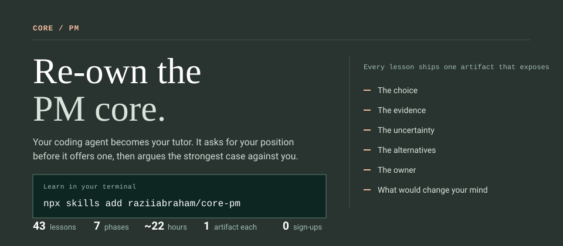
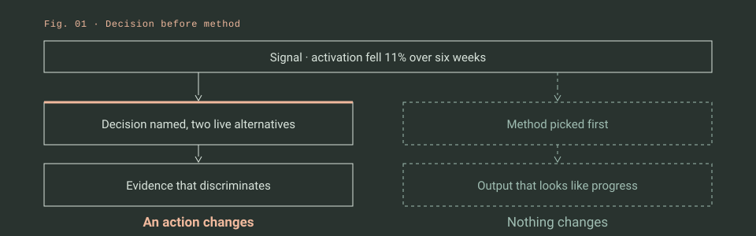
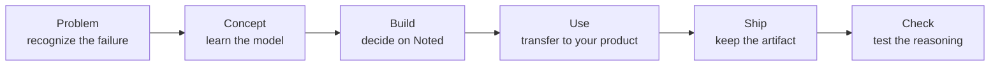
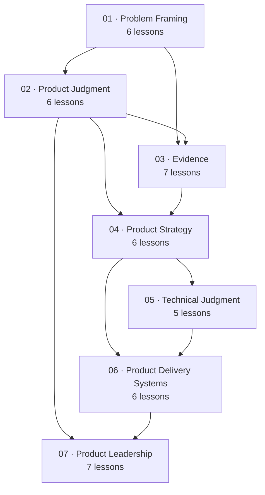

<div align="center">

[](#the-curriculum)
[](#the-curriculum)
[](#the-six-skills)
[](#what-a-lesson-contains)
[](https://core-pm-field-course.razii-abrhm.chatgpt.site)

**Re-own the judgment underneath product management.**

</div>

## Learn in your terminal

Install the six skills once, for every project:

```bash
npx skills add raziiabraham/core-pm --global
```

Then go to the directory where your course should live, and begin:

```bash
cd ~/my-product   # your own product repo is the best choice
```

```text
/start-learning
```

**Two directories matter, and they are not the same one.** `--global` puts the skills in `~/.claude/skills/`, so the course is available in every session. `/start-learning` writes your plan — `PM-LEARNING.md`, plus an `artifacts/` directory holding one decision object per lesson — into whatever directory you run it in. Choose that one deliberately: a fresh agent session often starts in a temporary scratch workspace that is deleted when the session ends, and your progress would go with it. Your own product repo is the best home, because every lesson asks you to practice on a live decision from it.

That first run is a short interview and a 14-scenario judgment placement. From then on, `/learn` teaches the next lesson and picks up exactly where you left off, from any directory.

No clone required. No server to run. No account. Every skill falls back to fetching lesson content straight from this repository.

> **Codex and other hosts:** invocation syntax differs. Use `start-learning` and `learn` as plain skill names, or just say *"Use start-learning to begin the course."*

---

## Why an agent instead of a website

Product judgment is not information you lack. It is a set of moves you have never been forced to make under pressure, with someone arguing back.

A web page cannot argue back. An agent can.

In a lesson, the tutor gives you a real situation from the shared case, asks for your position **before** offering one, then takes the strongest argument against you. When you hedge, it presses for a commitment. When you ask it to just give you the answer, it hands the choice back. Then it writes your decision artifact to disk, and `review-artifact` tells you exactly what a skeptical reviewer would break.



That loop is the course. The website is a reader for the same material.

## The six skills

| Skill | What it does |
|---|---|
| **`start-learning`** | Interview, judgment placement, writes your `PM-LEARNING.md` plan |
| **`learn`** | Teaches one lesson interactively, ships the artifact, records progress |
| **`find-your-level`** | 14 scenarios, two per phase, scored on reasoning rather than recall |
| **`check-understanding`** | Phase assessment on a case you have not seen — scenario, boundaries, recall |
| **`review-artifact`** | Stress-tests any decision document against the inspectability standard |
| **`course-guide`** | Routes a real problem ("nobody trusts our metrics") to the lesson that fixes it |

`review-artifact` works on documents that have nothing to do with this course. Point it at a PRD you wrote last quarter.

## Use every lesson the same way

The content changes. The learning contract does not.



1. **Problem** — recognize the costly reasoning failure, stated as a failure and not a definition.
2. **Concept** — learn a durable model, and the boundary where it stops being true.
3. **Build** — make the decision on the shared Noted case, with the tutor arguing against you.
4. **Use** — transfer the same move to a live decision in your own product.
5. **Ship** — write one reusable artifact to `artifacts/`.
6. **Check** — answer five questions that test reasoning rather than recall.

The standard is not a beautiful template. Another PM should be able to see the choice, the evidence, the uncertainty, the alternatives, the owner, and the condition that would change your mind.

## What a lesson contains

All 43 lessons are authored to the same contract, which is enforced by `npm run validate:lessons`:

| Element | Count | Why |
|---|---:|---|
| Mechanism diagrams | **91** | Show how the failure happens, not just that it does |
| Worked comparisons | **43** | The same move done weakly and done well, on the shared case |
| Structural tables | every lesson | A checklist you can run against your own work |
| Check questions | **215** | Scenarios, not definitions; every distractor is one a competent PM would pick |
| Boundary sections | every lesson | Where the model stops being true — a model without one gets misapplied |
| Self-checks | every lesson | What a strong answer holds — collapsed on the web until you commit, withheld by the tutor until you do |
| Copyable templates | every lesson | The artifact template rendered as a ready-to-paste `.md`, with its six-exposure quality bar |

Diagrams are Mermaid. The website draws them; in the terminal the tutor walks you through one node at a time and stops at the branch to ask which way you would go.

The full contract is [`lessons/AUTHORING.md`](lessons/AUTHORING.md).

## Choose a route

You do not need to scan all 43 lessons before starting. `start-learning` recommends a route from your scope, and you can override it.

| I want to… | Route | Lessons | Time |
|---|---|---:|---:|
| Build the complete PM foundation | **Complete foundation** | 43 | ~22 h |
| Practice one consequential decision end to end | **Decision field path** | 12 | ~6 h |
| Own technical and AI product choices | **Technical + AI judgment** | 13 | ~7 h |
| Scale judgment through other PMs | **Product leadership** | 15 | ~8 h |

Every route starts from the same place. Problem Framing is never skipped — it is the shared vocabulary the other six phases are built on.

## The curriculum

Seven phases build from one bounded decision to a product system that keeps making good ones.



| Phase | Lessons | Capability promise | Representative artifact |
|---|---:|---|---|
| **01 · Problem Framing** | PF-01–PF-06 | Turn noise, requests, and symptoms into a bounded decision worth investigating. | Opportunity case |
| **02 · Product Judgment** | PJ-01–PJ-06 | Take a position without manufacturing certainty. | Delegation contract |
| **03 · Evidence** | EV-01–EV-07 | Choose evidence that can answer the claim and update belief honestly. | Belief-update ledger |
| **04 · Product Strategy** | ST-01–ST-06 | Convert evidence into a coherent choice about how the product will win. | Strategy narrative |
| **05 · Technical Judgment** | TJ-01–TJ-05 | Reason about systems and AI without pretending to own specialist expertise. | AI-system decision record |
| **06 · Product Delivery Systems** | DS-01–DS-06 | Carry intent through commitment, delivery, exposure, and learning. | System-change record |
| **07 · Product Leadership** | LD-01–LD-07 | Create direction, autonomy, and accountability beyond one PM. | Executive decision memo |

The complete inventory with prerequisites and durations is in [`CURRICULUM.md`](CURRICULUM.md). The machine-readable source every skill reads is [`lessons/manifest.json`](lessons/manifest.json), generated from [`lib/curriculum.ts`](lib/curriculum.ts).

## Every lesson ships something

Reading is not completion. Each lesson writes a decision object to `artifacts/` designed to survive outside the course.

| Family | What you keep |
|---|---|
| **Frame** | Decision brief, mechanism map, evidence boundary, audience boundary, opportunity case |
| **Judge** | Product view, definition of good, trade-off record, decision architecture, delegation contract |
| **Learn** | Evidence plan, synthesis, metric definition, tracking contract, experiment memo, belief ledger |
| **Choose** | Diagnosis, product-market hypothesis map, positioning choice, portfolio, sequence, strategy narrative |
| **Build** | System sketch, technical trade-off map, repository orientation, AI-system decision record |
| **Deliver** | Commitment brief, delivery sequence, review protocol, staged launch plan, system-change record |
| **Lead** | Decision rights, coaching plan, operating system, capability portfolio, intervention contract |

Together they become one cumulative **Product Decision Case**: the history of a consequential choice from first signal through outcome and revision.

## One shared case, then your product

Every learner practices on **Noted**, a constructed AI-assisted document product with intentionally incomplete evidence. Four signals compete for attention through the whole course:

- activation fell 11% in six weeks;
- three enterprise customers requested automated meeting summaries;
- P95 response time rose 34% for large workspaces;
- a platform dependency loses support in 10 weeks.

The case is stable enough that two learners can compare answers, and incomplete enough that neither can look up the right one. Read it in [`lessons/noted/case.md`](lessons/noted/case.md).

Every lesson then asks you to repeat the same move on a real decision from your own product. That transfer step is where the course pays for itself.

## Repository map

```text
core-pm/
├── skills/                   # the six agent skills — source of truth
│   └── <skill>/SKILL.md
├── .claude/skills/           # generated mirror, for Claude Code in a clone
├── lessons/
│   ├── manifest.json         # generated index every skill reads
│   ├── AUTHORING.md          # the lesson contract
│   ├── noted/case.md         # the shared case
│   └── <phase>/<lesson>/     # lesson.md · checks.json · artifact.md
├── lib/
│   ├── curriculum.ts         # 43 lessons, prerequisites, routes
│   └── lesson-content.ts     # renders lessons/**/lesson.md for the website
├── app/                      # the web reader: / · /learn/[lesson] · /noted
├── assets/                   # generated README artwork
├── scripts/                  # manifest, skill mirror, validators, artwork
└── tests/                    # rendered invariants across every lesson page
```

Lesson prose is authored once. The `learn` skill reads `lesson.md` directly, and the website renders the same file, so the two surfaces cannot drift apart.

## Contributing

Corrections, sharper examples, and stronger exercises are welcome through [issues](https://github.com/raziiabraham/core-pm/issues).

Read [`lessons/AUTHORING.md`](lessons/AUTHORING.md) before writing a lesson, and [`AGENTS.md`](AGENTS.md) before changing anything else.

```bash
git clone https://github.com/raziiabraham/core-pm.git
cd core-pm
npm install
npm test
```

`npm test` regenerates the manifest, validates every lesson against the authoring contract, parses all 91 diagrams, builds the site, and renders every lesson page. Individual steps:

| Command | Does |
|---|---|
| `npm run build:manifest` | Regenerate `lessons/manifest.json` from `lib/curriculum.ts` |
| `npm run sync:skills` | Mirror `skills/` into `.claude/skills/` |
| `npm run validate:lessons` | Check structure, visuals, and check-question shape |
| `npm run validate:diagrams` | Parse every Mermaid block with the real parser |
| `npm run build:art` | Regenerate `assets/*.svg` |
| `npm run dev` | Run the web reader on `http://localhost:3000` |

Generated files (`lessons/manifest.json`, `.claude/skills/**`, `assets/*.svg`) are committed so a clone works without running anything. If you change their sources, regenerate and commit the result in the same change.

When changing a lesson, preserve its stable ID, prerequisites, and output contract, and its role in every route that includes it.

---

<div align="center">

### A PM should not be the person who produces every answer.

### A PM should be the person who makes the reasoning inspectable.

```bash
npx skills add raziiabraham/core-pm --global
```

</div>
