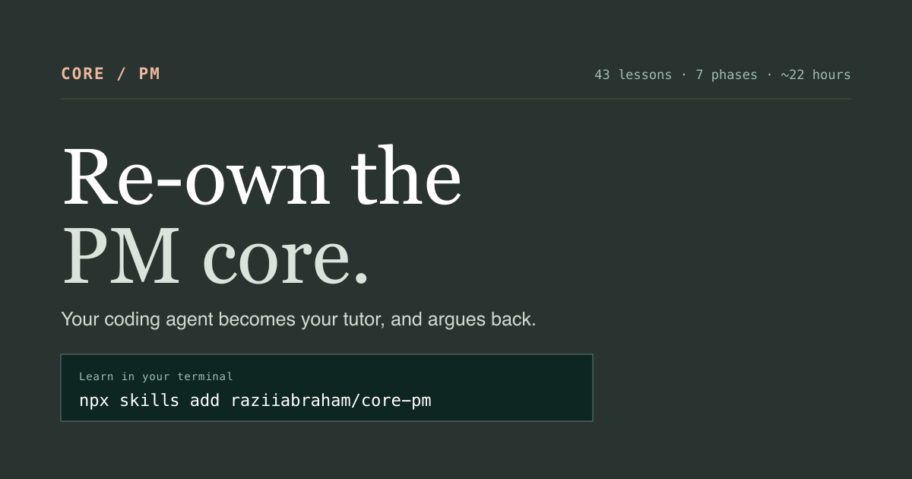
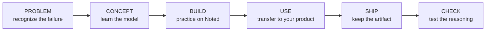
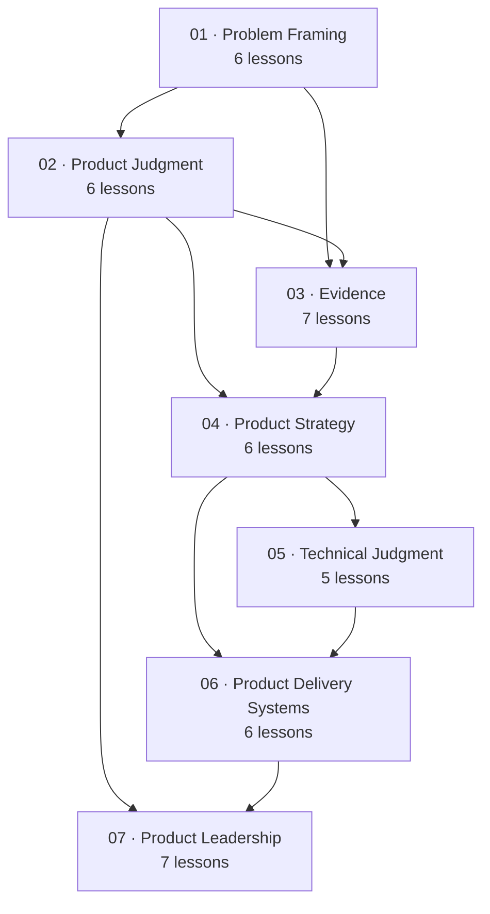

<div align="center">

# CORE / PM

### Re-own the judgment underneath product management.

A self-paced curriculum for practicing PMs who know the rituals—and want to recover the reasoning that makes those rituals useful.

[](#the-curriculum)
[](#the-curriculum)
[](#start-here-choose-your-route)
[](#quality-standard)
[](https://core-pm-field-course.razii-abrhm.chatgpt.site)

**[Start the course](https://core-pm-field-course.razii-abrhm.chatgpt.site)** · **[Browse the curriculum](CURRICULUM.md)** · **[Choose a learning path](learning-paths/README.md)**

</div>



> **43 lessons. 7 phases. ~23 hours. 4 learning paths.**
>
> Every lesson moves from a product failure to a decision artifact another person can inspect, challenge, and reuse.

Product management is not the coordination around the decision. It is the judgment inside it.

---

## Start here: choose your route

You do not need to scan all 43 lessons before beginning. Pick the work you need to become better at.

| I want to… | Route | Lessons | Time | Start |
|---|---|---:|---:|---|
| Build the complete PM foundation | **Complete Foundation** | 43 | ~23h | [Begin with decision framing](https://core-pm-field-course.razii-abrhm.chatgpt.site/learn/pf-01-decision-before-method) |
| Practice one consequential decision end to end | **Decision Field Path** | 12 | ~6h | [Begin the field path](https://core-pm-field-course.razii-abrhm.chatgpt.site/session-1/reading) |
| Own technical and AI product choices | **Technical + AI Judgment** | 13 | ~7h | [Begin with technical abstraction](https://core-pm-field-course.razii-abrhm.chatgpt.site/learn/tj-01-technical-abstraction-without-ignorance) |
| Scale judgment through other PMs | **Product Leadership** | 15 | ~8h | [Begin with decision architecture](https://core-pm-field-course.razii-abrhm.chatgpt.site/learn/pj-04-decision-architecture) |

Not sure? Start with **PF-01 — Decision before method**. It is the foundation for every route.

## Use every lesson the same way

The content changes. The learning contract does not.



1. **Problem** — recognize the costly reasoning or operating failure.
2. **Concept** — learn a durable model and where it stops being true.
3. **Build** — make the decision on the shared Noted case.
4. **Use** — transfer the same move to a live product decision.
5. **Ship** — keep one reusable artifact in your Product Decision Case.
6. **Check** — test whether the reasoning survives scrutiny.

The standard is not a beautiful template. Another PM should be able to see the choice, evidence, uncertainty, alternatives, owner, and condition that would change your mind.

---

## Why this course exists

Most PM education teaches recognizable activities: discovery, roadmaps, metrics, experiments, strategy documents, planning, and stakeholder management. The activities matter, but they are easy to imitate without owning the decision underneath them.

CORE / PM makes that hidden layer explicit:

- what deserves product attention;
- what the evidence can actually establish;
- when confidence is sufficient for the next move;
- which trade-off the team is making;
- where product authority ends and specialist authority begins;
- how a choice survives delivery, exposure, disagreement, and revision;
- how leaders improve judgment without taking the work back.

AI makes this more urgent. Plausible research, analysis, specifications, and prototypes are now cheap. Product judgment—not artifact production—is the constraint.

## The curriculum

Seven phases build from one bounded decision to a product system that can keep making good decisions.



| Phase | Lessons | Capability promise | Representative artifact |
|---|---:|---|---|
| **01 · Problem Framing** | PF-01–PF-06 | Turn noise, requests, and symptoms into a bounded decision worth investigating. | Opportunity case |
| **02 · Product Judgment** | PJ-01–PJ-06 | Take a position without manufacturing certainty. | Delegation contract |
| **03 · Evidence** | EV-01–EV-07 | Choose evidence that can answer the claim and update belief honestly. | Belief-update ledger |
| **04 · Product Strategy** | ST-01–ST-06 | Convert evidence into a coherent choice about how the product will win. | Strategy narrative |
| **05 · Technical Judgment** | TJ-01–TJ-05 | Reason about systems and AI without pretending to own specialist expertise. | AI-system decision record |
| **06 · Product Delivery Systems** | DS-01–DS-06 | Carry intent through commitment, delivery, exposure, and learning. | System-change record |
| **07 · Product Leadership** | LD-01–LD-07 | Create direction, autonomy, and accountability beyond one PM. | Executive decision memo |

See the complete lesson inventory, prerequisites, durations, and outputs in [`CURRICULUM.md`](CURRICULUM.md). The canonical machine-readable source is [`lib/curriculum.ts`](lib/curriculum.ts).

## Every lesson ships something

Reading is not completion. Each lesson produces a decision object designed to survive outside the course.

| Artifact family | What you keep |
|---|---|
| **Frame** | Decision brief, mechanism map, evidence boundary, audience boundary, opportunity case |
| **Judge** | Product view, definition of good, trade-off record, decision architecture, delegation contract |
| **Learn** | Evidence plan, synthesis, metric definition, tracking contract, experiment memo, belief ledger |
| **Choose** | Diagnosis, product-market hypothesis map, positioning choice, portfolio, sequence, strategy narrative |
| **Build** | System sketch, technical trade-off map, repository orientation, AI-system decision record |
| **Deliver** | Commitment brief, delivery sequence, review protocol, staged launch plan, system-change record |
| **Lead** | Decision rights, coaching plan, operating system, capability portfolio, intervention contract |

Together these become one cumulative **Product Decision Case**: the history of a consequential choice from first signal through outcome and revision.

## One shared case, then your product

Every learner can practice on **Noted**, a constructed AI-assisted document product with intentionally incomplete evidence. The same four signals persist through the course:

- activation is declining;
- enterprise customers request automated summaries;
- large workspaces are slowing down;
- a platform dependency is nearing end-of-support.

The case is stable enough for comparison and incomplete enough to require judgment. Every exercise then asks you to repeat the move on a real decision from your own product.

**[Meet the Noted case →](https://core-pm-field-course.razii-abrhm.chatgpt.site/noted)**

---

## Research foundation

The curriculum is an original synthesis of **563 PDF resources across nine Reforge product-management programs**:

| Product core | Evidence | Strategy and execution |
|---|---|---|
| Mastering Product Management | User Insights | Product Strategy |
| Finding Product-Market Fit | Data for Product Managers | Technical Strategy |
| Product Leadership | Experimentation + Testing | Scaling Product Delivery |

The source programs inform the concepts—not the course sequence. CORE / PM reorganizes the material around one cumulative act of product judgment, preserves evidence boundaries, and names source programs in lesson notes where appropriate.

CORE / PM is an independent educational project and is not affiliated with or endorsed by Reforge. Source PDFs are not distributed in this repository.

## Current curriculum status

This is a living edition. Scope and maturity are reported separately so lesson count does not imply equal depth.

| Layer | Status |
|---|---:|
| Curriculum map and prerequisite graph | **43 / 43** |
| Atomic web lesson routes | **43 / 43** |
| Deep applied field-path lessons | **12 / 12** |
| Learning paths | **4 / 4** |
| Shared Noted case | **Complete** |
| Rendered route checks | **17 passing** |

The twelve-lesson Decision Field Path is currently the deepest authored route, with extended prose, exhibits, prompts, and source notes. The remaining atomic lessons establish the complete learning architecture and are being expanded toward that same depth.

## Three ways to use the course

### 1. Learn on the website

Open the [course reader](https://core-pm-field-course.razii-abrhm.chatgpt.site), choose a route, and continue at your own pace. Progress stays in your browser.

### 2. Read from the repository

Use [`CURRICULUM.md`](CURRICULUM.md) as the guide, [`learning-paths/README.md`](learning-paths/README.md) as the route manifest, and [`lib/curriculum.ts`](lib/curriculum.ts) for the complete prerequisite-aware lesson source.

### 3. Run the course locally

```bash
git clone https://github.com/raziiabraham/core-pm.git
cd core-pm
npm install
npm run dev
```

Then open `http://localhost:3000`.

Run the full rendered-route suite:

```bash
npm test
```

## Repository map

```text
core-pm/
├── app/
│   ├── learn/[lesson]/      # atomic lesson reader
│   ├── session-*/reading/   # deep 12-lesson field path
│   ├── noted/               # shared product decision case
│   └── components/          # curriculum and progress UI
├── lib/
│   └── curriculum.ts        # 43 lessons, prerequisites, paths
├── learning-paths/          # route definitions
├── tests/                   # rendered curriculum invariants
├── CURRICULUM.md            # repository course guide
└── LESSON_TEMPLATE.md       # authoring contract
```

## Quality standard

Every lesson must have:

- a stable ID and explicit prerequisites;
- a concrete product failure—not only a definition;
- one durable model and a visible boundary;
- a Noted exercise and real-product transfer;
- one reusable output artifact;
- checks that test reasoning rather than recall;
- proportionate source lineage for direct and contestable claims.

The rendered test suite protects the learner journey, lesson contract, Noted continuity, progress controls, deep field readings, and internal facilitator boundaries.

Use [`LESSON_TEMPLATE.md`](LESSON_TEMPLATE.md) when proposing or expanding a lesson.

## Contributing

Corrections, sharper examples, source challenges, and stronger exercises are welcome through [issues](https://github.com/raziiabraham/core-pm/issues).

Before submitting a change:

```bash
npm test
```

When changing a lesson, preserve its stable ID, prerequisites, output contract, and role in every learning path that includes it.

---

<div align="center">

### A PM should not be the person who produces every answer.

### A PM should be the person who makes the reasoning inspectable.

**[Start learning](https://core-pm-field-course.razii-abrhm.chatgpt.site)** · **[Explore all 43 lessons](CURRICULUM.md)**

</div>
