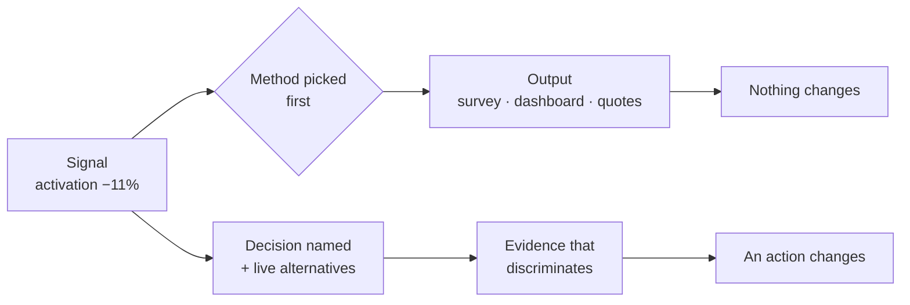
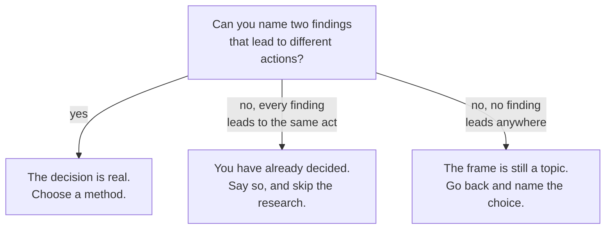

# PF-01 · Decision before method

> Research begins with the decision the evidence could change — not a favorite
> method and not a preselected answer.

## Problem — the research nobody can act on

A PM is told activation is down. Within an hour there is a survey being drafted,
a dashboard being filtered, and someone volunteering to "talk to some users."

Two weeks later the team has findings. Nobody can say what they now do
differently. The survey confirmed that onboarding could be clearer. The
dashboard showed the decline is real. The interviews produced quotes that
support whatever anyone already believed.

Nothing was wrong with any individual step. The failure happened before the
first step: **the decision the evidence was supposed to change was never
named.** Once a method is chosen, it generates output regardless of whether that
output can move a decision. Output feels like progress, which is what makes this
failure so durable.

This is the most expensive habit in product work, and it is almost invisible,
because the artifacts it produces look like exactly the artifacts good research
produces.

The two paths look identical from the outside. Only one of them can end in a
changed action:

Ask a PM who has just finished a research cycle: *what would you have done
differently if the finding had come back the other way?* If they cannot answer,
the research was decision-last.

## Concept — separate the four things that get collapsed

Separate four things that get collapsed:

| Layer | What it is | Failure when skipped |
|---|---|---|
| **Observation** | What was measured or heard, with no explanation attached | Interpretation gets treated as fact |
| **Interpretation** | A proposed mechanism for the observation | The first plausible story wins |
| **Decision** | The choice this evidence could change | Research produces unusable findings |
| **Alternatives** | The options being chosen between | The chosen option looks inevitable |

Decision-first means writing the third and fourth rows **before** selecting a
method.

A usable decision statement has three properties:

1. **It names a choice, not a topic.** "Understand activation" is a topic.
   "Change the first-session experience, investigate a cause outside the first
   session, or make no product change yet" is a choice.
2. **It has at least two live alternatives.** If only one option is really on
   the table, you are not deciding — you are building a case.
3. **It is bounded.** Which population, over what horizon, with what
   consequence. An unbounded decision cannot be answered by any amount of
   evidence.

Here is the same activation signal written both ways. The difference is not
length or polish:

**Weak** — "Investigate why activation dropped."

No choice is named, so every possible finding is compatible with every possible
action. The research can succeed and change nothing.

**Strong** — "Change the first-session experience, investigate a cause outside
the first session, or make no product change yet."

Three live options. A finding can now displace one of them, which is what makes
it worth gathering.

The test that makes this concrete: **name two plausible findings that would
lead to different actions.** If you cannot, the evidence question is still
detached from the decision, and no method will fix it.

### Boundary

Decision-first is not a rule that all exploration must be justified in advance.

Genuine exploration — new market, unfamiliar user, a product area nobody
understands yet — is legitimate work, and demanding a decision statement for it
produces fake decisions written to authorize curiosity.

The boundary is this: **exploration is honest when it is labelled as
exploration.** The failure is not exploring. The failure is exploring, then
presenting the output as if it settled a decision it was never designed to
settle.

A good frame also does not prove the answer. It states what is known, what is
assumed, and which evidence could change the next choice. If your frame already
contains the conclusion, you have written a justification.

## Build — on Noted

Read `lessons/noted/case.md` if you have not already.

Take **Signal 1: activation fell 11% over six weeks.**

Assume the head of product wants "the bottom of it" by Friday. Two changes
shipped during the window. The activation definition is inherited and
undefended. No segmentation has been done.

**Your task.** Produce a decision statement for this signal, before choosing any
method.

1. State the observation with no interpretation attached. This is harder than it
   sounds — most attempts smuggle in a cause. "Activation fell after the signup
   flow changed" has already smuggled one in.
2. Write at least two competing interpretations. One of them should not involve
   the first session at all.
3. Write the decision: the specific choice this evidence could change, with its
   alternatives.
4. Bound it: which users, over what horizon, with what consequence if you are
   wrong.
5. Name the two findings that would lead to different actions.
6. State what remains uncommitted. What are you explicitly not deciding yet?

**Expect to be pushed on:** whether your "observation" is really an observation,
whether your alternatives are real or one strawman and one favorite, and whether
your decision is bounded tightly enough that Friday is achievable.

### What a strong answer holds

- The observation contains only what was measured: the metric as currently
  defined, the size of the fall, the six-week window, the fact that it is
  aggregate and unsegmented, and the two changes that shipped. No verb of cause
  appears anywhere in it.
- At least one interpretation places the cause outside the first session — in
  who is arriving, in the definition itself, or in something that changed in the
  window but not in the product — and the two interpretations do not share the
  assumption that the product got worse.
- The decision is written as a choice between named alternatives, each of which
  someone on the team would actually argue for. "Understand the drop" is a
  topic. "Fix onboarding" is a conclusion.
- The bound names a population (or makes segmentation the first act), a horizon
  that separates the Friday decision from any fix, and the cost of being wrong
  in each direction.
- The two findings named would send you to different actions — one into the
  first session, one away from it — and the answer says which shipped change,
  if either, it refuses to blame yet.
- The most common weak move is writing the decision as the investigation
  ("find out why activation dropped"). It is weak because every possible finding
  is compatible with it, so nothing you learn can displace anything.

## Use — on your product

Take one live decision from your own product. Not a hypothetical, and not one
already made that you are rationalizing.

Answer five questions:

1. What exact decision will this work change?
2. Who owns the consequence, and who holds specialist authority?
3. Which alternative is displaced if your recommendation is accepted?
4. What evidence supports the claim, and what can it not establish?
5. What condition should trigger review, reversal, or escalation?

Work only from evidence you actually have today. Where you have none, write
`<unknown>` — a named gap is worth more than a confident guess, and this course
will keep asking you to distinguish the two.

Then do one thing this week: show the decision statement to the person who owns
the consequence and ask whether they recognise it as the choice in front of
them. If they name a different choice, you have found the real decision.

## Ship — Decision brief

Produce `artifacts/PF-01-decision-brief.md` using the template in
`artifact.md`.

Write it for the next person who has to make or review this decision — not for
yourself, and not for an audience you are trying to persuade. It should carry
the choice, the evidence, the uncertainty, the alternatives, the owner, and the
condition that would change your mind.

This is the first entry in your Product Decision Case. Every later artifact
either extends it or contradicts it, and contradiction is useful — it is how you
find out which of your earlier beliefs was load-bearing.

## Carry forward

A decision statement with live alternatives, a bounded population and horizon,
and two findings that would produce different actions. PF-02 takes the
interpretations you wrote here and makes you defend their mechanisms.
