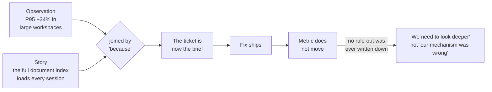
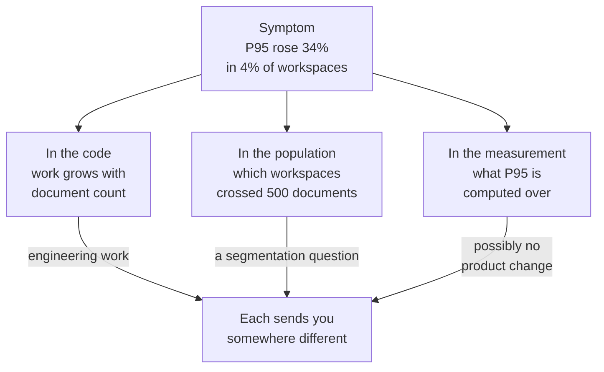

# PF-02 · Problem, mechanism, alternatives

> A symptom becomes useful only when you can name a plausible mechanism and
> competing explanations.

## Problem — a plausible cause becomes the brief

Monitoring reports that response time for large workspaces has risen. Suppose
the PM writes the ticket: "Large workspaces are slow because we load the full
document index on every session." Engineering agrees it sounds right. The work
is scheduled. Six weeks later the index loads lazily, and the response time has
not moved.

Nobody lied. Nobody was careless. The sentence in the ticket did real damage
anyway, because it contained two different things joined by the word "because."
The first half was a measurement. The second half was a story. Once they are in
one sentence, the story stops being a candidate and starts being the brief.

The failure is hard to see from inside for a specific reason: the story was
plausible, and plausibility feels like evidence. A mechanism invented by someone
who knows the system well will almost always sound correct. Expertise makes the
first story *better*, which makes it *harder to displace*, which is the opposite
of what you need. Teams with strong engineers often converge faster on a wrong
mechanism than teams without them.

There is also a second, quieter failure in the same ticket. Even if the index
theory were right, nobody wrote down what would have proved it wrong. So there
was no moment at which the team could notice they were building the wrong fix.
The fix shipped, the metric stayed flat, and the conclusion was "we need to look
deeper" rather than "our mechanism was wrong."

Trace what the word "because" did. A measurement and a story enter the ticket as
two things and leave it as one:

Notice the last edge. Nothing in the chain ever forced the story to defend
itself, so a flat metric could only mean the investigation was incomplete.

Ask your team: *if this explanation were false, what would we currently be
seeing that we are not seeing?* If the answer is "nothing in particular," the
explanation is not doing any work.

## Concept — separate mechanism from symptom and fix

Three things get compressed into one sentence. Pull them apart.

| Layer | Question it answers | What it is not |
|---|---|---|
| **Problem** | What is happening, to whom, and why it matters | Not a cause, not a fix |
| **Mechanism** | Through what chain of events does it happen | Not a restatement of the symptom |
| **Intervention** | What you would change to break that chain | Not the problem in disguise |

Most product briefs skip the middle row. A brief with a problem and an
intervention but no mechanism is a guess with a schedule attached.

### What makes a mechanism defensible

A mechanism is a causal story with named parts. It is defensible when it does
all four of these:

1. **It names actors and steps.** Who does what, in what order, and what the
   system does in response. "Performance degrades at scale" names nothing. "A
   workspace over roughly 500 documents triggers a full permission re-check on
   every search, and search runs on page load" names actors and steps.
2. **It is specific about population.** A mechanism that would apply to every
   user cannot explain a symptom that appears in 4% of workspaces.
3. **It makes a side prediction.** If the mechanism is true, something *else*
   must also be true — something you have not looked at yet. That side
   prediction is what you go and check.
4. **It can be ruled out.** You can state the observation that would kill it.

The side prediction is the load-bearing part. A mechanism that explains the
symptom and nothing else cannot be tested, because the symptom is already there.

Here is the same slowdown explained both ways. The difference is not confidence
or vocabulary:

**Weak** — "Large workspaces are slow because the application does more work at
scale."

This applies to every workspace, names no actor, and predicts nothing you have
not already seen. There is no observation that would kill it, so it will survive
a failed fix intact.

**Strong** — "Above roughly 500 documents, search re-checks permissions per
document, and search runs on page load — so the cost lands on session start."

Actors, steps, and a population. It predicts that sessions which never search
are unaffected, which is something you can go and look at.

The strong version is riskier to hold, and that is the point. It has told you in
advance what would embarrass it. It is also invented: the case does not say what
got slower, and the permission re-check is one candidate written here to show
the shape. Yours will differ. What must not differ is that it has actors, a
population, a side prediction, and something that could kill it.

### Competing explanations must actually compete

Writing two mechanisms is not the same as writing two *competing* mechanisms.
The common failure is producing two versions of the same belief.

| Pair | Do they compete? |
|---|---|
| "Onboarding is confusing" / "The empty state is unclear" | No. Both assume the cause is inside the first session. |
| "The first session got worse" / "The mix of people arriving changed" | Yes. They disagree about whether the product changed at all. |

The test: **name the assumption the two explanations share.** If they share the
assumption that matters, you have one explanation, not two. A useful competing
set contains at least one mechanism that locates the cause somewhere you would
rather it not be — outside your team, outside the feature you already planned,
or in the measurement itself.

Include the measurement explanation deliberately. "The metric changed but the
underlying behaviour did not" is a real mechanism, and it is the one teams
forget, because it makes the last six weeks of alarm look wasteful.

A practical way to force real competition is to put each mechanism somewhere
different. One symptom, three locations:

The test is on the edges, not the boxes. If two mechanisms lead to the same
next action, they are one mechanism written twice.

### Boundary

Mechanism-first stops being worth the effort in two situations.

**When the fix is cheaper than the diagnosis.** If an intervention is cheap,
fast, and reversible, and it would help under every mechanism you can name, do
it and watch. Spending two weeks distinguishing mechanisms to justify a
two-hour change is not rigour. It is procedure.

**When the symptom has no single mechanism.** A response-time rise across
thousands of workspaces can be three unrelated causes summing to one number.
Forcing a single story onto a multi-cause symptom produces a mechanism that is
partly right, a fix that moves the metric slightly, and a team that cannot
explain the remainder. When you suspect this, the right move is to split the
symptom before explaining it — by population, by request type, by time — and
accept that you may end up with three small problems instead of one large one.

The boundary is not "sometimes skip the thinking." It is that the unit of
explanation must match the unit of the symptom.

## Build — on Noted

Read `lessons/noted/case.md` if you have not already.

### Part 1 — defend what you already wrote

Open your `artifacts/PF-01-decision-brief.md`. Find the competing
interpretations you wrote for the activation decline.

1. For each interpretation, decide whether you wrote a **mechanism** or a
   **relabelled symptom**. "Onboarding got worse" is a relabelled symptom.
   Rewrite each one until it names actors and steps.
2. Name the assumption your two interpretations share. If they share the
   assumption that the cause lives inside the first session, one of them is not
   a real competitor. Replace it. The case gives you two shipped changes, an
   unsegmented decline, and an inherited metric definition — at least one of
   those supports a mechanism that is not about the first session at all.

### Part 2 — a signal you have not framed

Now take **Signal 3: P95 response time rose 34% for large workspaces.**

What the case gives you: "large" means more than 500 documents; that is about 4%
of workspaces; those workspaces hold a disproportionate share of paid seats; no
support ticket has mentioned speed; the signal came from monitoring. The case
does not tell you what got slower, or when in the window it happened.

3. State the problem: what is happening, to whom, and why it matters. Do not use
   the word "because."
4. Write **three** candidate mechanisms. One must locate the cause outside the
   application code — in the data, the measurement, or the population of
   workspaces. One must be a mechanism you would find inconvenient.
5. For each mechanism, write its **side prediction**: something else that must
   be true if it holds, that you could check without shipping anything.
6. For each mechanism, write the observation that would **rule it out**.
7. Explain the absence of support tickets. It is evidence. Decide what it is
   evidence *of*, and state which of your mechanisms it favours and which it
   damages.
8. Commit: name the one mechanism you would investigate first, and say what
   would have to come back for you to abandon it.

Steps 4 to 6 fit one shape. Fill it in before you commit in step 8, and use the
second column to check that your three mechanisms are not sitting in the same
place:

| Mechanism | Where the cause sits | Side prediction, checkable this week | Ruled out by |
|---|---|---|---|
| 1 | `<code, data, population, or measurement>` | `<what else must be true>` | `<what you would have to see>` |
| 2 | `<...>` | `<...>` | `<...>` |
| 3 | `<...>` | `<...>` | `<...>` |

If two rows name the same location, replace one. If any row has an empty fourth
cell, that mechanism is a belief, not a candidate.

**Expect to be pushed on:** whether your three mechanisms genuinely compete or
share one buried assumption; whether your side predictions are checkable this
week or are just restatements of the symptom; and whether your reading of the
silent support queue is evidence or convenience.

### What a strong answer holds

- The problem statement carries no cause. It says what moved (P95, up 34%), for
  whom (workspaces over 500 documents, about 4%, holding a disproportionate
  share of paid seats), and why it matters — and the "why it matters" is written
  as a risk to paid seats, not as an observed loss, because the case observes no
  loss.
- The three mechanisms sit in three different locations from the diagram —
  code, population or data, measurement — and each names actors and steps. None
  of them is "it does more work at scale" in different words.
- Every side prediction is something you could check this week without shipping
  anything, and it is not the symptom restated. A good one names who or what
  should be *unaffected* if the mechanism is true.
- Every rule-out cell is filled. A mechanism whose fourth column is empty is
  dropped from the set, not carried as a belief.
- The silent support queue is read with a direction: the answer says which
  mechanism it favours, which it damages, and admits the one thing it cannot
  separate — that people rarely file tickets about slowness, so silence is weak
  evidence either way.
- The most common weak move is three mechanisms that all live in the code and
  differ only by component. That is one belief written three times, and it is
  weak because all three lead to the same engineering ticket, so no finding can
  change what you do next.

## Use — on your product

Take the same live decision you used in PF-01.

Answer four questions:

1. What is the mechanism you currently believe, written with actors and steps —
   not a label?
2. What side prediction does it make that you have not yet checked?
3. What is the strongest competing mechanism that locates the cause somewhere
   you would find inconvenient? Name who would be uncomfortable with it.
4. What single observation would rule out your preferred mechanism, and how long
   would it take to look?

Where you do not have the evidence, write `<unknown>`. Do not fill a mechanism
gap with something that merely sounds like your system. A guess written in the
vocabulary of your architecture is still a guess, and it will be quoted back to
you as a fact.

## Ship — Problem mechanism map

Produce `artifacts/PF-02-problem-mechanism-map.md` using the template in
`artifact.md`.

Write it for the engineer or designer who will be asked to act on it. That
person needs to see which parts of your statement are measured and which parts
are your story, without having to ask you. If they cannot tell the two apart at
a glance, the map has failed regardless of whether your mechanism is correct.

This is the second entry in your Product Decision Case. It attaches to the
decision brief from PF-01: the brief says what choice is open, and the map says
what would have to be true about the world for each option to be the right one.

## Carry forward

A problem statement separated from its mechanisms, at least one competing
explanation you did not want to write, and a side prediction you can go check.
PF-03 takes those mechanisms and forces every claim inside them to declare its
population, time window, source, and limit — which is where most confident
mechanisms lose their support.
