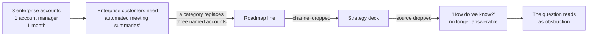
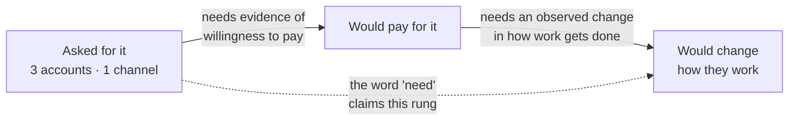

# PF-03 · Evidence boundaries

> Every claim needs a visible population, time window, source, and limit before
> it can carry product weight.

## Problem — the claim that outran its evidence

A PM writes one line in a roadmap document: **"Enterprise customers need
automated meeting summaries."**

It is not a lie. Three enterprise customers did ask. But look at what the
sentence does that the underlying evidence cannot do. "Enterprise customers"
turns three named accounts into a category. The present tense turns a request
made last month into a standing condition. "Need" turns something people asked
for into something they cannot work without. And the sentence carries no source,
so a reader cannot go back and check any of it.

Three weeks later that line is in a strategy deck. The three requests are gone.
The account manager who collected them is gone. What remains is a category, a
verb, and a slide. When someone finally asks "how do we know?", the honest
answer is that nobody can reconstruct it, so the question gets treated as
obstruction rather than diligence.

This failure is hard to see from inside because the compression happens for good
reasons. Roadmap documents have to be short. Executives ask for the headline.
Every step of the compression was reasonable, and the result is a claim that
outruns its evidence by a wide margin. The evidence did not get weaker. It got
invisible, which is worse, because an invisible limit cannot be argued with.

The decay has a shape, and each step in it is a document somebody was right to
write:

Read the edge labels rather than the boxes. Nothing was falsified at any step.
Each step only removed a field, and the last field removed was the one that
would have let a reader push back.

Ask of any claim in your planning documents: *who exactly, over what period,
observed by whom, and what could this evidence not show even if it is
completely accurate?* If the document cannot answer without a research trip,
the claim is unbounded.

## Concept — what must travel with every claim

A claim carries product weight only when four things travel with it.

| Field | Question | Common failure |
|---|---|---|
| **Population** | Exactly who is this about, and how many? | A category name standing in for a handful of named cases |
| **Window** | When was it observed, and over how long? | Present tense applied to a past observation |
| **Source** | Who observed it, through what channel? | The channel is dropped, so its bias becomes invisible |
| **Limit** | What can this not establish even if accurate? | Absent, so the reader assumes it establishes everything |

The fourth field is the one people skip, and it is the one that does the work.
Population, window, and source describe what you have. The limit describes the
distance between what you have and what you are about to claim.

### Two limits worth naming every time

**Prevalence.** Counting how often something was said is not counting how often
it happens. Three requests are three requests. They tell you the behaviour
exists. They tell you nothing about whether it is common, because you did not
sample — the requests arrived through whatever path made requesting easy. A
loud channel and a common problem produce the same shape of evidence.

**Strength.** "They asked for X" and "they would pay for X" and "they will
change how they work to use X" are three different claims. A request establishes
only the first. Moving up that ladder requires evidence of a different kind, not
more of the same kind:

The dotted edge is the whole failure. One word moved the claim two rungs, and
collecting more requests — the cheap move, the one the channel makes easy —
would not move it one.

### Channel is part of the claim

Evidence arriving through one route is not an independent sample, and the route
shapes what you receive. A single account manager collecting requests will
surface the concerns of the accounts they speak to, phrased in the vocabulary
they use, filtered by what they think product will act on. None of that is
dishonest. All of it narrows the evidence in a direction you cannot see unless
you write the channel down.

The practical rule: **name the channel next to the claim, permanently.** Not in
an appendix. Next to it. When the channel travels with the claim, a reader can
weigh it. When it is stripped off in the first summary, it never comes back.

**Weak** — "Enterprise customers need automated meeting summaries."

Three accounts have become a category, a past request has become a standing
condition, and a request has become a need. A reader cannot find the edge of
the evidence, so they assume there is none.

**Strong** — "Three enterprise accounts, all reached through one account
manager within one month, asked for automated meeting summaries. Whether team
leads lose decisions after recurring meetings is untested, and meeting type is
not captured — so this says nothing about how often it happens."

The second version is not hedged; it is bounded. Hedging weakens a claim while
leaving it vague. Bounding states exactly what the claim covers, which is what
lets someone act on the covered part with confidence.

### What to do with a gap

You will find claims where a field is genuinely unavailable. Meeting type may
simply not be captured. Actor identity may be missing for a fraction of events.
The move is not to estimate around it and not to abandon the claim. The move is
to write the gap into the claim itself, so that anyone quoting the claim has to
carry the gap with them.

A claim with a stated gap is usable. A claim with a hidden gap is a liability
that will surface at the worst moment, usually in front of the person who
approved the work.

### Boundary

Evidence boundaries are a discipline for **load-bearing claims**, not a tax on
every sentence.

If a claim is not carrying a decision — background, context, something everyone
already agrees on and nothing depends on — bounding it costs time and buys
nothing. Applying this to every line produces documents nobody reads, which
protects no decision at all.

There is a second limit, and it is sharper. Bounded evidence is not the same as
sufficient evidence. A claim can have a perfect population, window, source, and
limit, and still be too thin to act on. Writing the four fields is how you find
that out early. It is not a way to make weak evidence acceptable by dressing it
correctly. If bounding a claim reveals that it rests on three cases from one
channel, the conclusion is that you know less than the roadmap implies — not
that you have now made three cases sufficient.

## Build — on Noted

Read `lessons/noted/case.md` if you have not already.

Take **Signal 2: three enterprise customers asked for automated meeting
summaries.**

What the case gives you: three enterprise customers asked; all three requests
came through the same account manager, within one month; their combined contract
value is roughly 20% of current revenue; the underlying claim — that enterprise
team leads repeatedly lose decisions, action owners, or context after recurring
meetings, causing rework or missed commitments — has never been tested; meeting
type is not captured in the product's event data; actor identity is missing for
about 18% of events.

**Your task.** Take the roadmap sentence apart and rebuild it so it cannot
outrun its evidence.

1. Write the compressed claim as a roadmap would state it. One sentence. Make it
   as tempting as the real thing.
2. List every separate assertion hiding inside that sentence. There are more
   than three.
3. For each assertion, fill the four fields: population, window, source, limit.
   Write `<unknown>` where the case does not say — do not reason your way to a
   number.
4. Identify which assertions the evidence supports, which it merely fails to
   contradict, and which it cannot address at all. Keep those three categories
   separate.
5. Place the strongest available claim on the strength ladder: asked for it,
   would pay for it, would change how they work for it. Say what evidence would
   move it up one rung, and roughly what that would cost to get.
6. Handle the 20% revenue figure. Decide whether it is evidence about the
   problem, evidence about the consequence of ignoring the problem, or neither.
   Defend your answer.
7. Rewrite the roadmap sentence so a reader three documents downstream still
   sees the population, the channel, and the limit.

Step 4 asks for three categories, and they collapse into each other easily. Keep
them apart with a test rather than a feeling:

| Verdict | What it means | The test |
|---|---|---|
| **Supported** | The case positively establishes it | Name the line in `case.md` that does the establishing |
| **Not contradicted** | Consistent with what you have, but the evidence would look identical if it were false | Ask what you would be seeing if it were false, and check whether you would see it |
| **Cannot address** | The evidence is silent — wrong population, wrong instrument, or not captured at all | Name the field that has to read `<unknown>` |

The middle row is where most roadmap claims live, and it is the row that gets
reported as the first one.

**Expect to be pushed on:** whether your rewritten sentence is honest or merely
hedged; whether you let the 20% revenue figure quietly substitute for evidence
about the problem; and whether you treated "never been tested" as a neutral gap
when it is the largest fact in the signal.

### What a strong answer holds

- The unpacking finds at least four separate assertions inside the roadmap
  sentence: who (a category), how many (a plural), that it is current (present
  tense), that it is a need (not a request), and that it is about meetings in
  general (meeting type is not captured). Each gets its own four fields.
- Every field the case does not supply reads `<unknown>`. In particular, no
  number appears for how many enterprise accounts exist, how many run recurring
  meetings, or how often decisions are lost.
- The three verdicts stay apart, and anything marked *supported* points at the
  line in `case.md` that supports it. "Three accounts asked" is supported.
  "Enterprise customers want this" is not contradicted. "Team leads lose
  decisions after meetings" cannot be addressed — the case says it is untested.
- The strength ladder places the claim on the bottom rung, and the evidence that
  would move it up is a different kind — an observed behaviour or a willingness
  to pay — not more requests through the same account manager.
- The 20% is handled as contract value: evidence about what is at stake if the
  accounts leave, or neither — with the explicit note that nothing in the case
  says those contracts are at risk. It is refused as evidence about the problem.
- The most common weak move is rewriting the sentence with hedges — "some
  enterprise customers may need better meeting records." That is weak because it
  is vaguer, not more bounded: a reader still cannot find the edge of the
  evidence, and now cannot act on the covered part either.

## Use — on your product

Open a planning document you have written or approved in the last quarter.

Answer four questions:

1. Which single claim in it is doing the most work — the one that, if false,
   changes what gets built?
2. What are its population, window, source, and limit? Write `<unknown>` for any
   you cannot answer from memory, then check whether you can answer it at all.
3. Through what channel did the evidence arrive, and what does that channel
   systematically fail to surface?
4. Where does this claim sit on the strength ladder, and where does the document
   imply it sits?

Do not repair the document yet. First find out how far the gap goes. A named gap
is a finding you can act on; a quietly patched one teaches you nothing about how
your team's evidence usually decays.

## Ship — Evidence boundary note

Produce `artifacts/PF-03-evidence-boundary-note.md` using the template in
`artifact.md`.

Write it for the person who will quote your claim without reading your working.
That is the real audience: the colleague who lifts one sentence into a deck. The
note succeeds if the sentence they lift still carries its population and its
limit.

This is the third entry in your Product Decision Case. It attaches to the
mechanisms from PF-02 — each mechanism rests on claims, and this note is where
those claims declare what they can and cannot support.

## Carry forward

A load-bearing claim with its population, window, source, and limit visible, and
an honest position on the strength ladder. PF-04 uses that honesty directly: once
you know how thin the evidence really is, you can size the frame to the next
consequential choice instead of to the ambition of the sentence.
