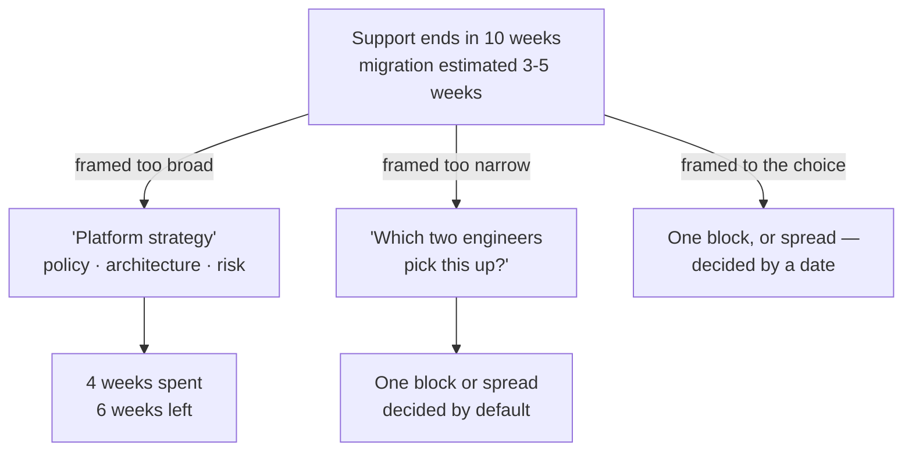
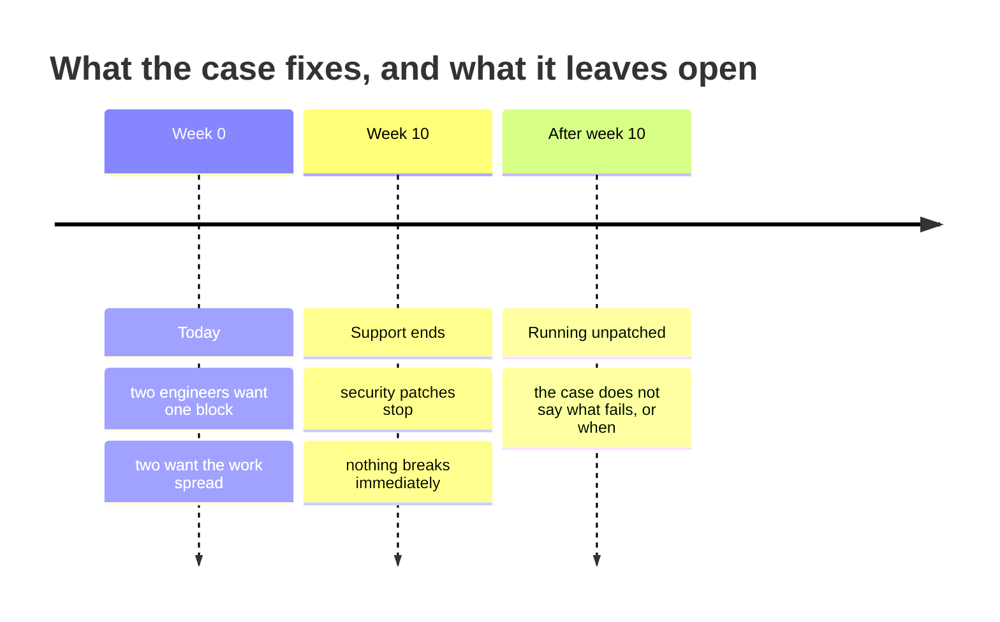

# PF-04 · Right-sized framing

> The frame should be no broader than the next consequential and reversible
> choice requires.

## Problem — the decision the calendar makes for you

A dependency in Noted loses support in ten weeks. The choice in front of the
team is narrow: migrate in one block this cycle, or spread the work across the
remaining ten weeks.

Instead, suppose someone opens a document titled "Platform strategy." It asks how Noted
should manage third-party dependency risk, whether the team should adopt a
support-lifecycle policy, and what the right long-term architecture is. The
document is thoughtful. Everyone contributes. Nobody objects, because objecting
to a strategic view of a technical problem sounds small.

Four weeks pass. The migration has not started. The window is now six weeks
against a three-to-five-week estimate with wide uncertainty. The strategy
document has become a reason not to decide, while looking like the opposite.

The reverse failure is just as common and gets far less attention. A PM sizes
the frame down to "which two engineers do the migration" and gets a fast,
confident answer to a question that was never the risk. The real choice — one
block or spread across the quarter — never gets made explicitly. It gets made by
default, by whoever picks up the work first.

Both failures come from the same missing step. Nobody asked what the next
consequential choice actually is, and nobody asked whether it can be undone.

The failure is hard to see from inside because the broad frame feels
responsible and the narrow frame feels efficient. Both are pleasant to be in.
The frame that fits is usually the uncomfortable one, because it names a
decision someone has to own this week.

One signal, three framings. Only the third ends in someone deciding:

The two failing branches produce different artifacts and the same outcome: the
real choice is made by the calendar rather than by a person.

Ask of any framing document: *what choice becomes possible when this is
finished, and could we make that choice without it?*

## Concept — size the frame to the next choice

Frame size is not a matter of taste. It is set by two properties of the choice
in front of you.

| Property | Question | Effect on the frame |
|---|---|---|
| **Consequence** | What does being wrong cost, and to whom? | Higher consequence justifies more framing |
| **Reversibility** | Can this be undone, and at what price? | Easy reversal justifies less framing |

A frame that is the right size answers both rows of that table. A frame that is
the wrong size cannot answer either, which is how you spot it before you start
writing:

**Weak** — "How should Noted manage third-party dependency risk?"

Ask what being wrong costs, and there is no answer, because nobody has to be
wrong about it by any particular date. This question can be worked on
indefinitely without ever becoming false.

**Strong** — "Migrate in one block this cycle, or spread the work across the
remaining ten weeks."

Consequence: security patches stop after week ten. Reversibility: the choice can
be revised while patches still ship, and not after.

Now combine the two properties:

| | Reversible | Costly or one-way |
|---|---|---|
| **Low consequence** | Decide now. Framing is overhead. | Frame lightly. Name the exit cost. |
| **High consequence** | Frame narrowly, act, and watch. | Frame properly. This is where framing earns its cost. |

Only one of the four cells justifies a broad frame. Most framing documents are
written for that cell while describing a choice from one of the other three.

### The next consequential choice

The sizing rule is: **frame to the next consequential choice, not to the largest
question the topic touches.**

Every problem connects upward to a bigger one. Dependency timing connects to
dependency policy, which connects to architecture, which connects to hiring. All
of those connections are real. None of them changes what has to be decided this
week. A frame that expands to include them stops being a decision aid and
becomes a survey.

Two practical tests:

1. **The removal test.** Take the broadest section of your frame. Delete it. Can
   the next choice still be made? If yes, that section was context, not framing.
   Context is not free — it costs the reader's attention and it delays the
   decision.
2. **The date test.** Name the date by which the next choice must be made.
   Whatever cannot be answered before that date is out of frame, no matter how
   important it is. Important and in-frame are different properties.

### Frames that are too narrow

Under-framing is harder to spot because it produces answers quickly. Three
symptoms:

- The question can be answered without anyone disagreeing. Real choices have
  people on both sides.
- The answer is an assignment, not a decision. "Who does it" has replaced
  "whether and when."
- The consequence of being wrong lands outside the frame. If the cost of a bad
  answer shows up in a place your frame does not cover, the frame is too small.

The last one is the sharpest. A frame must be at least large enough to contain
the consequence of getting the answer wrong.

### Boundary

Right-sizing does not mean small. It means matched.

There are situations where the broad frame is the correct one, and treating this
model as a bias toward narrowness will hurt you. If a decision is one-way, if it
sets a precedent that later decisions will follow, or if the same narrow choice
has now appeared for the fourth time, the recurring pattern is the real problem
and the individual instance is a symptom. Framing narrowly there produces four
correct local answers and one unexamined structural failure.

The second limit: frame size is a judgment made under time pressure with
incomplete information, and it can be revised. A frame you sized narrowly on
Monday can be widened on Thursday when new evidence arrives. What you cannot do
is widen it silently, after the narrow frame produced an answer you disliked.
That is not re-framing. That is looking for a scale at which you win.

## Build — on Noted

Read `lessons/noted/case.md` if you have not already.

Take **Signal 4: a core dependency loses support in ten weeks.**

What the case gives you: engineering estimates the migration at three to five
weeks, with wide uncertainty; two engineers want to migrate now and two want to
spread the work across the quarter; after end-of-support, security patches stop,
and nothing breaks immediately. The case does not tell you what the dependency
does, what else is planned this cycle, or why the estimate is uncertain.

The clock is the only fixed thing in this signal. Everything else is estimate or
preference:

The three-to-five-week migration sits somewhere inside that span, and the case
does not say where. Step 3 asks you to derive a decision date from this picture
rather than from a sprint boundary.

**Your task.** Size the frame, then defend the size against both directions of
attack.

1. Write the next consequential choice in one sentence. It must be a choice
   someone can make, not a topic someone can study.
2. Place it in the consequence and reversibility grid. Justify both axes. "After
   end-of-support, security patches stop. Nothing breaks immediately" cuts both
   ways — say which way you read it and why.
3. Name the date by which the choice must be made. Derive it from the ten-week
   window and the three-to-five-week estimate, not from a planning cycle.
4. Write a frame that is one size too broad. Write a frame that is one size too
   narrow. Both should be tempting.
5. Apply the removal test to your chosen frame. Name one section you can delete
   without preventing the choice, and delete it.
6. Locate the consequence of a wrong answer. Confirm it lands inside your frame.
   If it lands outside, widen the frame until it does.
7. Handle the engineering disagreement. Two against two is not a tie to be
   broken by seniority. Decide whether it is a disagreement about facts, about
   risk tolerance, or about who absorbs the disruption — and say what evidence
   would settle it.
8. Commit to the frame, and state the condition under which you would widen it.

Before you commit in step 8, run your frame against all four failure modes at
once. A frame that fails any row is the wrong size, in the direction the row
names:

| Check | Question | Your frame fails if |
|---|---|---|
| **Removal** | Delete the broadest section — can the choice still be made? | Nothing is lost and you kept it anyway |
| **Date** | What must be decided, by when? | The date comes from a planning cycle rather than from the risk |
| **Consequence** | Where does a wrong answer land? | It lands somewhere the frame does not cover |
| **Disagreement** | Could two informed people take opposite sides? | Nobody can disagree, because it is an assignment |

**Expect to be pushed on:** whether your "wide uncertainty" reading is analysis
or an excuse to start immediately; whether the date you named comes from the
risk or from a sprint boundary; and whether your too-broad frame is a genuine
temptation or a strawman you wrote to look decisive.

### What a strong answer holds

- The choice is one sentence with two options and a date. "How should we handle
  the dependency" is a topic and fails on sight.
- Consequence and reversibility are argued separately. The reading of "patches
  stop, nothing breaks immediately" is stated as a judgment, and what the case
  does not say — what fails after week ten, and when — is written as unknown,
  not filled in with a guess.
- The decision date is derived by subtracting the *longer* estimate from the
  ten-week window, and the answer says what is lost after that date: only the
  faster path survives, and with it the margin for the uncertainty engineering
  already flagged.
- Both wrong-sized frames are ones a reasonable colleague would propose. The
  too-broad one sounds responsible; the too-narrow one sounds efficient. Neither
  is a strawman.
- The two-against-two disagreement is diagnosed — about facts, about risk
  tolerance, or about who absorbs the disruption — and the answer names the
  evidence that would settle it. It is not resolved by seniority, by a vote, or
  by splitting the difference.
- The most common weak move is taking the decision date from a planning
  boundary ("end of this cycle"). It is weak because the calendar, not the risk,
  then makes the decision — which is exactly the failure this lesson opened
  with.

## Use — on your product

Take a decision your team is currently framing — ideally one where a document is
being written right now.

Answer five questions:

1. What is the next consequential choice, stated as a choice with a date?
2. Where does it sit on consequence and reversibility? Answer both separately.
3. Which section of the current framing could be deleted without preventing that
   choice?
4. Where does the consequence of a wrong answer land, and is that place inside
   the frame?
5. What would make you widen the frame later — and would you accept that trigger
   if it arrived after an answer you disliked?

Write `<unknown>` where you cannot answer from what you hold today. Question four
is the one people guess at most often, and guessing there is how consequences
end up owned by nobody.

## Ship — Framing scale check

Produce `artifacts/PF-04-framing-scale-check.md` using the template in
`artifact.md`.

Write it for the person who has to approve the scope of the work — the one
deciding whether your team spends a week framing or a day deciding. That person
needs to see the choice, its date, and why the frame is that size, in that
order.

This is the fourth entry in your Product Decision Case. It disciplines the
earlier entries: a decision brief and a mechanism map can both quietly grow past
the choice that prompted them, and this check is where you catch that.

## Carry forward

A frame sized to a dated, consequential choice, with an explicit condition for
widening it. PF-05 applies the same discipline to a different axis. Instead of
asking how broad the question should be, it asks how broad the audience should
be — and the same two failures, too wide and too convenient, show up there.
