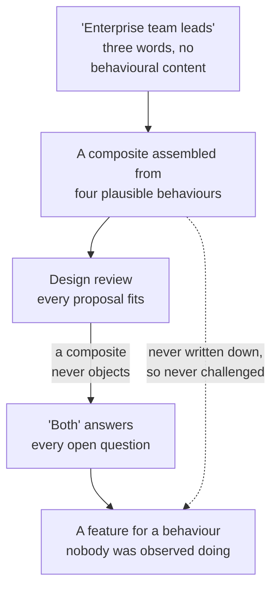
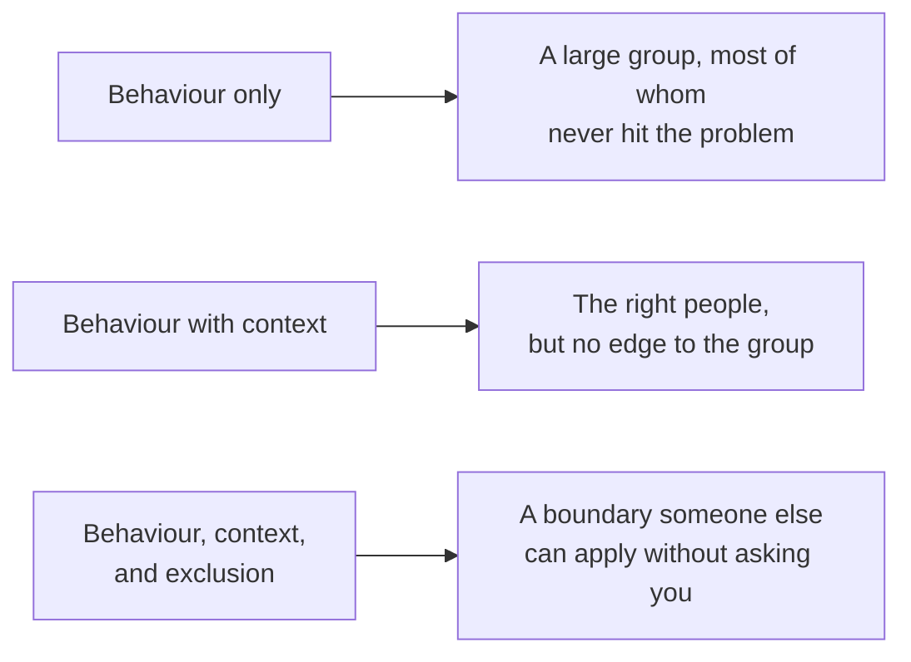
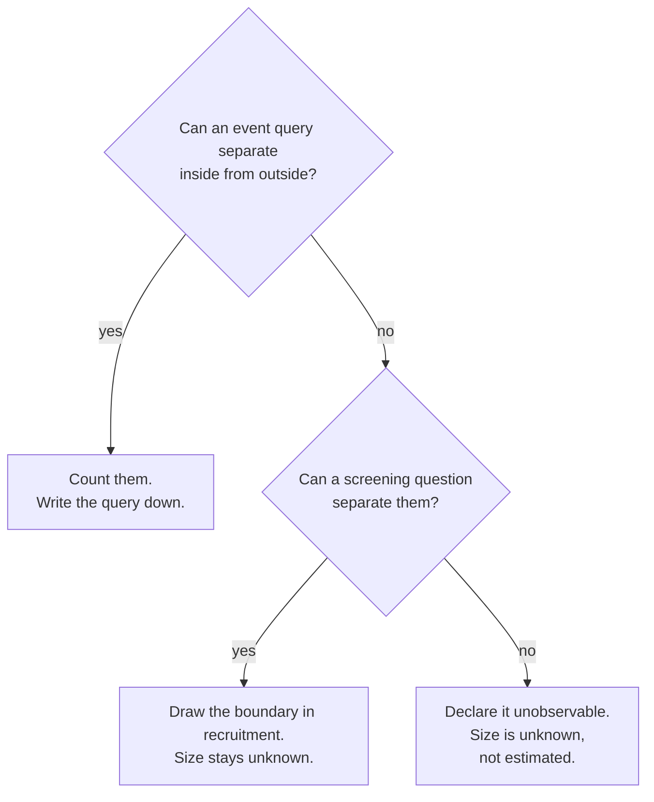

# PF-05 · User and context boundary

> A useful audience is a behavior-and-context boundary, not a demographic label
> or an imagined average user.

## Problem — the composite user who never objects

Suppose a team decides to build meeting summaries for "enterprise team leads."

Nobody can say what that means operationally. It is not a plan tier, because
plan tier is a billing fact and says nothing about how someone works. It is not
a job title, because the product has never captured job titles. It is not
"people in large workspaces," because those are the customers with performance
problems, and only some of them run recurring meetings.

So the team builds for a composite. A person who runs weekly meetings, takes
notes in the product during the call, needs to assign owners, and shares the
result with people who were not there. Every element of that composite is
plausible. No single observed person has been confirmed to have all four.

The design reviews go smoothly, because a composite user never objects. Every
proposal fits, since the audience was assembled from the same intuitions the
proposals came from. When someone asks whether team leads take notes during
meetings or afterwards, the answer is "both," and the design accommodates both,
and the product grows a feature for a behaviour nobody has been observed doing.

The failure is hard to see from inside for two reasons. First, the label sounds
specific. "Enterprise team leads" has three words of precision and zero
behavioural content. Second, an average is invisible. The composite is never
written down as an assumption, because it was never written down at all — it
lives in everyone's head slightly differently, and the differences only surface
after the build.

The composite is not a shortcut someone took. It is what a label produces when
nobody writes it down:

The dotted edge is the one to hold onto. The composite is not wrong because it
is a simplification. It is dangerous because it was never stated, so there is
nothing on the page for anyone to disagree with.

Ask of any audience definition: *could I write a query, or hand a recruiter a
screening question, that separates people inside this boundary from people
outside it?* If not, you have a label, not a boundary.

## Concept — behaviour, context, and who is excluded

An audience boundary answers three questions together. Any one of them alone is
not a boundary.

| Question | What it fixes | Failure when missing |
|---|---|---|
| **Behaviour** | What these people do, observably and repeatedly | The audience includes people who never hit the problem |
| **Context** | The conditions under which they do it | The behaviour is real but the problem only appears in some settings |
| **Exclusion** | Who is deliberately outside, and why | The boundary quietly expands until it means everyone |

Exclusion is the field people skip, and it is the one that makes the boundary
real. A definition that excludes nobody has no edges. If you cannot name a
population that plausibly resembles your audience but is out of scope, you have
not drawn a boundary — you have described the product's whole user base with
extra adjectives.

The three fields are cumulative, and stopping early produces a specific kind of
wrong answer:

Only the third row survives contact with a researcher scheduling calls, which is
the test that matters in the Ship section.

### Behaviour, not attribute

Attributes describe who someone is on a form. Behaviours describe what they do.

| Attribute-based | Behaviour-and-context based |
|---|---|
| Enterprise plan customers | People who run a recurring meeting series and produce a written record afterwards |
| Team leads | People who assign work to others in a document that others read later |
| Large workspaces | People who search across more than a few hundred documents in a single session |

The right-hand column can be checked. Some of it can be checked in event data,
some of it needs a screening question, and some of it cannot be checked with
what you have — which is itself useful to discover before you build.

Attributes are not useless. They are proxies. A proxy is legitimate when you
state what it stands for and how well it stands for it. "Enterprise plan" as a
proxy for "runs recurring meetings with people who miss them" is a claim about
correlation, and it deserves the same population, window, source and limit
treatment as any other claim.

### The average user is not a user

Composite audiences fail in a specific way: they are consistent, and no real
person is. Blending four observed behaviours from four different people produces
a fifth person who does not exist and who cannot disconfirm anything.

The repair is not "add more detail." More detail makes the composite more vivid
and no more real. The repair is to **anchor each element of the boundary to
something observed**, and to mark the elements that are not. A boundary with
three observed elements and one marked assumption is honest and usable. A
boundary with four unmarked assumptions is fiction with a job title.

The repair looks like this on Noted's enterprise signal:

**Weak** — "Enterprise team leads who need better meeting records."

Plan tier is a billing fact. The product has never captured job titles. Nobody
is excluded, so a borderline case cannot be resolved without asking the author.

**Strong** — "People who run the same meeting series more than once and produce
a written record afterwards that someone who was absent later reads. Outside:
individual knowledge workers, who have no absent reader; and large-workspace
owners, who reach us through a response-time signal, not a meeting one."

The difference is not detail. The strong version can be applied to one person at
a time, by someone who is not you, because it names a repeated behaviour, the
condition that makes the loss possible — an absent reader — and two populations
it deliberately keeps out.

### When you cannot observe the boundary

Sometimes the product simply does not capture what you need. Meeting type may
not be recorded. Actor identity may be missing for a share of events. This is
common and it is not a dead end.

Three moves, in order of preference:

1. **Find a behavioural proxy you can observe,** and state its error direction —
   who it wrongly includes and who it wrongly excludes.
2. **Use a screening question** to draw the boundary in recruitment rather than
   in data.
3. **Declare the boundary unobservable,** and treat every claim about its size
   as unknown rather than estimated.

The order matters, and so does where you are allowed to stop:

Both lower branches end with size unknown, and neither is a failure. The third
move is a legitimate answer. Teams avoid it because it sounds like failure, and
then spend a quarter building for a population whose size they cannot check.

### Boundary

Behavioural boundaries are not always the right unit, and treating them as
universal will produce nonsense in two places.

**Where an attribute is the actual constraint.** Legal, accessibility, data
residency, regulatory, and contractual requirements attach to attributes by
design. "Customers whose data must remain in a specific jurisdiction" is a real
boundary, and translating it into behaviour would lose exactly the thing that
matters.

**Where the behaviour does not yet exist.** For a genuinely new capability,
nobody currently performs the behaviour you are designing for. Defining the
audience by a behaviour that has never been observed is circular: you will find
zero people inside your boundary and conclude wrongly. There, the honest move is
to define the audience by the **adjacent behaviour and the condition** — what
they do today instead, and what makes the current approach costly — and to state
plainly that the target behaviour is hypothesised.

The line is this: use behaviour when behaviour is what determines whether the
problem occurs. Use attributes when the attribute is what determines it. The
error is not using attributes. The error is using attributes and calling them
behaviour.

## Build — on Noted

Read `lessons/noted/case.md` if you have not already.

Take **Signal 2, and specifically the population question inside it.** Three
enterprise customers asked for automated meeting summaries. The untested claim is
that enterprise team leads repeatedly lose decisions, action owners, or context
after recurring meetings, causing rework or missed commitments.

What the case gives you: three constructed populations — individual knowledge
workers, small teams, enterprise team leads — described as teaching populations
rather than validated segments; team collaboration is in design, not live;
private draft-review is planned; meeting type is not captured in event data;
actor identity is missing for about 18% of events.

**Your task.** Turn "enterprise team leads" into a boundary someone could
actually apply.

1. Write the audience as the roadmap currently states it. Then list every
   attribute in that phrase and mark each one: observable in the product,
   observable only by asking, or not observable at all.
2. Write the behaviour-and-context boundary. Behaviour must be something a
   person does more than once. Context must name the conditions under which the
   loss of decisions or owners actually occurs.
3. Write the exclusion. Name at least two populations that resemble your
   audience and are deliberately outside it, with the reason for each. One of
   them should be a population someone on the team will want to include.
4. For each element of your boundary, mark whether it is observed in the case,
   inferred by you, or unknown. Do not skip this. Count the unmarked assumptions
   at the end.
5. Decide how you would identify these people. Say whether it is by event query,
   by screening question, or not at all — and if it is a proxy, name who it
   wrongly includes and who it wrongly excludes.
6. Handle the live-capability constraint honestly. Team collaboration is in
   design, not live. Say what that does to a boundary defined around shared
   meeting records, and whether your audience can currently exist inside the
   product at all.
7. State what you cannot know about this population's size, and refuse to
   estimate it.
8. Commit to a boundary, and name the observation that would make you redraw it.

Steps 2 to 5 fit one shape. Fill it in, then count the rows marked *inferred*:

| Element | Your statement | Observed · inferred · unknown | Where it came from |
|---|---|---|---|
| Behaviour | `<what they do, more than once>` | | |
| Context | `<the condition under which the loss occurs>` | | |
| Exclusion 1 | `<who is outside, and why>` | | |
| Exclusion 2 | `<the one the team will argue about>` | | |
| Identification | `<query, screening question, or neither>` | | |

A boundary with one inferred row is workable, as long as the row is marked. A
boundary where every row is inferred is the composite from the Problem section,
wearing better clothes.

**Expect to be pushed on:** whether your context clause is doing real work or is
decoration attached to a demographic; whether your exclusions are ones the team
would actually accept or ones chosen because they are easy; and whether you let
"enterprise" quietly become the boundary again once the behavioural version
turned out to be unobservable.

### What a strong answer holds

- The behaviour is something a person does more than once and that someone else
  could watch — running the same meeting series again, producing a written
  record afterwards. It is not a title, a plan tier, or a workspace size.
- The context names the condition that makes the loss possible — a reader who
  was not there, a decision that has to survive a handoff — not the setting.
  "In meetings" is a setting. "Someone absent has to act on it later" is a
  condition.
- Two exclusions, each with a reason, and one of them is a population a
  colleague would fight to include — small teams, or the owners of large
  workspaces. An exclusion nobody objects to has not drawn an edge.
- The table is honestly marked, which means most rows read *inferred* or
  *unknown*: the case observes almost none of this behaviour. The answer says so
  rather than quietly promoting inferences to observed, and the size of the
  population stays `<unknown>`.
- The live-capability fact is faced. Team collaboration is in design, so the
  shared-record behaviour cannot yet happen inside Noted. The answer says what
  that does to a boundary drawn around it — including whether these people can
  currently be found in the product at all, or only by asking.
- The most common weak move is letting "enterprise" back in as the boundary
  once the behavioural version turned out to be unobservable. It is weak because
  a billing fact says nothing about how anyone works, so the boundary would once
  again include people who never hit the problem and exclude people who do.

## Use — on your product

Take the audience definition your team is currently using for the decision you
have been carrying since PF-01.

Answer five questions:

1. What observable, repeated behaviour defines this audience?
2. Under what context does the problem actually occur for them? Name the
   condition, not the setting in general.
3. Who is deliberately excluded, and who on your team will object to that
   exclusion?
4. Which elements of your boundary are observed, which are inferred, and which
   are unknown?
5. Can you count these people with what you have today? If you are using a
   proxy, in which direction is it wrong?

Write `<unknown>` where you cannot answer. Question five is where teams most
often substitute a number they can produce for the number they need, and the
substitution is rarely visible once it reaches a slide.

## Ship — Audience boundary

Produce `artifacts/PF-05-audience-boundary.md` using the template in
`artifact.md`.

Write it for the person who will recruit participants or write the query — the
researcher, the analyst, the designer scheduling calls. That person has to make
inclusion decisions one case at a time. If your boundary does not let them
resolve a borderline case without asking you, it is still a label.

This is the fifth entry in your Product Decision Case. It sharpens PF-03: an
evidence boundary states which population a claim came from, and this artifact
states which population the decision is for. When those two populations differ,
you have found something worth knowing before you build.

## Carry forward

An audience defined by behaviour and context, with explicit exclusions and every
element marked observed, inferred, or unknown. PF-06 needs this to be honest:
you cannot compare two opportunities against each other unless you know how many
people each one reaches, and a boundary that quietly includes everyone will make
its opportunity look larger than it is.
