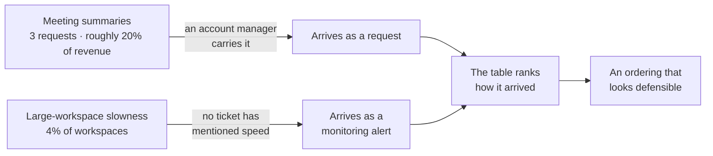
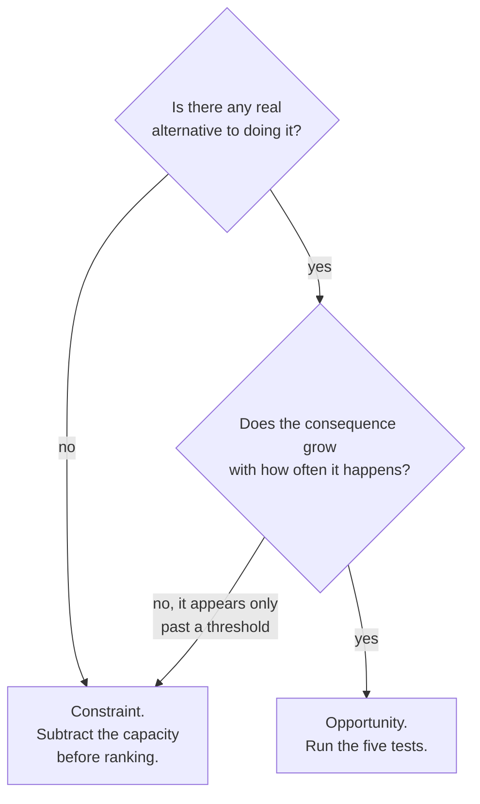

# PF-06 · Opportunity worth solving

> Opportunity earns priority through consequence, frequency, ownership,
> alternatives, and strategic fit — not request volume alone.

## Problem — the table that ranks how problems arrived

A PM builds a prioritisation table. Meeting summaries score highly: three
enterprise requests, 20% of revenue attached, an obvious feature shape. Large
workspace performance scores lower: no requests, no complaints, one monitoring
alert. The table produces an ordering. The ordering goes into the plan.

Notice what the table actually measured. It measured how loudly each problem
arrived. Requests are a channel artifact — they come from customers who have an
account manager, who know what to ask for, and who believe asking will work. A
problem that produces no request is not a smaller problem. It is a problem whose
sufferers have no path to your inbox, or who have already adapted around it, or
who leave without explaining why.

Suppose it plays out like this. Six months later the enterprise feature is live
and lightly used. Two large paying workspaces have downgraded. Nobody filed a
ticket about speed before leaving, because people rarely complain about a
product being slow. They just use it less, then use it elsewhere.

The failure is hard to see from inside because the prioritisation table did its
job. It was consistent, it was applied evenly, and it produced a defensible
ranking. The defect was in the inputs, and a defect in the inputs is invisible
once the table renders. A scoring model launders whatever went into it into
something that looks like analysis.

There is a second version of this failure that looks more sophisticated. A team
scores every opportunity on reach, impact, confidence and effort, multiplies,
and ranks. The numbers are estimates, the units are incompatible, and the
multiplication produces a single figure with no meaning — but the figure is
comparable, and comparability feels like rigour. The argument then moves to
whether impact is a 3 or a 4, which is not an argument anyone can win or learn
from.

The defect entered before the scoring did. Follow each signal back to how it
arrived:

Both paths lead into the same table, and the table cannot tell them apart. Once
the ranking renders, the difference between the two left-hand boxes is gone.

Ask of any priority ordering: *which of these problems would still be invisible
to us if it were severe?*

## Concept — five tests that cannot offset each other

An opportunity earns priority on five tests. They are not weights to multiply.
They are separate questions with separate answers, and a weak answer on one of
them cannot be repaired by a strong answer on another.

| Test | Question | What a weak answer looks like |
|---|---|---|
| **Consequence** | What happens to the user, and to the business, if this stays unsolved? | "Users are frustrated" — a feeling, with no downstream event |
| **Frequency** | How often does the problem occur, for how many, inside the boundary from PF-05? | A count of requests standing in for a count of occurrences |
| **Ownership** | Is this ours to solve, and do we hold the authority and the capability? | The fix depends on a team, a system, or a capability that is not live |
| **Alternatives** | What do people do instead today, and how well does it work? | No workaround named, which usually means nobody looked |
| **Strategic fit** | Does solving this move the product toward what it is trying to become? | Fit asserted by restating the company vision |

### Consequence is a chain, not an adjective

"This is painful for users" is not consequence. Consequence is what happens
next: work redone, a commitment missed, a seat unrenewed, a workspace abandoned.
Write the chain until it reaches an event someone could observe. If the chain
runs out after one link, the consequence is smaller than it felt.

Consequence has a direction people forget. A problem can be severe and silent.
Severity and visibility are independent properties, and channels measure only
the second one.

The same slow-workspace signal, written as an adjective and written as a chain:

**Weak** — "Slow workspaces frustrate our largest paying customers."

One link, and it ends in a feeling. Nothing here can be looked for, so nothing
here can come back false. It will sit in the table at whatever weight the author
felt it deserved.

**Strong** — "Results take longer to return → those users search less often →
they keep the record somewhere faster → seats go unused → renewal is decided on
unused seats."

The strong version is not more confident. It is more exposed: every link is an
event someone could go looking for, which means someone can also come back and
tell you the third link is false. That is what makes it worth writing.

### The alternatives test is the one that kills good-looking opportunities

If people already have a workaround that is 80% as good, the value of your
solution is the remaining 20%, not the whole problem. Teams routinely size an
opportunity as if the current state were doing nothing.

Alternatives include: another product, a manual process, a colleague doing it
for them, and doing without and accepting the loss. The last one matters most
and is asked about least. Some problems are genuinely tolerated, permanently,
and solving them changes nothing about what people do.

### Comparing across incompatible units

Two opportunities will rarely be measured in the same units. One is three
accounts and 20% of revenue. Another is 4% of workspaces holding a
disproportionate share of paid seats. There is no honest arithmetic that ranks
those.

What you can do instead is compare them **one test at a time**, and state where
each one wins and loses. That produces a comparison a reader can argue with,
because they can disagree with one row instead of one number. Then make the call
in language, not in arithmetic: *I would take X over Y because its consequence
chain reaches a business event and Y's does not, even though Y arrived with more
requests.*

The shape that makes that possible is one row per test and one column per
opportunity. Two rows are already filled here, because the case fixes them; the
rest are yours:

| Test | Signal 2 · meeting summaries | Signal 3 · large-workspace speed |
|---|---|---|
| **Consequence** | `<your chain, to an observable event>` | `<your chain, to an observable event>` |
| **Frequency** | 3 requests, one channel, one month | 4% of workspaces; the share of paid seats is called disproportionate, never counted |
| **Ownership** | Team collaboration is in design, not live | `<yours>` |
| **Alternatives** | `<what they do today instead>` | `<what they do today instead>` |
| **Strategic fit** | `<yours>` | `<yours>` |

Read it across, one row at a time. A reader can disagree with a row and tell you
which one. Nobody can disagree with the product of four estimates.

A ranking you can argue with is more useful than a score you cannot
reconstruct.

### Boundary

The five tests apply to opportunities that genuinely compete for the same
capacity. Two situations sit outside the model.

**Forced choices do not compete.** A dependency losing support, a security
obligation, a legal deadline — these do not enter the ranking. They are
constraints on the capacity that the ranking is allocating. Scoring them
alongside opportunities produces a false comparison, because they have no
alternative and their consequence appears only after a threshold. Subtract them
first, then rank what is left against the capacity that remains.

Two questions separate the two kinds, and urgency is not one of them:

Signal 4 goes through this diagram in step 1 of the Build. Answer the two
questions before you decide how urgent it feels.

**Some opportunities are complements, not substitutes.** The model assumes you
are choosing between things. When two problems share a mechanism, solving one
may resolve or shrink the other, and ranking them against each other is the
wrong shape entirely. Check for a shared mechanism before you compare — the work
from PF-02 is what makes this visible.

One further limit. These five tests judge whether an opportunity is worth
attention. They do not tell you whether your proposed solution will work. An
opportunity can pass every test and still be met with a bad solution, and no
amount of prioritisation rigour protects against that.

## Build — on Noted

Read `lessons/noted/case.md` if you have not already.

You will compare **Signal 2 (three enterprise customers asked for automated
meeting summaries)** against **Signal 3 (P95 response time rose 34% for large
workspaces)**, under the constraint of **Signal 4 (a core dependency loses
support in ten weeks)**.

Bring forward three things you already wrote: the mechanisms from PF-02, the
frame and its date from PF-04, and the audience boundary from PF-05.

**Your task.**

1. Handle Signal 4 first. Decide whether it is an opportunity to be ranked or a
   constraint to be subtracted. Defend the answer using its alternatives and its
   consequence shape, not its urgency.
2. Fill the five-test table above for both signals, one row at a time. Three
   rows need particular care:
   - **Consequence.** Write each chain link by link until it reaches an event
     someone could observe, or runs out. Say which chain runs out first.
   - **Frequency.** For Signal 2, use the boundary from PF-05; if it made the
     population unobservable, write `<unknown>` rather than estimating. For
     Signal 3, say what "4% of workspaces" is counting, and whether affected
     workspaces and affected sessions are the same thing.
   - **Alternatives.** Name what an enterprise team lead does today instead,
     and what someone in a slow large workspace does today instead. One of
     these is easier to name than the other. Say what that asymmetry tells you.
3. Handle the visibility asymmetry directly. Signal 2 arrived through requests.
   Signal 3 arrived through monitoring with a silent support queue. State what
   each channel systematically fails to surface.
4. Check for a shared mechanism. If large-workspace slowness and enterprise
   dissatisfaction have a common cause, ranking them against each other is the
   wrong move. Decide, and say what you checked.
5. Compare the two across the table, one row at a time. Say where each wins and
   where each loses. Do not produce a combined score.
6. Commit to an ordering, in a sentence that names the test that decided it and
   the test where your choice is weakest.
7. State what would reverse the ordering, as an observation with a threshold.

**Expect to be pushed on:** whether your consequence chain for Signal 3 is
evidence or a plausible story about churn you cannot see; whether you allowed
the 20% revenue figure to substitute for frequency; and whether your ordering
was actually decided by which signal you find more interesting to work on.

### What a strong answer holds

- Signal 4 is classified by the two diagram questions — is there a real
  alternative, and does the consequence grow with frequency or arrive at a
  threshold — and subtracted before anything is ranked. It is not ranked because
  it feels urgent, and not ignored because nothing breaks immediately.
- Both consequence chains end in an event someone could go and look for: a
  downgrade, a missed commitment, an unused seat. The answer says which chain
  runs out first and admits that no link in either chain is observed in the
  case. They are hypotheses with a shape, not findings.
- The frequency rows hold only what the case holds. Three requests, one channel,
  one month. Four percent of workspaces, with the paid-seat share called
  disproportionate and never counted. Any number beyond that is `<unknown>`.
- The alternatives row is filled for both, and the asymmetry is read as
  information: a workaround for slowness is easy to name, a workaround for lost
  decisions is a guess, and that says something about which problem is better
  understood — not about which is larger.
- The ordering is a sentence in language, naming the test that decided it and
  the test where it is weakest, with a reversal condition that has a number
  attached. No combined score appears anywhere.
- The most common weak move is letting the 20% revenue figure stand in for
  frequency or consequence. It is weak because it is a contract value: nothing
  in the case says those contracts are at risk, and the requests it is attached
  to came through one channel.

## Use — on your product

Take the two strongest candidates on your own roadmap. They must genuinely
compete for the same capacity.

Answer five questions:

1. For each, write the consequence chain to an observable event. Which one runs
   out of links first?
2. For each, what do people do today instead, and how well does it work?
3. Which one arrived through a channel, and what does that channel not surface?
4. Is either of them actually a constraint rather than an opportunity?
5. Which test decides your ordering, and on which test is your choice weakest?

Write `<unknown>` where you do not have the evidence. Question two is where most
opportunities shrink, because the honest answer is often that people already
have something adequate and the remaining gain is small.

## Ship — Opportunity case

Produce `artifacts/PF-06-opportunity-case.md` using the template in
`artifact.md`.

Write it for the person who will be told their preferred item was not chosen.
That reader is looking for the place where your reasoning is weakest, and the
artifact is stronger if you have already named it. An opportunity case that
cannot survive its own losing party is a case for a decision already made.

This is the sixth entry in your Product Decision Case and the one that closes
Problem Framing. It uses every earlier artifact: the decision from PF-01, the
mechanisms from PF-02, the evidence limits from PF-03, the frame and its date
from PF-04, and the audience from PF-05. If any of those were weak, the
comparison here will expose it — an opportunity built on a vague audience or an
unbounded claim cannot be compared against anything.

## Carry forward

A comparison made one test at a time, an ordering stated in language rather than
arithmetic, and a named reversal condition. PJ-01 takes the confidence you
attached to that ordering and tests whether it is calibrated — whether your
stated certainty matches the evidence you actually hold, and what happens to
your judgment when it does not.
