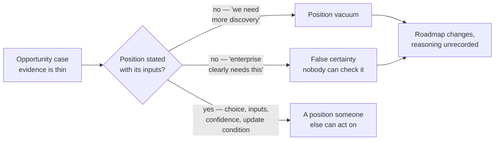
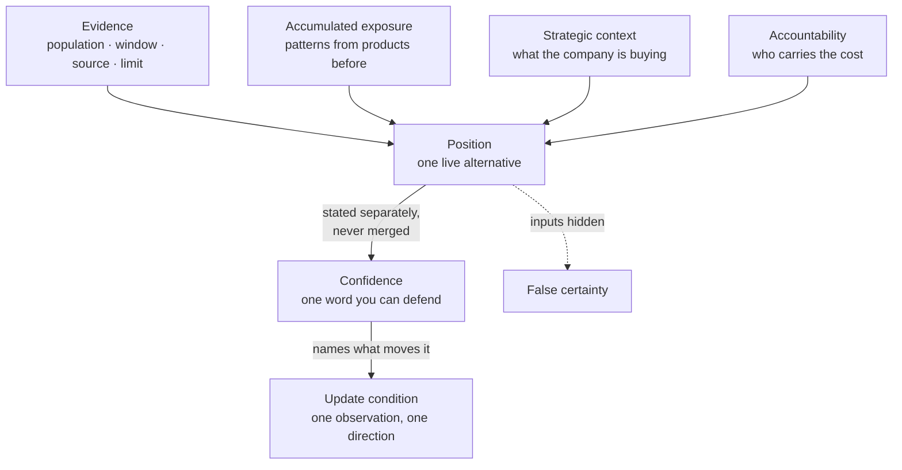

# PJ-01 · Calibrated product judgment

> Judgment integrates evidence, accumulated exposure, strategic context, and
> accountability while preserving uncertainty.

## Problem — the position vacuum someone else fills

A PM finishes an opportunity case. The room asks the only question that matters:
*so what do you think we should do?*

The PM says the evidence is not conclusive yet, and proposes more discovery.
This sounds careful. Everyone nods. Six weeks later the account manager
escalates, the founder makes the call in a hallway, and the roadmap changes
without anyone writing down why.

The PM did not avoid a decision. The PM transferred it to whoever was willing to
speak with confidence. Refusing to take a position does not preserve rigor; it
hands the position to the least calibrated person in the room.

The opposite failure is just as common and easier to admire. Another PM says
"enterprise clearly needs this" and gets funded. The claim was built from three
requests through one account manager, plus a memory of a previous company where
something like it worked. Neither input was wrong. Both were presented as
stronger than they were, and nobody could tell which part of the position would
break first.

Both PMs failed in the same way. **A position was stated without the inputs it
rests on, and a confidence was implied that nobody could check.** The first
implied confidence near zero, which was false. The second implied confidence
near certainty, which was also false.

Both failures run through the same gap, and both end in the same place — a
roadmap that moved without a recorded reason:

The middle node is the one to watch. A vacuum does not stay empty; it is filled
by whoever speaks next with confidence, and that person is usually not the one
holding the evidence.

Ask a PM who has just given a recommendation: *what is your confidence, and what
specific observation would move it?* If the answer is "we would need more data,"
they have not taken a position. If the answer is "nothing would change my mind,"
they are not reasoning.

## Concept — a position with visible inputs and stated confidence

Judgment is not intuition, and it is not the average of the evidence. It is a
**stated position with visible inputs and a checkable confidence.**

Four inputs feed a product position. Each one is legitimate. Each one lies when
it is used alone.

| Input | What it contributes | How it misleads when used alone |
|---|---|---|
| **Evidence** | What was observed, inside a stated population, window, source, and limit | Says nothing outside its boundary, but reads as if it does |
| **Accumulated exposure** | Fast hypotheses from products and users you have seen before | Transfers a pattern from a context that no longer holds |
| **Strategic context** | Which outcome the company is currently trying to buy | Quietly overrides evidence and becomes a wish |
| **Accountability** | Who carries the consequence, and therefore who must choose | Authority gets mistaken for correctness |

PF-03 gave you the discipline for the first row: a claim carries product weight
only when its population, window, source, and limit are visible. PJ-01 asks you
to do the same thing for the other three. Where did the pattern come from? What
is the strategy actually paying for? Who eats the cost if this is wrong?

The four inputs combine into one position. What keeps that position from
hardening into false certainty is that the confidence is stated *separately*
from the choice, and carries the observation that would move it:

The dashed edge is the failure. It is not a different diagram — it is the same
position with the four source nodes deleted, which is what "enterprise clearly
needs this" is.

### What a calibrated position contains

A position is calibrated when a reader can check it without asking you
questions:

1. **The choice**, stated as one of the live alternatives from your decision
   statement — not a topic and not a direction.
2. **The inputs**, separated by type, so a reader can see which rows are doing
   the work. A position resting mostly on accumulated exposure is not
   disqualified; it is disclosed.
3. **A confidence**, stated in words that carry meaning. "Moderate" means you
   would be unsurprised to be wrong. "High" means you would owe someone an
   explanation.
4. **The strongest counter-case**, written well enough that the person who
   believes it would recognize their own argument.
5. **The update condition** — the specific observation that would move your
   confidence, in which direction, and by roughly how much.

Here is the same position on Noted's enterprise summaries signal, written both
ways. Both take a side. Only one of them can be checked:

**Weak** — "Enterprise clearly needs this. Three customers asked, and they are
20% of revenue. High confidence."

Every input is present and none is labelled. Three requests through one account
manager read as prevalence, and a contract value reads as a churn risk. A reader
who disagrees has nothing specific to disagree with.

**Strong** — "Run a bounded test of the lost-decisions claim before committing
roadmap capacity. Moderate confidence. This rests mostly on accumulated
exposure, not evidence: the three requests came through one account manager
inside one month, so they are one channel, not three independent points. The 20%
is contract value; nothing says those contracts are at risk. I would move to
high if the support lead's recordings show team leads describing lost decisions
unprompted."

The difference is not caution. Both are positions. The second one **names which
input is load-bearing**, so a reader can attack the right part — and it names the
observation that would move it, so the team knows where to look.

### Confidence and certainty are different things

Preserving uncertainty does not mean lowering your position. It means keeping
the position and the confidence separate.

| Statement | Position | Confidence | Usable? |
|---|---|---|---|
| "We need more data before deciding." | none | none | No — the decision still gets made, elsewhere |
| "Enterprise clearly needs this." | build | implied certainty | No — no reader can check it |
| "Build it. Moderate confidence. Three requests through one channel is not prevalence, so I would drop to low if a second channel showed nothing." | build | moderate, with a named test | Yes |

The third statement can be wrong. That is what makes it useful. It tells the
team where to look to find out.

### Boundary

Calibration has two real limits.

**Low confidence does not license inaction.** Some decisions expire. When an
option set is shrinking, "wait for more evidence" is itself a position with a
cost, and it must be stated and priced like any other. A PM who calls waiting
"not deciding" is hiding a choice inside a process.

**You cannot calibrate against a scale you never check.** Stated confidence
drifts unless it is compared to what actually happened, over a run of decisions.
A single decision cannot tell you whether your "high confidence" means anything.
Until you have that record, treat your own confidence labels as claims you owe
evidence for, not as measurements. PJ-05 starts building that record, and EV-07
uses it to update belief.

Calibration also does not substitute for expertise. Stating moderate confidence
on a question that belongs to your engineering lead does not make your answer
more usable than theirs. It makes it better labelled.

## Build — on Noted

Read `lessons/noted/case.md` if you have not already.

Take **Signal 2: three enterprise customers asked for automated meeting
summaries.**

Bring your PF-06 opportunity case. Whatever it concluded, assume the head of
product now wants your position, not your case: one sentence they can act on,
and a confidence they can check.

**Your task.** Take a position on the enterprise summaries opportunity, and make
it checkable.

1. State the choice you are taking, as one of the live alternatives. "Build the
   summaries capability this quarter," "make no roadmap change yet," and "run a
   bounded test of the underlying claim first" are three different positions
   with three different costs.
2. Separate your inputs into the four rows. Write what each one actually
   contributes here, and mark which row your position mostly rests on.
3. For the evidence row, apply PF-03: state the population, window, source, and
   limit of every claim you use. The 20% revenue figure is a contract value, not
   a churn risk. Say which one you are treating it as, and why.
4. For the audience, apply PF-05: enterprise team leads are a behavior-and-
   context boundary, not a contract size. Say which behavior you mean.
5. State your confidence in one word, and one line saying why that word and not
   the one above or below it.
6. Write the strongest counter-case. Write it so that the founder, who made the
   earlier sequencing decision, would recognize it as fair.
7. Name the update condition: one observation, its direction, and what it would
   do to your confidence.

**Expect to be pushed on:** whether "run a bounded test first" is a real
position or a way to avoid taking one; whether you are treating three requests
through one account manager as three independent data points; and whether the
20% revenue figure entered your reasoning as evidence of value or as pressure.

### What a strong answer holds

- The choice is one of the live alternatives, stated so that it could turn out
  wrong. "Run a bounded test first" counts only if the answer says what the test
  would settle, by when, and what the roadmap does while it runs. Without those
  three, it is a deferral wearing a position's clothes.
- The four inputs are separated and one is marked as load-bearing. If that row
  is accumulated exposure, the answer says which product or pattern the
  exposure came from, so a reader can judge whether the context still holds.
- The evidence row carries PF-03's fields: three accounts, one account manager,
  one month, an untested underlying claim, meeting type not captured. The 20%
  is treated as contract value unless the answer can say what makes it exposed.
- The confidence is one word, with a line on why not the word above or below.
  "High" on this evidence has to survive the observation that one channel is not
  three independent points.
- The counter-case contains the strongest fact for the other side — written so
  the founder, who made the earlier sequencing call, would recognise it as fair
  — and the update condition is one observation with a direction and a rough
  size of the move it would cause.
- The most common weak move is "we need more discovery" with no position
  attached. It is weak because the decision still gets made, in a hallway, by
  whoever speaks next with confidence — and that person is rarely the one
  holding the evidence.

## Use — on your product

Take one live position you currently hold about your own product. Choose one you
have already said out loud to someone.

Answer four questions:

1. Which of the four inputs is your position mostly resting on? Be honest —
   most real positions rest on accumulated exposure and are dressed as evidence.
2. What is your confidence, in one word, and what would a reader need in order
   to check that word?
3. What is the strongest counter-case, written in the words of the person who
   holds it?
4. What single observation would move your confidence, and in which direction?

Write `<unknown>` where you have no answer. An input you cannot name is an input
you cannot defend when someone senior pushes on it.

## Ship — Calibrated product view

Produce `artifacts/PJ-01-calibrated-product-view.md` using the template in
`artifact.md`.

Write it for the person who has to act on your position without being able to
ask you a follow-up question. That is the real test of calibration: the document
carries the confidence, not your tone of voice.

This extends your Product Decision Case. PF-01 gave you the decision and its
alternatives. This artifact commits to one of them, in public, with the
uncertainty attached rather than removed.

## Carry forward

A stated position, its four inputs separated, a confidence you can defend, and
one named update condition. PJ-02 attacks the weakest thing you just wrote: you
took a position on whether to build something, without stating what change
counts as good enough to be worth building.
