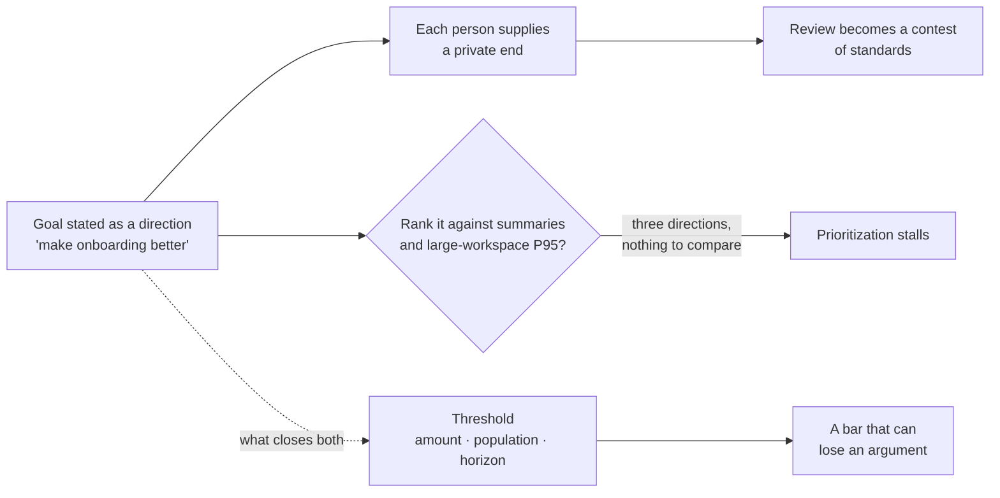
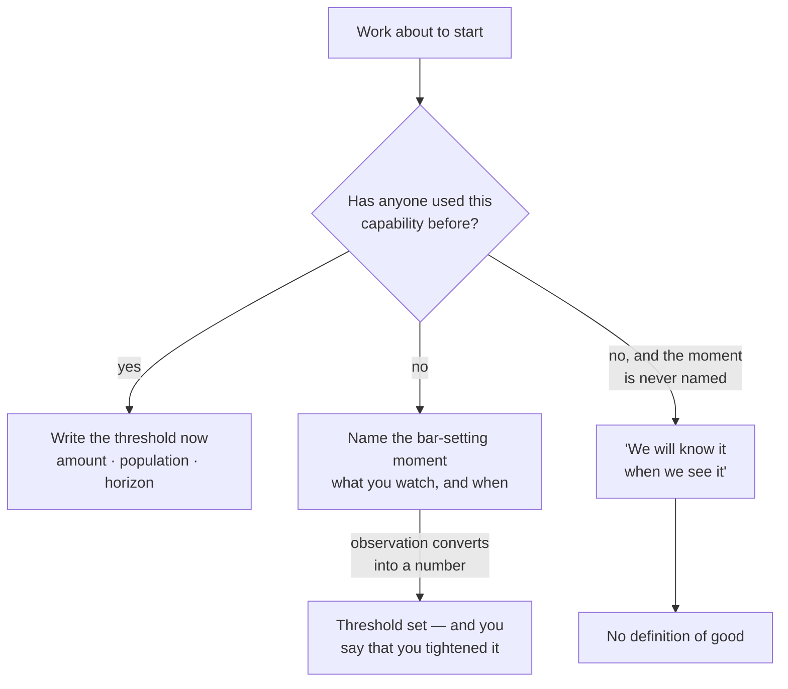

# PJ-02 · Define good

> Teams cannot trade off intelligently until the desired change and its quality
> bar are explicit.

## Problem — a goal that cannot be missed or ranked

A team spends three weeks improving onboarding. At review, half the room thinks
it shipped well and half thinks it is not ready. Both sides point at the same
screens.

The argument is not about the screens. It is about a sentence nobody wrote. The
goal was "make onboarding better." Better is a direction. A direction has no
end, so every person supplies their own end, and the review becomes a contest
between private standards.

Now look at what this does to prioritization. The team also has a request for
enterprise summaries and a performance problem in large workspaces. Someone asks
which one matters more. Nobody can answer, because none of the three has a
stated change or a stated bar. You cannot compare three directions. You can only
compare three thresholds.

The failure is hard to see because the team is not confused about *what to
build*. They are confused about *what would count as having done it*. Those look
identical from inside a sprint, and completely different eight weeks later.

A direction does two kinds of damage at once, and they arrive at different
times — one in the review, one in the prioritization meeting nobody connects
back to it:

The dashed edge is the whole lesson. One sentence, written before the work,
removes both failures.

Noted has a live example. Activation is defined as creating a document and
returning within seven days. Nobody defends this definition. So when activation
falls 11%, no one can say whether that is a serious change in behaviour or a
change in a number that never described the behaviour anyone cared about.

Ask your team: *if this ships and works, what specifically is different, for
whom, and how much of it is enough?* If the answers vary across the room, you do
not have a definition of good.

## Concept — turn the direction into a threshold

"Good" is three separable statements. Teams usually write the first one, argue
about the second, and forget the third.

| Part | The question it answers | What breaks when it is missing |
|---|---|---|
| **Desired change** | What behaviour or outcome is different, for which population, over what horizon | Work gets judged by what shipped, not by what changed |
| **Quality bar** | How much of that change is enough to be worth the cost | Endless polish, or shipping something too small to matter |
| **Floor** | What must not get worse in order for the change to count | A local win that creates a larger loss somewhere else |

### Direction versus threshold

A direction is a verb with no end: increase, improve, reduce, simplify. A
threshold is a direction plus a number and a horizon.

| Statement | Type | Can it be traded off? |
|---|---|---|
| "Improve activation" | direction | No — it never completes, so it always deserves more |
| "Reduce time to first useful document" | direction | No |
| "Recover half of the 11% decline, in the individual knowledge worker population, within one quarter" | threshold | Yes |

Only the third can lose an argument to another priority. That is the point. A
direction cannot be outranked, which is why teams that speak in directions never
finish a prioritization conversation.

### The bar is set by consequence, not by ambition

How good is good enough depends on two things you already have from Phase 01:

- **Who bears the cost of being wrong**, from your decision statement.
- **How reversible the work is.** A reversible change can ship at a lower bar,
  because the correction is cheap. A one-way change needs a higher bar, because
  the correction is not available.

A team that applies the same bar to everything is either over-building
reversible work or under-building irreversible work. Usually both at once.

Both versions below are about Noted's activation decline. Both sound like goals:

**Weak** — "Improve activation back to where it was."

A direction with a destination attached. It still has no population and no
horizon, so it cannot be missed, and it cannot lose an argument to the
large-workspace performance work. It also inherits a definition nobody on the
team defends.

**Strong** — "Recover half of the 11% decline, in the individual knowledge
worker population, within one quarter. Floors: small-team paid conversion does
not fall, and the share of created documents that are reopened later does not
drop."

The difference is not ambition. The strong version can be **missed**, in public,
by an amount someone else can compute — and one of its floors protects a
population that is not the one it is optimising.

The fraction — half — is chosen, not measured. The case gives you the 11%. It
does not tell you how much of it is worth buying back, or at what cost. Step 6
of the Build asks you to defend that choice out loud.

### The desired change needs a population

PF-05 gave you audience as a behaviour-and-context boundary. Apply it here.
"Improve activation" across all of Noted is three different definitions of good,
because individual knowledge workers, small teams, and enterprise team leads do
not do the same thing in a first session. A single aggregate bar hides which
population is moving and lets a gain in one hide a loss in another.

### Boundary

Some work legitimately has no numeric bar in advance.

When you are building a capability nobody has used before, you often cannot know
what good looks like until you watch a person use it. Demanding a threshold
there produces an invented number, and invented numbers are worse than absent
ones, because they get defended.

The honest move is not to skip the definition. It is to **name the bar-setting
moment**: what you will observe, when, and what will convert the observation
into a threshold. "We will set the bar after ten sessions with team leads, using
whether they returned to the document in the following meeting" is a definition
of good. "We will know it when we see it" is not.

Both of the left-hand paths below are legitimate. Only the right-hand one is a
failure, and it is the one that feels most like open-mindedness:

The difference between the two "no" branches is a single sentence written in
advance. Without it, the work arrives at review with nothing to be judged
against, which is where this lesson started.

The second limit: a definition of good that is too tight too early kills
learning. If you set a threshold on exploratory work and the work misses it, you
will usually learn that the threshold was wrong, not that the work was. Tighten
the bar as the mechanism becomes clearer, and say each time that you have done
it.

The third limit is about what this artifact is not. A threshold with floors
looks like an experiment success criterion, and it is not one. Turning it into
something a test could settle needs a baseline, a sample large enough to detect
the effect you care about, and a validity check — separate work, covered in
EV-06. A definition of good tells you what you are trying to buy. It does not
tell you whether you could measure having bought it.

## Build — on Noted

Read `lessons/noted/case.md` if you have not already.

Take **Signal 1: activation fell 11% over six weeks.**

Activation is currently defined as creating a document and returning within
seven days. Nobody defends the definition. The decline has not been segmented.
Two changes shipped inside the window.

Take the inherited definition apart before you write a bar on top of it. Each
clause counts something and misses something else:

| Clause in the current definition | What it counts | What it leaves out |
|---|---|---|
| **Creating a document** | That a document was started | Whether anything was produced that was worth keeping |
| **Returning within seven days** | A second visit inside a week | Whether the document was reopened, or only the product |
| **Applied to everyone** | One aggregate number | Which of the three populations moved, and in which direction |

Noted's job is capture, direct, produce. Read the middle column against that
job: it is a record of activity, and the right-hand column is where the job
lives. Your definition of good has to name which column you are buying.

**Your task.** Write a definition of good for Noted's activation, and be ready
to defend every part of it.

1. State the behaviour you actually care about, in plain words, before naming
   any metric. Noted's job is capture, direct, produce. Say which part of that
   job a newly activated user has completed.
2. Say what the current definition includes that should not count, and what it
   excludes that should. Creating a document and returning is a measure of
   activity. Say whether it is a measure of the job.
3. Pick one population, using PF-05 boundaries. Do not write a bar for "users."
4. Write the desired change as a threshold: the amount, the population, the
   horizon.
5. Write two floors — things that must not get worse for the change to count.
   At least one floor should protect a different population from the one you
   chose.
6. State the bar's justification: why this number and not one half its size.
   "It felt right" is a legitimate answer only if you say it out loud.
7. Say what your definition deliberately does not measure, so a reader does not
   assume more coverage than you are claiming.

**Expect to be pushed on:** whether your threshold was reverse-engineered from
the 11% figure rather than from the job the product does; whether your
population is a behaviour-and-context boundary or a plan tier in disguise; and
whether your floors are real constraints or things you were never at risk of
breaking.

### What a strong answer holds

- The behaviour is named before any metric, and placed on capture → direct →
  produce. An activated user has produced something and come back to *it* — not
  merely created a document and come back to the product.
- The inherited definition is taken apart in both directions: what it counts
  that should not (an empty document, a return to any page) and what it misses
  that should count (the document reopened, something kept). The answer says
  plainly that the current metric measures activity, not the job.
- One population from PF-05, with a reason for choosing it over the other two.
  Not "users", and not a plan tier.
- The threshold has all three parts — amount, population, horizon — and the
  justification for the amount is not "it gets us back to where we were". The
  answer says why this number and not half of it, even if the honest reason is
  judgment.
- Two floors, one of which protects a population other than the one being
  optimised, and each of which is something the intended change could actually
  break. A floor nothing threatens is decoration.
- The most common weak move is reverse-engineering the bar from the 11% figure.
  It is weak because it inherits a definition nobody on the team defends, so
  hitting the bar would prove only that an undefended number moved back.

## Use — on your product

Take one piece of work your team is currently doing, or is about to start.

Answer five questions:

1. What behaviour or outcome will be different, for which population, over what
   horizon?
2. How much of that change is enough to justify the cost, and why that amount?
3. What must not get worse for the change to count?
4. Is the work reversible? If yes, say why your bar is not lower. If no, say why
   your bar is not higher.
5. What does your definition deliberately not measure?

Where you have no answer, write `<unknown>`. A missing threshold is a real
finding — it usually means the work was approved on a direction, and the
argument about whether it succeeded is still ahead of you.

## Ship — Definition of good

Produce `artifacts/PJ-02-definition-of-good.md` using the template in
`artifact.md`.

Write it for the person who will review this work when it ships, including the
version of you that will be tempted to move the bar afterwards. A definition of
good written before the work is a commitment. The same words written after are a
description.

This extends your Product Decision Case. PJ-01 committed you to a position. This
artifact states what that position is buying, in an amount someone else can
check.

## Carry forward

A desired change with a population, a threshold you can defend, and floors that
constrain you. PJ-03 uses this immediately: two pieces of work now compete for
the same engineering capacity, and without thresholds on both, the comparison
collapses into whoever argues hardest.
