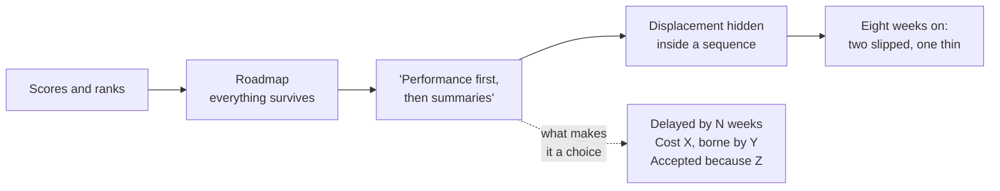
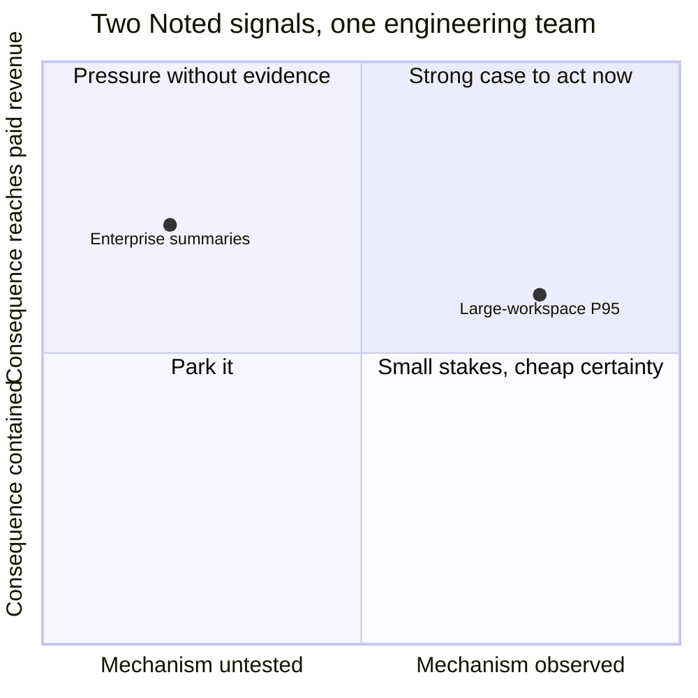

# PJ-03 · Trade-offs and opportunity cost

> A choice is only real when the displaced option, resource, risk, and future
> flexibility are visible.

## Problem — a ranking where nothing was given up

A PM runs a prioritization session. Every candidate gets a score. The top three
go on the roadmap. Everyone leaves satisfied.

Eight weeks later, two of the three have slipped, the third shipped thin, and
the enterprise account manager is asking why nothing happened. The PM looks back
at the session notes and finds scores, ranks, and a roadmap. Nowhere is there a
sentence saying what was given up.

Here is the specific move that failed. Asked to choose between fixing large-
workspace response times and building enterprise summaries, the PM said: "we'll
do performance first, then summaries." That sentence feels like a decision. It
is not. It is a sequence, and it hides the actual trade-off, which is that
summaries are being delayed by however long performance takes — an amount nobody
estimated, against a bar nobody set.

The failure is hard to see because a prioritized list looks exactly like a set
of decisions. Ranking is not choosing. **A choice exists only when something
specific stops being possible, and someone can name what it was.** A list where
everything survives in some form has decided nothing; it has only re-ordered the
disappointment.

Follow the top path and notice that nothing is ever given up — which is exactly
why the cost surfaces two months later, in someone else's inbox:

Ask after any prioritization: *what is now not happening, who was expecting it,
and when will we tell them?* If nobody can answer with a name and a date, the
session produced a ranking, not a decision.

## Concept — name what stops happening, and who pays

A real trade-off is visible on five faces. Most teams show one — usually cost —
and call it analysis.

| Face | The question | What hides when it is missing |
|---|---|---|
| **Displaced option** | What specifically stops happening, and who was expecting it | The chosen option looks free |
| **Resource** | Which scarce capacity is consumed, and is it substitutable | "We'll find the time" replaces a real constraint |
| **Risk** | What gets worse, or more likely, if this is wrong | Downside lands on a population nobody named |
| **Future flexibility** | Which options close, and when they reopen | You discover in month three that you locked something in month one |
| **Reversal cost** | What it costs to undo this in four weeks | Reversible and one-way choices get treated identically |

### Opportunity cost is measured against the best displaced alternative

Not against doing nothing. This is the most common error in product
prioritization, and it is invisible from inside.

When a team says "the performance work is worth it because slow workspaces cost
us paid seats," they are comparing the work to inaction. The real comparison is
against the best thing those same engineers would otherwise have built. If that
alternative was worth more, the performance work is a loss even though it is
positive on its own.

This is why PJ-02 comes first. Two directions cannot be compared. Two thresholds
can. If you cannot state what each option buys, in what amount, for which
population, you cannot say which one you are giving up.

### Capacity is not fungible

Teams reason as if engineering time is a pool of hours. It is not. The two
engineers who can do a dependency migration may be the same two who can do the
storage-layer work behind large-workspace performance. Moving "40% of capacity"
between two projects can mean moving 100% of the only people who can do either.

Before you write a trade-off, name the specific scarce resource: not hours, but
the people, the review bandwidth, the design attention, or the single
decision-maker whose time everything queues behind.

### Sequencing is a trade-off, not an escape from one

"First A, then B" displaces B by the duration of A. That delay has a cost, and
the cost is usually paid by a population that was not in the room. Sequencing is
often the right answer. It is never a way to avoid stating what was given up.

Write it as: *B is delayed by approximately N weeks. The cost of that delay is
X, borne by Y. We accept it because Z.*

Here is that sentence applied to the two Noted signals, next to the version most
teams actually say:

**Weak** — "We'll do performance first, then summaries."

Both options survive, so nothing was chosen. No resource is named, no delay has
a length, and the person who loses is not in the sentence. It cannot be argued
with, because it does not claim anything.

**Strong** — "The storage-layer engineers go to large-workspace P95 this cycle.
Summaries are delayed by roughly one cycle. The cost lands on the account
manager holding the three enterprise requests, who is told this week with a
date. We accept it because the P95 rise was observed directly and the summaries
claim has never been tested."

The difference is that the strong version **can be refused**. The account
manager can read it, recognise the description of their own loss, and argue that
the delay is worth more than the P95 recovery. That argument is the decision.

One caution about the strong version: "the storage-layer engineers" is an
exercise input. The case does not say who can do the response-time work. When
you write yours, name the real people or write `<unknown>`. Do not borrow a team
from an example.

### Boundary

Not every choice deserves a trade-off record.

For a cheap, reversible, low-consequence choice, the record costs more than the
decision. A team that documents every trade-off will document them badly, and
will slow down exactly where speed was free. The dividing line is consequence
multiplied by reversal cost — which is the subject of PJ-04.

The second limit is more dangerous. **A trade-off record written after the
decision is not analysis; it is a defence.** Once a choice is made, every face
of it can be described in a way that makes the choice look correct. If you find
yourself writing a trade-off record to explain a commitment already announced,
label it as a rationale, not as a decision record, and do not let it enter the
evidence base as if it were one.

## Build — on Noted

Read `lessons/noted/case.md` if you have not already.

Take **Signal 3: P95 response time rose 34% for large workspaces**, and put it
directly against **Signal 2: three enterprise customers asked for automated
meeting summaries.**

Take it as the exercise premise that both need the same engineering team this
cycle. The case does not say so, but it is the condition under which a trade-off
exists at all. Both have advocates. The case gives you:

- Large workspaces are more than 500 documents, about 4% of workspaces, holding
  a disproportionate share of paid seats. No support tickets mention speed. The
  signal came from monitoring.
- The three summary requests came through one account manager within one month.
  Their combined contract value is roughly 20% of current revenue. The
  underlying claim about lost decisions and owners has never been tested. Meeting
  type is not captured in event data.

Two axes separate these two options: how well the mechanism is actually
observed, and how far the consequence reaches. One reading looks like this:

**The placement is the argument, not a fact from the case.** Summaries sit high
only if you treat 20% of revenue as exposed, and nothing in the case says those
contracts are at risk — move that point down and the chart reverses. P95 sits
right because monitoring observed it, but no support ticket mentions speed, so
you could argue it right and low instead. Neither point can be placed at all
until both options are thresholds rather than directions.

**Your task.** Choose one. Then make the choice real.

1. State each option as a threshold, using your PJ-02 work. What does each one
   buy, in what amount, for which population, by when? If you cannot write both,
   say which one you cannot write and what that tells you.
2. Name the scarce resource specifically. Not "engineering capacity" — which
   people, and what else are they the only ones who can do.
3. Choose. One option, stated as a choice.
4. Write the displaced option in the words of the person who loses it. For
   summaries, that is the account manager. For performance, that is whoever is
   watching paid-seat retention. Write it so they would agree it is fair.
5. State what the delay costs, with a rough magnitude and who bears it. If your
   answer is "we do it next cycle," say what next cycle then loses.
6. Name which future options close and when they reopen.
7. State the reversal cost: what it costs to switch back in four weeks.
8. Name the one thing that, if you learned it next week, would flip your choice.

**Expect to be pushed on:** whether "do both, just staged" is hiding in your
plan; whether you weighed the 4% of workspaces by count or by paid seats, and
whether you said which; and whether the 20% revenue figure entered as evidence
of value or as pressure, given that nothing in the case says those contracts are
at risk.

### What a strong answer holds

- Both options are written as thresholds — or the answer admits that the
  summaries option cannot be written as one yet, because its underlying claim is
  untested, and says what that admission does to the comparison. Either is
  strong. Pretending both are thresholds is not.
- The scarce resource is people or a named bottleneck, not hours. If the case
  does not say who can do the work, the answer writes `<unknown>` rather than
  inventing a team, and says what that gap does to the plan's credibility.
- One option is chosen. The other is displaced with a length of delay, a cost,
  and a named bearer — written so the account manager, or the person watching
  paid-seat retention, would accept the description of their own loss.
- Future flexibility and reversal cost are answered as separate questions: which
  options close, when they reopen, and what switching back in four weeks costs
  in work already done.
- The flip condition is a single learnable fact with a source — something the
  support lead's recordings, monitoring, or the account manager could deliver
  next week — not "if priorities change".
- The most common weak move is "performance first, then summaries." It is weak
  because it is a sequence, not a choice: nothing is given up on paper, so the
  cost surfaces two months later, in someone else's inbox, with no record of who
  accepted it.

## Use — on your product

Take a real choice your team is making this quarter, where two things compete
for the same constrained resource.

Answer five questions:

1. What specifically stops happening, and who was expecting it?
2. Which scarce, non-substitutable resource is consumed?
3. What gets worse or more likely if you are wrong, and for whom?
4. Which future options close, and when do they reopen?
5. What would it cost to reverse this in four weeks?

Write `<unknown>` where you cannot answer. Question two is the one most teams
cannot answer honestly, and it is usually the one that decides whether the plan
was ever achievable.

## Ship — Trade-off record

Produce `artifacts/PJ-03-trade-off-record.md` using the template in
`artifact.md`.

Write it for the person who loses. The displaced option should be described well
enough that its advocate would accept the description, even while disagreeing
with the conclusion. That is the difference between a record and a defence.

This extends your Product Decision Case. PJ-02 said what good looks like for one
thing. This artifact is the first time two definitions of good compete, and one
of them loses.

## Carry forward

A choice with its displaced option, resource, risk, closed options, and reversal
cost named. PJ-04 asks a different question about the same choice: given its
consequence and its reversibility, how much process did it deserve, who should
have decided it, and when did the option to decide it expire?
