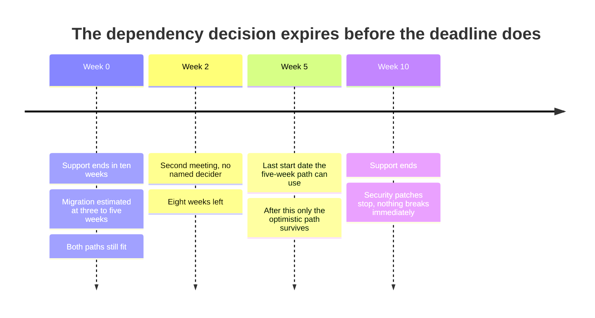
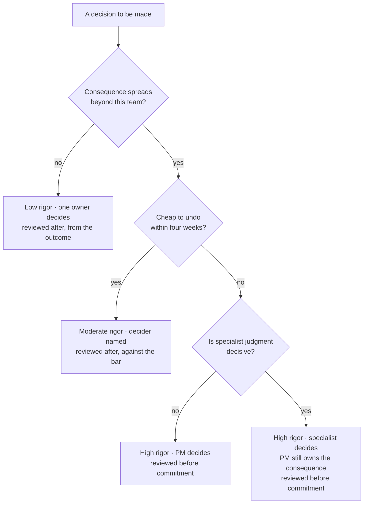

# PJ-04 · Decision architecture

> Impact, reversibility, uncertainty, timing, and expertise should determine
> rigor, participation, and review depth.

## Problem — the delay that consumed the options

Noted has a dependency that loses support in ten weeks. Engineering estimates
the migration at three to five weeks. Two engineers want to do it now. Two want
to spread it across the quarter.

Suppose the team books a sixty-minute discussion. Everyone attends. The four engineers
argue about timing. The PM has no view, because the question sounds technical.
The meeting ends without a decision, because nobody was named as the decider and
"let's think about it" is always available when nobody has to sign.

Two weeks later, the same meeting happens again. The ten weeks are now eight.
The migration estimate has not changed, so the pessimistic path — five weeks —
now needs to start within three weeks or it runs past end-of-support. The option
set has shrunk while the team was being thorough.

That is the failure. It is not that the wrong answer was chosen. **No answer was
chosen, and the delay itself consumed the options.** It is hard to see because
every individual behaviour was reasonable: consult widely, respect expertise, do
not rush a consequential call.

Put the clock next to the estimate and the loss becomes visible:

Nothing on that timeline is a mistake anyone made. The option at week five was
removed by the two meetings, not by a choice — which is why no one on the team
experienced it as a decision at all.

The same team routes a trivial copy change through the same sixty-minute forum,
and decides a storage-layer change in a two-person direct message. Both are
architecture failures. One over-spends process where speed was free. The other
under-spends it where the cost of being wrong is high.

Ask about any decision your team is making: *who decides, what would make this
rigorous enough, and what date does the option to decide expire?* If the first
answer is "the team," the decision has no owner.

## Concept — set rigor, roles, and review before deciding

Decision architecture is the choice you make *before* the decision: how much
rigor it deserves, who takes part, and how deeply it gets reviewed.

Five variables set it.

| Variable | Raises rigor when | Lowers rigor when |
|---|---|---|
| **Impact** | Consequence is large and spreads beyond the team | Contained, and absorbed by one team |
| **Reversibility** | One-way, or costly to undo | Cheap to undo |
| **Uncertainty** | Mechanism unknown, evidence thin, no precedent | Well understood, precedent exists |
| **Timing** | A deadline removes options as it approaches | No expiry; the choice waits without cost |
| **Expertise location** | Specialist judgment is decisive | The PM holds the relevant knowledge |

These five set three outputs.

**Rigor** — how much evidence and analysis is required before a choice is
allowed. This is where PF-04 applies directly: the frame should be no broader
than the next consequential and reversible choice requires, and the rigor should
match the same scale.

**Participation** — who holds which role. Four roles, and they are not the same
person:

| Role | What they hold |
|---|---|
| **Decider** | Makes the call and is accountable for having made it |
| **Consequence owner** | Carries the outcome, whether or not they decided |
| **Specialist authority** | Holds knowledge the decision depends on and can veto on technical grounds |
| **Consulted / informed** | Contributes input, or needs to know — neither decides |

Collapsing decider and specialist authority is the most common error. A PM who
decides a technical timing question because they own the roadmap is overreaching.
A PM who lets four engineers decide it by argument has abdicated, because no
engineer owns the roadmap consequence.

Both versions below are a PM's opening move on a different Noted decision —
Signal 3, whether to move engineering time this cycle from planned features to
large-workspace response times. One sets participation and stops; the other
sets all three outputs:

**Weak** — "Let's get everyone in a room on Thursday and align on the
large-workspace slowdown."

Participation with no decider, no rigor level, and no date. Thursday will
produce a discussion, and "let's think about it" stays available to everyone in
it.

**Strong** — "Decider: me. Moving planned features to make room for
response-time work is a roadmap call, and the roadmap is mine. Specialist
authority: the engineering lead, on whether the work can land this cycle — a no
on feasibility is a veto. Consequence owner: me, and whoever holds the paid-seat
relationships. Expiry: the day this cycle's capacity is committed. Reviewed
after, against the response-time bar, because the reallocation can be reversed
next cycle."

The difference is that the strong version says **who signs and when the option
disappears**. Everything else in this lesson is downstream of those two lines.
Notice that on this decision the PM is the decider. Do not carry that across to
the Build unchecked — the dependency question puts the decisive knowledge
somewhere else, and the Build asks you to say where.

**Review depth** — what gets reviewed, by whom, and when. High-consequence
irreversible decisions get reviewed before commitment. Reversible ones get
reviewed after, from their outcome.

Consequence and reversal cost route a decision to its rigor and its review
depth. Run any open decision down this path before you book a meeting for it:

The copy change from the opening of this lesson exits at the first branch. The
dependency migration runs to the bottom right — which is why the sixty-minute
forum was the wrong shape for both of them.

### Time-boxed decisions have an expiry

When a deadline is fixed and the work has a duration, the decision expires
before the deadline does.

Noted's dependency loses support in ten weeks. The migration takes three to five
weeks. If you want the pessimistic path to land inside the window, the decision
to start must be made by roughly week five — not week ten. Every week of
deliberation after that removes the safe option and leaves only the optimistic
one.

Write the expiry date on the decision. **Delay is a choice, and on a time-boxed
decision it is a choice that narrows your own options in favour of whoever is
comfortable with risk.**

### Boundary

Two real limits.

**Architecture is not a permission system.** Escalating a decision does not
transfer the consequence. If you route a call to your head of product and it
goes badly, you still own the outcome in your area — you have only added a name
to the record. Escalate to get a decision that genuinely is not yours, not to
distribute blame.

**Process cannot rescue a badly framed decision.** If the decision statement is
a topic rather than a choice, adding rigor produces a more expensive version of
the same confusion. Check PF-01 before you check rigor. A high-participation
review of "what should we do about the dependency" will burn an hour and settle
nothing, while the same group given "migrate now, or split across the quarter,
decided by Friday" will produce an answer.

There is a third limit worth naming honestly: over-architecture is expensive and
invisible. The cost of the process must be smaller than the cost of a wrong
decision. Teams rarely measure the first number, so it grows.

## Build — on Noted

Read `lessons/noted/case.md` if you have not already.

Take **Signal 4: a core dependency loses support in ten weeks.**

Engineering estimates three to five weeks of migration work, with wide
uncertainty. Two engineers want to migrate now; two want to spread the work
across the quarter. After end-of-support, security patches stop. Nothing breaks
immediately.

**Your task.** Do not decide the migration. Design how it should be decided.

1. Score the five variables for this decision. One line each, with the reason.
   Reversibility is not obvious here — say what "reversible" even means for a
   migration that is half done.
2. Compute the expiry. Given ten weeks and a three-to-five week estimate, state
   the date by which the decision must be made for the pessimistic path to still
   fit, and say what is lost after that date.
3. Assign the four roles by name or role. State explicitly whether the PM is the
   decider here, and defend the answer either way.
4. State the rigor: what specifically must be known before the choice is
   allowed. "Nothing further" is a legitimate answer if you defend it.
5. Set participation: who is consulted, who is informed, and what the four
   engineers' disagreement is actually input on.
6. Set review depth: whether this gets reviewed before commitment or after, and
   what the reviewer is checking.
7. Name the escalation condition: the observation that would move this decision
   to someone above you, and what you would be asking them to decide.

**Expect to be pushed on:** whether you claimed the decider role on a technical
timing question you do not have standing to settle; whether "consult everyone"
is inclusion or an avoidance of naming a decider; and whether your expiry date
was computed from the pessimistic estimate or from the one that makes the
schedule comfortable.

### What a strong answer holds

- All five variables are scored with one reason each, and the reversibility line
  engages with what "half-migrated" means — a partly done migration is neither
  cleanly reversible nor cleanly one-way, and the answer says which it is closer
  to and why.
- The expiry is computed from the five-week estimate, not the three-week one,
  and the answer says what survives after it: only the optimistic path, and with
  it none of the margin engineering flagged as wide uncertainty.
- The four roles are four different people, or the answer gives an explicit
  reason why two coincide. It takes a defended position on whether the PM
  decides a technical timing question — and either way, the consequence stays
  with the PM.
- Rigor is a short list of what must be known before the choice is allowed, or a
  defended "nothing further". It is not "more analysis" or "a spike".
- The two-against-two disagreement is classified as input on a named thing —
  sequencing risk, disruption to planned work, confidence in the estimate — not
  treated as a vote to be broken, and the escalation condition is an observation
  that would move the decision to someone above you, with the question you would
  hand them.
- The most common weak move is "get everyone in a room Thursday." It is weak
  because it is participation with no decider and no date, so "let's think about
  it" stays available while the clock removes the option you were being thorough
  about.

## Use — on your product

Take one decision currently open on your team — ideally one that has been open
longer than it should be.

Answer five questions:

1. Score the five variables. Which one is actually driving the rigor you are
   applying?
2. Who is the decider, by name? If the answer is "the team," who signs?
3. Where does the specialist authority sit, and is it the same person as the
   decider?
4. What date does the option to decide this expire, and what is lost after it?
5. What is the escalation condition, and what exactly would you be asking the
   escalation target to decide?

Write `<unknown>` where you cannot answer. Question four is the one most teams
have never asked, and it is usually the reason the decision is still open.

## Ship — Decision architecture

Produce `artifacts/PJ-04-decision-architecture.md` using the template in
`artifact.md`.

Write it for the people who will take part in the decision, and publish it
before the decision is made. An architecture written afterwards describes what
happened. Written beforehand, it prevents the meeting where four people argue
and nobody signs.

This extends your Product Decision Case. PJ-03 recorded a choice. This artifact
records how choices of that class should be made — which is what makes your
judgment repeatable by someone who is not you.

## Carry forward

A decision with a named decider, a rigor level, an expiry date, and an
escalation condition. PJ-05 turns the lens on the reasoning itself: for a
decision whose outcome you do not yet know, how do you judge whether it was made
well, before the result arrives to tell you what you want to hear?
