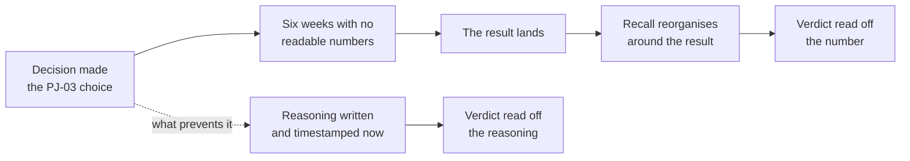
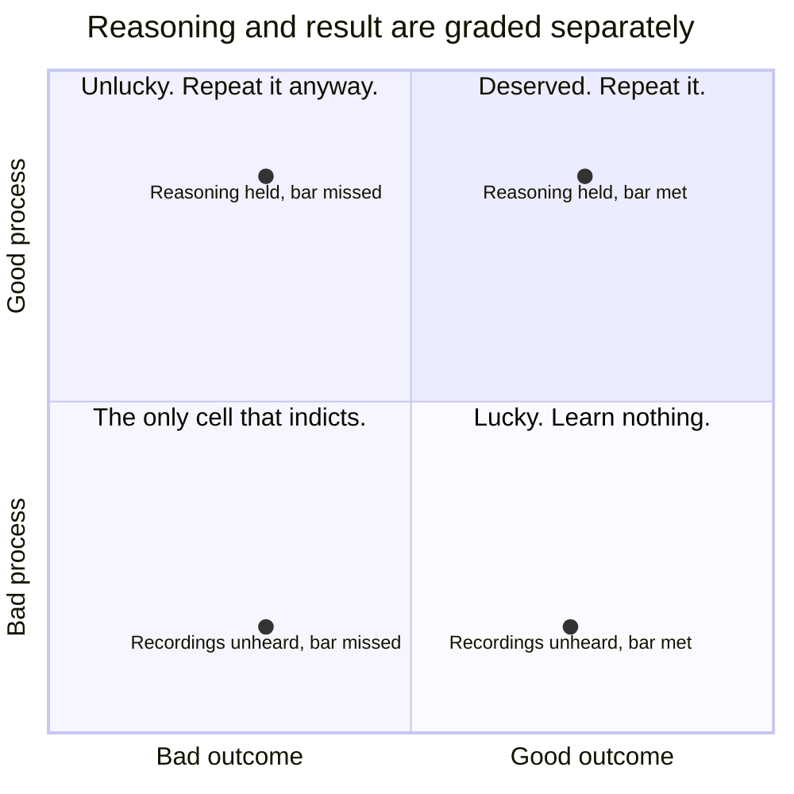

# PJ-05 · Decision quality under uncertainty

> Judge the reasoning from what was knowable at the time, then separate process
> quality from luck and outcome.

## Problem — the verdict read off the result

A team reviews its decisions only after the results land. The review is short,
because the result does the work. Growth went up, so the call was right. The
feature flopped, so someone should have caught it.

Both conclusions teach the wrong lesson. The successful call may have rested on
a mechanism that was never true, and got a good number for an unrelated reason.
The failed one may have been the best available choice against the information
that existed, and would be the right call again tomorrow.

There is a second, quieter failure. By the time the outcome arrives, nobody
remembers what they actually believed beforehand. Memory rewrites confidence to
match the result. The PM who said "moderate confidence, this could go either
way" remembers being cautious about exactly the thing that went wrong. Nobody is
lying. Recall simply reorganises itself around what happened.

Put your PJ-03 choice in this position. Suppose it was made two weeks ago,
whichever way you chose between response times and summaries. The cycle is not
finished. The numbers that would tell you whether it worked will not be readable
for six more weeks. And the team has already started narrating the decision —
some people call it obviously right, some call it a mistake, and both groups are
working from the same absence of evidence.

The gap between the decision and the result is where the damage happens. Nobody
does anything wrong in it; the reasoning simply decays while everyone waits:

The dashed branch has to be taken **during** the six weeks. After the result
lands there is nothing left to write down that has not already been edited.

Ask about a decision your team made last month: *what did you believe, at what
confidence, and what did you say would change your mind?* If the answer comes
from memory rather than a document, it is already contaminated.

## Concept — grade the reasoning, not the result

Separate the decision from the outcome. They are related, but not the same
thing, and only one of them is under your control.

|  | Good outcome | Bad outcome |
|---|---|---|
| **Good process** | Deserved. Repeat it. | Bad luck, or uncertainty nobody could resolve. Repeat it anyway. |
| **Bad process** | Luck. Do not learn from this. | Deserved. This is the only cell that indicts the decision. |

The dangerous cell is the top right of the bad-process row: a good outcome from
bad reasoning. It gets rewarded, imitated, and turned into a heuristic that will
fail expensively later.

The table gives the verdict for each cell. The map below plots four possible
endings for your PJ-03 decision, measured against the bar you set in PJ-02, and
the point is how little the horizontal position tells you:

Each row holds the same reasoning twice. Only the world differs between the two
ends of it. If your review moves a decision up or down when the number arrives,
it is grading the result and calling it a lesson.

### Knowable at the time has a price

The central question of a decision review is: **what was knowable at the time,
and at what cost?**

Something was knowable if it could have been learned inside the decision's
window for less than the decision's consequence. Anything else was genuinely
unknown, and not knowing it is not a process failure.

| Situation | Verdict |
|---|---|
| The data existed in the warehouse; a query would have taken two hours | Knowable. Not checking it is a process failure. |
| The support lead had recordings; listening would have taken a day | Knowable. |
| Learning it required a four-week study, and the decision expired in ten days | Not knowable inside this decision. Not a failure. |
| Nobody in the industry knows the mechanism yet | Not knowable. |

This distinction is what stops decision review from becoming hindsight. After
the fact, everything looks like it could have been checked. The question is
whether it could have been checked *then*, *in time*, *for a cost proportionate
to the stakes*.

The whole distinction usually collapses into a single sentence in a review.
Here it is collapsed, and here it is done properly:

**Weak** — "We didn't have the data. We'll see how the numbers look in six
weeks."

One sentence covering two different things. Some of that data existed and was
not collected; some of it does not exist at all. Merged, they read as bad luck,
and the process failure inside them never gets found.

**Strong** — "The support lead holds recordings of customer conversations.
Listening for whether team leads describe lost decisions unprompted was days of
work, available, and skipped — uncollected, not unknown. Meeting type is not
captured in the event data at all, so how often it happens was genuinely
unavailable inside this window. Actor identity is missing for about 18% of
events, which bounds any segmentation done later."

The difference is that the strong version **splits unknown from uncollected**,
which is the only split that can produce a lesson. One item is a process
failure. The other two are the working conditions of the job.

### A pre-outcome review

The move is to review the decision **before** the result arrives, while the
reasoning is still intact. Five questions:

1. **Was the decision framed as a choice with live alternatives?** A decision
   with one option was never a decision.
2. **What was knowable at the time, at what cost — and what did you skip?**
   Distinguish unknown from uncollected.
3. **Was the stated confidence proportional to the evidence held?** Compare
   against your PJ-01 view. If confidence was high and the evidence was three
   requests through one channel, the process is wrong regardless of what
   happens.
4. **Were the discriminating findings named in advance?** Which results would
   have pointed to different actions.
5. **Was the revision trigger observable and dated?** Not "we will monitor."

Write the answers down and timestamp them. The document exists precisely because
your memory will not be usable later.

### Separating luck from process in advance

You can do most of this before the outcome. Name, now, the failure modes you
would call bad luck and the ones you would call bad process.

- **Bad luck:** an enterprise account churns for a reason unrelated to
  summaries; the migration hits an undocumented behaviour in a dependency
  nobody could have found without starting.
- **Bad process:** the support lead's recordings were never listened to; the
  audience boundary was a plan tier rather than a behaviour.

If you write these in advance, you cannot re-sort them afterwards to protect
yourself.

### Boundary

Process review is not always better than outcome review.

For a **single** decision, the outcome is a weak signal. Too much of it was out
of your control. Judge the reasoning.

For a **run** of decisions, the outcomes are the calibration signal, and they
beat any amount of well-written reasoning. If a PM's "high confidence" calls
turn out wrong half the time, that PM's process is broken even when each
individual decision reads well on the page. Confidence labels only mean
something when they have been compared against results many times.

So: judge one decision by its process, and judge a decision-maker by the match
between their stated confidence and their record. PJ-01 warned you that you
cannot calibrate against a scale you never check. This is where you start
building the scale. EV-07 will use the accumulated record to update belief.

One more honest limit. A pre-outcome review can be written to be
unfalsifiable — hedged so widely that any result confirms it. That is worse than
no review, because it produces a document that looks like rigor and cannot be
graded. If your review would read as vindicated under every plausible outcome,
you have written insurance, not analysis.

## Build — on Noted

Read `lessons/noted/case.md` if you have not already.

Take the decision you made in **PJ-03**, whichever way you chose between
large-workspace response times and enterprise summaries.

Assume it was decided two weeks ago. The cycle is mid-flight. The numbers that
would show whether it met your PJ-02 bar will not be readable for six more
weeks, and no enterprise contract has changed status. Nobody knows yet whether
this was right.

**Your task.** Review the decision now, before the outcome exists.

1. Restate the decision as it was framed at the time, with its live
   alternatives. If it was framed as a sequence rather than a choice, say so.
2. List what was knowable at the time, with the cost of learning each item. Use
   what the case gives: the support lead holds recordings; meeting type is not
   captured at all; actor identity is missing for about 18% of events; the P95
   signal came from monitoring, and the case does not say what got slower. Sort
   each into *uncollected* (available, skipped), *unavailable* (not capturable
   inside the window), or `<unknown>` (the case does not say whether it could
   have been got). Do not let the third bucket absorb the first.
3. State the confidence you held, and whether the evidence supported that word.
   If it did not, say so now rather than after the result.
4. Name the discriminating findings that were stated in advance. If none were,
   that is the finding.
5. Write two failure modes you would call **bad luck**, and two you would call
   **bad process**. Be specific enough that a reader could sort a real outcome
   into one of your four entries without asking you.
6. Set a dated checkpoint: what you will look at, when, and what result would
   mean the reasoning was wrong rather than the world unlucky.
7. State the one thing about this decision that you would do differently even if
   the outcome is good.

**Expect to be pushed on:** whether "we didn't have the data" is actually "we
didn't listen to recordings the support lead already holds"; whether your
bad-luck list is quietly absorbing things that were plainly checkable; and
whether your review is hedged widely enough that every outcome would confirm it.

### What a strong answer holds

- The decision is restated with the alternative that lost, as it was framed at
  the time. If it was a sequence ("performance first, then summaries"), the
  review says so and grades that as a framing failure, not a footnote.
- Knowables are sorted three ways with a cost each: uncollected (the recordings),
  unavailable (meeting type), and `<unknown>` where the case is silent. The
  sort is not adjusted to flatter the decision, and nothing checkable inside the
  window sits in the unavailable bucket.
- The confidence held then is written as one word and judged against the
  evidence held then. If the word was too strong for one-channel evidence, the
  review says so now, before the result can make it look wise or foolish.
- The bad-luck and bad-process lists are specific enough that a stranger could
  sort a real outcome into one of the four entries without asking you. An
  enterprise account churning for an unrelated reason is luck. Never asking the
  support lead is process.
- The checkpoint has a date, a thing to look at, and a result that would indict
  the reasoning rather than the world — and the review is not written so that
  every plausible outcome confirms it.
- The most common weak move is "we'll see how the numbers look in six weeks." It
  is weak because it merges uncollected with unknown, and defers the only review
  that can produce a lesson until memory has already rewritten what you believed.

## Use — on your product

Take a decision you made in the last month whose outcome is not yet visible. Not
one that has already resolved.

Answer five questions:

1. Was it framed as a choice with live alternatives, or as a single option with
   supporting material?
2. What was knowable at the time, and what did you skip because of cost, time,
   or comfort? Separate unknown from uncollected.
3. What confidence did you state, and does the evidence you held support that
   word?
4. Which outcomes would you call bad luck, and which would you call bad process?
   Write both lists now.
5. What is your dated checkpoint, and what result would indict the reasoning
   rather than the world?

Write `<unknown>` where you cannot answer. If you cannot recall your confidence
at the time, write `<unknown>` rather than reconstructing it. A reconstructed
confidence is the exact thing this lesson exists to prevent.

## Ship — Pre-outcome decision review

Produce `artifacts/PJ-05-pre-outcome-decision-review.md` using the template in
`artifact.md`.

Write it for the version of you that will read it after the result lands, and
who will want to have believed something slightly different. Timestamp it. The
value of this artifact is almost entirely in the fact that it was written before
the answer was available.

This extends your Product Decision Case. It is the first artifact that grades
your earlier ones — and it will keep grading them, because every later phase
adds decisions whose reasoning can be checked against what actually happened.

## Carry forward

A timestamped review of your own reasoning, with luck and process separated in
advance and a dated checkpoint set. PJ-06 makes the same reasoning portable:
if you can review a decision from its written record, you can also hand that
record to someone else and have them make the next one without you.
