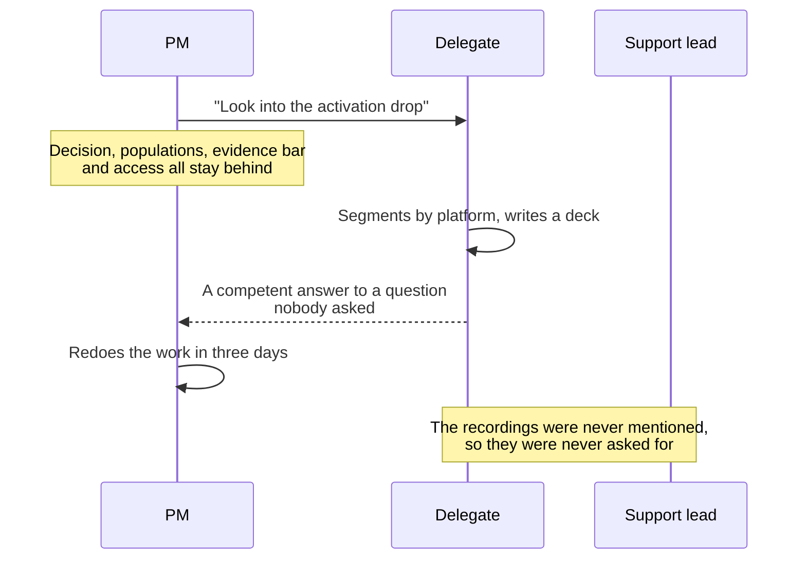
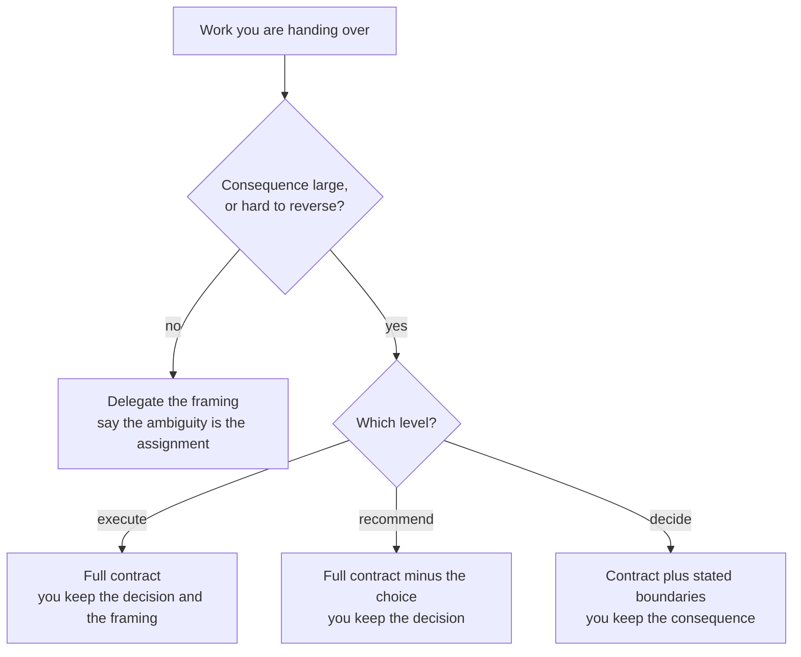

# PJ-06 · Delegation readiness

> Work is ready to delegate when intent, constraints, interfaces, evidence, and
> escalation conditions are portable.

## Problem — the handover that carried only a topic

Suppose a PM is overloaded. Four signals compete for attention, and the activation
decline is the one that keeps slipping. So the PM delegates it: "can you look
into the activation drop and come back with what you find?"

Two weeks later a deck arrives. It is competent. It segments activation by
platform, shows the decline is broadly distributed, and recommends improving
onboarding copy. It answers a question the PM was not asking. The PM redoes the
work in three days and concludes, privately, that this is not delegable.

That conclusion is wrong, and it is expensive, because the PM will now hold
every consequential investigation personally and will keep being the constraint.

Look at what was actually handed over. A topic. Everything load-bearing stayed
in the PM's head: which decision the work serves, which populations matter,
which evidence would be sufficient, whether the delegate could talk to the
support lead, and what would require coming back early. None of that was
missing from the PM's thinking. It was missing from the handover.

The failure is hard to see because the delegate's output *is* competent. The
gap does not look like a communication problem. It looks like a judgment gap in
the other person.

Trace what actually crossed between the two people, and what did not:

One arrow crosses from the PM, and it carries a topic. Everything the delegate
needed in order to aim is sitting in the note over the PM's own lane, and the
support lead never enters the diagram at all.

Ask before handing anything over: *could a competent person who was not in the
room produce something I would act on?* If not, the gap is in your handover, not
in them.

## Concept — what must survive leaving your head

Delegation readiness is a portability test. Five things must survive leaving
your head.

| Element | Portable when | Symptom when it stays behind |
|---|---|---|
| **Intent** | The decision it serves is written, with live alternatives | The delegate optimises the task rather than the decision |
| **Constraints** | Time, budget, population, and what must not change are stated | The delegate finds the constraints by violating one |
| **Interfaces** | Who they can talk to, what they can commit, what they cannot | Blocked for a week, or commits something you cannot honour |
| **Evidence standard** | What counts as sufficient for this decision | Anecdotes, or an over-built study nobody needed |
| **Escalation conditions** | Named observations that require coming back early | Escalates everything, or nothing until it is too late |

PJ-02 and PJ-04 do most of the work here. The evidence standard is a definition
of good applied to the *answer* rather than to the product. The escalation
conditions and the decision rights come straight from your decision
architecture. If you have both artifacts, you are most of the way to a
delegation contract already. That is the point of writing them.

### Delegate the work, or delegate the decision?

These are different, and confusing them is what makes handovers feel arbitrary.

| Level | What the delegate does | What you keep |
|---|---|---|
| **Execute** | Produces a defined output to a defined standard | The decision, and the framing |
| **Recommend** | Frames options and argues for one; you decide | The decision |
| **Decide** | Chooses, inside stated boundaries, and informs you | The consequence |

Say the level out loud, in the handover. Most delegation disappointment is a
level mismatch: you thought you asked for a recommendation, they thought they
were executing, or they decided something you had not authorised.

Here is the activation handover from the opening of this lesson, and the same
handover made portable:

**Weak** — "Can you look into the activation drop and come back with what you
find?"

A topic, a person, and no level. The delegate has to guess the decision, the
population, the evidence bar, and whether they are allowed to talk to anyone.
Every guess they make is one you will disagree with later.

**Strong** — "Recommend level, not decide. The decision: change the
first-session experience, look outside the first session, or make no product
change yet. Sufficient answer: the decline split by acquisition channel and
platform for individual knowledge workers, and whether it survives excluding the
two changes that shipped in the window. You may ask the support lead for the
recordings and engineering for one query. Come back early if the decline
concentrates in a single acquisition channel."

The second version is not longer because it is more thorough. It is longer
because **five things that were in the PM's head are now in the document** —
level, decision, evidence standard, interfaces, and one escalation condition.

It is still a fragment, not a contract. It has no time box, it does not say
whether the inherited activation definition is the delegate's to challenge, and
it carries one escalation condition where the Build asks for three. Do not copy
it into the Build and call it done.

### Accountability does not transfer with the work

You can move all three levels and still own the outcome in your area. This is
the same rule as escalation in PJ-04, pointed downward. Delegating is not a way
to stop carrying a consequence. It is a way to stop being the only person who
can produce the reasoning.

Say this explicitly when you delegate. A delegate who believes they now own the
consequence will either over-hedge or over-commit, and both are your doing.

### The readiness test

Before handing over, read your own contract as if you had just joined the
company. Three questions:

1. Could you say, in one sentence, what decision this changes?
2. Could you tell whether you had done enough?
3. Could you tell when you must come back early?

If any answer is no, the work is not ready. Fix your document, not the person.

### Boundary

Not everything should be made portable before it is delegated.

Sometimes the whole point of handing work over is that the other person forms
the frame themselves. That is how judgment develops, and it is the only way it
develops. If you hand a fully specified contract to someone who is ready to
frame the problem, you have given them execution work and told yourself you were
growing them.

The dividing line is the one from PJ-04: consequence and reversibility.
**Delegate the framing when the consequence is small or reversible, and delegate
execution with a full contract when it is not.** When you deliberately leave the
frame open, say so, so the delegate knows the ambiguity is the assignment rather
than an oversight.

The same branch decides the level and what stays with you:

Every path on the right keeps something with you. That is the rule from the
section above, drawn: no branch exists where the consequence leaves.

A second limit, stated plainly: a portable contract is not a substitute for
competence. Perfect intent, constraints, interfaces, evidence standard, and
escalation conditions handed to someone without the required skill produces a
well-scoped failure. Portability makes delegation *possible*. It does not make
it *safe*.

## Build — on Noted

Read `lessons/noted/case.md` if you have not already.

Take **Signal 1: activation fell 11% over six weeks.**

You have your PJ-02 definition of good for activation. You are not going to run
this investigation yourself, because your judgment is committed elsewhere this
cycle. Assume you are handing it to one person who is capable, has not been in
your meetings, and has access to the product's data.

The relevant facts are in the case: activation is defined as creating a document
and returning within seven days, and nobody defends the definition. The decline
has not been segmented. Two changes shipped inside the window. Actor identity is
missing for about 18% of events. The support lead holds recordings of customer
conversations.

**Your task.** Write a delegation contract that a competent stranger could act
on.

1. State the level: execute, recommend, or decide. Defend the choice against the
   consequence and reversibility of what follows.
2. Write the intent as a decision with live alternatives, not as a topic. "Find
   out why activation dropped" fails this test.
3. Carry your PJ-02 definition of good across as the evidence standard: what
   answer would be sufficient, for which population, and what would be more work
   than this decision justifies.
4. State the constraints: the time box, and what must not change. Include
   whether the inherited activation definition is theirs to challenge. That
   single line changes the whole assignment.
5. State the interfaces: whether they can speak to the support lead, whether
   they can ask engineering for a query, and what they may not commit on your
   behalf.
6. Write three escalation conditions as observations, not feelings. "If it looks
   complicated" is not one. "If the decline concentrates in a single acquisition
   channel" is.
7. Say who still owns the consequence, in one sentence.
8. Run the readiness test on your own document. Answer the three questions as if
   you had just joined.

**Expect to be pushed on:** whether your intent is a decision or a topic;
whether the escalation conditions are observable by the delegate with the access
you actually gave them; and whether you said the level out loud or left it to be
inferred.

### What a strong answer holds

- The level is said out loud — execute, recommend, or decide — and defended from
  the consequence and reversibility of what follows the answer, not from how
  busy you are.
- The intent is the PF-01 decision with its live alternatives. "Find out why
  activation dropped" fails, and so does any intent that names only one
  acceptable conclusion.
- The evidence standard is your PJ-02 definition of good pointed at the answer:
  which population, which split, what would be sufficient — and an explicit
  stopping rule for what would be more work than the decision justifies.
- Constraints include a time box and a one-line ruling on whether the inherited
  activation definition may be challenged. Interfaces name the support lead and
  engineering by role, and say what the delegate may not commit on your behalf.
- The three escalation conditions are things the delegate can actually observe
  with the access granted — a split that concentrates the decline, a data gap
  larger than the 18% already known, a shipped change that cannot be isolated —
  and the consequence stays with you in one sentence, with the readiness test
  run honestly, including any "no".
- The most common weak move is handing over a topic with a competent person
  attached. It is weak because every load-bearing choice then gets guessed, you
  will disagree with the guesses, and you will conclude the work was not
  delegable when it was the handover that was not ready.

## Use — on your product

Take one piece of work you are currently holding that someone else could do.
Choose one you have privately decided is "not delegable."

Answer five questions:

1. What decision does this work change, and what are its live alternatives?
2. What level are you delegating: execute, recommend, or decide?
3. What counts as a sufficient answer, and what would be more work than the
   decision justifies?
4. Who can they talk to, and what may they not commit?
5. What three observations would require them to come back early?

Write `<unknown>` where you cannot answer. Every `<unknown>` here is a reason the
work has stayed on your desk, and most of them are yours to close rather than
theirs.

## Ship — Delegation contract

Produce `artifacts/PJ-06-delegation-contract.md` using the template in
`artifact.md`.

Write it for someone who was not in any of your meetings. Then read it as that
person. The contract is finished when a capable stranger could produce something
you would act on without a follow-up conversation.

This closes your Product Judgment phase of the Product Decision Case. It is also
the first artifact written for someone other than you, which is the real test of
whether the earlier ones carried reasoning or only carried conclusions.

## Carry forward

A portable contract: intent as a decision, an evidence standard, interfaces, and
observable escalation conditions. EV-01 attacks the third of those. You have
said what a sufficient answer looks like — now you have to choose a method that
can actually produce it, and show that the method can answer the claim rather
than merely generate output about it.
