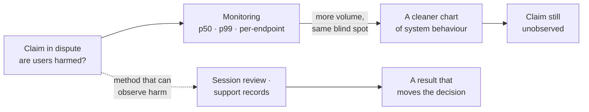
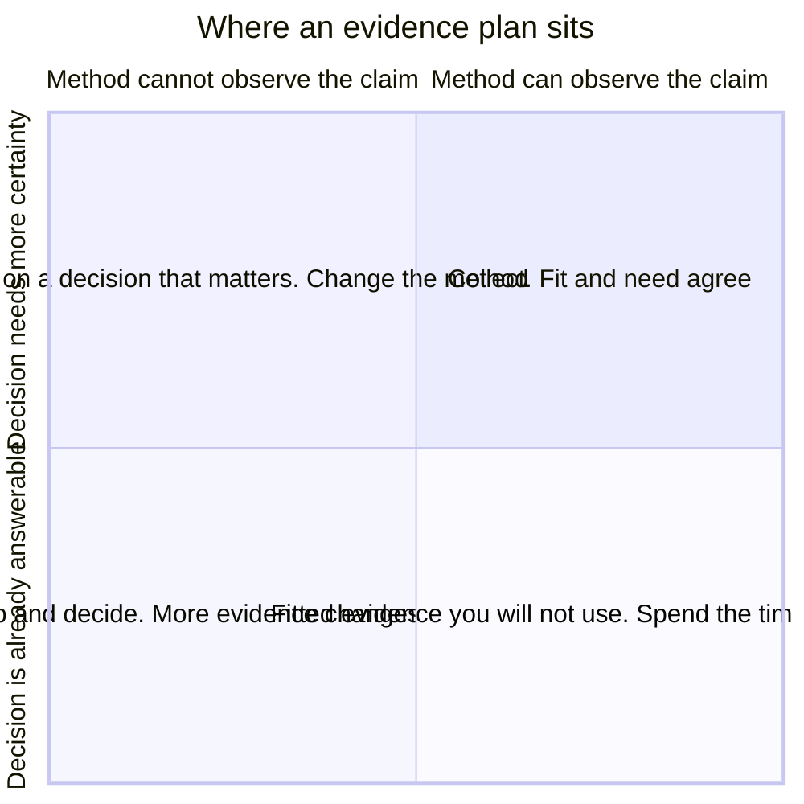

# EV-01 · Evidence fit and sufficiency

> Evidence quality depends on whether the method can answer the claim, and
> whether the decision needs more certainty than you already have.

## Problem — the method that cannot see the claim

A PM sees P95 response time rise for large workspaces. She opens the monitoring
dashboard, adds a second week of data, breaks it out by region, and builds a
chart. The chart is clean. The rise is real. She takes it to the roadmap review
and asks for two engineers.

Someone asks whether users are actually being harmed. She goes back and adds
more monitoring: p50, p99, time-to-first-render, a per-endpoint breakdown. Three
days of good work. The answer to the question is still not in any of it.

Two different failures are hiding here, and they look alike from the inside.

The first is **misfit**. Monitoring measures system behaviour. The claim under
debate is about user harm. No amount of additional monitoring converts one into
the other, because the method was never able to observe the thing being claimed.
More data of the wrong type feels like progress because the volume of evidence
increases while the fit stays at zero.

The second is **oversufficiency**. If the decision is a two-week reversible
reallocation of engineering time, it may already be answerable. Buying more
certainty costs time, and time is the thing the decision was about. Teams
routinely research past the point where the answer would change.

Both paths below start from the same claim. Only one of them runs through a
method that can observe it, and no amount of travel down the other one arrives:

Ask, before starting any evidence work: *which claim is this method able to
observe, and what would I do differently if I had twice as much of it?* If the
method cannot observe the claim, stop. If twice as much changes nothing, stop.

## Concept — fit and sufficiency are separate gates

Evidence work has two independent gates. A plan can pass one and fail the other.

**Gate 1 — fit.** Different claims are observable by different methods. The
common failure is to pick a method you trust and aim it at a claim it cannot see.

| Claim type | What it asserts | Methods that can observe it | Methods that cannot |
|---|---|---|---|
| **Existence** | This behaviour or problem happens at all | Interviews, session review, support records, event data | Surveys about hypotheticals |
| **Prevalence** | It happens to this share of this population | Instrumented event data, sampled survey with a defined frame | Request volume, sales anecdote |
| **Mechanism** | It happens *because* of this | Interviews, observed sessions, diagnostic instrumentation | Aggregate trend lines |
| **Magnitude** | It costs this much, or is worth this much | Instrumented outcomes, revenue data, time studies | Stated importance ratings |
| **Causation** | Changing X changes Y | Controlled experiment, strong quasi-experiment | Before/after comparison |
| **Preference** | People would choose this | Revealed choice, willingness-to-pay behaviour | Asking people to predict themselves |

Two rules follow. **Stated evidence is weak for prediction and strong for
mechanism.** People are poor at forecasting their own behaviour and good at
explaining what they did and why. **Behavioural evidence is strong for
prevalence and weak for mechanism.** Event data tells you how many and when, not
why.

Here is the fit gate applied to Noted's response-time signal. Both plans are
real work. Only one of them can observe the claim the decision turns on:

**Weak** — "Add p99, time-to-first-render and a per-endpoint breakdown, then
present the reallocation."

Every one of those observes system behaviour, which nobody is disputing. The
claim under debate is that users in workspaces over 500 documents are being
harmed. Monitoring cannot see harm at any resolution.

**Strong** — "Existence: review sessions in workspaces over 500 documents for
abandoned or repeated actions. Prevalence: count how many paid seats sit in
those workspaces."

Two claim types, split apart, each pointed at a method that can observe it. The
plan also states what it cannot settle: neither method establishes that the
34% rise is the cause.

**Gate 2 — sufficiency.** Sufficiency is not a property of the evidence. It is a
relation between the evidence and the decision.

| Decision property | Demand more evidence when | Accept less when |
|---|---|---|
| **Reversibility** | One-way, costly to unwind | Reversible in days |
| **Consequence** | Large, concentrated, external | Small, internal, diffuse |
| **Blast radius** | Affects all users or revenue | Affects a bounded slice |
| **Cost of the evidence** | Cheap and fast to obtain | Slow, expensive, or blocking |
| **Option value of waiting** | Waiting reveals something | Nothing new arrives by waiting |

The practical test is the **flip test**: state the level of evidence you plan to
collect, then ask whether a result at that level would actually flip your
decision. If a result would not flip it, you are collecting evidence to defend a
choice you already made. That is a legitimate activity — it is just not
research, and it should not be budgeted as research.

Write the flipping result as an observation, not an adjective. "Strong evidence
of harm" flips nothing, because nobody can say when it has arrived. "Reviewed
sessions in workspaces over 500 documents show abandoned or repeated actions
that sessions in smaller workspaces do not" is a result you can either see or
not see.

The two gates are independent, so every plan lands in one of four places. Find
yours before you staff it — only the top right quadrant is worth funding, and
the two on the left cannot be rescued by collecting more:

The third thing to write down is what the evidence **cannot** establish. Every
method has a shadow. Naming the shadow before you collect is what keeps a
finding from expanding in the retelling.

### Boundary

Fit and sufficiency assume that more certainty is purchasable and that the
decision waits for it. Sometimes neither is true.

Take Noted's platform dependency, which loses support in ten weeks. No evidence
changes the date. Engineering's three-to-five-week estimate has wide
uncertainty, and better estimation research would consume the very weeks in
question. Here the question is not "what evidence do I need" but "which option
stays recoverable if I am wrong". You choose for recoverability, not for
certainty.

The same limit applies when the evidence cannot arrive before the decision must
be made. A plan that produces the right answer after the deadline is not a
better plan than a fast, weak one. It is a worse plan wearing rigour as a
costume.

## Build — on Noted

Read `lessons/noted/case.md` if you have not already.

Take **Signal 3: P95 response time rose 34% for large workspaces.**

Large means more than 500 documents — about 4% of workspaces, holding a
disproportionate share of paid seats. No support ticket has mentioned speed. The
signal came from monitoring. The decision is whether to move engineering time
this cycle from planned features to large-workspace response times.

**Your task.** Build an evidence plan before choosing any method.

1. Write the claim that actually needs support. Not "the system is slower" —
   that is already observed. Write the claim the decision turns on.
2. Classify that claim using the table above. Existence, prevalence, mechanism,
   magnitude, causation, or preference. If it is more than one, split it.
3. For each sub-claim, name the method that can observe it, and name one method
   that would look reasonable and cannot.
4. Explain the absence of support tickets. Write two readings: one where the
   absence is evidence of no harm, one where it is not. State which observation
   would separate them.
5. Set sufficiency. The reallocation is for one cycle; say whether that makes
   it reversible, and what that does to the bar. Then, given blast radius and
   the cost of waiting, state the result at which you would commit engineering
   time.
6. Apply the flip test to your own plan, in writing. Name the result that would
   flip you, as an observation.
7. Commit to a position: run the plan, commit now without it, or decline the
   reallocation. Say which.

**Expect to be pushed on:** whether your "claim" is really the decision-bearing
claim or a restatement of the monitoring number, whether you treated silent
tickets as evidence of absence, and whether your sufficiency level is set by the
decision or by your own comfort.

### What a strong answer holds

- Names a decision-bearing claim about users or paid seats, not a restatement
  of the 34% rise, and splits it into at least two claim types with a different
  method behind each.
- Says, for each method, what it cannot establish — in particular that nothing
  in the plan proves the rise is the cause of whatever harm is found.
- Reads the silence in support tickets two ways and names the observation that
  would separate them. Absence of complaints is treated as something to explain,
  not as a finding.
- Sets the bar from the decision's properties — one cycle, reversible, bounded
  to about 4% of workspaces — and states the flipping result as an observation,
  not a confidence adjective.
- Commits to one of the three positions and says what being wrong costs.
- The most common weak move is stacking more monitoring — p99, per-endpoint,
  another week — and calling it evidence about harm. It fails the fit gate:
  monitoring observes the system and cannot see the user at any resolution.

## Use — on your product

Take one live decision where you are about to start, or have just started,
evidence work.

Answer four questions:

1. What is the exact claim this evidence must support, and what type of claim is
   it?
2. Which method can observe that claim type, and what can that method not
   establish?
3. At what level of result would you change your decision? Name the result, not
   the confidence adjective.
4. What is the cost of the delay this evidence introduces, and who bears it?

Answer only from what you hold today. Where you do not know, write `<unknown>`.
A named gap survives review. A confident guess collapses under it.

## Ship — Evidence plan

Produce `artifacts/EV-01-evidence-plan.md` using the template in `artifact.md`.

Write it for the person who will be asked to fund or staff this work — an
engineering lead, a design partner, a researcher. That reader needs to see what
question is being bought, what it costs, and what result would change the plan.

This extends your Product Decision Case. Your PF-01 decision brief named the
choice; this names the evidence that could move it, and the point at which you
stop buying more.

## Carry forward

A classified claim, a fitted method, a stated sufficiency level, and a written
list of what the method cannot establish. EV-02 takes the claims you marked as
mechanism claims and puts you inside the method that can actually observe them.
