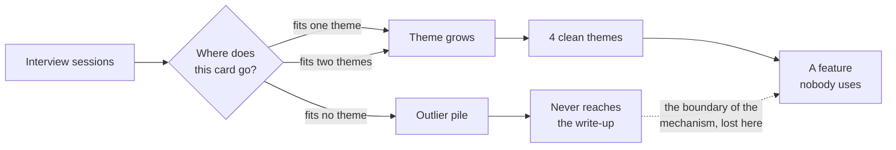
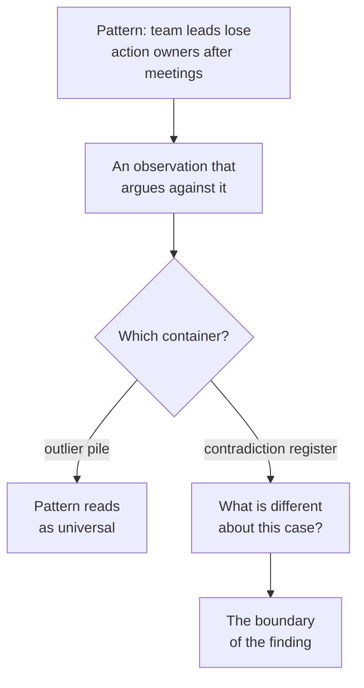

# EV-02 · Qualitative evidence and synthesis

> Qualitative work reveals mechanism and context, but only when observations
> stay separate from interpretation and contradiction survives synthesis.

## Problem — the clean themes that deleted the outliers

A PM runs eight interviews about meeting follow-up. The sessions are warm.
People are generous. Afterwards she opens a board, writes each quote on a card,
and groups the cards. Four themes emerge. She writes them up as findings:
*people lose track of action items*, *context gets lost between meetings*,
*nobody wants another tool*, *summaries would save time*.

Every theme is defensible. The write-up is well received. Six months later the
feature built on it is used by almost nobody.

Look at what happened during the grouping. Cards that fit a theme went into the
theme. Cards that fit two themes went into the stronger one. Cards that fit no
theme were set aside as outliers. The two sessions where the person had already
solved the problem with a shared doc and a recurring reminder did not survive
into the write-up, because they were not a theme — they were one person each.

Follow a single card through the board. The route it takes is decided by how
many other cards resemble it, which is a fact about recruiting, not about users:

That is the failure. **Synthesis by clustering rewards repetition and deletes
contradiction.** Repetition in eight sessions is not prevalence; it can just as
easily be a property of how the eight were recruited. Contradiction, on the
other hand, is the most information-dense thing in the whole set, because it
marks the boundary of the mechanism you think you found.

The failure is invisible from inside because clustering produces a clean output.
Cleanliness is the symptom, not the proof.

Ask, after any synthesis: *which observation in my notes argues against my main
finding, and where does it appear in the write-up?* If the answer is "there
wasn't one" or "I left it out", the synthesis compressed away the part that
would have made it useful.

## Concept — separate the layers, keep the contradictions

Qualitative evidence has one job that no other method does well: it exposes
**mechanism and context** — how a thing actually happens, in what conditions,
with what workaround already in place.

It has one discipline that makes it trustworthy: three layers stay separate at
all times.

| Layer | Example | Rule |
|---|---|---|
| **Observation** | "She said she rewrites the action list into a task tool after every Monday sync." | Recorded, attributable, no adjectives that imply cause |
| **Interpretation** | "The rewriting suggests the meeting notes are not trusted as a system of record." | Yours. Owned by you. Must be falsifiable |
| **Claim** | "Team leads maintain a second record because the first one is not addressable." | Carries product weight. Needs a population and a limit |

Collapsing observation into interpretation is the single most common way a
research readout becomes unarguable. Once "she rewrites the list" becomes
"notes are not trusted", nobody can check the step.

**How the questions determine the evidence.** Two question styles produce
different quality of data.

| Ask this | Not this | Why |
|---|---|---|
| "Walk me through the last time that happened." | "What usually happens?" | Episodes are recalled; generalisations are constructed |
| "What did you do next?" | "What would you want here?" | Behaviour is observable; wishes are speculation |
| "What did that cost you?" | "How important is this?" | Consequence is concrete; importance is a rating |
| "Show me where that lives now." | "Would you use a summary feature?" | Existing workarounds are the strongest signal of a real problem |

**How to synthesise without deleting the interesting part.** Four moves:

1. **Anchor every pattern.** A pattern is a claim plus the specific observations
   that produced it, with session identifiers. A pattern with no anchors is an
   opinion in the voice of the user.
2. **Count sessions, not quotes.** One person saying the same thing four times
   is one session. Quote counts are how a single loud participant becomes a
   trend.
3. **Keep a contradiction register.** Every observation that argues against a
   pattern gets recorded next to that pattern, not filed as an outlier. Then ask
   what is different about those cases. That difference is usually the real
   boundary of the finding.
4. **State the recruiting frame.** Who you talked to, how they were reached, and
   who could not have appeared in this set. This is what makes the finding
   readable by someone else.

Move 3 is the one that changes what you learn. The same disagreeing observation
produces two different findings depending only on which container it lands in:

Run the same three enterprise requests through both routes and the readouts do
not differ in tone. They differ in what a reader can check:

**Weak** — "Enterprise team leads lose decisions and action owners after
recurring meetings. Three of three customers raised it. Summaries are the fix."

Three requests through one account manager, in one month, restated as a property
of a population. The interpretation has been fused to the observation, the
channel has disappeared, and the recommendation is inside the finding.

**Strong** — "Observation: in `<n of n>` sessions, leads kept a second record of
decisions outside the meeting document. Interpretation, mine: the first record
is not addressable. Frame: all reached through one account manager; nobody who
never escalated could appear. Contradiction: `<n>` sessions where nothing went
missing."

Sessions counted, not quotes, with the count left open until the sessions exist.
The interpretation is labelled and falsifiable. The contradiction sits next to
the pattern, so a reader can ask what makes those accounts different — which is
where the boundary of the mechanism is.

**Saturation is a stopping rule, not a proof.** When new sessions stop producing
new mechanisms, you have probably mapped the mechanisms present *in your
recruiting frame*. It says nothing about how common any of them is.

### Boundary

Qualitative evidence cannot establish prevalence, magnitude, or causation. Not
with more sessions, not with better analysis. Eight sessions describing a
mechanism vividly is compatible with that mechanism affecting 2% of the
population.

There is a sharper limit in Noted. The three enterprise requests all arrived
through one account manager, within one month. Sessions recruited from those
accounts share a channel, a relationship, and a moment. However careful the
synthesis, the frame cannot produce a prevalence claim, because the frame is not
a sample of anything.

The honest use is: **qualitative gives you the mechanism and the boundary
conditions; something else has to tell you how often.** A readout that ends in
"and this is widespread" has stepped outside what the method can carry.

## Build — on Noted

Read `lessons/noted/case.md` if you have not already.

Take **Signal 2: three enterprise customers asked for automated meeting
summaries.**

The underlying claim is stated in the case and has never been tested: that
enterprise team leads repeatedly lose decisions, action owners, or context after
recurring meetings, causing rework or missed commitments. All three requests
came through one account manager. Meeting type is not captured in the product's
event data, so behavioural evidence about meetings does not exist today.

**Your task.** Design the qualitative work, then practise the synthesis
discipline on it.

1. Split the underlying claim into its parts. "Lose decisions", "lose action
   owners", "lose context", and "causes rework" are four different claims with
   four different observable traces. Say which one the decision turns on.
2. Write the recruiting frame. Who you would talk to, how you would reach them,
   and — explicitly — who cannot appear in this frame. Name at least one
   population whose absence would change how you read the results.
3. Write six questions. For each, say which sub-claim from step 1 it bears on
   and what observable trace it is asking for. At least two must ask for a
   specific past episode. At least one must ask about an existing workaround.
4. Write the two questions you will not ask, and why. Include at least one that
   asks someone to predict their own future behaviour.
5. Now practise separation. For each of the three exercise observations below,
   write the observation cleanly, then a separate interpretation, then say what
   would falsify that interpretation.
6. Build a contradiction register with at least two entries. One entry must be
   an observation that would argue against the claim that summaries are the
   right response.
7. Commit to a position: what you would now believe about the underlying claim,
   at what strength, and what the method cannot tell you.

**Exercise observations.** These three lines are teaching inputs for step 5
only. They are not case evidence about Noted, and you must not carry them into a
later lesson as fact.

- A team lead says she pastes the decision list from the meeting doc into a
  channel message afterwards, and that people respond to the channel message.
- A second lead says the problem is not the record but that the owner is
  assigned to a team rather than a person.
- A third lead says nothing goes missing, and describes a standing agenda
  document that is edited during the meeting.

**Expect to be pushed on:** whether your split claims are separately observable
or a single claim in four costumes, whether your recruiting frame quietly
excludes the people who would contradict you, and whether the third exercise
observation is treated as a contradiction or explained away.

### What a strong answer holds

- Splits the underlying claim into parts that leave different traces — a lost
  decision, an unassigned owner, missing context, and rework are not one
  observation — and says which part the decision turns on.
- States the recruiting frame with its exclusions: who cannot appear when every
  participant is reached through one account manager, and how that absence
  would change the reading.
- Keeps the three layers apart in every step. Observations carry no adjectives
  that imply cause; interpretations are labelled as yours and paired with what
  would falsify them.
- Treats the third exercise observation as a contradiction with a boundary
  question attached, not as an outlier or a case to explain away.
- Ends with a claim about mechanism and refuses a claim about prevalence,
  however many sessions agree.
- The most common weak move is writing "three of three customers confirmed the
  problem" as a finding. It counts requests as sessions, quotes as people, and
  one channel as a sample.

## Use — on your product

Take one belief about your users that your team repeats without checking.

Answer five questions:

1. What is the mechanism you believe is operating, stated so that it could be
   wrong?
2. What is the last actual episode anyone on your team observed, and who
   observed it?
3. Who has to be in the recruiting frame for that belief to be tested rather
   than confirmed?
4. What is already true in your notes that argues against the belief?
5. What is the workaround your users have built, and what does its shape tell
   you?

Answer only from what you hold today. Where you do not know, write `<unknown>`.
If question 2 or question 4 is `<unknown>`, that is the finding.

## Ship — Insight synthesis

Produce `artifacts/EV-02-insight-synthesis.md` using the template in
`artifact.md`.

Write it for someone who was not in any of the sessions and who will be asked to
act on it. That reader needs to see the observations, the interpretations
labelled as yours, the recruiting frame, and the contradictions that survived.

This extends your Product Decision Case. EV-01 named which claims needed
mechanism evidence. This is where the mechanism claims get their support, their
boundary, and their honest limit.

## Carry forward

A mechanism claim with anchored observations, a stated recruiting frame, and a
contradiction register that was not cleaned up. EV-03 takes the outcome buried
inside your mechanism claim and forces you to define it as something that can
actually be counted.
