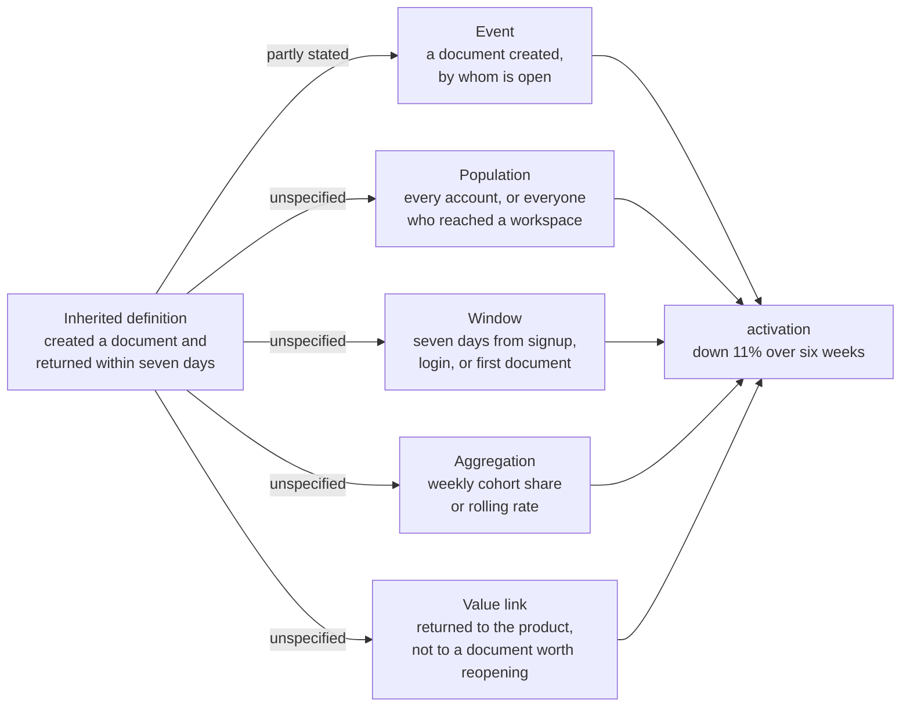
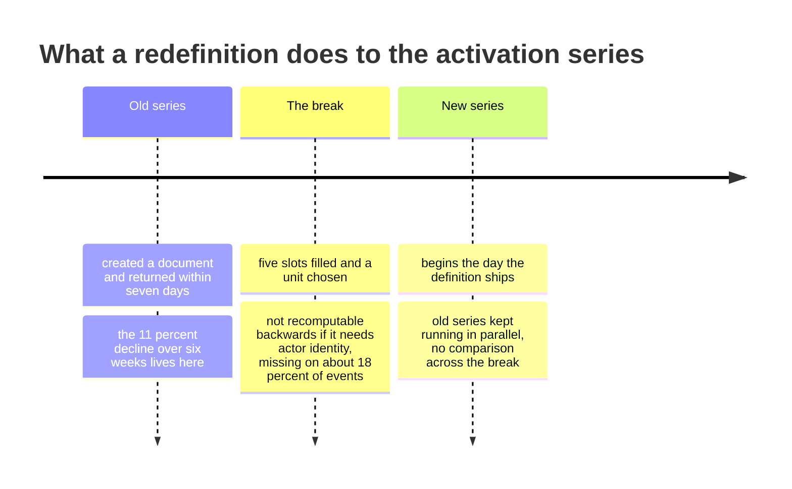

# EV-03 · Measurement models and metrics

> A metric is meaningful only when its population, event, window, aggregation,
> and connection to value are all explicit.

## Problem — the metric nobody in the room can define

Noted's activation number has fallen 11% over six weeks. Everyone in the room
agrees this is bad. Everyone in the room can picture what it means. Nobody in
the room can state the definition.

The definition is: created a document and returned within seven days. It is
inherited. Nobody wrote it down as a decision, and nobody defends it now.

Watch what that costs. Seven days from what — from signup, from first login, or
from the first document? Which users are in the denominator — everyone who
created an account, or everyone who reached a workspace? Does a document created
for you by an onboarding flow count as creating a document? Does returning mean
returning to the product, or returning to that document? Is the number a share
of a weekly signup cohort, or a rolling count that mixes cohorts together?

Run the inherited definition through the five things a metric has to specify.
Only one slot is even partly answered, and every unanswered slot is a place the
number can move on its own:

Each of those has a defensible answer. The problem is that the team is running a
decision off a number where the answers were never chosen. Two people looking at
the same dashboard are holding different metrics.

This failure is durable because the metric still moves. A number that moves
feels like a measurement. And the movement is real — something changed. What is
missing is any way to know whether the thing that changed was user behaviour, or
the mix of people entering the denominator, or an event that started firing
differently when the signup flow was revised.

Ask about any metric your team runs on: *state the population, the event, the
window, the aggregation, and what user value it stands in for.* If two people
answer differently, you do not have a metric. You have a shared feeling with a
number attached.

## Concept — the five slots a metric must fill

A metric is a compression of a claim about value. Five slots must be filled
before the compression is legible.

| Slot | The question it answers | Failure when left implicit |
|---|---|---|
| **Population** | Which entities are counted, and which are excluded | The denominator drifts as acquisition mix changes, and the metric moves with no behaviour change |
| **Event** | Which recorded action counts as the thing happening | Product changes silently redefine the metric |
| **Window** | Anchored at what moment, lasting how long | Recent cohorts are measured on incomplete windows and look worse than they are |
| **Aggregation** | Cohort share, rolling rate, per-user count, median | Rolling rates mix cohorts; averages hide the distribution that matters |
| **Value link** | What user outcome this stands in for, and how the link could break | The metric becomes the goal and the outcome is quietly abandoned |

Four properties matter as much as the five slots.

**Every metric has a gaming surface.** Name the cheapest way to move the number
without producing the value. If the cheapest way is something your team could
plausibly ship next quarter, the metric is not safe to target.

**Every metric has a drift surface.** Name what could change the number without
any change in user behaviour. Acquisition mix, a platform release, an event
schema change, a bot, a new default that auto-creates an object. Drift is why a
metric can be perfectly defined and still mislead.

**The unit of the population is a decision, not a detail.** A per-user metric
and a per-workspace metric answer different questions and can move in opposite
directions at the same time. Noted has personal workspaces, small team
workspaces, and enterprise accounts. A user-level activation rate and a
workspace-level activation rate will disagree, and both will be correct.

**A metric needs a companion that gets worse when it is gamed.** A primary
number without a counter-metric invites the team to optimise the surface. Pair
each metric with the thing that would degrade if the cheap path were taken.

The difference between the two versions below is not rigour for its own sake.
The left one cannot be computed the same way twice; the right one can be
disagreed with, which is what makes it usable:

**Weak** — "Activation: created a document and returned within seven days."

Readable, agreed in the room, and unspecified in four slots. When the signup
flow changes, the number moves and nobody can say whether behaviour did.

**Strong** — "Share of a weekly signup cohort, counted per user, who created a
document not generated on their behalf, and opened a document again within
seven days of first reaching a workspace. Reported only after the window closes.
Stands in for a document worth reopening."

Five slots filled, unit chosen, and the value link stated so a reader can see
where it would break — a return driven by a notification satisfies the metric
and not the job.

### Boundary

Defining a metric well does not make it the right metric. A precisely specified
number can be precisely disconnected from the job. Noted's job is a retrievable
artifact that supports a decision or a later return. A tight definition of
"returned to the product within seven days" measures none of that; it measures
whether the person came back to the building.

There is a second limit, and it has teeth. **Redefining a metric breaks its
history.** If you rebuild Noted's activation definition, the 11% decline cannot
be restated on the new definition unless the underlying events exist far enough
back and carry the fields the new definition needs. Noted's event data is
missing actor identity for about 18% of events, so a definition that depends on
identifying the actor may not be computable historically at all.

That is not a reason to keep a bad definition. It is a reason to state plainly
that you are starting a new series, to keep the old one running in parallel for
a stated period, and to refuse comparisons across the break. The break is a
point on a clock, and everything before it belongs to a different number:

## Build — on Noted

Read `lessons/noted/case.md` if you have not already.

Take **Signal 1: activation fell 11% over six weeks**, and specifically the
inherited definition — created a document and returned within seven days.

Two changes shipped during the window: a revised signup flow and a new
AI-suggestion prompt on the empty document state. The decline has not been
segmented by cohort, acquisition channel, or platform.

**Your task.** Rebuild the definition, then say what happens to the 11%.

1. Write down the inherited definition and mark every slot it leaves implicit.
   Use the five-slot table. Expect at least three gaps.
2. For each implicit slot, write the two defensible answers and say which one
   the team is probably using today. Say how you would find out.
3. State the value the metric is supposed to stand in for, in one sentence, in
   terms of Noted's job. Then say how the current definition and that value come
   apart.
4. Write the rebuilt definition with all five slots filled. Choose the unit —
   user or workspace — and defend the choice against the other one.
5. Name the gaming surface. What is the cheapest change that would raise your
   new number without producing the value? If Noted could ship it this quarter,
   revise the definition or add a counter-metric.
6. Name the drift surface. List every way the number could move with no change
   in user behaviour. The revised signup flow belongs on this list; say why.
7. Say what happens to the 11%. Can it be restated on the new definition? If
   not, say so explicitly, and say what you will do with the old series.
8. Commit: is the observed decline still something you would act on after this
   rebuild? Say yes, no, or not yet, and name the reason.

**Expect to be pushed on:** whether your rebuilt definition smuggles in a
mechanism you have not tested, whether your chosen unit was picked for
convenience rather than for the decision, and whether you were honest about the
11% being uncomparable rather than quietly recomputing it.

### What a strong answer holds

- Marks every implicit slot in the inherited definition, gives two defensible
  readings for each, and says how you would find out which one the dashboard
  is computing.
- States in one sentence what the metric stands in for, in terms of Noted's job
  — a document worth returning to — and shows where the current definition and
  that value come apart.
- Fills all five slots in the rebuilt definition, chooses user or workspace as
  the unit, and defends the choice against the other.
- Names a gaming surface Noted could plausibly ship this quarter, and a drift
  list that includes the revised signup flow with the reason it belongs there.
- Refuses to compare the 11% across the redefinition unless the new definition
  is computable on the old events, and says what happens to the old series
  either way.
- The most common weak move is rebuilding the definition and then quietly
  restating the decline on it. The two are separate series; a comparison across
  the break measures the redefinition, not the users.

## Use — on your product

Take the metric your team is currently held to.

Answer five questions:

1. What are its five slots, exactly as your data would compute them today?
2. What user value does it stand in for, and what is the closest thing to that
   value you could measure directly?
3. What is the cheapest way to move this number without producing that value?
4. What could move it with no behaviour change at all?
5. Which counter-metric would get worse if the cheap path were taken, and is it
   on the same dashboard?

Answer only from what you can verify today. Where you cannot verify a slot,
write `<unknown>` — an unverified slot is exactly where the surprises live, and
you will need this list in EV-04.

## Ship — Metric definition

Produce `artifacts/EV-03-metric-definition.md` using the template in
`artifact.md`.

Write it for the analyst or engineer who will implement it and for the next PM
who inherits it. It should be specific enough that two people computing it
independently would produce the same number, and honest enough that a reader can
see where the number stops meaning what its name suggests.

This extends your Product Decision Case. EV-02 gave you a mechanism claim with a
stated outcome inside it. This turns that outcome into something countable, and
records what the count is not able to carry.

## Carry forward

A five-slot metric definition, a named gaming surface, a named drift surface,
and a list of slots you could not verify. EV-04 takes that list and confronts
what the event data would actually have to record for the definition to be
computable at all.
