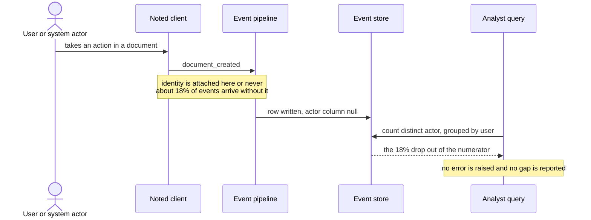
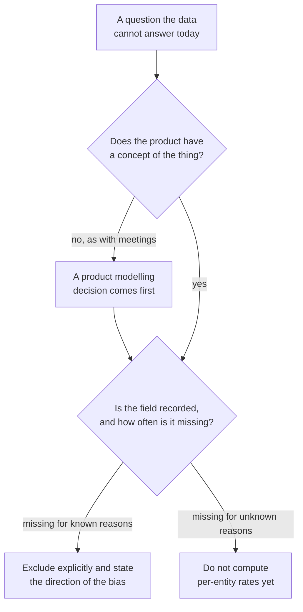

# EV-04 · Instrumentation and data contracts

> Instrumentation is a product contract about what happened, to whom, when, and
> with which identity. It is not an analytics afterthought.

## Problem — the missing data that is not random

A PM finishes a clean metric definition. Population, event, window, aggregation,
value link — all five slots filled. She sends it to an analyst, who replies two
days later: about 18% of the relevant events have no actor identity, so a
per-user rate cannot be computed the way the definition asks.

The obvious response is to treat this as noise. Eighteen percent is not nothing,
but the number still looks usable. Compute it on the 82% that do have identity,
add a footnote, move on.

That response is wrong for a reason that is easy to miss. **Missing data is
almost never missing at random.** Events lose actor identity for structural
reasons — a signed-out session, a public page view, an integration writing on
behalf of an account, a client that failed to attach the identifier. Each of
those reasons is a *kind* of user or a *kind* of moment. Dropping them does not
shrink the population evenly. It removes a slice with a shared characteristic,
and that characteristic is often exactly the one under investigation.

Follow one event from the moment it happens to the moment it becomes a number.
There is exactly one point where identity is attached, and one point where its
absence stops being visible to anybody:

There is a second failure in the same case, and it is worse because it produces
no error at all. Meeting type is not captured in Noted's event data. Not
partially, not unreliably — it does not exist. The enterprise claim is about
what happens after *recurring* meetings. No query can distinguish a recurring
meeting from a one-off, because the product never recorded the difference. The
analyst cannot even report a gap, because there is no field to report on.

Ask, before running any analysis: *what fraction of these events is missing the
field I am grouping by, and what do those events have in common?* If the answer
to the second half is "we don't know", the analysis has an unmeasured bias, not
a footnote.

## Concept — treat missingness as bias, not noise

An event is a promise made by the product to everyone who will later reason
about it. A tracking contract writes the promise down in four parts.

| Part | The promise | Common breach |
|---|---|---|
| **What happened** | One event name means one thing, and it does not change meaning when the product changes | A rename, a reuse, or a UI change quietly redefines the event |
| **To whom** | Actor, workspace, and account identifiers are attached, with a stated rule for anonymous and system actors | Identity is attached "usually", so the gap is invisible until someone groups by it |
| **When** | Timestamp source, ordering guarantee, and the treatment of late or replayed events | Client clocks, retries, and backfills silently move counts between days |
| **With which identity** | How an anonymous identifier becomes a user identifier, and what happens to events recorded before that moment | Pre-signup activity is stranded or double-counted after stitching |

Four properties turn this from a schema into a contract.

**Missingness has a shape.** For every field a metric depends on, record the
missing rate and the reason for missingness. A field that is missing at 18% for
one known structural reason is workable. A field that is missing at 3% for
unknown reasons is more dangerous, because the bias is unbounded.

| Missingness pattern | Effect on a rate | What to do |
|---|---|---|
| Missing for a known, listable reason | Biased in a direction you can name | Exclude explicitly, state the direction, or model it |
| Missing at a stable rate, cause unknown | Bias of unknown direction and size | Do not compute per-entity rates until the cause is found |
| Missing rate changing over time | Trend is contaminated | Any change in the metric may be a change in collection |

The table above is a set of options, and only one of them is normally taken.
Here is the same 18% handled the usual way and handled as a contract:

**Weak** — "About 18% of events have no actor. Compute activation on the 82%
that do, and add a footnote."

The footnote records the size of the gap and nothing about its shape. If the
events without identity come from a particular kind of session or a particular
kind of actor, the 82% is not a smaller sample of the population. It is a
different population.

**Strong** — "Identity is missing for a listable set of structural reasons.
Until each reason is counted, activation is reported per workspace, and the
per-user rate is withheld."

The gap is treated as a bias with a direction rather than as noise with a size,
and the metric that depends on the unavailable field is refused rather than
published with a caveat nobody reads.

**You cannot instrument a concept the product does not have.** If Noted has no
representation of a meeting, adding a `meeting_type` property is not an
analytics task. It is a product modelling decision that has to happen first: the
product needs a place where a meeting exists, is typed, and is linked to a
document. Instrumentation gaps are frequently model gaps wearing a data costume.

Sort every unanswerable question through the same two questions, in this order.
Skipping the first one is how a product decision becomes a tracking ticket:

**Instrumentation has no history.** A field added today answers questions from
today forward. There is no backfill for something that was never observed. This
makes instrumentation a scheduling decision: the earliest date you can answer a
question is the date you started recording, plus the window your metric needs.

**Every field is a permanent obligation.** It carries privacy and consent
duties, storage and pipeline cost, and a maintenance burden that lands on
whoever changes that code path next. A tracking contract that adds forty
properties because they might be useful is not rigour; it is debt with a
spreadsheet attached.

### Boundary

A data contract makes data checkable. It does not make data true.

Instrumentation records that an action occurred. It cannot record why, whether
the person meant it, or whether the outcome was any good. A perfectly
instrumented `document_created` event tells you nothing about whether the
document was worth creating. This is why EV-02 exists: mechanism is not
recoverable from event data at any level of instrumentation quality.

There is a second limit. Some questions should not be answered by adding fields.
If answering a question requires recording the content or context of private
work, the correct output of this lesson may be that the question is closed to
instrumentation, and must be answered by another method or not at all. Write
that down as a decision rather than leaving it as an unimplemented ticket.

## Build — on Noted

Read `lessons/noted/case.md` if you have not already.

Take the two instrumentation gaps stated in the case: **actor identity is
missing for about 18% of events**, and **meeting type is not captured at all.**

You are carrying two live obligations into this lesson. Your rebuilt activation
definition from EV-03 depends on identifying the actor. The enterprise claim
from EV-02 depends on distinguishing recurring meetings from other work.

**Your task.** Write the tracking contract that these two gaps require.

1. Take the 18% identity gap first. List at least four structural reasons an
   event in Noted could lack an actor identifier. Use only what the case
   supports — Noted has a public publishing path, file storage, and AI acting
   inside the document surface.
2. For each reason, say which population it over-represents, and say what that
   does to your EV-03 activation number. Direction matters more than size here.
3. Decide what you would do with the 18% today, before any fix: exclude, model,
   or refuse to compute. Defend the choice, and state the bias your choice
   leaves in place.
4. Write the identity part of the contract. Actor, workspace, and account
   identifiers; the rule for anonymous actors; the rule for AI-generated and
   system-generated actions; and the stitching rule when an anonymous visitor
   becomes a signed-in user.
5. Now take the meeting-type gap. Establish whether Noted has any product
   concept of a meeting. If it does not, say what product change must precede
   instrumentation. This is the step people skip.
6. Write the earliest point at which the enterprise claim could be answered
   with event data, counted in weeks from the day the field starts recording,
   given the window your metric needs. Then say what that lag means for the
   decision that is being asked for now.
7. Write the missingness monitor: which fields you will watch, at what threshold
   an alert fires, and who receives it.
8. Commit to a position: which of these two gaps you would fix first, and what
   you are willing to leave broken this quarter.

**Expect to be pushed on:** whether your four reasons for missing identity are
real properties of Noted or generic analytics folklore, whether you claimed a
direction of bias you cannot support, and whether you treated the meeting-type
gap as a tracking ticket when it is a product modelling decision.

### What a strong answer holds

- Lists reasons for missing actor identity that are properties of Noted — a
  public publishing path, file storage, AI acting inside the document — not
  generic analytics folklore, and names the population each one over-represents.
- States the direction each reason pushes the EV-03 activation number, and
  admits where the direction cannot be known from the case.
- Decides what to do with the 18% today — exclude, model, or refuse to compute —
  and names the bias that decision leaves in place.
- Treats the meeting-type gap as a product modelling decision first and a
  tracking ticket second, and states the earliest point at which event data
  could speak to the enterprise claim.
- Says what stays broken this quarter and why, instead of promising both fixes.
- The most common weak move is computing on the 82% with a footnote. It treats
  a structured gap as random noise, so the number describes a different
  population from the one in the definition.

## Use — on your product

Take the metric definition you produced in EV-03, and the slots you could not
verify.

Answer four questions:

1. For each field your metric depends on, what is the missing rate, and what do
   the missing rows have in common?
2. Which of your events could change meaning if the product changed, and who
   would notice?
3. What question are you currently unable to answer because a field does not
   exist, and what is the earliest date you could answer it if you started
   today?
4. Who owns the contract when an event breaks — not who fixes it, who is
   accountable for noticing?

Answer only from what you can verify. Where you cannot verify a missing rate,
write `<unknown>` and treat it as the most urgent item on the list. An unknown
missing rate is worse than a known bad one.

## Ship — Tracking contract

Produce `artifacts/EV-04-tracking-contract.md` using the template in
`artifact.md`.

Write it for the engineer who will implement the events and the analyst who will
query them. Both need the same document. It should be specific enough to
implement from and honest enough that a reader can see which questions the data
will still not answer after it ships.

This extends your Product Decision Case. EV-03 defined what you want to count.
This states what the system will actually record, what it will keep missing, and
from which date the record begins.

## Carry forward

A tracking contract with a stated missingness shape, an identity rule, and a
list of questions the data cannot yet answer. EV-05 puts you in front of an
analysis built on exactly this kind of data, where the query is correct SQL and
the answer is wrong.
