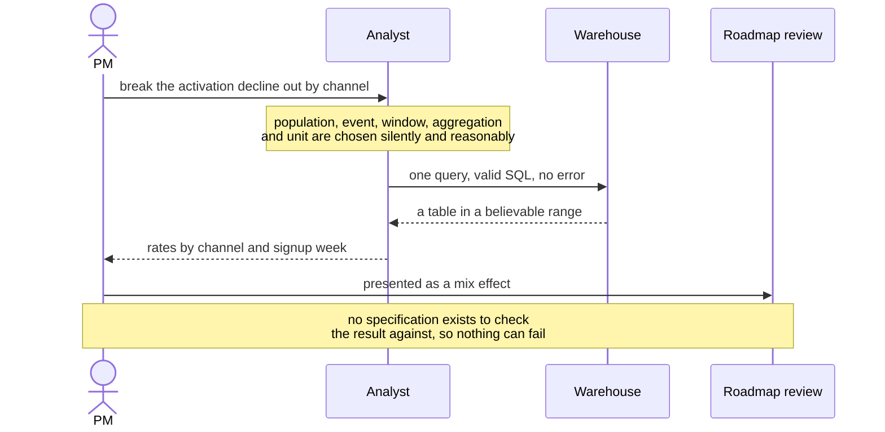
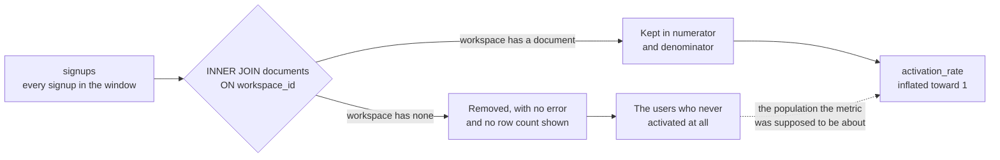

# EV-05 · Data reasoning and SQL supervision

> You need enough data literacy to specify the question, inspect the joins and
> the denominators, and challenge output that is plausible and wrong.

## Problem — the wrong number that looks entirely plausible

A PM asks an analyst to break the activation decline out by acquisition channel.
The analyst returns a table the next morning. Paid social sits well below
organic and referral, and it has dropped hardest over the six weeks. The story
writes itself: acquisition mix shifted toward a weaker channel, and the decline
is a mix effect rather than a product problem.

The PM presents this. It is well received. It is also wrong, and nothing in the
presentation reveals it.

Look at what travelled between the people rather than at the query. A topic went
one way and a table came back, and no specification went with either:



The query was competent SQL. It ran without error. The numbers are in a
believable range and they move in a believable direction. That combination is
what makes this failure so hard to catch: **a broken analysis usually produces
plausible output, not obviously broken output.** An analysis that returned 340%
would have been caught in thirty seconds.

The three most common breakages leave no trace in the result. An inner join
silently removes every entity that lacked a match, so the denominator quietly
becomes a subset of the numerator's population. A join on the wrong key fans a
single row into many, so counts inflate for exactly the entities with the most
related rows. A time filter that includes the most recent period truncates the
outcome window for the newest cohort, so the freshest data looks worst — which
manufactures a decline out of nothing.

The PM's protection is not the ability to write the query. It is the ability to
ask four questions about it and to refuse the result until they are answered.

Ask, of any number you are about to act on: *what is one row in the final table,
and what row set is the denominator?* If you cannot answer both from the query,
you do not yet know what the number means.

## Concept — interrogate the denominator, the joins, the edges

Supervising an analysis is four moves. None of them require you to write SQL.
All of them require you to read it.

**Move 1 — specify before anyone queries.** Hand over the five slots from EV-03:
population, event, window, aggregation, unit. An analyst given a topic will make
these choices silently and reasonably, and their reasonable choice may not be
yours. Specification is not bureaucracy; it is the only way the result can be
checked against an intent.

**Move 2 — interrogate the denominator.** This is where most wrong numbers live.

| Denominator question | Failure it catches |
|---|---|
| What row set is the denominator, stated in words? | The denominator is a different population from the one in the definition |
| Is it filtered by anything related to the outcome? | Inner joins and `WHERE` clauses that keep only entities that already succeeded |
| Does it include entities with zero of the numerator event? | Rates computed only over entities that did the thing, which always look high |
| Does it reconcile to a number you know independently? | Silent drops anywhere in the pipeline |

The second row of that table is the one that costs the most, because an inner
join removes rows without reporting anything. Trace the signups through it:



Everyone who failed to activate has left the denominator, so the surviving rate
describes only people who already succeeded. The single most useful habit
follows directly: compute the denominator on its own, in its own query, and
check it against a total you already trust.

**Move 3 — interrogate the joins.** For each join, ask two questions.

| Join question | Failure it catches |
|---|---|
| What is one row *after* this join? | Fan-out — one entity becomes many rows, so counts and sums inflate |
| Which rows are dropped by this join? | Drop-out — an inner join silently removing an entire population |

Join key and grain are the whole game. Joining on a workspace identifier when
the question is about a user attributes every teammate's action to every member.
That kind of error inflates most for the largest workspaces, which is also where
the money is, which is why it survives review.

**Move 4 — interrogate the edges.** Three edges break analyses routinely.

- **NULLs.** `COUNT(DISTINCT column)` ignores NULLs. If the column is missing for
  a structural reason — as actor identity is in Noted — the numerator drops a
  specific population while the denominator keeps it.
- **Window completeness.** Any cohort whose outcome window has not finished is
  measured on a partial window. Include those cohorts and the most recent period
  will always look worse.
- **Boundary conditions.** Inclusive or exclusive endpoints, timezone basis, and
  whether an event that defines the anchor also counts as the outcome.

**The tell for a plausible-but-wrong result is not implausibility.** It is
convenience. A number that lands exactly on the story you already believed
deserves more scrutiny than a number that surprises you, not less. Before
accepting a result, ask the analyst for the row count at each stage, and ask to
see three individual entities traced through the logic by hand.

### Boundary

Supervision catches errors in the analysis. It cannot catch a correct query run
against wrong data, and it cannot catch a correct query answering a
well-specified but irrelevant question. If the events are mis-instrumented, the
SQL review will pass and the answer will still be false. That is why EV-04
precedes this lesson.

There is a second limit about authority, and it turns on which seat you are in.

**This lesson assumes an analyst owns the query.** Reading it is your job;
owning its correctness is theirs. A PM who quietly rewrites someone else's query
has taken specialist accountability without specialist expertise, and has
removed the one person capable of catching the next error. The output here is a
list of checks and a refusal to act until they are answered — not a corrected
query.

**Where no analyst exists and the data is yours, the rule inverts.** A PM who
cannot run the second query rarely gets to ask it, and the questions that matter
most are usually the unplanned follow-ups ninety seconds after a surprising
number. That is a real and separate skill — schema design, grain, writing and
running the query yourself — and this course does not teach it. *PM Is Now
Another Member of Technical Staff* does, at length and with a runnable database.
You do not need any of it to finish this lesson.

## Build — on Noted

Read `lessons/noted/case.md` if you have not already.

You asked for the activation decline to be broken out by acquisition channel.
Recall from EV-04 that actor identity is missing for about 18% of Noted's
events. Assume three tables:

- `signups(user_id, workspace_id, signed_up_at, channel)` — one row per signup
- `documents(document_id, workspace_id, created_by_user_id, created_at)` —
  `created_by_user_id` is NULL where actor identity was not recorded
- `sessions(session_id, user_id, workspace_id, started_at)`

This is the query that produced the table you were about to present. What the
analyst says it does, in words: *for each channel and signup week, take everyone
who signed up in the last six weeks, and report what share of them created a
document within seven days.*

Read it against that sentence. You are not being asked to write SQL, or to know
every function in it — you are being asked whether the structure in front of you
can produce the sentence above.

```sql
SELECT
  s.channel,
  DATE_TRUNC('week', s.signed_up_at)            AS signup_week,
  COUNT(DISTINCT d.created_by_user_id)          AS activated_users,
  COUNT(DISTINCT s.user_id)                     AS signups,
  COUNT(DISTINCT d.created_by_user_id)::float
    / COUNT(DISTINCT s.user_id)                 AS activation_rate
FROM signups s
JOIN documents d
  ON d.workspace_id = s.workspace_id
JOIN sessions se
  ON se.user_id = s.user_id
 AND se.started_at BETWEEN s.signed_up_at AND s.signed_up_at + INTERVAL '7 days'
WHERE s.signed_up_at >= CURRENT_DATE - INTERVAL '6 weeks'
GROUP BY 1, 2
ORDER BY 1, 2;
```

**Your task.** Do not rewrite the query. Review it.

1. State, in one sentence each, what one row of the final table is and what row
   set the denominator is. Write these before looking for anything wrong.
2. Find at least four defects. For each, name the defect, name the direction it
   moves `activation_rate`, and name which channel or workspace type it distorts
   most. Direction and concentration matter more than the label.
3. At least one of your defects must be a denominator problem and at least one
   must be a join-grain problem. Say which is which.
4. Identify the defect that could, on its own, manufacture a decline over six
   weeks where no behavioural decline exists. Explain the mechanism in two
   sentences.
5. Say what the 18% NULL identity does to the numerator here, and whether it
   pushes the rate up or down relative to the truth.
6. Write the three checks you would ask the analyst to run before you look at
   any result again. Each must be a number you could compare against something
   you already know.
7. Write the escalation sentence you would send the analyst. It should name the
   checks and withhold the conclusion, without asserting that the query is
   wrong.
8. Commit to a position: what, if anything, you now believe about activation by
   channel.

Step 7 is where most people either flinch or overreach. Both versions below spot
the same defect; only one of them leaves the analyst able to catch the next one:

<div class="compare">
<div>

**Weak** — "The join is wrong — it drops every signup whose workspace never
produced a document, so the rates are inflated. I've rewritten it; here are the
corrected numbers."

The conclusion is asserted, the correction is unilateral, and the person with
the expertise to find the defect you missed has been removed from the loop. If
the rewrite is also wrong, nobody is left to notice.

</div>
<div>

**Strong** — "Before I take this anywhere, could you run three numbers: signups
for the six weeks with no joins, the same rate with signups left-joined to
documents, and the rate excluding signup weeks whose seven-day window has not
closed. I'm holding the channel conclusion until those come back."

Three checks, each comparable against something already known, and no claim that
the query is wrong. The conclusion is withheld rather than replaced, which is
the actual output of supervision.

</div>
</div>

**Expect to be pushed on:** whether your four defects are genuinely distinct or
one defect described four ways, whether you got the direction of each distortion
right rather than just naming it, and whether your escalation sentence takes the
analyst's job away from them.

### What a strong answer holds

- Opens with one row of the result and the denominator row set, in words,
  before naming any defect.
- Finds distinct defects — at least one that filters the denominator and at
  least one that changes the grain — and for each names the direction it moves
  the rate and the channel or workspace type it distorts most.
- Separates the defects that bias a level from the one that can manufacture a
  trend over six weeks, and explains that mechanism rather than labelling it.
- States what NULL actor identity does to the numerator and to the denominator
  separately, and therefore which way the rate moves.
- Asks the analyst for three checks that each reconcile to a number already
  known, and withholds the channel conclusion without asserting the query is
  wrong.
- The most common weak move is rewriting the query. It takes the analyst's
  accountability without their expertise, and removes the one person who could
  catch the defect you missed.

## Use — on your product

Take the last analysis you acted on.

Answer five questions:

1. What is one row of the result table, in words?
2. What row set is the denominator, and is it filtered by anything downstream of
   the outcome?
3. Which join could fan out, and which could silently drop a population?
4. Which columns in the logic have structural NULLs, and what do those rows have
   in common?
5. Does the most recent period have a complete outcome window?

Answer from the query, not from memory of the conversation. Where you cannot
answer without asking someone, write `<unknown>` and ask. A question you were
too senior to ask is the cheapest error in this whole course.

## Ship — Analysis review sheet

Produce `artifacts/EV-05-analysis-review-sheet.md` using the template in
`artifact.md`.

Write it for the analyst who ran the query and for the reviewer who will be
shown the result. It is a supervision record: what was specified, what was
checked, what remains unchecked, and what you are refusing to conclude until the
checks come back.

This extends your Product Decision Case. EV-04 recorded what the data can carry.
This records whether a specific analysis carried it correctly, and it is the
document you will point at when someone quotes your number back to you in six
months.

## Carry forward

A specified question, a reviewed denominator, a reviewed join grain, and a
result you either accepted with limits or refused. EV-06 takes the one claim
this analysis cannot settle — whether a change caused the movement — and builds
the design that can, along with the boundaries that design cannot cross.
