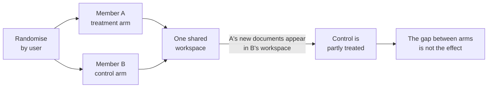
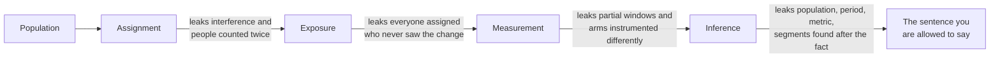

# EV-06 · Experiment and causal judgment

> An experiment estimates a causal effect only inside its assignment, exposure,
> measurement, and inference boundaries.

## Problem — a significant result the design cannot support

Noted runs an A/B test on the AI-suggestion prompt in the empty document state.
Half of new users get the new prompt. Activation is higher in the treatment arm,
and the result is significant.

The team ships it. The readout says: *the new prompt increases activation.*

Four things are wrong with that sentence, and none of them are about statistics.

Users were assigned individually, but Noted has shared workspaces. When two
members of one workspace land in different arms, the treated member's documents
appear in the untreated member's workspace. The arms are not independent, so the
comparison is not between treatment and its absence.

The leak happens below the level the randomisation operates at, which is why no
statistical test can see it:

The prompt only appears on the empty document state. Many assigned users never
reach it. The analysis compared everyone assigned, which measures a diluted
effect, or it compared only those who saw the prompt, which throws away the
randomisation — because reaching the empty state is a behaviour, not a coin
flip.

The outcome metric has a seven-day window, and the test kept assigning users
until the day it stopped. The final cohorts were measured on incomplete windows,
in both arms, but not necessarily in equal proportions.

And the new prompt creates documents through a different code path. If those
documents record a system actor rather than a user, they vanish from a numerator
built on `COUNT(DISTINCT created_by_user_id)` — which would understate the very
effect the test was built to find.

Each of these is invisible in the result. The p-value is unaffected by all four.
That is the durable failure: **randomisation protects against confounding and
against nothing else.** Everything the experiment does not control, it inherits.

Ask of any experiment result: *what exactly was randomised, who actually saw the
change, what was measured on whom, and to which population does this number
apply?* If a reader cannot answer all four from the memo, the memo is claiming
more than the design supports.

## Concept — four walls that bound a causal claim

An experiment produces a causal estimate bounded by four walls. A design is
sound when all four are stated, and a result is quotable only inside them.

The walls sit in series, and each one leaks a specific thing. What arrives at
the end is not "the effect of the change" but whatever survived all four:

### Wall 1 · Assignment

Assignment defines what "random" means here.

| Question | Failure it prevents |
|---|---|
| What is the unit of assignment — user, workspace, account, device? | A unit smaller than the unit of interaction lets treatment leak between arms |
| Is assignment made before exposure and independent of the outcome? | Assigning at the moment of a behaviour selects on the outcome |
| Can the same person be assigned twice under different identifiers? | Cross-device or signed-out traffic splits one person across arms |
| Are the arms balanced on entities, or on something correlated with the outcome? | Imbalance that mimics an effect |

**Interference is the assignment failure that costs the most.** If entities in
one arm can affect entities in the other, the difference between arms is not the
effect of the treatment. In a product with shared workspaces, the safe unit of
assignment is usually the workspace, not the user. That choice has a price: the
effective sample size becomes the number of workspaces, which is far smaller, so
the detectable effect gets larger.

### Wall 2 · Exposure

Assignment is not exposure. Most people assigned to a treatment never encounter
it.

| Concept | What it is | When to use it |
|---|---|---|
| **Intent to treat** | Compare everyone assigned, exposed or not | The default. Preserves randomisation. Estimates the effect of *shipping* the change |
| **Exposed-only comparison** | Compare only those who saw the change | Almost always broken, because exposure is a behaviour and behaviours differ between people |

The number you must record is the **exposure rate**: what share of the assigned
population actually encountered the change. If 40% were exposed, the
intent-to-treat effect is roughly 40% of the effect on the exposed, and a null
result may mean the change works and almost nobody saw it.

### Wall 3 · Measurement

The outcome is whatever your instrumentation recorded, not whatever you
intended.

- **Window completeness.** Every assigned cohort needs a finished outcome
  window. A test shorter than assignment period plus outcome window measures its
  last cohorts on partial data.
- **Identical instrumentation across arms.** If the treatment ships a new code
  path, that path may fire different events, attach a different actor, or fire
  at a different moment. This produces a measured difference with no behavioural
  difference. Check it before launch, not after.
- **Guardrails.** Pair the primary outcome with the counter-metric you named in
  EV-03 — the number that would degrade if the primary were moved the cheap way.
- **One primary outcome.** Declared before launch. Everything else is
  secondary and cannot carry the decision on its own.

### Wall 4 · Inference

What the number licenses you to say.

| Boundary | Statement it limits |
|---|---|
| **Population** | The estimate applies to the assigned population, not to all users |
| **Period** | It applies to the period run, including its seasonality and any novelty effect |
| **Metric** | It is an effect on that metric, not on the value the metric stands in for |
| **Precision** | The minimum detectable effect sets what a null result can mean |
| **Multiplicity** | Segments tested after seeing the data are hypotheses, not findings |

The most important pre-launch calculation is not the sample size. It is the
comparison between the **minimum detectable effect** and the **effect that would
change your decision**. If the smallest effect you could detect is larger than
the smallest effect you would act on, the experiment cannot answer the question
no matter how cleanly it runs. Cancel it or change the design.

A null result then means one of three things, and the memo must say which is
which: no effect, an effect smaller than the design could see, or an effect
hidden by low exposure.

### Boundary

Experiments do not settle every causal question, and forcing one is how teams
buy rigour for problems that do not have it.

They break down when the treatment cannot be confined to an arm — pricing that
users discuss, a public brand promise, a marketplace where one side's behaviour
is the other side's supply. They break down when the effect is slow, when the
outcome is rare, or when the population is too small to randomise, as with
Noted's three enterprise accounts.

And there is a limit no design escapes: **an experiment can tell you whether a
change moved a metric, and never whether that metric was the right thing to
move.** Noted could raise seven-day return with a notification and learn nothing
about whether documents became more useful. The experiment answers inside the
measurement model; choosing the measurement model is the judgment upstream of
it, and it is not testable by the test.

## Build — on Noted

Read `lessons/noted/case.md` if you have not already.

Two changes shipped during the activation decline: a revised signup flow and a
new AI-suggestion prompt on the empty document state. You want to know whether
the prompt is part of the cause. You propose an experiment: a revised
empty-state AI suggestion, against the current one, measured on the activation
definition you rebuilt in EV-03.

You are carrying two constraints. Actor identity is missing for about 18% of
events. Noted has personal workspaces, small team workspaces, and enterprise
accounts, and the team workspaces are shared.

**Your task.** Design the experiment, then write its four walls.

1. Write the causal question in one sentence. It must name a treatment, a
   comparison, a population, and an outcome. If your sentence contains the word
   "understand", start again.
2. Choose the unit of assignment. Defend it against the two units you rejected.
   State explicitly what interference you are preventing and what you are paying
   for it in detectable effect.
3. Say what the 18% identity gap does to assignment. Name at least one way a
   single person could end up in both arms, and what you would do about it.
4. Write the exposure model. The empty document state is live today, so the
   share of new users who reach it can be measured before launch rather than
   guessed. Say how you would measure it, what the 18% identity gap does to
   that measurement, and declare in advance that your primary analysis is
   intent to treat.
5. Write the measurement plan. Primary outcome, its window, the run length that
   makes every cohort's window complete, one guardrail, and the pre-launch check
   that both arms are instrumented identically. Name the specific way the new
   code path could break the numerator.
6. State the effect that would change your decision, before any power
   calculation. Then say what you would do if the minimum detectable effect
   turned out to be larger than it.
7. Write the inference statement you will be allowed to make if the result is
   positive. One sentence, with its population, period, and metric attached.
   Then write the sentence you are *not* allowed to make.
8. Write what a null result would mean, distinguishing the three cases.
9. Commit to a position: run it, run it with a different unit, or do not run it.
   If you would not run it, say what you would do instead.

Step 7 is the whole lesson compressed into one sentence. Both versions below can
follow the same positive result; only one of them stays inside the four walls:

**Weak** — "The revised empty-state AI suggestion increases activation."

No population, no period, no metric. The sentence travels into a roadmap
document, then into a board update, and by then it has quietly become a claim
about Noted's users in general — including the enterprise accounts that were
never assigned.

**Strong** — "Among workspaces assigned during the run, those receiving the
revised suggestion reached the rebuilt activation definition at a higher rate.
It says nothing about enterprise accounts, which were not in the assignment
population, and nothing about whether documents became worth reopening."

Population, period and metric are attached to the number, and the sentence you
are not allowed to say is written down next to the one you are.

**Expect to be pushed on:** whether your assignment unit was chosen for
statistical convenience rather than for interference, whether your exposure rate
is a guess presented as a plan, and whether your positive-result sentence
quietly generalises to enterprise accounts that were never in the assignment
population.

### What a strong answer holds

- Writes a causal question with a treatment, a comparison, a population, and an
  outcome, then chooses the assignment unit for interference rather than for
  sample size — and states the price paid in detectable effect.
- Names how one person could land in both arms given missing actor identity,
  and what the design does about it.
- Declares intent to treat as the primary analysis and says how the exposure
  rate will be measured from the live product, not guessed.
- Makes the run length cover assignment plus the full outcome window, and names
  the specific way the new code path could change what the numerator records.
- Writes the positive-result sentence with population, period, and metric
  attached, and next to it the sentence the result does not license — including
  anything about enterprise accounts or about documents becoming useful.
- The most common weak move is randomising by user because it gives more
  power. In a product with shared workspaces, that buys a tighter interval
  around a number that is not the effect.

## Use — on your product

Take an experiment your team ran, or is about to run.

Answer five questions:

1. What is the unit of assignment, and can entities in one arm affect entities
   in the other?
2. What share of the assigned population is actually exposed, and is that number
   recorded?
3. Is the run length at least the assignment period plus the full outcome
   window?
4. What is the smallest effect that would change your decision, and is it larger
   than the minimum detectable effect?
5. If the result is null, which of the three explanations can you rule out?

Answer from the design document, not from memory. Where the design does not say,
write `<unknown>`. An experiment with an unknown exposure rate is not a failed
experiment yet, but it is one that cannot be interpreted.

## Ship — Experiment decision memo

Produce `artifacts/EV-06-experiment-decision-memo.md` using the template in
`artifact.md`.

Write it for the person who will read the result in six weeks and for the
engineer who will implement the assignment. It is a pre-registration and a
decision record in one document: what will be run, what will be concluded from
each outcome, and what will not be concluded from any of them.

This extends your Product Decision Case. EV-05 told you what an analysis of
existing data can and cannot separate. This is where you buy a causal estimate
deliberately, at a stated price, with its walls written down before the number
arrives.

## Carry forward

A causal estimate with four stated walls, a pre-committed decision rule, and a
written list of what the result will not license you to say. EV-07 puts that
estimate next to the qualitative mechanism from EV-02 and makes you deal with
the case where the two of them disagree.
