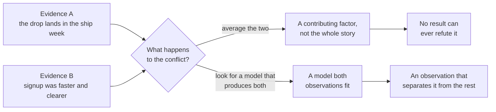
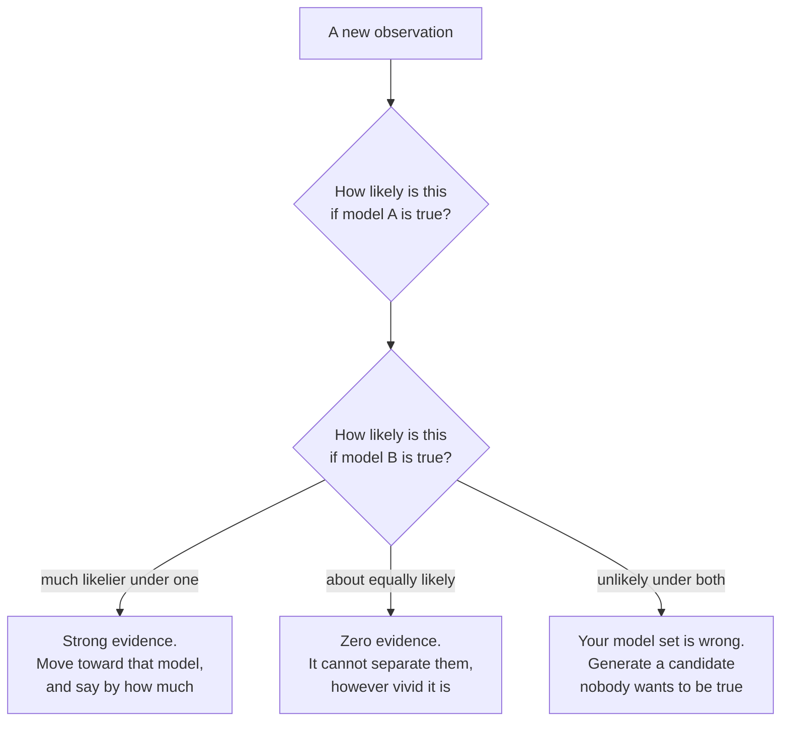

# EV-07 · Triangulation and belief updating

> Conflicting evidence should change your model of the world. It should not be
> averaged into a false consensus.

## Problem — the average that neither source supports

A PM has two pieces of evidence about the same claim. The behavioural analysis
says activation dropped sharply in the week the new signup flow shipped. The
sessions with recent signups say the signup flow was faster and clearer than
before, and nobody who stopped using the product mentioned signup at all.

She does what looks like good judgment. She writes: *the signup flow is likely a
contributing factor, though not the whole story. We should refine it while
continuing to investigate.*

That sentence is the failure. It is not a synthesis. It is an average.

Look at what it costs. The claim it produces — "a contributing factor, not the
whole story" — is not supported by either source. The quantitative evidence does
not say "contributing"; it says the drop coincides with the ship. The
qualitative evidence does not say "not the whole story"; it says the mechanism
is absent. Averaging invented a third position that no observation produced and,
worse, that no future observation can refute. Any result is consistent with
"contributing factor". The belief has become unfalsifiable, and the team will
now spend a cycle refining something on the strength of it.

The two routes out of a conflict are not two styles of judgment. One of them
ends in a claim no observation can reach, and the other ends in an observation:

The averaging move is attractive because it looks balanced, it respects both
colleagues who brought evidence, and it avoids saying anyone was wrong. Those
are social virtues. They are not epistemic ones.

Ask, whenever two sources disagree: *what would have to be true for both of
these observations to be correct?* Most of the time there is an answer, and it
is more interesting than either source alone.

## Concept — find the model that produces both observations

**Independence is a property of failure modes, not of source count.** Two
sources corroborate each other only when the ways they could each be wrong are
different. Sources that fail the same way agree loudly and tell you nothing, and
adding a third of the same kind makes the agreement louder without making it
more informative.

| Pair of sources | Independent? | Why |
|---|---|---|
| Event data and a survey routed through the same in-product prompt | No | Both miss users who never reach the surface |
| Three customer requests through one account manager, and that manager's summary | No | One channel, one relationship, one interpretation |
| A controlled experiment and interviews recruited from a different population | Yes | Different selection, different failure modes |

Agreement between dependent sources is the most common way a team becomes
confident and wrong.

**Conflict has five shapes.** Naming the shape is most of the work.

| Shape | What is happening | How to test it |
|---|---|---|
| **Different populations** | The two sources describe different people | Recompute one on the other's population |
| **Different constructs** | The two sources measure different things under one word | Write both definitions side by side |
| **Different windows** | One is a snapshot, one is a trend, or they cover different periods | Align the periods and look again |
| **One is wrong** | A defect in the analysis, the design, or the recruiting frame | Run the checks from EV-05 or the walls from EV-06 |
| **Both are right and the claim is wrong** | The observations are compatible, and the model connecting them is not | Find the model that predicts both |

The fifth shape is the productive one, and it is the one averaging destroys. If
both observations are sound and they cannot both fit your claim, the claim is
what has to go.

Take a different Noted conflict to see the move without the answer attached.
P95 response time rose 34% for large workspaces, and no support ticket has ever
mentioned speed. Two sources, both sound, pointing opposite ways:

**Weak** — "Performance is probably somewhat degraded for some users. We should
keep an eye on it."

Neither source said "somewhat" and neither said "some users". The sentence is
built from the midpoint of two observations rather than from either of them, and
no future ticket count or latency reading can contradict it.

**Strong** — "Both observations hold. A candidate model: users in workspaces
over 500 documents meet the slowdown in operations they do not attribute to
Noted, so they absorb it rather than report it. That model predicts the
monitoring rise, the ticket silence, and one more thing — abandoned or repeated
actions concentrated in those workspaces."

The claim is a model, labelled as a candidate, and it earns its place by
predicting a third observation nobody has looked for yet. That observation is
what would move it.

**Update on likelihood, not on direction.** The question is never "does this
support my belief". It is: *how likely is this observation if model A is true,
compared with if model B is true?* Evidence that is equally likely under both
models is not weak evidence. It is zero evidence, no matter how vivid, how
recent, or how expensively obtained.

The same observation does different work depending on the models it is being
weighed against. Run any new finding through this before you let it move you:

The third branch is the one teams never take. An observation that surprises
every model you hold is not noise to be explained away — it is the clearest
signal you will get that the real explanation is not yet on the table.

**Write the update down as an update.** A belief that quietly becomes stronger
leaves no record of why. A ledger records the prior belief, its strength, the
observation, what it would have looked like under each model, the new strength,
and what would move it again. That record is what lets a later reader see
whether you were reasoning or accumulating.

**Confidence should be able to go down.** A functioning belief system produces
downgrades. If your last ten updates all increased confidence in things you
already believed, you are not updating; you are collecting.

### Boundary

Belief updating only works over the models you actually put on the table. If the
true explanation is not among your candidates, updating makes you increasingly
confident in the best of a bad set. The discipline that protects against this is
not more updating; it is deliberately generating a model that nobody in the room
wants to be true, and asking what evidence would look like under it.

There is a second limit. Some conflicts should not be resolved yet. Holding two
live models is a legitimate state — but only with a named observation that would
separate them and a date by which you will have it. Without those, "we are still
triangulating" becomes a way of never deciding, and a decision that is due does
not wait for a belief that has become comfortable to hold open.

## Build — on Noted

Read `lessons/noted/case.md` if you have not already.

The claim under test is: **the revised signup flow caused the activation
decline.**

You hold two pieces of evidence about that single claim. They conflict.

**Exercise inputs.** These two findings are teaching material for this lesson.
They are not established facts about Noted, and you must not carry them into
another lesson as case evidence.

- **Evidence A — behavioural.** After the query defects from EV-05 were fixed,
  activation is recomputed by weekly signup cohort with complete outcome
  windows. The rate is materially lower for every cohort that signed up after
  the new flow shipped, and the step down lands in that week. Signup completion
  rate rose in the same week.
- **Evidence B — qualitative.** Sessions with users who signed up after the
  change describe signup as faster and clearer than the previous flow. No
  participant who stopped using Noted mentioned signup. Several describe
  creating one document to try the AI suggestion, finding nothing they wanted to
  keep, and not returning.

**Your task.** Resolve this without averaging.

1. State the claim precisely enough to be wrong, including its population and
   window.
2. Assess independence. For each piece of evidence, name its failure mode, then
   say whether the two failure modes are genuinely different.
3. Classify the conflict using the five shapes. Argue for one shape and say what
   would rule out the other four.
4. Write the sentence you are refusing to write. It is the averaged one. Say in
   one line why it cannot be tested.
5. Build at least three candidate models that could produce both observations.
   One of them must not involve the signup flow's design at all. One of them
   should be a model you would prefer not to be true.
6. For each model, write what Evidence A and Evidence B would look like if that
   model were true. This is the likelihood step, and it is where the answer
   comes from.
7. Identify the model that predicts both observations without strain. State the
   additional observation it predicts, that the others do not.
8. Write the update: your prior belief in the original claim and its strength,
   the new strength, and the reason. If your confidence went up, say what would
   have made it go down.
9. Commit to a position: what you now believe, what you would do next, and what
   you refuse to do until the discriminating observation arrives.

**Expect to be pushed on:** whether your third model is a genuine alternative or
the first model with different words, whether the rising signup completion rate
was used or ignored, and whether your "update" is a downgrade anywhere or only a
rearrangement that leaves your original instinct intact.

### What a strong answer holds

- States the claim with a population and a window, and names a failure mode for
  each piece of evidence before saying whether the two are independent.
- Writes the averaged sentence out in full and says why no observation could
  refute it.
- Offers at least three candidate models — one that leaves the signup flow's
  design alone, one you would rather not be true — and for each says what
  Evidence A and Evidence B would look like if it held.
- Uses the whole of Evidence A, including the completion rate rising in the
  same week, rather than the part that fits.
- Names the one further observation the surviving model predicts and the others
  do not, and states the update as a change in strength with a reason,
  downgrading where the evidence demands it.
- The most common weak move is a third model that is the first model in new
  words. Updating over near-identical candidates makes you confident in the
  best of them without ever testing whether the set was wrong.

## Use — on your product

Take a belief your team holds where two sources of evidence do not agree.

Answer four questions:

1. What is the claim, stated precisely enough that an observation could falsify
   it?
2. Do the two sources share a failure mode? Name each one.
3. Which of the five conflict shapes is operating, and what would rule out the
   others?
4. What single observation would move you most, and who could get it?

Answer only from evidence you hold. Where a source's failure mode is not known,
write `<unknown>` — an unexamined failure mode is how two dependent sources get
counted as corroboration.

## Ship — Belief update ledger

Produce `artifacts/EV-07-belief-update-ledger.md` using the template in
`artifact.md`.

Write it for yourself in three months and for whoever inherits this product
area. It is the record of how a belief moved and why, which is the only thing
that separates a considered position from an accumulated one.

This closes your evidence phase in the Product Decision Case. Your PF-01 brief
named the decision; EV-01 through EV-06 bought the evidence and bounded it; this
records what you now actually believe about the world, at what strength, and
what would change it.

## Carry forward

A surviving model of the world, with its strength stated and its discriminating
observation named. ST-01 begins strategy from exactly that: the constraint or
dynamic your model says matters most, rather than an aspiration written before
the evidence was in.
