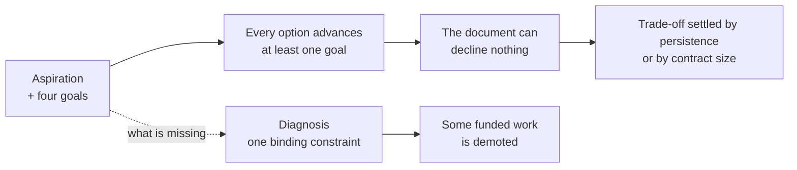
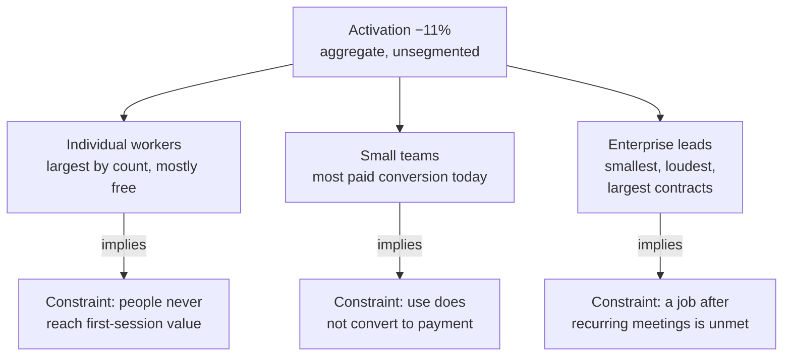

# ST-01 · Strategic diagnosis

> Strategy starts by identifying the constraint or dynamic that matters most,
> not by writing an aspiration.

## Problem — the strategy that can decline nothing

A team writes its first strategy document. It opens with a sentence everyone
likes: "Become the default workspace where teams think together." Below it sit
four goals, each with a number, each with an owner. Below that, a quarter of
themes. The document is circulated. Nobody objects.

Six weeks later an account manager escalates a customer request. Engineering
wants a week for response times. Design has an onboarding rework half-built. Two
of these can be funded. The team opens the strategy document to settle it, and
the document says nothing. Every option advances at least one of the four goals.
Every option fits under the aspiration. So the argument is settled by who is
most persistent, or by who has the largest contract attached to their request.

The failure is hard to see because the document passed every review. Nobody
objected precisely because it contained nothing to object to. An aspiration
attracts agreement; a diagnosis attracts argument. A team that has never argued
about its strategy has usually never had one. Goals and themes look like
strategy because they are specific, dated, and countable — but specificity about
targets is not the same as a claim about why the targets are hard.

The mechanism is worth tracing, because the harmless-looking step is the first
one. An aspiration plus a goal list makes every candidate defensible, and a
document that can decline nothing hands the trade-off to whoever pushes hardest:

The dotted edge is the whole lesson. Nothing on the top path is a mistake you
could catch in review; the bottom path never started.

Ask this: **name one thing currently funded that this strategy tells you to
stop.** If the answer is nothing, you have an aspiration and a plan, not a
diagnosis.

## Concept — name the one binding constraint

Four different documents get called strategy. Only one of them can settle a
trade-off.

| Layer | What it states | What it cannot do |
|---|---|---|
| **Aspiration** | Where you want to end up | Choose between two things that both point there |
| **Goal list** | Targets, numbers, owners | Say why the targets are currently out of reach |
| **Plan or roadmap** | What will be built and when | Say what happens when the plan meets a surprise |
| **Diagnosis** | The dynamic that is deciding outcomes now | Motivate anyone on its own |

A diagnosis has three parts:

1. **The dynamic.** What is actually happening in the market, the product, or
   the population structure — stated as a mechanism, not as a metric movement.
2. **The binding constraint.** The one thing that, if it changed, would change
   the outcome. Not the most annoying thing. Not the most requested thing.
3. **The consequence of ignoring it.** What continues to happen if you fund
   everything else instead.

### The binding-constraint test

Most teams can list five problems. A constraint is binding when relieving it
changes the result *and* relieving the others does not.

Test each candidate this way: assume it is fully solved tomorrow, at no cost.
Does the outcome you care about move? If it does not, it is a real problem but
not the constraint. Run this on at least three candidates, including one you
expect to survive and one you would rather not name out loud.

Here is the test applied to Noted's activation signal. Both versions are the
same length and both sound decisive:

**Weak** — "Our binding constraint is onboarding. Activation fell 11% over six
weeks."

This restates the metric and names the first plausible cause. It demotes
nothing, because every population's request still qualifies as onboarding work.

**Strong** — "Activation is measured across a population that is mostly free,
and the number has not been segmented. The binding constraint is that we cannot
yet say which population moved."

A mechanism someone can argue with. It is provisional, and it demotes the
half-built onboarding rework until the number is split.

The difference is not confidence. The weak version names a cause; the strong
version names what is deciding the outcome and what that costs.

### Population structure is a common source of false constraints

When a product serves several populations, three different populations will
each generate a candidate constraint:

| Population signal | Why it looks binding | Why it may not be |
|---|---|---|
| The largest by count | Volume feels like the market | Volume without value capture may not be the constraint on the business |
| The loudest | Requests arrive with names, urgency, and revenue attached | Request volume measures access to your team, not prevalence |
| The one that pays today | Revenue is real and current | Today's payer may be an artifact of the current product, not a choice |

None of these is automatically wrong. The error is letting one of them win
without being compared to the other two.

### Boundary

Diagnosis stops being useful in two situations, and both are common.

**The constraint sits outside your control.** If the binding constraint on
Noted's growth were the pricing of the underlying model provider, that would be
a true diagnosis and a useless one for a product team. When this happens, say so
plainly, name who does control it, and then diagnose the strongest constraint
inside your control. Do not quietly substitute a smaller constraint and present
it as the main one.

**The constraint is genuinely not yet identifiable.** Noted's activation decline
has not been segmented, and two changes shipped in the same window. A diagnosis
written today would be a guess wearing a confident sentence. The honest move is
a *provisional* diagnosis with the discriminating evidence named, not a refusal
to diagnose and not a false certainty. A provisional diagnosis must say what
would overturn it.

A diagnosis also has a shelf life. One that is correct for 4% of workspaces
today may be wrong when that share doubles. Date it.

## Build — on Noted

Read `lessons/noted/case.md` if you have not already.

Take **Signal 1: activation fell 11% over six weeks** — and read it against the
population structure in the case, not on its own.

The structure is the interesting part. Individual knowledge workers are the
largest population and mostly free. Enterprise team leads are the smallest
population, make the loudest requests, and hold the largest contracts. Small
teams are where most paid conversion happens today. A declining aggregate
activation number sits on top of all three.

One number, three populations, three different constraints implied — and one
cycle of capacity:

The three constraints conflict because relieving any one of them consumes the
capacity the other two need, and the aggregate number cannot tell you which
population moved. Your task is to pick one and defend the demotion of the other
two.

**Your task.** Produce a strategic diagnosis for Noted.

1. State the dynamic you believe is operating, as a mechanism. Not "activation
   is down." Something a reader could disagree with.
2. Write three candidate binding constraints. At least one must come from each
   of: the largest population, the loudest population, the paying population.
3. Run the binding-constraint test on all three. For each, state which outcome
   moves if it were solved tomorrow at no cost, and for which population. If
   nothing moves, say so — that candidate is out.
4. Commit to one as binding. Say why the other two are real problems that are
   not the constraint.
5. State the consequence of ignoring your constraint for two more quarters.
6. Mark your diagnosis provisional or firm, and name the one piece of evidence
   that would overturn it. Say who could produce that evidence.
7. Name one currently funded activity your diagnosis demotes.

**Expect to be pushed on:** whether your "dynamic" is a restated metric rather
than a mechanism; whether you selected the loudest population because it came
with revenue attached; and whether an unsegmented aggregate number can support
any population-level claim at all.

### What a strong answer holds

- States a dynamic as a mechanism a reader could argue with, not as "activation
  is down".
- Runs the solved-tomorrow test on three candidates drawn from three different
  populations, and shows what happens to the outcome in each case.
- Commits to one constraint and says why the other two are real problems that
  are not binding.
- Marks the diagnosis provisional or firm, names the evidence that would
  overturn it and who could produce it, and dates it.
- Names something currently funded that the diagnosis demotes.
- The most common weak move is letting the loudest population's constraint win
  because revenue is attached. Contract size and access to your team are facts
  about the channel, not about which constraint binds — and an unsegmented
  aggregate cannot settle it either way.

## Use — on your product

Take your own product, at the level you actually influence.

Answer four questions. Write `<unknown>` where you do not have evidence — a
named gap is worth more here than a plausible sentence.

1. What is the dynamic deciding outcomes for your product right now, stated as a
   mechanism rather than a metric?
2. What are three candidate constraints, and what happens to your outcome if
   each is solved tomorrow at no cost?
3. Which population's candidate constraint has been winning arguments, and is
   that because of evidence or because of access to your team?
4. What is currently funded that your diagnosis says should stop, and who would
   have to agree?

## Ship — Strategic diagnosis

Produce `artifacts/ST-01-strategic-diagnosis.md` using the template in
`artifact.md`.

Write it for a peer PM or a functional lead who has to make a resourcing
argument next week without you in the room. They should be able to read it and
tell you which of their requests it demotes, and why.

In your Product Decision Case, this is the first artifact that constrains the
others. Your earlier problem framings and evidence work supply its inputs.
Everything in this phase either follows from this diagnosis or contradicts it,
and a contradiction is a signal to revisit one of the two — not to keep both.

## Carry forward

One named binding constraint, with the two rejected candidates and the evidence
that would overturn your choice. ST-02 takes that constraint and breaks the
business around it into six linked hypotheses, so you can see which parts of
your strategy can fail independently.
