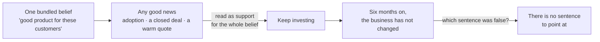
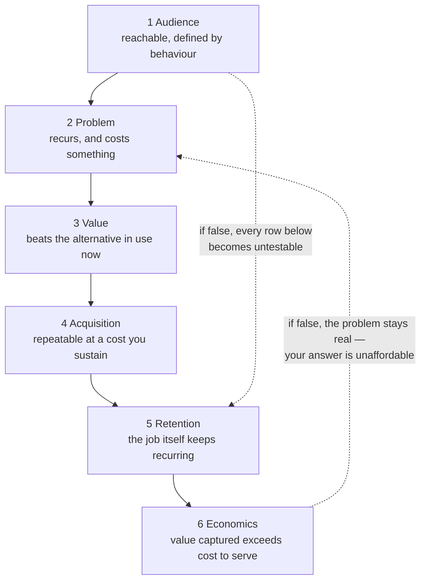

# ST-02 · Product-market hypothesis system

> Audience, problem, value, acquisition, retention, and economics are linked
> hypotheses that can fail independently.

## Problem — the bundled belief no result can refute

A team ships a capability that a set of customers asked for. Adoption among
those customers is good. Six months later the business has not changed.

Each function has an explanation and each explanation is locally correct. Design
says the experience tests well. Engineering says usage is stable. Sales says
the feature closes deals. Finance says the accounts using it cost more to serve
than they return. Nobody is wrong, and nobody can say which belief was the one
that failed, because the team never wrote its beliefs down as separable claims.
It had one belief — "this is a good product for these customers" — and that
belief cannot fail in a way you can learn from.

This is hard to see because a bundled belief is confirmed by any piece of good
news. A single positive signal — adoption, a closed deal, a warm interview —
gets read as support for the whole chain. Teams then keep investing because
something is working, without noticing that the part that is working is not the
part the business depends on.

A bundled belief has a specific shape, and it is a loop rather than a chain:

Notice that nothing in that loop is a mistake anyone made. The loop runs on
good news, which is why teams stay in it.

Ask this: **if this strategy fails, which specific sentence would have been the
false one?** If your team cannot point at a sentence, the strategy is one
unfalsifiable claim wearing six confident paragraphs.

## Concept — split the position into six separable claims

A product-market position is not one hypothesis. It is six, in a chain. Each can
be true while its neighbour is false.

| # | Hypothesis | The claim | How it fails alone |
|---|---|---|---|
| 1 | **Audience** | A specific, reachable population exists and is distinguishable by behaviour | The population is real but cannot be reached or identified in your product |
| 2 | **Problem** | That population repeatedly experiences a costly problem | The problem is real but rare, or real but tolerable |
| 3 | **Value** | Your product resolves the problem better than the alternative they use now | It works, but not enough better to displace the current habit |
| 4 | **Acquisition** | You can reach them repeatably at a cost you can sustain | Users love it, and every new one costs more than the last |
| 5 | **Retention** | They keep returning because the job keeps recurring | They return out of novelty, then stop, or the job simply does not recur |
| 6 | **Economics** | The value captured exceeds the cost to serve, at scale | Each additional customer makes the business worse |

Three properties of this system matter more than the list itself.

**Failures propagate downward, not upward.** A false audience hypothesis makes
every hypothesis below it untestable, because you cannot measure retention of a
population you have not defined. A false economics hypothesis does not
invalidate the problem — it means you are solving a real problem in a way you
cannot afford.

The solid edges are the chain. The dotted edges are what a failure does to the
rest of it, and they run in opposite directions:

Read one row at a time and ask what evidence you hold for that row alone. Most
teams find they have one kind of evidence spread across six claims.

**Each hypothesis needs its own evidence type.** Audience and problem are mostly
established by observation and behaviour. Value is established by comparison
against the alternative, not by satisfaction. Retention needs a recurrence
claim, which is a claim about the job's frequency, not about the product.
Economics needs unit-level numbers. A team that uses interview quotes for all
six has one method producing six answers it cannot support.

**The weakest link determines the strategy, not the strongest.** Teams naturally
invest in the hypothesis they have the most evidence for, because progress feels
faster there. The useful question is which link you would be most surprised to
find false, and which one you have never actually tested.

### Confidence and consequence are different axes

Rate each hypothesis twice: how confident you are, and how much of the strategy
collapses if it is false. The dangerous cell is low confidence with high
consequence. That cell should determine what you test next, and it is usually
not the cell your team is currently working in.

### Boundary

This model assumes the six hypotheses are separable enough to be tested one at a
time. Sometimes they are not.

In products with strong network or collaboration effects, value and retention
are entangled: a shared workspace with one member has low value *because* it has
one member, so a retention test on single-user accounts tells you almost nothing
about the multi-user case. Splitting the chain there produces six precise
answers to the wrong question. When hypotheses are coupled, say so, name the
coupling, and test the pair together at a realistic unit — for a collaboration
product that unit is a team, not a user.

The model also breaks when the audience hypothesis is still open. Until the
population is defined by behaviour rather than by label, the lower five
hypotheses cannot be stated precisely enough to fail. Fix the top of the chain
before writing the bottom of it.

## Build — on Noted

Read `lessons/noted/case.md` if you have not already.

Take **Signal 2: three enterprise customers asked for automated meeting
summaries.**

The case gives you the pieces and withholds the ones you would want. All three
requests came through the same account manager within one month. Their combined
contract value is roughly 20% of current revenue. The underlying claim — that
enterprise team leads repeatedly lose decisions, action owners, or context after
recurring meetings, causing rework or missed commitments — has never been
tested. Meeting type is not captured in the product's event data. The team
collaboration environment is still in design; it is not live.

Here are the top two rows of that chain, written the way a team usually writes
them and the way they have to be written to fail:

**Weak** — "Enterprise team leads need automated meeting summaries. Three
customers worth roughly 20% of revenue asked for it."

One sentence, one bundle. Adoption by any of the three confirms it, and no
result can contradict it.

**Strong** — "Audience: team leads who run a recurring meeting series inside
Noted. Identifying them in the product today is `<unknown>`, because meeting
type is not captured. Problem: that population loses decisions or owners after
those meetings often enough to cause rework. Untested."

Two claims, each of which can be false on its own, and one named instrumentation
gap standing between you and the first one.

The difference is separability. Write the remaining four rows to the same
standard.

**Your task.** Write the six-hypothesis chain for the enterprise meeting-summary
position, then judge it against the diagnosis you committed to in ST-01.

1. State the audience hypothesis by behaviour, not by label. "Enterprise team
   leads" is a label. What behaviour would let you identify one in the product
   today?
2. State the problem hypothesis so that it could be false. Include the
   recurrence claim: how often does this happen, to what share of that
   population?
3. State the value hypothesis against the actual current alternative these
   people use — including doing it manually or not at all.
4. State acquisition. Note honestly whether your evidence about how these three
   customers arrived generalizes to a fourth.
5. State retention, and separate returning to Noted from returning to the
   summary capability.
6. State economics at the unit you can actually observe: contract, seat, or
   workspace. Say which.
7. Rate each hypothesis on confidence and on consequence-if-false. Name the one
   in the low-confidence, high-consequence cell.
8. Commit: does this chain support or contradict your ST-01 diagnosis? If it
   contradicts it, say which one you now believe less.

**Expect to be pushed on:** whether your audience hypothesis can be evaluated
with data the product actually collects, given that meeting type is not
captured; whether "three customers asked" has been quietly promoted into a
prevalence claim; and whether your retention hypothesis depends on a
collaboration environment that is still in design rather than live.

### What a strong answer holds

- States the audience by a behaviour that could be observed in the product
  today, or marks it `<unknown>` because meeting type is not captured.
- Writes each of the six as a sentence that could be false on its own, with the
  recurrence claim inside the problem row and the current alternative —
  including doing nothing — inside the value row.
- Matches each hypothesis to the evidence type that could test it, and admits
  where the only evidence held is three requests through one channel.
- Keeps retention separate from a collaboration environment that is still in
  design, or names that dependency as a coupling and says how the pair would be
  tested together.
- Rates confidence and consequence separately, names the low-confidence,
  high-consequence cell, and says whether the chain supports or contradicts the
  ST-01 diagnosis.
- The most common weak move is treating "three customers worth roughly 20% of
  revenue asked" as evidence for the problem and value rows. It is evidence
  about acquisition through one account manager, and it says nothing about
  prevalence.

## Use — on your product

Take the position your product currently occupies, or the one your strategy is
moving toward.

Answer five questions. Write `<unknown>` for gaps rather than estimating.

1. Write the six hypotheses as six separate sentences. Which one has never been
   stated out loud before today?
2. For each, what kind of evidence would test it, and do you have that kind or
   only the kind you already collect?
3. Which hypothesis is low confidence and high consequence?
4. Which two of your hypotheses are coupled and cannot be tested separately?
5. If the strategy fails in a year, which sentence will have been the false one?

## Ship — Product-market hypothesis map

Produce `artifacts/ST-02-product-market-hypothesis-map.md` using the template in
`artifact.md`.

Write it for the person who will run the next test cycle. They should be able to
read it and know which single hypothesis to attack first, and what result would
count as a failure rather than as a disappointing number.

In your Product Decision Case, this map turns the ST-01 diagnosis into testable
parts. When a later artifact reports a result, it should update one row of this
map, not the whole strategy. That is the practical benefit of separating the
chain.

## Carry forward

Six separately falsifiable hypotheses, with the weakest high-consequence link
named. ST-03 uses the audience and value rows directly: positioning forces you
to commit to one of these populations as the one you serve, and to name the one
you are giving up.
