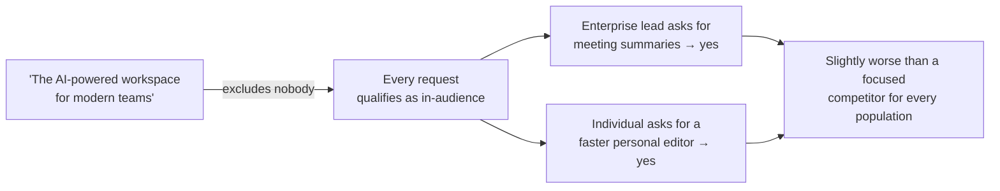
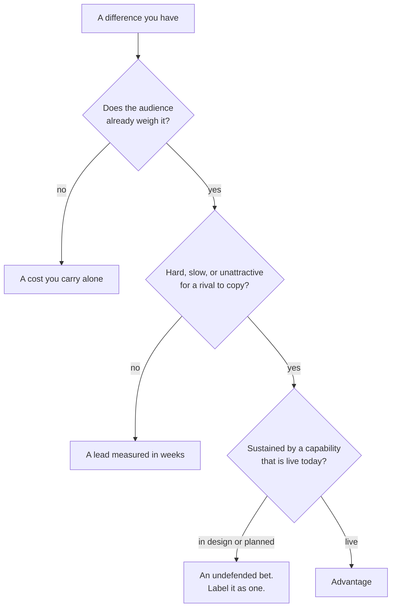

# ST-03 · Advantage and positioning choice

> Positioning becomes strategic when it commits to an audience, alternative,
> valued difference, and capability the company can sustain.

## Problem — the positioning that excludes nobody

A team runs a positioning workshop. The output is a sentence: "The AI-powered
workspace for modern teams that helps everyone do their best work." It is put on
the site, in the deck, and at the top of the roadmap document.

Two weeks later the product decisions have not changed at all. An enterprise
lead asks for meeting summaries and the team says yes, because enterprise leads
are modern teams. An individual user asks for a faster personal editor and the
team says yes, because individuals do their best work too. The sentence has
excluded nobody, so it cannot decline anything.

The failure is that the team treated positioning as a description of the product
rather than as a choice about who the product is for. A description can be
accurate and still carry no information, because information comes from what is
ruled out. And the failure is comfortable: the sentence tested well internally,
nobody had to tell a customer no, and no revenue was refused. The cost only
appears later, as a product that is slightly worse than a focused competitor for
every population it serves.

The cost arrives through a chain of individually sensible yeses:

No step in that chain is where the mistake happened. The mistake was the first
box, which was approved because it offended nobody.

Ask this: **which real customer request does this positioning tell us to
decline?** If the honest answer is none, you have written marketing copy.

## Concept — when a difference becomes an advantage

A positioning choice is strategic when it makes four commitments at once. Miss
one and it stops being able to decide anything.

| Commitment | The question | Failure when vague |
|---|---|---|
| **Audience** | Who specifically, defined by behaviour | Every request qualifies as in-audience |
| **Alternative** | What they would use instead, named | You compare against nothing and win by default |
| **Valued difference** | What is better, in terms that audience already cares about | You claim a difference the audience does not pay attention to |
| **Sustaining capability** | What in your company makes that difference hold | The difference is copied within a quarter and you have nothing left |

### Difference is not advantage

A difference becomes an advantage only when three things hold at once:

1. **Valued.** The audience already cares about this dimension. A difference on
   a dimension nobody weighs is a cost you carry alone.
2. **Hard to copy.** Not impossible — hard, or slow, or unattractive for a
   competitor to copy because copying it would damage something they rely on.
3. **Sustained by a real capability.** Something the company actually has today:
   accumulated data, a distribution channel, an operating model, deep domain
   knowledge, or a shipped technical asset.

Test the third one strictly. A capability that is in design or planned is a
statement of intent. Building a position on it means the position is currently
undefended, which can be a legitimate bet — but it must be labelled as one.

Run a candidate difference through all three gates in order. Only one exit is an
advantage; the other three are worth knowing about before you build on them:

Most positioning arguments never reach the third gate, because the first two are
answered by assertion.

### The giving-up test

Positioning that gives up nothing is not positioning. Make the sacrifice
concrete with three questions:

- Which population will now get a product that is *worse for them* than a
  focused competitor's?
- Which request type will be declined even when it arrives with revenue?
- Which capability will you deliberately not build, and for how long?

If you cannot answer all three, you have added an emphasis, not made a choice.

Both of these are positions for Noted. One of them can be used by an account
manager holding a request:

**Weak** — "Noted is the AI workspace for teams that need their documents to
stay useful."

Nobody is excluded, no alternative is named, and nothing is given up. An
enterprise lead and a free individual both read themselves into it.

**Strong** — "Noted is for small teams whose shared workspace is where paid
conversion already happens. Enterprise meeting-summary requests are handled at
the standard we set, not the standard they set, and the AI-first onboarding work
stays unbuilt this year."

One population, one declined request type with revenue attached, one capability
deliberately not built.

The strong version is disagreeable, which is the property that makes it usable.
It also states a sacrifice a colleague can carry into a conversation you are not
in.

### Giving up an audience is not the same as refusing their money

This distinction prevents most of the panic in this lesson. Giving up an
audience means: they no longer shape the roadmap, they are no longer the
population you optimize the core experience for, and their requests are handled
against the standard you set rather than the standard they set. Existing
contracts can continue. Support continues. What ends is their claim on your
direction.

### Boundary

Positioning is a commitment with a duration, not a permanent identity.

Two situations legitimately soften it. First, a genuinely early product may not
yet know which audience it serves. Holding two candidate audiences while you
test is honest, as long as the resource split is stated and time-boxed — "both,
until the end of the quarter, then one." What is dishonest is holding two
indefinitely and calling it focus.

Second, an audience can be a bridge. A population you do not intend to serve
long-term can still be the one that funds or teaches the product now. That is a
real strategy, and it has a specific requirement: name the condition under which
you leave. Without that condition, "bridge" becomes the story you tell yourself
about drifting.

The model also stops working when the four commitments are made at different
levels of abstraction. An audience defined tightly and an alternative defined
loosely produce a position that seems sharp and still cannot decline anything.

## Build — on Noted

Read `lessons/noted/case.md` if you have not already.

Take **Signal 3: P95 response time rose 34% for large workspaces.**

The details matter here. "Large" means more than 500 documents, which is about
4% of workspaces. Those workspaces hold a disproportionate share of paid seats.
No support tickets mention speed; the signal came from monitoring. Separately,
the case tells you that small teams are where most paid conversion happens
today, that individual knowledge workers are the largest population and mostly
free, and that the team collaboration environment is still in design.

Before you name a sustaining capability, check which ones Noted actually has.
The case separates them, and the separation decides whether your position is
defended or is a bet:

| Capability | Status in the case | A position built on it is |
|---|---|---|
| Personal document workspace with AI assistance | Live | Defended today |
| File storage and retrieval | Live | Defended today |
| Public publishing path | Live | Defended today |
| Team collaboration environment | In design | Undefended — label it a bet |
| Private draft-review workflow | Planned | An intention, not a position |
| AI-first onboarding | Planned | An intention, not a position |

Any position you write that leans on a row from the bottom half must say so in
the sentence, not in a footnote.

**Your task.** Make a positioning choice for Noted and commit to what you give
up.

1. Choose one audience from the three populations in the case. Define it by
   behaviour, not by label.
2. Name the specific alternative that audience uses today for this job. Include
   the option of doing nothing.
3. State the valued difference, in terms that audience already weighs. Say how
   you know they weigh it, or mark it `<unknown>`.
4. Name the capability that sustains the difference. Mark it live, in design, or
   planned, using the status table in the case. Do not blur the three.
5. State how long the difference would take a competitor to copy, or mark it
   `<unknown>`. Either way, say what would make copying unattractive to them —
   that part you can reason about without data.
6. Run the giving-up test. Name the population that now gets a worse product,
   the request type you will decline even with revenue attached, and the
   capability you will not build.
7. Decide what the large-workspace slowdown means under your position. It is a
   different kind of fact if your audience is the 4% holding paid seats than if
   it is the free majority.
8. Write the position as one sentence that could be disagreed with.

**Expect to be pushed on:** whether your valued difference is one any competent
competitor could copy in a quarter; whether your sustaining capability is
actually live rather than in design; and whether your sacrifice is real — you
will be asked what you would say to the account manager holding the enterprise
relationships.

### What a strong answer holds

- Defines one audience by observable behaviour and names the alternative that
  audience uses today, including doing nothing.
- States a valued difference and says how you know the audience weighs it, or
  marks that `<unknown>` rather than asserting it.
- Labels the sustaining capability live, in design, or planned using the case's
  status table, and calls any position that leans on the bottom half a bet in
  the sentence itself.
- Passes the giving-up test with three concrete answers: who gets a worse
  product, which request is declined even with revenue attached, and which
  capability stays unbuilt.
- Reads the large-workspace slowdown through the chosen position rather than as
  a separate problem, and ends in one sentence a colleague could disagree with.
- The most common weak move is naming a difference any competent competitor
  could copy in a quarter and calling it an advantage. A difference is only an
  advantage when it is valued, hard to copy, and sustained by something live
  today.

## Use — on your product

Take your product's current position, as it actually operates, not as it is
written on the site.

Answer five questions. Write `<unknown>` where you do not know.

1. Who is the audience, defined by behaviour you can observe?
2. What is the named alternative, and when did you last check what they actually
   use?
3. What is the valued difference, and what evidence says the audience weighs
   that dimension?
4. What capability sustains it, and is that capability live today?
5. Which population are you giving up, and what will you say the next time they
   ask for something with revenue attached?

## Ship — Positioning choice

Produce `artifacts/ST-03-positioning-choice.md` using the template in
`artifact.md`.

Write it for the people who will field requests without you: an account manager,
a support lead, a designer choosing a default. They should be able to read it and
decline something on their own, and know what to say when they do.

In your Product Decision Case, this is the artifact that converts the ST-02
chain into a commitment. The audience row of your hypothesis map and the audience
here must be the same population. If they are not, one of the two documents is
out of date.

## Carry forward

One committed audience, one named sacrifice, and a capability claim marked live
or aspirational. ST-04 turns that commitment into funding: the four Noted signals
stop being requests and start competing as portfolio bets against your
constraint.
