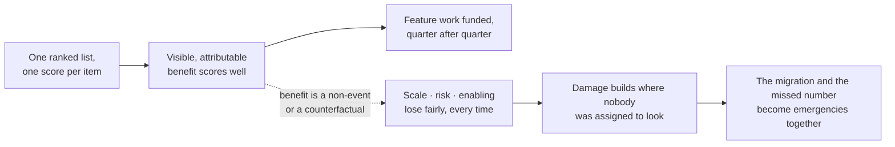
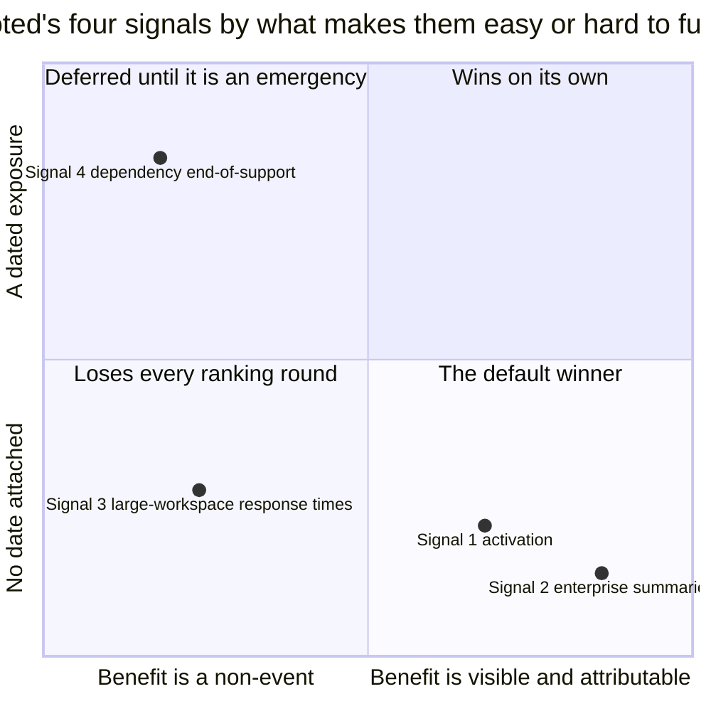

# ST-04 · Product bets and portfolio

> A healthy portfolio funds feature, growth, scale, risk, and enabling work
> according to the constraint — not politics or visibility.

## Problem — the work that loses every ranking round

A team ranks its work every quarter. Each item gets a score. The scores are
discussed, adjusted, and sorted. The top items are funded until capacity runs
out. This is disciplined, transparent, and repeatable.

After four quarters, look at what got funded. Almost all of it is feature work.
The infrastructure item never scores well, because its benefit is that nothing
gets worse. The migration keeps sliding, because its benefit is that a risk does
not land. The internal tooling work loses every time, because its benefit
arrives through other people's speed and shows up in no customer-facing number.
Nobody decided to defund this class of work. It lost fairly, item by item,
against a scoring system that rewards visible, attributable benefit.

This failure is invisible from inside because each individual decision was
defensible. The damage is structural: it accumulates in the parts of the system
that nobody was assigned to protect. And it arrives at the worst time — the
migration becomes urgent in the same quarter the growth number is missed, and
now both are emergencies.

Follow the mechanism rather than any single decision. A single scale rewards one
property — attributable benefit — and that property is unevenly distributed
across the kinds of work you have:

Nobody defunded the dotted branch. It lost item by item, which is why no meeting
exists where the decision could have been challenged.

Ask this: **what share of last quarter's capacity went to work whose success
looks like nothing happening?** If the answer is near zero four quarters
running, your ranking system is doing something other than what you think.

## Concept — five kinds of bet, one allocation

Product work is not one kind of thing being ranked. It is five kinds of bets,
and they cannot be compared on a single scale because they buy different things.

| Bet type | What it buys | Success looks like | Why it loses in a ranking system |
|---|---|---|---|
| **Feature** | New value for the audience you chose | Adoption and use of a new capability | It does not lose — it is the default winner |
| **Growth** | More of the right people reaching the value | Movement in acquisition, activation, or conversion | It competes well when attribution is clean |
| **Scale** | The existing product continuing to work as load grows | A number that does not get worse | The benefit is a non-event |
| **Risk** | Removal of an exposure that could stop you | Something bad does not happen | The benefit is counterfactual and unprovable |
| **Enabling** | Capability the team does not have yet, or leverage for future work | Other work becomes cheaper or possible | The benefit is indirect and lands in someone else's numbers |

### Allocation follows the diagnosis

A portfolio is a set of proportions, not a sorted list. The proportions should
come from your binding constraint.

- If the constraint is that the chosen audience never reaches value, growth and
  feature work carry the weight.
- If the constraint is that the product degrades exactly where value is
  captured, scale work carries it, even though scale work is invisible.
- If the constraint is that an exposure could remove your ability to act at all,
  risk work carries it, and it does so first.

There is no correct universal ratio. There is a correct ratio *given a
diagnosis*, and the way to check it is to read your allocation back and ask
whether a stranger could infer your diagnosis from it. If they would infer a
different constraint than the one you wrote in ST-01, your strategy and your
funding disagree, and the funding is the one that is real.

Noted's four signals do not compete evenly, and the reason has little to do with
their importance. Placing them on the two properties that decide ranking
outcomes makes the distortion visible:

The horizontal position is a property of the bet type, not of the value at
stake. Signal 3 sits on the left because a response time that stops getting
worse produces no number anyone can point at, and Signal 4 sits high because ten
weeks is a date. Neither position says the work matters more. Your allocation
has to come from the constraint, against the pull this chart describes.

### Sizing a risk bet

Risk bets are the hardest to size honestly, because both over- and
under-investment feel responsible. Use three questions:

1. **What is the exposure, and when does it become live?** A date, not a mood.
2. **What is the cost if it lands?** Distinguish immediate breakage from a
   slower accumulation such as unpatched security exposure.
3. **What is the smallest action that removes the exposure, and what does the
   larger action buy beyond that?**

A risk bet that cannot answer the third question is usually anxiety with a
budget attached.

### Every bet has to name what it displaces

A funded bet is only a decision when you can say what it pushed out. In a
portfolio with fixed capacity, "we will also do X" is not a decision; it is a
statement that the capacity number was wrong.

### Boundary

Two things break portfolio reasoning.

**Capacity is not fungible.** The portfolio model assumes you can move a share
of capacity from one bet to another. Often you cannot. The two engineers who can
do a platform migration may be the only two who can, and shifting them onto
growth work does not convert into growth output. When capacity is specialized,
allocate by the specific people or teams that hold each capability, and say so.
A percentage split across a team that cannot actually be reassigned is a
fiction that reads as rigor.

**A hard deadline is not a bet.** If work must be complete by a fixed external
date, it is a constraint on the portfolio, not a competitor within it. Treat it
as capacity removed before allocation begins, then allocate what remains. The
error is putting a dated obligation into a ranking exercise and feeling
principled when it wins.

Finally, a portfolio does not tell you the order to do things in. Two portfolios
with identical proportions can have very different risk profiles depending on
sequence, which is the next lesson's problem.

## Build — on Noted

Read `lessons/noted/case.md` if you have not already.

This lesson uses all four Noted signals at once. That is the point: until they
are typed as bets and funded against a constraint, they are four requests that
each look reasonable.

Recall the four:

1. Activation fell 11% over six weeks; unsegmented; two changes shipped in the
   window.
2. Three enterprise customers asked for automated meeting summaries; one
   account manager; roughly 20% of revenue; underlying claim untested.
3. P95 response time rose 34% for large workspaces; more than 500 documents;
   about 4% of workspaces; disproportionate share of paid seats; no support
   tickets.
4. A core dependency loses support in 10 weeks; migration estimated at three to
   five weeks with wide uncertainty; nothing breaks immediately, but security
   patches stop.

An allocation is a decision only when it names what each funded bet pushed out.
Compare two versions of the same portfolio:

**Weak** — "Fund all four. The migration runs alongside the feature work, and we
will pick up response times if there is room."

Nothing was displaced, so nothing was decided. "Alongside" and "if there is
room" are both claims that the capacity number was wrong.

**Strong** — "The risk bet takes the first share, sized as the smallest
migration that removes the exposure before support ends. Scale is funded because
of the paid-seat concentration inside the 4%, not because of the 4%. Enterprise
summaries are funded at zero this cycle, and that displaces the account
manager's next request."

Every bet names what it cost something else. A stranger can infer the
constraint from the shares.

The second version can be argued with, and that is the point: it tells you which
belief to attack if the cycle goes badly.

**Your task.** Build one cycle's portfolio.

1. Assign each of the four signals a bet type. For Signal 4, decide first
   whether it is a risk bet inside the portfolio or a hard constraint removed
   before allocation begins — the case says nothing breaks immediately, and the
   Boundary above turns on that. Then say precisely what exposure the migration
   removes and what it does not remove.
2. For each, state what the bet buys, in terms of your ST-01 constraint and your
   ST-03 audience.
3. For each, state what evidence justifies funding it — and what evidence you
   would need but do not have.
4. Size the risk bet using the three questions. Name the smallest action that
   removes the exposure, and what the larger version buys beyond that.
5. Decide whether any of the four should be funded at zero this cycle. At least
   one probably should. Say which and why.
6. Allocate capacity as shares. Do not leave anything at "as needed."
7. Name what falls out. For each funded bet, one thing it displaced.
8. Read your allocation back. What constraint would a stranger infer from it?
   If it is not the one you wrote in ST-01, fix one of the two documents now.

**Expect to be pushed on:** whether the enterprise request won capacity because
of evidence or because of contract size; whether your scale bet is justified by
the 4% figure or by the paid-seat concentration inside it, which are different
arguments; and whether the migration was sized by analysis or by the discomfort
of the ten-week number.

### What a strong answer holds

- Types each signal as a bet, and decides whether the ten-week dependency is a
  risk bet inside the portfolio or a constraint removed before allocation —
  using the fact that nothing breaks immediately, not the discomfort of the date.
- Sizes the risk bet by the smallest action that removes the exposure, and says
  what the larger version buys beyond that.
- If it funds the scale bet, funds it on the paid-seat concentration inside the
  4%, not on the 4% itself — and says which argument it is using.
- Allocates every share, funds at least one signal at zero, and names one thing
  each funded bet displaced.
- Reads the allocation back and checks that a stranger would infer the ST-01
  constraint from it.
- The most common weak move is funding the enterprise request because of
  contract size. Roughly 20% of revenue is a fact about consequence, not about
  evidence; the underlying claim is untested and the three requests share one
  channel.

## Use — on your product

Take your current cycle, as it is actually staffed, not as it was planned.

Answer five questions. Write `<unknown>` rather than estimating.

1. What share of current capacity sits in each of the five bet types?
2. Which bet type has received near zero for three cycles or more?
3. What constraint would a stranger infer from your allocation, and does it
   match your stated strategy?
4. Which of your funded items cannot name the thing it displaced?
5. Where is capacity specialized, so that a percentage reallocation would not
   actually convert into output?

## Ship — Product bet portfolio

Produce `artifacts/ST-04-product-bet-portfolio.md` using the template in
`artifact.md`.

Write it for the person who has to defend this allocation when a new request
arrives mid-cycle — often a lead who is not you. They should be able to point at
the shares, name what the new request would displace, and make the trade-off
without reopening the strategy.

In your Product Decision Case, this artifact is where the diagnosis becomes
money and time. It is also the easiest place to catch yourself: allocations
reveal beliefs that documents hide.

## Carry forward

A typed, sized, and allocated portfolio with named displacements. ST-05 attacks
the part a portfolio cannot express: the order. You will sequence these bets to
retire the most decision-relevant uncertainty first while keeping later options
open.
