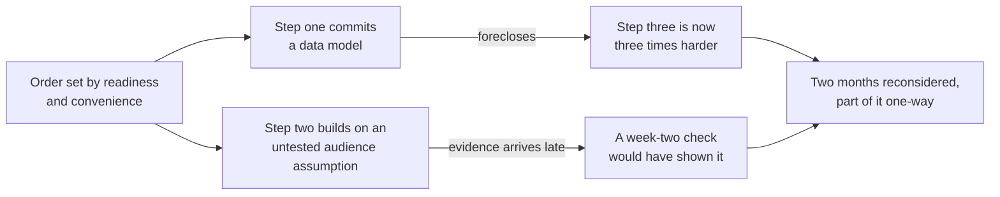
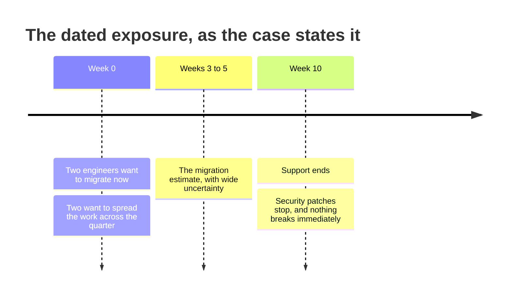

# ST-05 · Strategic sequencing and options

> Sequence should retire the most decision-relevant uncertainty while preserving
> future options.

## Problem — the ordering nobody experienced as a decision

A team agrees on its bets and then orders them the way most teams do: easiest
first, or most requested first, or in the order the work became ready.

The first two months look productive. Then the third bet starts and the team
discovers that a data model chosen in month one makes it three times harder. A
week later, evidence arrives showing the audience assumption behind bet two was
wrong — evidence that could have been collected in week two for almost nothing.
Two months of work now has to be reconsidered, and one part of it cannot be
undone at a price anyone will pay.

Nothing here was a bad decision in isolation. The ordering was the decision, and
nobody experienced it as one. Sequence feels like scheduling, which feels like a
delivery concern, so it gets settled by readiness and convenience. But the order
determines what you know when you make each commitment, and it determines which
commitments are still available later. Those are strategic properties, and they
are decided by default when nobody decides them on purpose.

Two separate costs come out of the same choice, and neither is visible while the
order is being set:

The upper branch is a foreclosed option. The lower branch is information that
arrived after the commitment it should have informed. Sequence decides both.

Ask this: **what will we know after step one that we do not know now, and would
it change step two?** If step one produces nothing that could change step two,
the ordering was chosen for a reason that has nothing to do with strategy.

## Concept — order by uncertainty retired and doors closed

Sequence is decided by two criteria in tension.

**Criterion one: retire the most decision-relevant uncertainty first.**

Uncertainty is decision-relevant when different resolutions lead to different
next moves. Large uncertainty is not the same as decision-relevant uncertainty.
A team can be very unsure about something that would not change any action, and
quite confident about something that changes everything.

| Uncertainty | Size | Decision-relevant? |
|---|---|---|
| Exactly how much a slowdown annoys users | Large | Only if the answer would change whether you fix it |
| Whether the audience you committed to has the problem at all | Moderate | Yes — a false answer invalidates the position |
| Which of two implementations is faster | Moderate | Rarely at strategy level; usually an execution choice |

**Criterion two: do not foreclose options you may need.**

Some moves close doors. A data model, a pricing structure, a public commitment,
a platform choice, a hire. The cost is not the work itself; it is what becomes
unavailable afterwards. Classify each step:

| Move type | Property | Sequencing implication |
|---|---|---|
| **Reversible** | Can be undone at low cost | Can go early; low information cost to being wrong |
| **Costly to reverse** | Undoing is possible and expensive | Prefer to place after the uncertainty it depends on is retired |
| **One-way** | Practically cannot be undone | Place last, or place after the discriminating evidence exists |

### Options are not free

"Preserve optionality" is the most respectable way to avoid choosing. Keeping an
option open has a carrying cost: extra abstraction, delayed learning, a team
that cannot specialize, and a product that reads as unfinished to every
audience. State the carrying cost of each option you keep. If you cannot name a
condition under which you would actually exercise the option, it is not an
option — it is an unresolved decision with a better name.

Both of these keep the same door open on Noted. Only one of them is an option:

**Weak** — "We keep the option open to become a team-first product, since team
collaboration is already in design."

No cost, no exercise condition, no expiry. This sentence will still be true, and
still unexercised, in four quarters.

**Strong** — "We hold the team-first path open. It costs us a generic document
model, which slows every personal-workspace change while we hold it. We exercise
it if paid conversion in small teams stops responding to personal-workspace
work; we drop it at the end of the cycle if that has not happened."

A cost, a trigger, and an expiry. Someone other than you could tell whether it
is still worth holding.

The difference is not caution. The weak version defers a decision and calls the
deferral a strategy.

### Dated exposures compress everything

A hard external date does not change the sequence logic, but it removes slack.
Work backwards: latest start = date minus the pessimistic estimate minus the
time you would need to react if the estimate is wrong. Compare that with your
plan. When the latest start is already behind you, the sequencing question is
over and the only remaining question is what gets cut.

### Boundary

Sequencing produces value only when you can observe a result before the next
commitment. If step one's outcome will not be visible until after step two has
started, ordering them gives you no information benefit — you have split work,
not sequenced it. Check the observation lag before claiming a learning sequence.

Option preservation also stops being useful in two cases. First, when there is
no realistic path to exercising the option: an option nobody has the capacity or
appetite to take is a permanent cost. Second, when delay is itself the dominant
risk. Under a dated exposure or a fast-moving competitive situation, a slower
sequence that keeps three options open can be worse than a faster one that keeps
one — because the thing you were protecting expires while you protect it.

## Build — on Noted

Read `lessons/noted/case.md` if you have not already.

Take **Signal 4: a core dependency loses support in 10 weeks**, and sequence it
against the portfolio you allocated in ST-04.

What the case gives you: engineering estimates the migration at three to five weeks, with
wide uncertainty. Two engineers want to migrate now. Two want to spread the work
across the quarter. After end-of-support, security patches stop. Nothing breaks
immediately.

Laid against the clock, those facts are all you have:

The timeline deliberately carries no latest-start marker. Deriving one — and
deciding how much reaction time you need if the three-to-five week estimate is
wrong — is step 4 of your task, and the arithmetic is the argument.

**Your task.** Produce a sequence for this cycle.

1. List every uncertainty currently sitting under your portfolio. For each, say
   what you would do differently under two different resolutions. Cross out the
   ones where the answer is "nothing."
2. Rank the survivors by decision relevance, not by size.
3. Classify each bet in your portfolio as reversible, costly to reverse, or
   one-way. Name at least one step that forecloses something.
4. Work backwards from the ten-week date using the pessimistic estimate. State
   the latest start date for the migration and show the arithmetic, including
   reaction time if the estimate is wrong.
5. Decide the migration question: complete it now, or spread it across the
   quarter. Defend the choice with the option and exposure logic, not with team
   preference.
6. Write the sequence as ordered steps. For each step, state what you will know
   at the end of it, and which later step that knowledge could change.
7. Check the observation lag on every claimed learning step. If the result is
   not visible before the next commitment, say so and either move it or drop the
   learning claim.
8. Name each option you are deliberately keeping open, its carrying cost, and
   the condition under which you would exercise it.

**Expect to be pushed on:** whether "spread the work" is a sequencing argument
or a way to avoid saying what gets cut; whether your first step produces
observable information in time to matter; and whether any option you kept open
has a real exercise path or is an unresolved decision in disguise.

### What a strong answer holds

- Lists the uncertainties, crosses out every one where both resolutions lead to
  the same action, and ranks the survivors by decision relevance rather than by
  size.
- Classifies each bet as reversible, costly to reverse, or one-way, and names at
  least one step that forecloses something specific.
- Shows the latest-start arithmetic from the ten-week date, the five-week
  pessimistic estimate, and a stated reaction time — and lets that arithmetic,
  not the engineers' split preference, decide now-versus-spread.
- States for each step what will be known at its end and which later step that
  knowledge could change, and checks the result is visible before the next
  commitment.
- Gives every option kept open a carrying cost, an exercise condition, and an
  expiry.
- The most common weak move is "spread the work across the quarter" with nothing
  cut. It is not a sequence; it is a refusal to say which bet loses the weeks
  the migration needs.

## Use — on your product

Take the next two or three commitments on your own product.

Answer four questions. Write `<unknown>` for gaps rather than estimating.

1. What will you know after the first commitment that you do not know now, and
   would it change the second?
2. Which of these commitments is one-way, and what does it foreclose?
3. What dated exposures exist, and what is the latest start date implied by each
   using pessimistic estimates?
4. Which option are you keeping open, what does keeping it cost you each week,
   and what would make you exercise it?

## Ship — Strategic sequence

Produce `artifacts/ST-05-strategic-sequence.md` using the template in
`artifact.md`.

Write it for a delivery lead who has to hold the order when something urgent
arrives. They should be able to see which steps can move without damage and
which ones cannot, and why.

In your Product Decision Case, this artifact adds time to the portfolio. It is
also the record that tells a later reviewer whether a bad outcome came from a
bad bet or from a bad order.

## Carry forward

An ordered sequence with named foreclosures, checkpoint learning, and the
carrying cost of each option held open. ST-06 turns the diagnosis, the position,
the portfolio, and this sequence into one narrative another team can act on
without you, along with the triggers that would force the whole strategy to be
revised.
