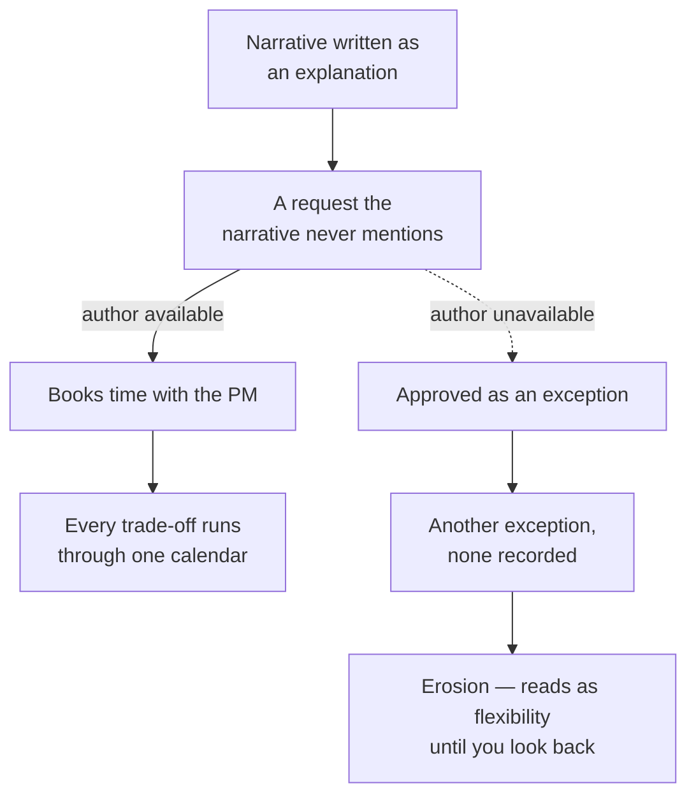
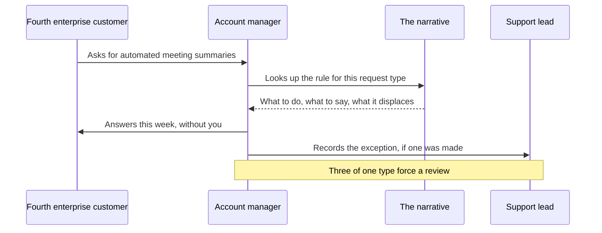

# ST-06 · Strategy communication and revision

> Strategy is useful when another team can make a trade-off from it and knows
> which evidence should trigger revision.

## Problem — the strategy that runs through one person

A PM finishes a strategy document that is genuinely good. It has a diagnosis, a
committed audience, an allocation, and a sequence. It is presented. People
listen, and several say it is the clearest thing they have read all year.

Then watch what happens over the next month. An account manager gets a request
and books time with the PM to ask how to answer it. A designer picks a default
and checks with the PM. An engineer proposes an optimization and asks whether it
fits the strategy. Every trade-off routes back through one calendar. The
strategy was communicated and understood, and it still is not being used,
because it was written as an explanation rather than as something a stranger can
act from.

The second failure is slower. Six weeks in, the market moves, or an assumption
turns out to be false, and the strategy quietly bends. A request gets approved
as an exception. Then another. Nobody revises anything, because nothing in the
document said what would count as a reason to. Erosion looks like flexibility
while it is happening and looks like never having had a strategy when you look
back.

The two failures share a starting point. A narrative written as an explanation
sends every uncovered case back to its author — and when the author is
unavailable, the same case leaves as an unrecorded exception:

Both branches leave the document intact and unused. The fix is not clearer
writing; it is decision rules, stated limits, and a place for the cases the
narrative does not cover.

Ask this: **the last time someone made a trade-off using our strategy without
asking me, what did they decide?** If you cannot name an instance, the strategy
is running through you, and it stops when you do.

## Concept — decision rules, stated limits, revision triggers

A strategy narrative is usable when a reader who was not in the room can do
three things.

| Capability | The test | What is missing when it fails |
|---|---|---|
| **Reconstruct** | Explain in their own words why this choice, not the alternative | The reasoning was replaced by conclusions |
| **Apply** | Resolve a trade-off the narrative never mentions | Decision rules and the sacrifice are missing |
| **Know its limits** | Say when the strategy does not cover their case, and where to route it | The narrative claims completeness it does not have |

### The absent-author test

Give the narrative to a colleague with a real, current request. Do not explain
anything. Ask them two questions: what would you do, and why. If they reach a
defensible decision and can state the reason without using a slogan, the
narrative works. If they reach the right answer but cannot say why, they are
guessing your preference — and they will guess wrong on the next case, which
will look different.

### What a usable narrative contains

1. **The diagnosis**, stated so a reader could disagree with it.
2. **The choice and the sacrifice**, including who now gets a worse product.
3. **Why this beats the strongest alternative** — argued fairly, not against a
   weak version.
4. **What it means for each function** that has to act on it.
5. **Decision rules** for the two or three trade-offs that recur.
6. **What is not covered**, and where those cases go.
7. **Revision triggers.**

Points 5, 6 and 7 are what most strategy documents omit, and they are the ones
that determine whether the document is used.

Here is the same quarter written as a goal list and as a narrative. Read both
while holding one real request — a fourth enterprise customer asking for
automated meeting summaries:

**Weak** — "Goals this quarter: lift activation, keep large-workspace response
times from degrading, complete the dependency migration, grow enterprise
revenue. Owners assigned."

Every goal is live, and the request advances one of them. The account manager
cannot decline it and cannot approve it, so the request routes back to you.

**Strong** — "We serve small teams, because that is where paid conversion
happens today. Rule: a request that serves only enterprise leads is declined
this cycle, with the reason given, and what it displaced is recorded. Not
covered: requests that serve both. Those go to the support lead."

A trade-off the narrative never mentioned can now be resolved by someone who was
not in the room, and they can say why.

The goal list is not less clear. It is less usable, because clarity about
targets carries no instruction about what to refuse.

### Revision triggers, and the difference from erosion

A revision trigger has four parts: an **observable**, a **threshold**, an
**owner who would see it first**, and a **pre-agreed response**. The response
matters. "We will revisit" is not a response; "we reopen the positioning choice"
and "we reallocate the scale bet" are.

Triggers come in three kinds:

| Kind | What changed | Typical response |
|---|---|---|
| **Falsified hypothesis** | A hypothesis in the chain turned out to be wrong | Revise the affected part; check what else depended on it |
| **Changed constraint** | The binding constraint moved or was relieved | Redo the diagnosis; the portfolio follows |
| **Expiry** | The stated duration or condition ran out | Re-decide deliberately, even if you re-decide the same way |

Revision is explicit, dated, and recorded. Erosion is a series of exceptions
that nobody records. The practical defence is a rule agreed in advance: an
exception is allowed, and it must be written down with what it displaced. Three
exceptions of the same type are not exceptions — they are evidence that the
strategy is wrong or that the rule is wrong, and either way it forces a review.

Only one thing must also be checked before a trigger is written: whether the
observable is actually measurable with the instrumentation you have. A threshold
on a number you cannot produce is decoration.

### Boundary

Communication cannot repair a strategy that has no diagnosis. A clear narrative
built on an aspiration spreads a bad choice faster and makes it harder to
dislodge, because now many people can repeat it. If the absent-author test fails
because readers reach confident but contradictory conclusions, the problem is
usually upstream, in ST-01, not in the writing.

Decision rules also break outside the cases they were designed for. A rule that
says "decline requests that serve only enterprise leads" will wrongly kill a
request that mostly serves your committed audience and happens to arrive from an
enterprise account. This is why point 6 exists: a narrative must say what it
does not cover and name where those cases go. Rules applied confidently outside
their range do more damage than no rules, because they carry your authority
without your judgment.

## Build — on Noted

Read `lessons/noted/case.md` if you have not already.

Take **Signal 2: the enterprise request for automated meeting summaries** — and
make it a test of your narrative rather than a decision you make again.

The situation to write for: you are unavailable for two weeks. A fourth
enterprise customer asks the account manager for automated meeting summaries.
The account manager has to answer this week. The support lead is being asked by
two small-team customers for something related. Nobody can reach you.

That situation is a handoff, not a document review. Your narrative has to carry
the decision across these steps with you absent from all of them:

Every arrow that has to become a message to you is a place the narrative failed.
Write it so the second and third arrows resolve inside the document.

**Your task.** Write the strategy narrative, then test it against that
situation.

1. Write the diagnosis, the position, the sacrifice, and the allocation in a
   form a non-PM can read once and restate.
2. Argue the strongest alternative fairly, then say why you rejected it.
3. Write what the strategy means for three functions: an account manager, a
   support lead, and an engineer.
4. Write two or three decision rules for the trade-offs that will recur. Each
   rule must say what to do, what to say, and what it displaces.
5. Write what the strategy does not cover, and where those cases go while you
   are unavailable.
6. Write revision triggers with all four parts: observable, threshold, owner,
   pre-agreed response. Include at least one falsified-hypothesis trigger taken
   from your ST-02 chain, and one expiry trigger from your ST-03 position.
7. Check each trigger against the instrumentation described in the case. Actor
   identity is missing for about 18% of events, and meeting type is not captured
   at all. If a trigger cannot be measured, change the observable or state
   plainly that the trigger depends on instrumentation that does not exist.
8. Write the exception rule: who may make an exception, what they must record,
   and how many exceptions of one type force a review.
9. Run the absent-author test on the account-manager situation. Write the answer
   you believe they would give, and the reason. If the reason is a slogan, the
   narrative is not finished.

**Expect to be pushed on:** whether your decision rules can be applied by
someone who was not in the room; whether your thresholds are measurable given
the known analytics gaps; and whether your exception rule actually prevents
erosion or just documents it.

### What a strong answer holds

- Writes the diagnosis, position, sacrifice, and allocation so a non-PM can
  restate them, and argues the strongest alternative fairly before rejecting it.
- Gives each decision rule three parts — what to do, what to say, what it
  displaces — and shows a rule resolving the fourth enterprise request with you
  absent.
- Says what the narrative does not cover and where those cases go, so a request
  that serves both populations is not killed by a rule written for one.
- Writes revision triggers with an observable, a threshold, an owner, and a
  pre-agreed response, and changes or flags any trigger whose observable depends
  on meeting type or on complete actor identity.
- Sets an exception rule with a recording requirement and a count that forces a
  review.
- The most common weak move is a threshold on a number Noted cannot produce. A
  trigger that cannot fire is decoration, and the strategy erodes exactly as if
  it had none.

## Use — on your product

Take your own strategy, in whatever state it currently exists.

Answer five questions. Write `<unknown>` rather than filling gaps with
intentions.

1. Name the last trade-off someone resolved using your strategy without asking
   you. What did they decide, and why?
2. Which two trade-offs recur, and what rule would settle them?
3. What does your strategy not cover, and where do those cases go today?
4. For each of your top two hypotheses, what observable and threshold would tell
   you it is false, and can you actually measure it?
5. How many exceptions have been made in the last quarter, and were they
   recorded anywhere?

## Ship — Strategy narrative

Produce `artifacts/ST-06-strategy-narrative.md` using the template in
`artifact.md`.

Write it for the person who has to make a decision this week without you: an
account manager holding a request, a support lead answering a customer, an
engineer choosing between two paths. Not for an executive review, and not for
your own record.

In your Product Decision Case, this is the artifact that makes the previous five
usable by other people. If the narrative and any earlier artifact disagree, the
narrative is wrong — it is downstream of the diagnosis, not a replacement for
it.

## Carry forward

A narrative another team can act from, with decision rules, stated limits, and
revision triggers that are measurable. TJ-01 moves underneath the strategy: you
will build enough technical abstraction to see where system boundaries make some
of these strategic choices cheap and others expensive, starting with the ones
your narrative just committed to.
