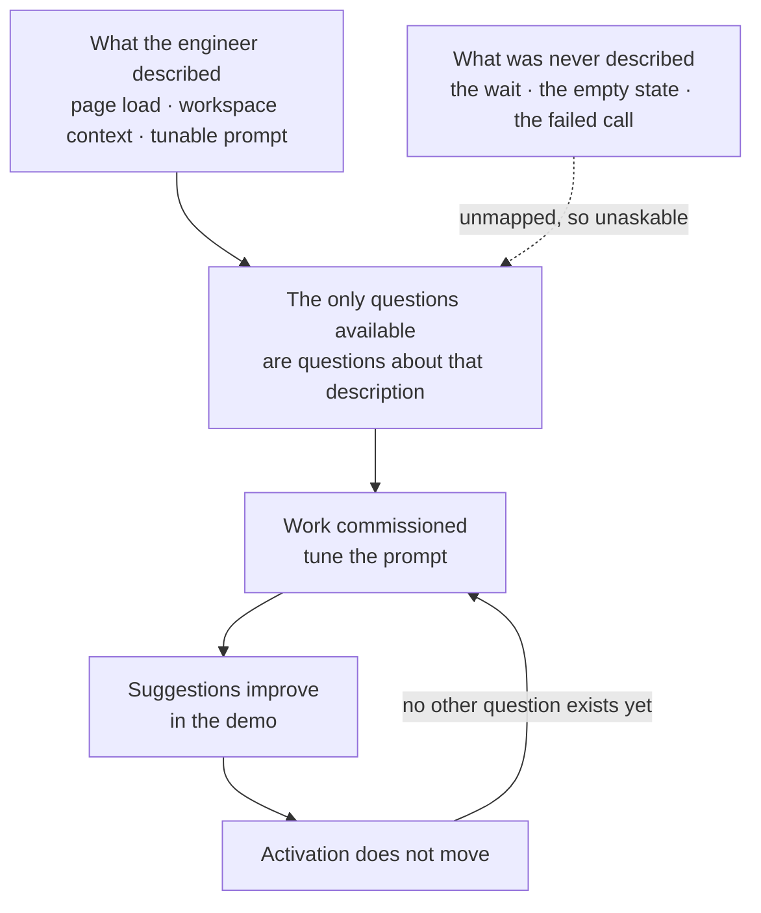
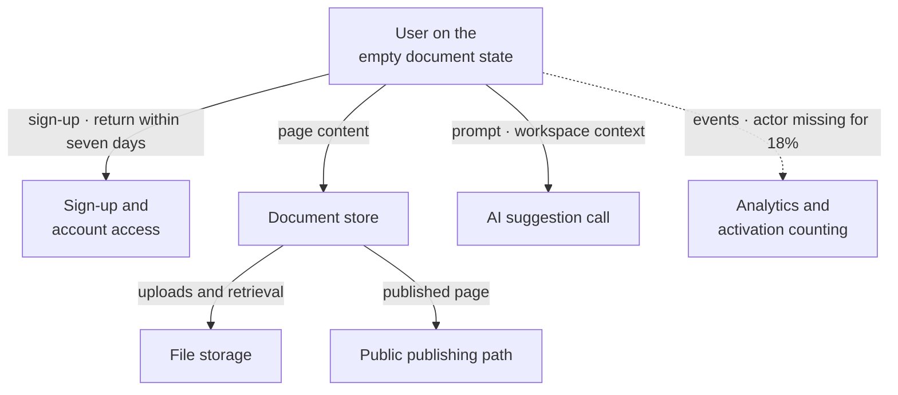

# TJ-01 · Technical abstraction without ignorance

> A PM should understand boundaries, failure modes, constraints, and
> consequences deeply enough to ask better product questions.

## Problem — the questions you cannot ask without a map

A PM sits in a review about the AI suggestion that appears on an empty
document. An engineer says the suggestion is generated when the page loads,
using context from the workspace, and that the prompt can be tuned. The PM
writes "tune prompt" in their notes and moves on.

Two weeks later the suggestions are better. In the demo they are clearly
better. Activation has not moved. Nobody in the room can explain why, so the
team schedules more prompt work.

The question nobody asked was not a technical question. It was this: what does
the user see between the moment the page loads and the moment the suggestion
arrives — and what do they see if it never arrives? The PM did not ask it
because they had no picture of where the work left one owner's control and
entered another's. Without that picture, the only questions available are
questions about the thing that was just described to you.

There is a second version of this failure that looks like its opposite. A PM
reads about caching, decides the suggestion should be cached, and says so in
the review. The engineers now spend the meeting explaining why that will not
work. Both PMs failed the same way. Neither had a map. One stayed silent
because they had nothing to say. One spoke because they had borrowed something
to say. A map would have produced a real question instead.

The loop below is what makes this durable. The description you were given
becomes the boundary of what you can ask, so the work that gets commissioned is
always work on the part somebody already explained:

Ask yourself, for the feature you are shipping this month: can you draw the
path from the user's action to the response, and mark three places where the
work changes hands? If you cannot, you are reasoning from a picture the team
does not share.

## Concept — own the consequence, not the mechanism

A system has layers. Authority is not the same on every layer.

| Layer | The question it answers | Who holds authority |
|---|---|---|
| **Mechanism** | How is this built | Specialist |
| **Boundary** | Where does the work change hands, and what crosses | Shared — you must be able to draw it |
| **Failure mode** | What does the user experience when this part fails | Product |
| **Constraint** | What is fixed, what was chosen, and by whom | Shared — you must know which is which |
| **Consequence** | Who pays, in what currency, and is that acceptable | Product |

The line that runs through this whole phase sits between rows one and five.
**You do not need to know how a thing is built to own what happens when it
breaks.** Mechanism is not your authority. Consequence is not theirs to decide
alone.

Four things you must be able to state about any system your product depends
on.

1. **Boundaries.** Where does a request leave one component and enter another?
   Every boundary is a place where something can be slow, fail, return
   something useless, or return something it should not have returned. Count
   the boundaries and you have counted the failure modes.
2. **Failure modes.** For each boundary, name three: it is slow, it fails, it
   succeeds but the answer is wrong. Then name what the user sees in each case,
   and who finds out. A failure nobody detects is worse than a loud one.
3. **Constraints.** Some limits are laws — physics, a vendor's rate limit, a
   regulation. Some limits are decisions somebody made and can unmake. When an
   engineer says "we can't do that," your first job is to establish which kind
   of limit you just hit, and what it costs to move it.
4. **Consequences.** Every technical property lands on somebody: a user waiting,
   a support lead answering, an engineer on call at night, a bill that grows
   with usage. Name who holds each one.

Here is that map drawn for Noted, using only the components the case actually
names as live. The boxes are components. The arrows are boundaries, and each
one is labelled with what crosses it. This sketch is the anchor for the rest of
the phase — TJ-02 moves cost across these arrows, and TJ-05 opens the AI box:

Notice what the diagram does not carry: an owner on any interface. The case
names an engineering lead who holds repository workflow and technical
standards, and it does not say who owns any single component. Every owner label
on that sketch is therefore `<unknown>` until an engineer fills it in, and the
emptiness is the finding, not a gap in the drawing. The measurement path is
dashed for the same reason — it is the one boundary where the case tells you
the crossing is already lossy.

The output of this thinking is a sketch, not a specification. A sketch you
drew from outside the code is a **hypothesis**. Take it to an engineer, ask
them to correct it, and record what changed. The corrections are the most
valuable part. They tell you exactly where your model of the product was
wrong, which is where your product decisions were also wrong.

Good questions from this map sound like consequence questions, not
instructions. Both of the questions below are about the same boundary — the AI
suggestion call on Noted's empty document state — and only one of them can
change what you do:

**Weak** — "Can we cache the AI suggestion so it appears faster?"

This names a mechanism you cannot see inside. The engineers will spend the
meeting explaining why it does not work, and you will leave knowing nothing
about the user. It is also unfalsifiable as a product question: no answer
changes your position on the activation decline.

**Strong** — "What does a user on the empty document state see between the page
loading and the suggestion arriving, and what do they see if it never arrives?"

This names a consequence you own. A slow or silent empty state is a candidate
mechanism for the decline; a suggestion that arrives instantly is not. Either
answer removes a boundary from your list or promotes it.

The difference is not politeness. The weak question borrows an implementation
and hands it back as an instruction. The strong one stays on your side of the
boundary and still constrains the decision.

### Boundary

Abstraction without ignorance stops working when **the mechanism is the
product decision**.

Suppose one way of generating a summary returns in under a second but can only
read the twenty most recent notes, and another reads the whole workspace but
takes fifteen seconds. There is no product-level abstraction that hides this.
The mechanism sets what you are allowed to promise the user. Handing that
choice to engineering as "an implementation detail" is not respect for
specialist authority. It is a product decision left unowned.

The test: if two implementations would let you make different promises to the
user, the choice between them is yours to be part of. If they would let you
make the same promise, it is not.

There is a limit on the other side too. A sketch that names components,
boundaries, and failures is useful. A sketch that names the caching strategy,
the database, or the queue technology is you doing someone else's job with
less information than they have. Stop at the boundary. Do not cross it and
start drawing what is inside the box.

## Build — on Noted

Read `lessons/noted/case.md` if you have not already.

Take **Signal 1: activation fell 11% over six weeks.**

Activation is defined as creating a document and returning within seven days.
Two changes shipped during the window: a revised signup flow and a new
AI-suggestion prompt on the empty document state. The case does not describe
Noted's architecture. That is deliberate. You are going to draw a sketch from
outside and mark what you do not know.

**Your task.** Produce a system boundary sketch for the path that produces the
activation number.

1. Write the path as ordered steps, from the user arriving to the moment the
   activation event is counted. Include the measurement steps. The event
   pipeline is part of this system.
2. Mark every boundary where work changes hands. For each, name what crosses
   it and who owns each side. Where you are guessing, write `<unknown>` beside
   it rather than a confident label.
3. For three boundaries, name what the user sees when the far side is slow,
   when it fails, and when it returns something useless. Only count things a
   user could actually notice.
4. Note the measurement failure separately. Actor identity is missing for
   about 18% of events. State plainly what that does to the activation number
   and to any claim you could make from it.
5. Separate fixed constraints from chosen ones. You will find you cannot do
   this for most of them yet. Write down which ones you cannot classify, and
   who could tell you.
6. Commit to a position. Name the one boundary you believe is most likely
   involved in the 11% decline, and write the single question you would ask
   engineering about it. The question must be about consequence. If it names a
   solution, rewrite it.

Steps two and three fill a grid. Here is the shape, seeded from the diagram in
the Concept section, with the cells the case cannot fill left honest:

| Boundary | What crosses it | Owner on the far side | User sees when it is slow | User sees when it fails | User sees when it returns something useless |
|---|---|---|---|---|---|
| User → sign-up and account access | sign-up, and the return visit that counts as activation | `<unknown>` | `<unknown>` | `<unknown>` | `<unknown>` |
| User → AI suggestion call | the prompt and workspace context | `<unknown>` | `<unknown>` | `<unknown>` | `<unknown>` |
| User → document store | page content | `<unknown>` | `<unknown>` | `<unknown>` | `<unknown>` |
| User → analytics | events, with actor identity missing for about 18% | `<unknown>` | nothing — only a dashboard notices | nothing — only a dashboard notices | nothing — the number is wrong and nobody sees it |

Fill the last three columns yourself, and add any boundary you believe exists
that the diagram omits. If you add one, say what evidence in the case implies
it. A row you invented is worse than a row you left empty. The analytics row
is filled in for you because it is the one boundary where the case already
tells you the answer: the user never sees this boundary fail. That is what
makes it dangerous.

**Expect to be pushed on:** whether your sketch contains components you
invented rather than inferred, whether your failure modes are things a user
could see or things only a dashboard could see, and whether your question to
engineering is an instruction in disguise.

### What a strong answer holds

- An ordered path that includes the measurement steps — the event and the
  activation count — not only what the user sees. The number is produced by
  the system, and the system can be wrong about it.
- Owners marked `<unknown>` wherever the case is silent, each with the name of
  the person who could fill it in. No component appears that the case does not
  imply.
- Failure modes stated as things a user could notice — a wait, a blank state,
  a suggestion that does not fit — kept separate from failures only a dashboard
  sees.
- A plain statement of what missing actor identity on about 18% of events does
  to the activation number, without claiming to know which direction it biases
  the decline.
- One boundary named as most likely involved, one consequence question about
  it, and an explicit refusal to call that boundary the cause.
- The most common weak move is a question that carries a solution — "can we
  cache the suggestion?" It is weak because it borrows a mechanism you cannot
  see inside, and no answer to it changes your position on the decline.

## Use — on your product

Take one feature you are shipping or operating right now. Not the whole
product, and not a feature you have never touched.

Answer five questions:

1. Where does a user request in this feature leave your team's control, and
   what does it depend on out there?
2. For the two boundaries you are least sure about, what does the user
   experience when the far side is slow, and when it fails outright?
3. Which limits on this feature are fixed, and which are decisions someone
   made? Name who could unmake each chosen one.
4. Who pays for this feature's failures — the user, support, an on-call
   engineer, a bill that grows with usage? Name the person or role, not the
   department.
5. Which of your open questions is a consequence question you own, and which
   is a mechanism question you must hand to a specialist?

Answer only from what you know today. Where you do not know, write `<unknown>`
and name who could close it. A sketch full of honest gaps is a working
document. A sketch full of confident guesses is a trap you set for yourself.

## Ship — System boundary sketch

Produce `artifacts/TJ-01-system-boundary-sketch.md` using the template in
`artifact.md`.

Write it for the engineer who will correct it. That is the actual audience.
The sketch succeeds when an engineer can read it, point at three things and
say "that is not how it works," and you can record the corrections without
rewriting the document. Leave the corrections visible. They are evidence about
how far your model was from the system.

In your Product Decision Case, this is the first artifact that describes the
machine rather than the market. Every later technical claim you make should be
traceable to a boundary on this sketch or to a gap you named on it.

## Carry forward

A drawn set of boundaries, the failure modes attached to them, and a clear
split between what is fixed and what was chosen. TJ-02 takes those boundaries
and shows that technical choices do not remove cost from a system — they move
it across the boundaries you just drew, and hand the bill to someone specific.
