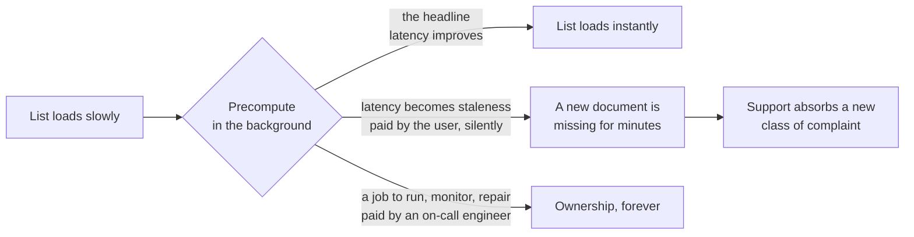
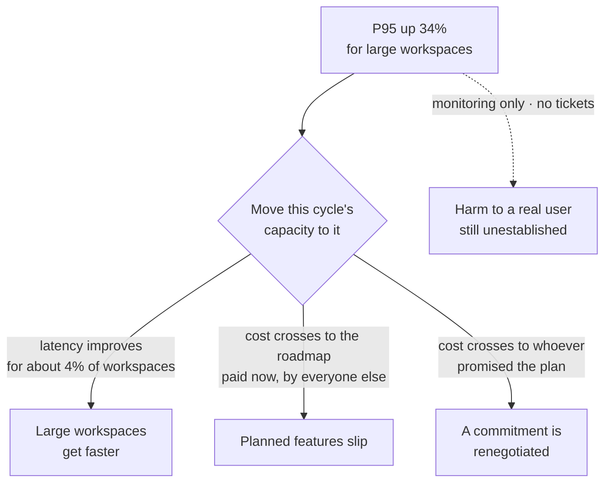

# TJ-02 · System boundaries and trade-offs

> Technical choices move cost, latency, reliability, security, and ownership
> across system boundaries rather than removing them.

## Problem — the cost that moved instead of disappearing

A team is slow to load a list of documents. An engineer proposes precomputing
the list in the background so it is ready before the user asks. The PM hears
"the list will load instantly" and approves it.

It does load instantly. Three months later, support is handling a new class of
complaint: a document a user just created does not appear in their list for a
few minutes. The list is fast and sometimes wrong. Nobody made a decision to
accept stale data. The decision was made, but it was made inside a sentence
about speed.

The cost did not disappear. It moved. Latency was converted into staleness,
plus a background job that now has to run, be monitored, and be fixed at two in
the morning when it stops. The PM approved all three, and knew about one.

Draw the same decision as a set of transfers and the missing two become
visible. One edge was the proposal. The other two were the price, and they
cross the boundary onto people who were not in the room:

This is hard to see because technical proposals arrive framed by the currency
they improve. Nobody opens with the bill. "We'll cache it" means "we will
trade freshness for speed." "We'll move it to a queue" means "we will trade
immediate confirmation for throughput, and add a place where work can get
stuck." The improvement is the headline. The transfer is the story.

Ask, about the last technical change your team made for you: which property
got worse, and who is holding it now? If the answer is "nothing got worse,"
either you found a rare genuine improvement or you were told only the
headline.

## Concept — name the currency and who pays it

Most technical choices are transfers. A property you dislike is converted into
a property you have not yet met, and it lands on a different side of a
boundary — often a boundary that separates you from whoever now pays.

Six currencies cover most of the ground.

| Currency | What it means | Who usually pays |
|---|---|---|
| **Latency** | How long a user waits | The user, immediately |
| **Money** | Compute, storage, licences, vendor bills | The company, and often per unit of usage |
| **Reliability** | How often it works, and how badly it fails | The user first, support second |
| **Freshness** | How far behind the truth the answer can be | The user, silently |
| **Security and privacy** | What can be seen by whom | The user, and the company on the bad day |
| **Ownership** | Who maintains, monitors, and gets woken up | Engineering, forever |

Two properties of these transfers matter more than the list itself.

**When the bill arrives.** Some costs are paid immediately and visibly, like a
slower page. Some arrive later and quietly, like a background job that must be
maintained for five years. A change that looks cheap today and expensive
forever is the most common way teams accumulate work they never chose.

**Who feels it.** A transfer from "the user waits" to "an engineer is on call"
is a real decision about a real person. A transfer from "we pay engineers
once" to "we pay a vendor every month per active user" changes your unit
economics. Neither is wrong. Both need an owner who knows they now hold it.

The move this lesson teaches is short. For every option on the table, record
four things:

1. **What improves**, in a named currency.
2. **What degrades**, in a named currency. If you cannot name one, keep
   looking, then see the boundary below.
3. **Who pays**, as a role, not a department.
4. **When the payment arrives** — now, at scale, or on the day it fails.

Then add one line that most trade-off documents omit: **which currency you
refuse to spend**, and what evidence would change that refusal. A trade-off map
without a refusal is a list. A refusal is a position.

Here is the same option on Noted — moving this cycle's capacity to
large-workspace response times — recorded both ways:

**Weak** — "Fixing large-workspace latency will cost roughly two weeks of
engineering time."

The only currency named is effort, and effort does not distinguish the options:
every option on the table costs engineering time. Nothing has been transferred
on paper, so nobody learns who now pays. Six months later the slipped feature
has an owner who never agreed to hold it.

**Strong** — "Latency improves for the 4% of workspaces over 500 documents,
which hold a disproportionate share of paid seats. The planned features slip.
The bill is paid now, by the remaining workspaces and by whoever committed
those features to a date."

Two currencies named, one improving and one degrading, with a role and a
timing attached to the degrading one.

The strong version is not longer because it is more careful. It is longer
because it contains a second party.

None of this requires you to choose the implementation. You are not deciding
between a cache and an index. You are deciding which bill the product can
afford and which it cannot. Engineering brings the options and their
properties. You bring the ranking of currencies and the reason for it. If you
find yourself arguing about which technique to use, you have crossed a
boundary you drew in TJ-01. If you find yourself saying "whatever engineering
thinks is best," you have abandoned the ranking, and the ranking is the part
only you can supply.

### Boundary

Not everything is a trade-off.

Some changes are simply improvements: a defect removed, a query that was
scanning far more data than it needed, a step that was doing nothing. These
have no interesting cost. Treating them as trade-offs is not rigour. It is a
way of hiding waste behind the language of balance, and it gives a team
permission to leave broken things broken because "everything has a cost."

The failure looks like this: a team spends a week debating whether to fix a
slow query, framing it as scale work competing with features, when the query
was written wrong and the fix takes an afternoon. The trade-off frame made a
cheap correction look like a strategic bet.

The test is whether the cost you name is real and specific. "Engineering time"
is not a cost that distinguishes options — everything costs engineering time.
If the only cost you can name is effort, you are probably looking at a
correction, not a transfer. Say so, and stop making it a decision.

## Build — on Noted

Read `lessons/noted/case.md` if you have not already.

Take **Signal 3: P95 response time rose 34% for large workspaces.**

What the case gives you: "large" means more than 500 documents, which is about 4% of
workspaces. Those workspaces contain a disproportionate share of paid seats.
No support tickets mention speed. The signal came from monitoring. The
decision is whether to move engineering time this cycle from planned features
to large-workspace response times, or keep the current plan.

Before you start, look at where the cost goes if you say yes. The improvement
stays inside one boundary. The cost crosses out of it, onto people the metric
never mentions — and the dashed edge is the thing you have not established at
all:

**Your task.** Produce a technical trade-off map for this decision.

1. State what the P95 number does and does not tell you. P95 is a statement
   about a distribution, not about a person. Say who is in that tail and what
   you do not know about them.
2. Handle the zero-tickets fact directly. Write one sentence on what the
   absence of tickets establishes, and one on what it does not. Do not let it
   carry more weight than it can hold.
3. Name the harm you believe is occurring, in terms of the job Noted does. Not
   "the app is slower." What does a user with 800 documents fail to finish?
   Mark it `<unknown>` if you cannot support it.
4. List the options at the level of consequence, not implementation. At
   minimum: do the work now, do it later, do a bounded piece of it now, do
   nothing and instrument instead. You may add an option engineering has
   proposed — but describe it by its currencies, not its technique.
5. For each option, fill the four rows: what improves, what degrades, who pays,
   when the bill arrives. At least one option must carry a cost in a currency
   other than engineering time or latency. Ownership is usually available
   without inventing anything: a bounded fix must be maintained, and an
   instrument must be watched by someone. If every option only costs
   "engineering time," you have not found the transfers yet.
6. Commit. Name the currency you refuse to spend on this decision, and the
   evidence that would make you spend it. Then name the option you displace by
   choosing yours.

Step five fills this grid. The options are given; the four columns are yours,
and the rule from step five applies to the whole table, not to each row:

| Option | Improves | Degrades | Who pays, by role | When the bill arrives |
|---|---|---|---|---|
| Do the work now | latency for large workspaces | `<unknown>` | `<unknown>` | `<unknown>` |
| Do it later | `<unknown>` | `<unknown>` | `<unknown>` | `<unknown>` |
| Do a bounded piece now | `<unknown>` | `<unknown>` | `<unknown>` | `<unknown>` |
| Do nothing, instrument instead | `<unknown>` | `<unknown>` | `<unknown>` | `<unknown>` |

If every cell in the "degrades" column reads "engineering time", go back. That
column is where the transfers live, and a column of effort means you have found
none of them.

**Expect to be pushed on:** whether you are treating revenue concentration as
evidence of harm, whether your "harm" is a real user outcome or a restatement
of the metric, and whether you have quietly picked an implementation while
claiming to reason about consequences.

### What a strong answer holds

- A statement of what P95 up 34% does and does not establish: a change in the
  tail of a distribution, for a population you cannot yet describe. Not harm,
  and not a person.
- Zero tickets handled as evidence about listening channels first, and only
  then as weak evidence about users.
- A "degrades" column with named currencies other than engineering time —
  ownership, freshness, reliability — each with a role and a timing attached.
- A currency you refuse to spend, the evidence that would change the refusal,
  and the option you displace by choosing yours.
- A refusal to treat the concentration of paid seats as evidence of harm. It
  is evidence of exposure, which is a different claim.
- The most common weak move is a "harm" that restates the metric — "the app is
  slower for 4% of workspaces." It is weak because it names no job a user
  fails to finish, so no option can be ranked against it.

## Use — on your product

Take one technical change your team is proposing or has just made for you.

Answer five questions:

1. Which currency does this proposal improve, and by how much, in the terms
   the proposer used?
2. Which currency gets worse? Name it specifically. If you were not told, that
   is your first question back.
3. Who holds the new cost, by role, and do they know they now hold it?
4. Does the bill arrive now, at scale, or only on the day something fails?
5. Which currency will you refuse to spend here, and what would change your
   mind?

Write `<unknown>` wherever you have not been told rather than assuming a
sensible default. The gaps you find in question two are the reason this
exercise exists.

## Ship — Technical trade-off map

Produce `artifacts/TJ-02-technical-trade-off-map.md` using the template in
`artifact.md`.

Write it for the person who will inherit the cost you are about to create —
the on-call engineer, the support lead, the finance owner watching a usage
bill. If they read this map in six months, they should find that the thing they
are now living with was chosen deliberately, by a named person, for a stated
reason.

In your Product Decision Case, this map is what stops a technical choice from
being recorded only as an outcome. The outcome is that the product got faster.
The decision is what you paid for that, and who is paying it.

## Carry forward

A map of what each option improves, what it degrades, who holds the new cost,
and which currency you refused to spend. TJ-03 widens the frame from one
decision to the whole set of technical bets competing for the same capacity,
and forces you to fund them against explicit consequence thresholds rather
than against whichever one is loudest this week.
