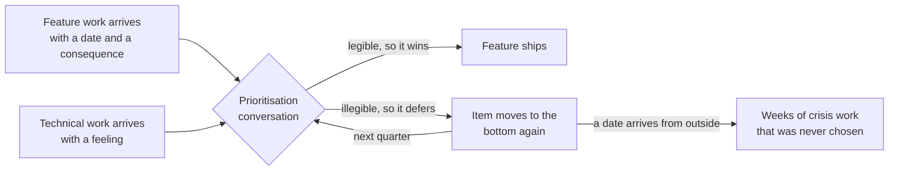
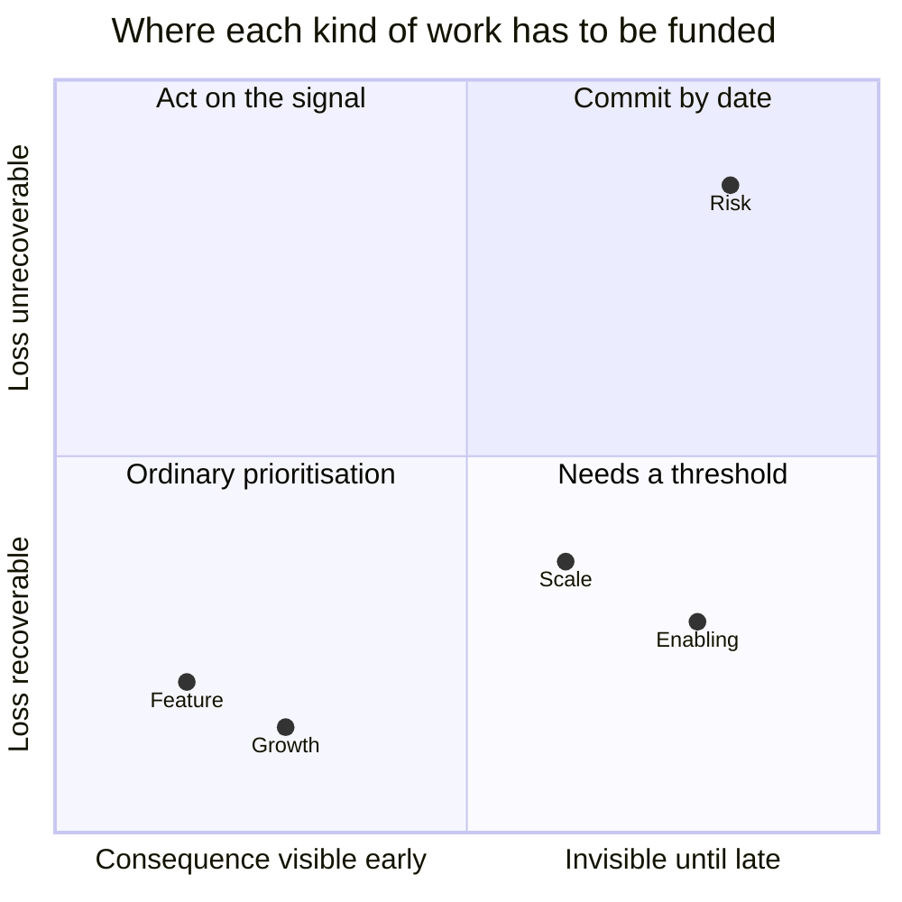
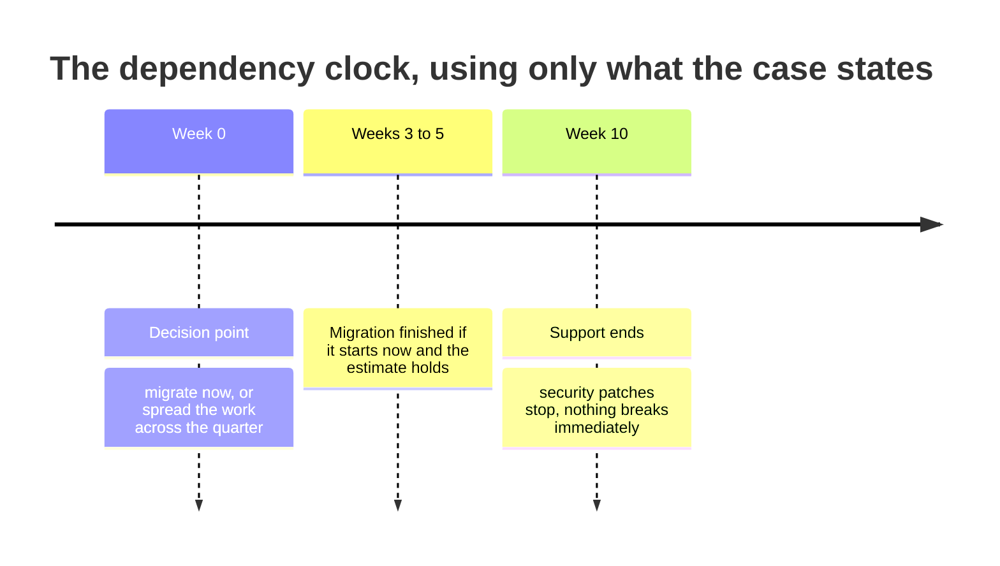

# TJ-03 · Technical portfolio and thresholds

> Scale, risk, debt, and enabling work should be funded against explicit
> consequence thresholds.

## Problem — deferred every quarter until it becomes urgent

A team keeps a list of technical work. Everyone agrees the list matters. Every
quarter, the same three items move to the bottom, because a feature commitment
arrives and something has to give.

Then one of the items becomes urgent. A dependency expires, or a limit is hit,
or an audit asks a question. The team drops everything and does in three weeks
what it declined to do calmly for four quarters. Afterwards, someone proposes a
rule: reserve 20% of every quarter for technical work. It works for two
quarters. Then a launch happens and the reservation is spent.

The list was never the problem. The problem is that feature work arrives with a
date and a consequence, and technical work arrives with a feeling. "This is
getting risky" cannot compete with "the customer expects it in March," not
because the risk is smaller, but because one of them is legible to a
prioritisation conversation and the other is not.

Percentage rules fail for the same reason. They protect a budget without
saying what the budget buys, so the first real pressure takes it back. What
survives pressure is a stated consequence with a date attached.

The loop below runs every quarter on most teams. Nothing in it is anyone's
mistake, which is why it repeats: the two inputs are not comparable, so the
comparable one wins every time until an outside date forces the other:

Ask about the technical item that has been deferred longest on your team: what
specifically happens if it is never done, by when, and how would you know it
was starting to happen? If the answer is a description of quality rather than
a consequence, that item will be deferred again.

## Concept — fund it with a threshold, not an argument

ST-04 gave you the five kinds of bet — feature, growth, scale, risk, and
enabling — and why the last three lose a ranking argument they sometimes deserve
to win: their benefit is a non-event, a counterfactual, or someone else's
number.

This lesson is about what replaces the argument. Work whose failure is silent
does not start winning prioritisation conversations because you explained it
better. It needs a funding mechanism instead.

Place the same five on two axes and the funding mechanism falls out of
the position rather than out of the argument. Read the horizontal axis as "how
late do you find out" and the vertical as "can you still undo it":

Feature and growth work sits bottom left: you find out fast and you can change
your mind. Scale and enabling work sits bottom right, where the mechanism has
to be a threshold, because nothing tells you when to act. Only the top right
demands a date commitment — and putting an item there costs you an option, so
you should be reluctant to do it.

That mechanism is a **threshold**. A threshold has four parts:

1. **An observable.** Something a person or a system can actually see.
2. **A level.** The value of that observable at which the answer changes.
3. **A date.** When you check, or by when the level must not be crossed.
4. **An action.** What happens automatically when the level is crossed, stated
   before it is crossed.

"We should get to the migration soon" has none of these. "If the migration has
not reached the integration step by week five, we stop feature work and finish
it" has all four. The second one survives a pressure conversation because the
argument was already had.

Thresholds also protect you from an argument you should not be having. When an
engineer gives an estimate of three to five weeks with wide uncertainty, the
estimate is theirs. Pressing on it — asking whether it could be three, asking
someone else, asking for a re-estimate — is you doing specialist work badly.
The uncertainty in that range is real information, and it is aimed at a
question that is yours: **how much schedule buffer are you buying, and what do
you give up to buy it?** That question does not require you to know anything
about the dependency.

The last piece is composition. A portfolio with no scale or enabling work is
not automatically wrong. It is wrong when the constraint your company actually
faces is one that only that work relieves. If you cannot ship fast enough to
learn, enabling work is the whole game. If your best customers are leaving over
performance, scale work is the whole game. If neither is true, feature work may
be correct and the technical list can wait — but that has to be a stated
judgment about the constraint, not the accidental result of feature work being
louder.

### Boundary

Thresholds work on curves. They do not work on cliffs.

Some consequences are not smooth. Crossing a line in a security, legal, or
data-integrity domain can produce a loss that is unbounded, non-recoverable, or
both. A threshold assumes you can watch an observable approach a level and act
in time. Where the first observable event is the breach itself, there is
nothing to watch.

For those items, commit by date instead. Say plainly: this is done by this
date, it is not eligible for reprioritisation, and here is the work it
displaces. That is a harder commitment to make and it should be, because you
are removing an option from your future self.

The overcorrection is also wrong. Not every security or dependency item is a
cliff. An end-of-support date after which patches stop, with nothing breaking
immediately, is a rising risk curve — a real one, but a curve. Treating every
risk item as a cliff means you will be talked out of all of them the first time
you are wrong about one.

## Build — on Noted

Read `lessons/noted/case.md` if you have not already.

Take **Signal 4: a core dependency loses support in 10 weeks.**

What the case gives you: engineering estimates the migration at three to five weeks,
with wide uncertainty. Two engineers want to migrate now. Two want to spread
the work across the quarter. After end-of-support, security patches stop.
Nothing breaks immediately. The decision is whether to complete the migration
this cycle or divide it across the remaining ten weeks.

Put the only three dates the case gives you on one line before you argue about
anything. The gap between the second and third marks is the buffer both
engineer positions are really disagreeing about:

**Your task.** Produce a technical portfolio for this cycle, with this item in
it.

1. Classify the dependency item. Is it a cliff or a curve? Argue it from what
   the case says, not from how the word "security" sounds. Then say what your
   classification commits you to.
2. Do the clock arithmetic in the open. Ten weeks available, three to five
   weeks of work. State how much buffer each option leaves if the estimate is
   wrong at the top of its range, and what happens if it is wrong beyond that
   range.
3. Name the different failure modes of the two engineer positions. Migrating
   now and spreading the work do not fail in the same way. One risks arriving
   at week ten unfinished. One risks stopping other delivery for a stretch you
   must be able to defend. Neither is the safe option.
4. Write a threshold for this item with all four parts: observable, level,
   date, action. It must be checkable by someone other than you.
5. Place at least three other items in the portfolio from the case — the
   large-workspace response times, the activation work, and the enterprise
   summaries request are all competing for the same capacity. For each, name
   the category, the consequence if unfunded, and either a threshold or a
   stated decision to leave it unfunded this cycle.
6. Commit. Name the constraint you believe Noted actually faces right now, and
   show that your portfolio funds the work that relieves it. Then name what you
   displaced.

Step four is where most attempts fail, and they fail in a way that is easy to
recognise once you have seen it beside a working version:

**Weak** — "The migration is high priority this cycle. We will keep an eye on
it."

No observable, no level, no date, no action. Nothing here can be checked by
anyone but the author, and nothing here loses an argument, so the first launch
pressure takes the capacity back and no rule has been broken.

**Strong** — "If the migration is not finished by week five, feature work stops
until it is. The engineering lead confirms at the week-five review."

Observable: finished or not. Level: finished. Date: week five. Action: feature
work stops. It also buys five weeks of buffer against an estimate whose top of
range is five weeks, and a person other than you can check it.

The second one survives pressure because the argument was already had, in
public, before anyone was under pressure.

Step five places the rest. Here is what the case gives you for each competing
item, and what you have to supply:

| Item, from the case | What the case states | What you must supply |
|---|---|---|
| **Dependency end-of-support** | 10 weeks; three to five week estimate; patches stop, nothing breaks immediately | category; cliff or curve; threshold or date commitment |
| **Large-workspace response times** | P95 up 34%; over 500 documents; about 4% of workspaces; disproportionate share of paid seats; no tickets | category; consequence if unfunded; threshold |
| **Activation decline** | 11% over six weeks; two changes shipped in the window; not segmented | category; consequence if unfunded; threshold |
| **Enterprise summaries** | three requests, one account manager, one month; roughly 20% of revenue; underlying claim untested | category; consequence if unfunded; or a stated decision to leave it unfunded |

The right-hand column is the whole exercise. Every cell in it is a judgment the
case cannot make for you, and leaving one blank is how an item returns as a
crisis.

**Expect to be pushed on:** whether you re-estimated the migration instead of
buying buffer against it, whether your threshold has an observable someone
could actually check, and whether "cliff" was a classification or a way of
avoiding the trade-off.

### What a strong answer holds

- A cliff-or-curve classification argued from what the case states — patches
  stop, nothing breaks immediately — with a plain sentence on what that
  classification commits you to.
- The clock arithmetic in the open: ten weeks available, three to five weeks of
  work, and the buffer each option leaves if the estimate is wrong at the top of
  its range.
- A threshold with all four parts — observable, level, date, action — that a
  named person other than you can check at a named moment.
- The other three signals placed with a category and a stated consequence if
  unfunded, including at least one explicit decision to leave something
  unfunded this cycle rather than a blank.
- A named constraint Noted faces now, and a portfolio that visibly funds the
  work relieving it. The estimate is left as engineering gave it.
- The most common weak move is buying safety by pressing on the estimate —
  "could it be three weeks?" It is weak because the estimate is specialist
  output, and the decision that is yours is how much buffer to buy and what it
  displaces.

## Use — on your product

Take the technical work currently competing for capacity on your team.

Answer five questions:

1. What constraint does your company actually face right now — value, reach,
   scale, risk, or ability to change? Name one.
2. For the technical item deferred longest, what happens if it is never done,
   by when, and what would you see first?
3. Which items are curves you can threshold, and which are cliffs that need a
   date commitment? Justify each cliff.
4. For each threshold: what is the observable, what is the level, what is the
   date, and who checks?
5. What did you decide not to fund this cycle, and what would have to be true
   for that to be a mistake?

Write `<unknown>` where you do not have the consequence, and note who owns the
estimate. An item with no stated consequence is not deprioritised. It is
undecided, and it will return at the worst moment.

## Ship — Technical portfolio

Produce `artifacts/TJ-03-technical-portfolio.md` using the template in
`artifact.md`.

Write it for the person who will be under pressure to break it — including
you, next month, when a launch date slips and the technical work is the
obvious place to find time. The portfolio earns its existence if it can survive
that conversation without being renegotiated from nothing.

In your Product Decision Case, this artifact records what you chose not to
fund. That is the part that later becomes evidence. When something goes wrong,
the question will be whether the risk was seen and accepted, or never seen at
all. Those are different failures with different lessons.

## Carry forward

A portfolio with categories, consequences, thresholds, and one honest cliff.
Every entry rests on a cost of change you have so far taken on trust. TJ-04
sends you into the repository and delivery system to see where that cost
actually comes from, so your next portfolio is priced from evidence rather
than from what you were told.
