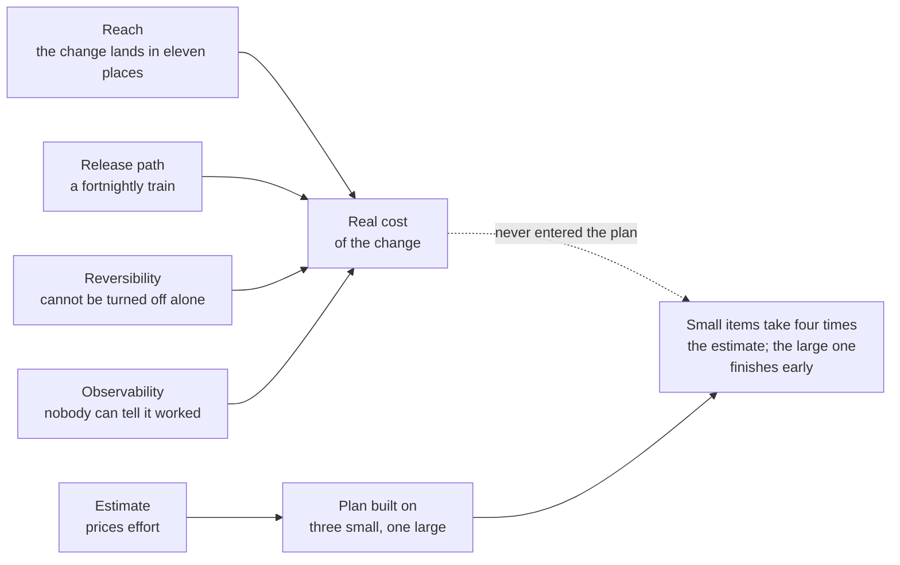
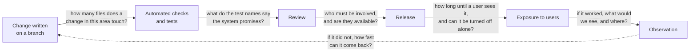

# TJ-04 · Repository and delivery-system literacy

> Repository structure, tests, release paths, observability, and ownership
> reveal the real cost of changing a product.

## Problem — pricing effort and calling it cost

A PM plans a quarter. Three items look small, one looks large. The plan is
built on that shape.

By week six, two of the small items have taken four times their estimate. One
of them touched a part of the product that appears in eleven places. Another
could not be released on its own, because the team ships everything together on
a fortnightly train, so it waited three weeks to reach a user. The large item
turned out to be a single self-contained addition and finished early.

Nobody was wrong about the work. They were wrong about the system the work
happens in. Effort is only part of the cost of a change. The rest is how many
places the change lands, how safely it can be made, how long it takes to reach
a user, whether it can be turned off, whether anyone can tell it worked, and
how many people must be involved to approve it.

The estimate answers one input. The plan was built as though it answered all of
them:

That information is not in the estimate. It is in the repository and the
delivery system, and an engineer can hand it to you in twenty minutes if you
know what to ask for. Most PMs never ask, because they believe the answer
requires reading code. It does not. The facts that price a change are
structural — how many places, how safely, how fast, how reversible, how
observable, how many people — and each one has a plain-English question
attached. Your job is to know the five questions, know what each answer changes
about your plan, and refuse to build a plan without the answers.

Ask yourself about the last change you scoped: how many files did it touch, how
long did it take to reach a user after it was written, and could it have been
turned off without a deploy? If you do not know, you were pricing effort and
calling it cost.

## Concept — price the five surfaces that carry cost

Five surfaces carry most of the cost of change. None of them requires you to
read logic. Each is a fact an engineer holds and you need.

| Surface | The fact you need | What it tells you |
|---|---|---|
| **Structure** | How many files a typical change in this area touches, and how many other areas it reaches | How many places a change lands, and how likely it is to break something else |
| **Tests** | Whether automated tests cover the area you would change, whether they run on every change, and what they protect | Whether a change can be made quickly and safely, or only slowly and carefully |
| **Release path** | How a written change reaches a user: review, checks, deploy, exposure control, rollback | How fast you learn, and how cheaply you can undo |
| **Observability** | What is logged, measured, and instrumented around this area | Whether you could ever tell that the change worked |
| **Ownership** | Who reviews this area, who is on call, how many people know it | Who must be involved, and how long the queue is |

Those five surfaces are stations on one path. A change walks from a branch to a
user and back to you as evidence, and at each station there is a question you
can ask without reading a line of logic. The questions are on the arrows,
because each one is about a crossing rather than about a stage:

The dashed return edge is the one most plans omit. A change you cannot walk
back is not a cheap change, whatever it cost to write.

### The five facts, in a twenty-minute conversation

Sit with an engineer who knows the area. Do not ask them to explain how it
works. Ask for five facts, and for each one, listen for the shape of the
answer.

**Structure.** "The last three changes in this area — how many files did each
touch, and did any of them reach outside this area?" A change that routinely
stays in one place is cheap. A change that reaches six places and a shared
component is not, whatever the estimate says. If the engineer has to think hard
about the answer, that is itself an answer: nobody has a clear picture of the
area's edges.

**Tests.** "Is this area covered by automated tests, do they run on every
change, and what do they protect?" Test names are sentences describing what the
system promises. Ask the engineer to read you three. They tell you what the
team believed was worth protecting. If the area has no tests, every change
there is a negotiation about risk, and your plan should carry review and
rollback margin to match.

**Release path.** "From written to seen by a user — how many steps, how long on
a normal week, and can this one be turned off without a deploy?" A change you
cannot turn off independently costs more than its build effort, because both
attributing it and undoing it become expensive.

**Observability.** "If this worked, what would we see, and where? Does the data
separate users who saw the change from users who did not?" A change with no
instrumentation cannot be evaluated, only believed.

**Ownership.** "Who has to review this, and how many people have touched the
area in the last six months?" If the answer is one name, your change is
scheduled around that person's calendar, whatever the plan says.

You are not gathering these facts to check the engineer's work. You are
gathering them because a plan built without them is a plan built on effort
alone, and effort is one input out of six.

### Questions to ask, and what each answer changes

Facts price the change. A second set of questions decides the plan. Write down,
before you ask, what each answer would change about your plan — otherwise you
are collecting trivia. The right-hand column is the test: a question whose row
you cannot fill does not go on the list.

| Question to ask | What the answer changes |
|---|---|
| If we shipped this and it was wrong, how would we turn it off, and how long would that take? | Whether you can ship to learn, or must be right before you ship |
| How long is it from a change being written to a user seeing it, on a normal week? | How fast the plan can respond to anything you find out |
| Which other parts of the product would this change touch that I would not expect? | The scope, and therefore the sequencing of everything after it |
| What in this area has no tests, and what does that mean for changing it? | How much review and rollback margin this item needs |
| If this change worked, what would we see, and where would we see it? | Whether the item can be evaluated, or only believed |
| Who has to be involved for this to ship, and are they available? | The date — more often than effort does |

### Boundary

The five surfaces tell you the cost of changing the product. They do not tell
you whether the change is right, and they do not produce an estimate.

Two failures follow from forgetting that. The first is using structural facts
to grade engineers. An area that many changes touch is a fact about a
codebase's history, usually about deadlines and turnover, and using it as
evidence about people will cost you the relationship that makes this whole
practice possible. The second is converting the facts into a number. "This
sounds like a two-week job" is an estimate, and estimates are specialist
output. You are gathering the inputs that make an estimate meaningful and a
plan honest.

The signals are also not reliable in isolation. A well-tested area can still
be expensive to change, if review queues are slow or releases happen monthly.
A poorly tested one can be cheap to change, if the area is small, one person
owns all of it, and the team ships daily. Get all five surfaces or you will
confidently draw the wrong conclusion from one.

There is a line here you should not cross. Knowing which five facts price a
change, and what each answer does to your plan, is your job. Producing those
facts from the code — reading the change history, the tests, the pipeline —
is a skill this course does not teach and does not ask of you. Ask for the
facts. Do not pretend to have read them.

## Build — on Noted

Read `lessons/noted/case.md` if you have not already.

Take **Signal 1: activation fell 11% over six weeks** — specifically the two
changes that shipped during that window: a revised signup flow, and a new
AI-suggestion prompt on the empty document state.

Noted has a disciplined delivery system and a much thinner evidence system. The
engineering lead owns repository workflow and technical standards, and some
planning assumptions have not been checked against the code. The case does not
tell you what the repository contains. That is the working condition. Most of
your cells will start empty.

Step six asks for questions with decisions attached. The difference between the
two kinds is visible immediately when they sit side by side:

**Weak** — "How is the AI-suggestion prompt implemented?"

A mechanism question. You will get an explanation, you will understand the
product slightly better, and no decision moves. Nothing in the answer tells you
whether the decline can be attributed or whether the change can be reversed
this week.

**Strong** — "Did the revised signup flow and the AI-suggestion prompt reach
the same users at the same time, and does the event data separate the two
groups?"

If the answer is no, attribution is impossible with this data, and an
investigation that could never have concluded anything stops today. If the
answer is yes, you know which comparison is available. Either answer changes
what you do this week.

**Your task.** Produce a repository orientation note aimed at one question: can
either change be attributed to the decline, and what would it cost to reverse
each one?

1. For each of the two changes, list what you would need to know to attribute
   the decline: when it shipped, who was exposed to it, whether exposure
   overlapped with the other change, and whether the event data separates the
   two groups.
2. Write your attribution verdict now, before asking anyone. If the two changes
   went to all users at the same time and events do not separate them, say
   plainly that this data cannot attribute the decline, and stop treating
   attribution as a research task.
3. Fill the five surfaces for the area each change touches. Mark every cell you
   cannot answer as `<unknown>`, and name who could answer it. Do not guess a
   test count or a release path you have not been told.
4. Map the reversal path for each change separately. Can one be turned off
   without the other? What does the answer change about your recommendation
   this week?
5. Fold in the measurement gap. Actor identity is missing for about 18% of
   events. State what that does to any exposure comparison you were planning.
6. Write six questions for the engineering lead, and beside each, the decision
   the answer would change. Delete any question whose answer would change
   nothing. Then commit: state what you now believe the real cost of reversing
   the AI-suggestion prompt is, expressed as a range with reasons, and labelled
   clearly as your inference and not an estimate.

**Expect to be pushed on:** whether you invented repository facts the case
never supplied, whether your questions have decisions attached or are curiosity
in a list, and whether you produced an estimate while claiming not to.

### What a strong answer holds

- An attribution verdict written before any answers arrive: what would have to
  be true about exposure and event data for either change to be attributed, and
  what it means for this week if those things are false.
- Five surfaces for each change, filled with `<unknown>` wherever the case is
  silent, each gap paired with the person who could close it. No test, folder,
  or pipeline is described that the case never supplied.
- The reversal path for each change treated separately, with a sentence on what
  a shared switch versus separate switches changes about your recommendation.
- A plain statement of what missing actor identity on about 18% of events does
  to any exposure comparison you planned.
- Six questions for the engineering lead, each with the decision beside it, and
  evidence that questions without a decision were cut.
- The most common weak move is a closing cost that sounds like an estimate —
  "probably a couple of days." It is weak because estimates are specialist
  output, and a PM's number will be repeated as one. A range, with reasons,
  labelled as inference, is the strong form.

## Use — on your product

Take one change your team is scoping now. Book twenty minutes with an engineer
who knows the area, and get five facts.

Answer five questions:

1. How many files did the last three changes in this area touch, and did any
   reach outside it?
2. Is the area covered by automated tests? Ask the engineer to read you three
   test names. What do they say the system promises?
3. From written to seen by a user: how long, and how many steps? Can this
   change be turned off without a deploy?
4. If this change worked, what would you see, and does that instrumentation
   exist today?
5. Who must review it, and how many people have touched this area in the last
   six months?

Where the engineer cannot answer, write `<unknown>` and record who could. Then,
beside each fact, write what it changes about your plan. A fact that changes
nothing was trivia, and it spent someone else's attention.

## Ship — Repository orientation note

Produce `artifacts/TJ-04-repository-orientation-note.md` using the template in
`artifact.md`.

Write it for the next PM who joins this product — and for yourself at the start
of the next planning cycle. It should let a competent stranger know, in ten
minutes, which parts of this product are cheap to change, which are expensive,
which changes can be undone, and which outcomes can be measured.

In your Product Decision Case, this note is what stops the phrase "that should
be quick" from entering a plan unchallenged. Every future sequencing decision
you make rests on the costs recorded here.

## Carry forward

Five facts that price a change, the decision each one moves, and a habit of
asking for them before a plan is built. TJ-05 puts the hardest kind of change
on top of that picture: an AI feature, where the output is probabilistic, the
failures are often invisible, and the quality bar has to be decided by you
before anyone builds it.
