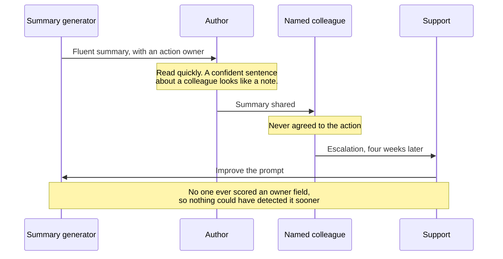
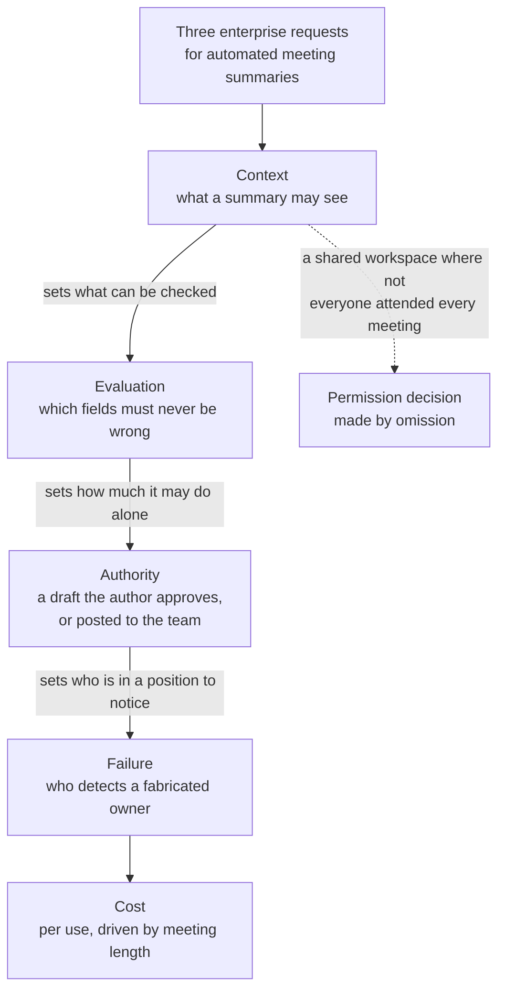
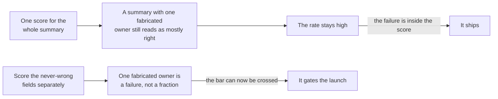

# TJ-05 · AI system judgment

> AI output must be evaluated as a probabilistic system with context,
> evaluation, human authority, failure, and cost boundaries.

## Problem — shipped because the output looked good

A team builds an AI meeting summary. The demo is convincing. The summaries read
well. It ships.

Four weeks later, a customer escalates. A summary listed a person as the owner
of an action item they had never agreed to. The person had been mentioned once,
in passing. Nobody caught it, because summaries are read quickly and a
confident sentence about a colleague does not look like an error. It looks like
a note.

The team's response is to improve the prompt. That is a reasonable response to
one wrong summary. It is not a response to the actual problem, which is that
nobody ever decided what a correct summary was. The feature shipped on the
basis that the output "looked good" — an assessment made by the people who
built it, on examples they chose, with no stated bar, no sample, and no rule
about which mistakes were tolerable.

Follow the wrong sentence through the people who touched it. Every one of them
had a reason not to catch it, and the only party who could have caught it — a
scoring step on the owner field — was never in the chain:

This failure is specific to probabilistic systems. Ordinary software is wrong
in ways that repeat. You can find the bug and fix it. A model is wrong
occasionally, in different ways each time, in a fluent voice, and its errors do
not announce themselves. A team's ordinary quality instincts — it works on my
machine, the tests pass, QA signed off — do not detect it. Worse, quality can
drift downward after launch with no code change at all, because the material
coming in has changed.

Ask about the AI feature nearest you: what error rate is acceptable, on what
kind of error, measured how, on what sample, judged by whom? If the answer is
"it should be accurate," nobody has decided yet, and the decision will be made
by whichever customer complains first.

## Concept — five boundaries that are product decisions

An AI feature is a system with five boundaries. Each one is a product decision
that arrives disguised as a technical detail.

| Boundary | The decision | Who owns it |
|---|---|---|
| **Context** | What the system may see when it answers | Product decides scope and permissions; engineering decides retrieval |
| **Evaluation** | What "good enough" means, and how it is measured | Product decides the bar; engineering runs the measurement |
| **Authority** | What it may do alone, and what a human must approve | Product |
| **Failure** | Which errors are tolerable, who detects them, how they are recovered | Product |
| **Cost** | What each use costs, in money and in waiting | Product decides the ceiling; engineering decides the mechanism |

Applied to the enterprise summaries request, the five boundaries are a chain,
and each link constrains the next. The context you allow determines what you
can evaluate; what you evaluate determines how much authority the system can
hold; the authority you grant determines who can detect a failure at all:

The dashed edge is the one that turns a quality problem into a customer
security conversation, and it is decided by silence more often than by
argument.

### Context

Most wrong output is not a model failure. It is a context failure: the system
saw the wrong material, too little, too much, or material the reader is not
entitled to see. That makes context the highest-value boundary you own.

Four questions define it. What may it see? What must it never see? How fresh
must that material be? And whose permissions apply — the person who asks, the
people in the source material, or the workspace? The last question is where
data leaks are born. "Give it access to everything so it does its best work" is
not generosity. It is a permission decision made by omission.

### Evaluation

**Decide what good enough means before anyone builds it.** This is the single
most important move in the lesson, and the one teams skip.

A usable quality bar has five parts:

1. **Fields that must never be wrong.** For a meeting summary: decisions,
   action owners, dates, and commitments. A single fabricated owner is a
   different class of failure from a clumsy sentence.
2. **Fields that may be imperfect.** Phrasing, ordering, how much discussion
   is included. Say so explicitly, or the team will optimise the wrong half.
3. **A target rate.** A number, on a stated sample. "Zero fabricated owners in
   50 real meeting notes" is a bar. "High accuracy" is not.
4. **A sample.** Real material, chosen before you look at results, covering the
   variety you will actually meet in production.
5. **A judge.** Who scores it, and how disagreement between judges is settled.
   If the people who built it are the only judges, you have a demo, not an
   evaluation.

Written out for Noted's enterprise summaries, the two versions of that bar are
not long and short. They are undecidable and decidable:

**Weak** — "Summaries should be accurate. We will review a few before launch."

No field split, so a fabricated action owner and a clumsy sentence score the
same. No rate, so no result can fail. No sample, so the examples get chosen
after the output is seen. No judge, so the builders decide. Every one of those
gaps is filled later by whichever enterprise customer escalates first.

**Strong** — "Zero fabricated decisions, action owners, dates or commitments,
across 50 real meeting notes chosen before we look at any output, scored by the
support lead and one person who attended the meeting. Phrasing and ordering may
be imperfect. Meeting type is not captured in the event data, so this sample
cannot be stratified by meeting type, and the bar carries that limit."

Note what the strong version does with its weakness: it states it. A bar that
names the population it cannot cover is still a bar. A bar that hides that is a
number people will over-trust.

This is also why a single accuracy rate is the wrong instrument here. Averaged
over a whole summary, one fabricated owner is a small fraction of a mostly
correct document, and the score it produces is indistinguishable from good:

Two kinds of measurement do different jobs. An offline evaluation runs a fixed
sample through the system and scores it: it is repeatable and it can gate a
launch. An in-product signal — edits made to the output, deletions,
regenerations, explicit corrections — tells you what is happening in the real
distribution, which is the only place drift shows up. You need both. Offline
evaluation cannot see the meeting types you did not think of.

### Authority

Decide what the system does alone and what a human approves. The rule is not a
preference about AI. It is a function of two things you already know how to
reason about: **how expensive the error is, and how easy it is to undo.**

- Cheap and easily reversed, visible to the person who can fix it: let it act,
  and make correction one gesture.
- Expensive or hard to undo, or visible to someone other than the person who
  could correct it: propose, and require approval.

A summary that appears in the author's own draft is one case. The same summary
posted automatically to twelve colleagues is a different one, because the
correction is now public and late. Same model, same quality, different
authority decision.

### Failure

Name the failure modes and say who detects each one. A short taxonomy covers
most AI product failures.

| Failure | What it looks like | Who notices |
|---|---|---|
| Fabrication | A fact, name, date, or owner that was never said | Often nobody, until it matters |
| Omission | A decision that was made and is missing | Usually nobody |
| Misattribution | The right content assigned to the wrong person | The wrong person, later |
| Staleness | Confidently reflecting material that has changed | The user, confusingly |
| Permission leak | Content surfaced to someone not entitled to it | Possibly your customer's security team |
| Refusal or empty output | The feature declines or produces nothing | The user, immediately |
| Silent degradation | Quality falls as inputs drift, with no code change | Nobody, unless a signal is watched |

The last row is the one that needs an explicit owner and an explicit signal.
Every other failure has at least a chance of being noticed by a human. Drift
does not, and it is the normal condition of a deployed model rather than an
exceptional event.

### Cost

AI features usually cost per use, not per seat. That breaks the arithmetic of a
seat-priced product: your most engaged customers become your most expensive.
Establish what drives the cost — document length, meeting length, how often it
runs, how much context is retrieved — and set a ceiling with a stated behaviour
at the ceiling. Latency belongs here too. A summary that takes forty seconds is
a different product from one that takes three, even when both are correct.

### Boundary

Evaluation is not value. A summary can pass every rubric you write and still
fail the job.

Noted's own trap applies with full force here. If usage of the summary feature
goes up and the underlying problem — decisions and owners getting lost after
recurring meetings — does not change, the product has generated activity
without completing the job. A high score on your rubric is evidence that the
system does what you specified. It is not evidence that what you specified was
worth doing.

There is a second limit. Offline evaluation only covers the distribution you
sampled. For Noted, meeting type is not captured in the product's event data,
so you cannot even draw a sample stratified by meeting type. That is a real
constraint on how much confidence any evaluation can carry, and it belongs in
the decision record rather than in a footnote.

And the bar itself is not fixed by pride. A system whose errors are cheap,
visible, and correctable in one gesture can ship at a lower quality bar than
one whose errors are silent and land on somebody else. Set the bar from the
consequence, not from how the output makes you feel.

One more line. You own the bar and the decision it gates. Building the
measurement — the tooling that runs the sample and scores it — is engineering's
work, and this course does not ask you to build it. Your part ends when the bar
is written so precisely that someone else can build a measurement against it
and you can tell whether they did.

## Build — on Noted

Read `lessons/noted/case.md` if you have not already.

Take **Signal 2: three enterprise customers asked for automated meeting
summaries.**

What the case gives you, and its limits: all three requests came through the same account
manager, within one month. Their combined contract value is roughly 20% of
current revenue. The underlying claim — that enterprise team leads repeatedly
lose decisions, action owners, or context after recurring meetings, causing
rework or missed commitments — has never been tested. Meeting type is not
captured in the product's event data. Three requests through one channel are
not an independent sample.

**Your task.** Produce an AI system decision record for this feature, and write
the quality bar before anything else.

1. Write the quality bar first, before any design. Name the fields that must
   never be wrong, the fields that may be imperfect, the target rate, the
   sample you would score against, and who judges. Do this before you read
   your own step two, and do not revise it downward later without recording
   that you did.
2. Define the context boundary. What may the system see, what must it never
   see, how fresh must it be, and whose permissions apply. Answer the
   permission question explicitly — a shared workspace where not everyone
   attended every meeting is exactly where this goes wrong.
3. Set the authority boundary. Does the summary appear as a draft the author
   approves, or is it posted to the team? Justify it from error cost and
   reversibility, not from a general view about AI.
4. Fill the failure table. For each failure mode, state who detects it, by what
   method, and what the recovery is. Name the signal that would catch silent
   degradation, and the person who watches it.
5. Set the cost boundary. Name what drives cost, what happens at the ceiling,
   and the latency above which you would rather return nothing than make the
   user wait.
6. Confront the evidence. State plainly what three requests through one account
   manager establish and what they do not. Then decide: is the next step to
   build this, to test the underlying claim first, or to build a bounded
   version whose purpose is to test the claim? Commit to one, and say what
   result would make you stop.
7. Write the off switch. Name the condition under which this feature is turned
   off after launch, and who has the authority to do it without a meeting.

**Expect to be pushed on:** whether your quality bar has a number and a sample
or only adjectives, whether your authority decision was argued from
reversibility or from taste, and whether you treated 20% of revenue as evidence
that the underlying claim is true.

### What a strong answer holds

- A quality bar written first, with all five parts: never-wrong fields,
  may-be-imperfect fields, a rate, a sample chosen before any output is seen,
  and a judge who did not build the system.
- An explicit answer to the permission question for a shared workspace where
  not everyone attended every meeting — whose permissions apply, and why.
- An authority split argued from error cost and reversibility, with the
  argument visible, not from a general position on AI.
- Silent degradation given a named signal and a named person watching it.
- A plain statement of what three requests through one account manager
  establish and what they do not, and a refusal to treat roughly 20% of revenue
  as evidence that the underlying claim is true.
- The most common weak move is a bar made of adjectives — "accurate", "high
  quality". It is weak because no result can fail it, so the real bar gets set
  later, by whichever enterprise customer escalates first.

## Use — on your product

Take one AI feature you own, are building, or are being asked to build.

Answer five questions:

1. What must never be wrong in this output, and what may be imperfect? Write
   both lists.
2. What is the target rate, on what sample, judged by whom — and does that
   measurement exist today?
3. What can this system see, and whose permissions govern it?
4. Which failure would nobody notice, and what signal would catch it? Who is
   watching that signal by name?
5. What does one use cost, in money and in waiting, and what happens when usage
   grows faster than revenue?

Where the answer does not exist yet, write `<unknown>` and name who could
settle it. On AI features the gaps are usually in questions two and four, and
those two are the difference between a product decision and a demo that got
promoted.

## Ship — AI system decision record

Produce `artifacts/TJ-05-ai-system-decision-record.md` using the template in
`artifact.md`.

Write it for two readers who will arrive later: the engineer who has to build
to the bar you set, and the person handling the first escalation after launch.
The second reader is the reason the failure table and the off switch exist. If
they can read this and see that the failure was anticipated, bounded, and
assigned, you made a decision. If they cannot, the feature shipped on how the
demo felt.

In your Product Decision Case, this record is the first one where you commit to
a standard of correctness rather than a direction. Everything before it argued
about what to build. This argues about what counts as it working.

## Carry forward

A stated quality bar, a context boundary, an authority split, a failure table
with detection owners, and a cost ceiling — for a feature you have not built
yet. DS-01 takes this record into the commitment decision, where a stated bar
becomes the thing that makes a commitment real: you cannot promise to deliver
something until you have said what delivering it means.
