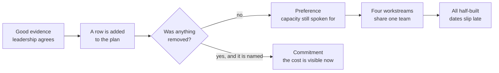
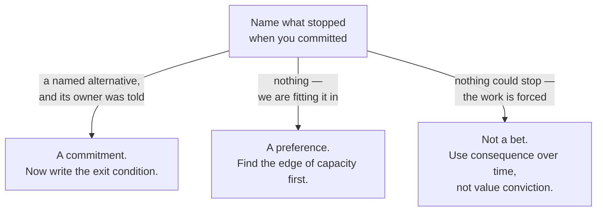

# DS-01 · From evidence to commitment

> Commitment begins when product value and effort conviction are strong enough
> to displace real alternatives.

## Problem — the commitment that displaces nothing

A PM finishes a strong evidence cycle. The belief is well argued, the readout is
good, and leadership agrees. The roadmap gains a row. Everyone leaves the room
feeling that a decision was made.

Three months later, four things are half-built. The feature that was "committed"
has a design, no backend, and a slipping date. The migration that nobody
formally committed to is being done in evenings. The performance work started
and stopped twice. When someone asks what the team decided in that meeting, the
honest answer is that the team decided to want something.

Nothing visibly went wrong. The evidence was good. The argument was sound. The
failure is that **adding a row to a plan is not a commitment.** A commitment is
a claim about capacity, and capacity is finite, so a real commitment always
takes something away from something else. If nothing was removed, nothing was
committed — the team simply agreed that the idea was good.

This is hard to see from inside because the emotional signal of commitment
arrives on time. Agreement feels like closure. And the cost of a fake commitment
is paid later, by the four workstreams that each get a fraction of a team.

Both paths start from the same good evidence and the same agreement. They
diverge at one question, which is rarely asked out loud in the room:

Ask your team: *what stopped when we committed to this?* If the answer is
"nothing, we're fitting it in", you have a preference, not a commitment.

## Concept — two convictions, and what gets displaced

Two separate convictions must both be strong before a commitment is real, and
they fail in different ways.

**Value conviction** is your belief that this change produces the intended
outcome for a named population. It is built from evidence about the problem,
the population, and the mechanism.

**Effort conviction** is your belief that you know enough about cost,
dependency, and unknown work to hold a scope and a horizon. It is built from
technical understanding, not from an estimate someone said out loud.

They combine into four states, and each state has a different correct move.

| Value conviction | Effort conviction | Correct move |
|---|---|---|
| Strong | Strong | Commit, and name what is displaced |
| Strong | Weak | Do not commit yet. Spend a bounded slice retiring the effort unknown |
| Weak | Strong | Do not commit yet. Buy value evidence cheaply; building is the expensive test |
| Weak | Weak | Do not commit. Choose which conviction is cheaper to raise, and raise that one |

The most common failure is the second row treated as the first. The team is
confident the thing is worth building, so it commits to a date it has no basis
for, and the date does the damage.

A commitment that is real states four things:

1. **What it displaces.** The specific alternative that now cannot happen, or
   cannot happen at full size, in this period.
2. **What it withdraws.** The capacity, attention, or future option that is no
   longer available — including the option to change your mind cheaply.
3. **Who can no longer say yes.** The named person or team whose availability
   is now spent, so that the next request to them is a conflict, not an addition.
4. **What ends it.** The condition under which you stop, reduce, or re-open the
   commitment — stated before you start, while you are still honest.

Displacement is the test that separates a commitment from an intention. If you
cannot name what is displaced, you have not found the edge of your capacity, and
you will find it later at a worse moment.

Here is the same commitment to Noted's enterprise summaries written both ways.
Both sentences were said by someone who meant them:

**Weak** — "We're committing to enterprise meeting summaries this quarter, and
we'll still do the migration alongside."

Nothing is removed. The migration, estimated at three to five weeks against a
ten-week end-of-support horizon, is being carried as if it were free. No
capacity was touched, so this is a preference wearing the word commit.

**Strong** — "Enterprise team leads get a record of decisions and action owners
after recurring meetings. The activation investigation is deferred to next
cycle. Large-workspace P95 is reduced to a monitoring guard with no engineering
time. The dependency migration is not displaced, because end-of-support is not
a bet."

Three named alternatives, each with a stated fate. The last one also names a
limit of the model: forced work is not weighed as value.

If you cannot say which square you are in before you say what you will do, you
are reasoning from the answer backwards:

### Boundary

This model assumes the alternatives are comparable product bets. It stops being
true when the work is not a bet at all.

Some work is forced. A dependency losing support, a legal requirement, a
security exposure — for these, "value conviction" is the wrong frame. There is
no user outcome to argue about. The real frame is consequence exposure over
time: what accumulates if you do not act, and how fast. Pushing forced work
through a value-conviction template produces an invented user story to justify
work that was never optional, and that invented story then competes for
attention as if it were evidence.

The model also has a floor. A small, reversible change that costs two days does
not need a displacement analysis. The overhead of formal commitment can exceed
the consequence of getting it wrong. Use this when the work is large enough that
its displacement is felt by someone who was not in the room.

And note the honest limit of the four-state table: strong effort conviction is
not the same as an accurate estimate. It means you know which parts are known
and which are not. A team with strong effort conviction can still be wrong about
duration. It should not be surprised about kind.

## Build — on Noted

Read `lessons/noted/case.md` if you have not already.

Take **Signal 2: three enterprise customers asked for automated meeting
summaries.**

Their combined contract value is roughly 20% of revenue. All three requests came
through one account manager within one month. The underlying claim — that
enterprise team leads lose decisions, owners, or context after recurring
meetings — has never been tested. Meeting type is not captured in event data.
The team collaboration environment is in design, not live.

Noted has one team and four signals. It cannot do all four.

**Your task.** Produce a commitment position for this signal.

1. State the commitment candidate as a change to a named population's job, not
   as a feature name. "Automated summaries" is a feature. Say what changes for
   whom.
2. State your value conviction, and state plainly what the evidence cannot
   establish. Three requests through one channel is not prevalence. Contract
   value is not evidence about the problem.
3. State your effort conviction. Name at least one dependency you do not
   control. The team collaboration environment is in design; decide whether your
   commitment depends on it, and say so.
4. Place yourself in the four-state table, and say which square you are in
   before you say what you will do.
5. **Name what this displaces.** Go through signals 1, 3, and 4 explicitly. For
   each, say whether it is deferred, reduced to a minimum guard, or dropped —
   and who is told.
6. Name who can no longer say yes, and to what.
7. Write the exit condition: the observation that would make you stop or shrink
   this commitment.

Step 5 is where most attempts thin out into "we'll fit the rest in". Fill this
table before you write any prose. The middle and right columns are yours; the
left two are what the case actually gives you.

| Signal | What the case states | Deferred, reduced to a guard, or dropped | Who is told, and when |
|---|---|---|---|
| **1 · Activation** | Fell 11% over six weeks; not segmented by cohort, channel, or platform | | |
| **3 · Large-workspace P95** | Rose 34%; about 4% of workspaces; no support tickets | | |
| **4 · Dependency end-of-support** | 10 weeks away; migration estimated at three to five | | |

A blank cell in the right-hand column is a displacement nobody has been told
about, which is the same as no displacement at all.

**Expect to be pushed on:** whether 20% of revenue is evidence about the problem
or evidence about account risk; whether "we will still do the migration
alongside" is a real displacement or a way of avoiding one; and whether your
effort conviction survives the fact that the environment this feature would live
in is only in design.

### What a strong answer holds

- A commitment candidate stated as a change to a named population's job, not as
  a feature name.
- Value and effort conviction stated separately, each with what its evidence
  cannot establish. At least one dependency outside your control is named, and
  the in-design collaboration environment is placed on or off the critical path
  in so many words.
- A square in the four-state table named before the move is named.
- Every displacement cell for signals 1, 3, and 4 filled with a fate and a
  person told — nothing "fitted in".
- An exit condition written as an observation, and a named person who can no
  longer say yes to something specific.
- The most common weak move is carrying the migration "alongside" as if it were
  free. It is weak because it displaces nothing on paper, so the displacement
  happens later, unowned, in evenings.

## Use — on your product

Take one commitment your team is currently holding. Choose one that is already
in a plan, not one you are considering.

1. What does this commitment displace, named specifically? Who was told?
2. Which of the two convictions is weaker right now, value or effort, and what
   evidence would raise it?
3. Who can no longer say yes to something else because of this, and do they know?
4. What is the exit condition, and who is allowed to invoke it?
5. If this commitment turns out to be wrong, when is the earliest you would find
   out?

Where you do not have the answer today, write `<unknown>`. Do not fill a gap
with an estimate that sounds like knowledge. An unnamed dependency is the most
common source of a missed commitment, and writing `<unknown>` is how it stays
visible.

## Ship — Commitment brief

Produce `artifacts/DS-01-commitment-brief.md` using the template in
`artifact.md`.

Write it for the people whose work is displaced by this commitment, and for the
person who will be asked in six weeks why the other three things did not move.
It should carry the choice, the two convictions with their evidence, the
uncertainty in each, the displaced alternatives, the owner, and the exit
condition.

This entry converts your Product Decision Case from a set of beliefs into a set
of obligations. Every later artifact in this phase refers back to it. When DS-05
asks what would make you stop a launch, it is asking you to re-open this file.

## Carry forward

A commitment with both convictions stated, a named displacement, and an exit
condition. DS-02 takes that commitment and asks how it should be broken into
sequence — not into smaller tickets, but into slices that produce evidence,
preserve options, and integrate safely.
