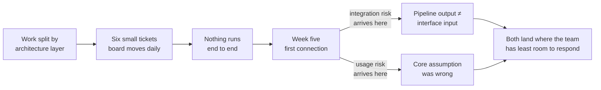
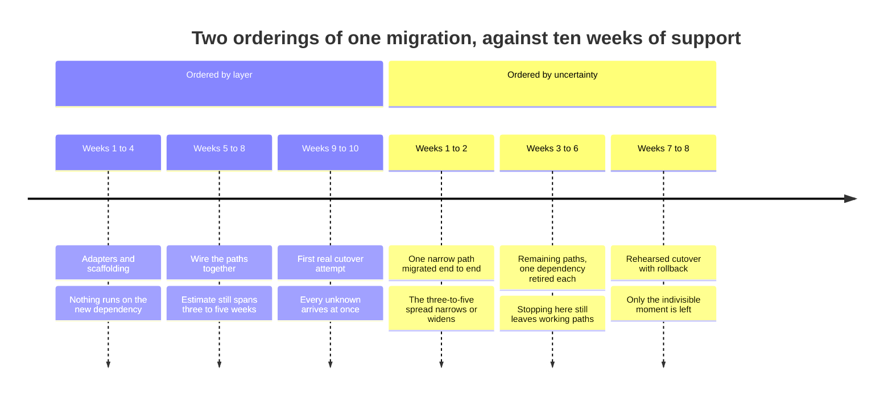

# DS-02 · Sequence, slice, and dependencies

> Smaller sequential delivery should create evidence, option value, and safe
> integration — not merely smaller tickets.

## Problem — smaller tickets that are not slices

A team commits to a feature and does the responsible thing: it breaks the work
down. Six tickets. Schema first, then the data pipeline, then the service, then
the API, then the interface, then the polish. Each ticket is small, estimated,
and independently reviewable. The board moves every day.

In week five, the interface is connected for the first time. Two things become
visible at once. The data the pipeline produces is not the data the interface
needs. And the underlying assumption about how the feature would be used was
wrong in a way that anyone could have seen in a working version.

The team did not fail to break the work down. It broke the work down along the
architecture instead of along the uncertainty. Every ticket was smaller. **No
ticket was a slice.** Nothing finished early could be shown to anyone, tested
against reality, or kept if the project stopped. All the learning and all the
integration risk was stacked into the final week, which is exactly where the
team had the least room to respond.

This is hard to see from inside because it looks like good practice. The tickets
are small. The estimates are tight. Velocity is stable. The measurement system
reports health right up until the week it does not.

The mechanism is that breaking work down along the architecture pushes every
moment of contact with reality to the same place — the end:

Ask about the next piece of work your team plans to finish: *if we stopped
immediately after this piece, what would we have that is worth keeping, and what
would we know that we do not know now?* If the answer to both is "nothing", it
is a smaller ticket, not a slice.

## Concept — order by uncertainty, not by layer

Judge every slice on four properties. A slice that fails all four is a task; a
slice that satisfies at least one deliberately is a delivery decision.

| Property | The question | Failed when |
|---|---|---|
| **Evidence yield** | What does finishing this let you learn that you cannot learn now? | Nothing is learnable until the whole thing exists |
| **Option value** | If you stopped here, what would you still have? | Stopping leaves partial work that must be thrown away |
| **Integration safety** | Can this reach production without exposing users? | The pieces only meet at the end, in one large merge |
| **Dependency retirement** | Which dependency or unknown does this settle? | Every dependency is still open on the last day |

A sequence is not a list of slices. A sequence is an **order**, and the order
should be driven by which uncertainty is most expensive to discover late.

Order by uncertainty, not by layer. The question is not "what has to be built
first" but "what would hurt most if we learned it in the final week". Usually
that is one of three things: whether the effort estimate is right, whether the
integration works, or whether the thing produces the outcome you claimed.

Put the two orderings on the same clock. Noted's dependency migration is
estimated at three to five weeks against ten weeks of remaining support, so the
question of which ordering you chose becomes answerable in week two under one
of them and week nine under the other:

Both rows contain the same work. The lower row is not faster. It is arranged so
that the most expensive thing to learn late is learned first, and so that
stopping at any point leaves something worth keeping.

### Three kinds of dependency

They are treated as one word and handled the same way, which is why they cause
different failures.

| Kind | What it means | How it is handled | Failure when misread |
|---|---|---|---|
| **Sequence** | B cannot start until A exists | Order the work, and shorten A | Treated as a knowledge gap and "researched" while it just needs building |
| **Capability** | You need something another team or system owns | An interface contract plus a stub you can build against | Treated as sequence, so your team waits instead of proceeding against a contract |
| **Knowledge** | You need an answer before the shape of the work is known | A bounded investigation with a decision date and a default | Treated as capability, so it is delegated and never returns |

The most common error is treating a capability dependency as a sequence
dependency. That converts another team's schedule into your critical path for no
reason, when a written interface and a stub would have let both sides move.

### Two things a slice can be for

A slice can be shaped to maximize learning, or to minimize risk. These are not
the same shape and they sometimes conflict. A slice that exposes the riskiest
integration first teaches you the most and is the most likely to destabilize the
build. A slice that isolates the risky part behind a safe boundary is calmer and
tells you less.

You do not resolve this in general. You resolve it per slice, by saying which
one this slice is for. A sequence where every slice is unlabelled is a sequence
where nobody can tell whether it is going well.

### Boundary

This test orders work by which uncertainty is most expensive to discover late.
It does not tell you whether a slice is small enough to review. That is a
different question — about architectural seams and how much diff a human can
hold at once — and a sequence that scores well here can still arrive as one
unreviewable change.

Slicing has a floor, and below that floor it costs more than it saves.

Some work is genuinely indivisible. A cutover from one dependency to another, a
schema change with no compatible intermediate state, a security patch — these
have a moment where the old thing stops and the new thing starts. You can slice
everything around that moment: preparation, compatibility work, verification,
rehearsal, rollback readiness. You cannot slice the moment itself. Pretending
you can produces dual-running complexity, and maintaining two live paths is
often riskier than a well-rehearsed single switch.

The second limit: slicing does not create evidence on its own. A slice yields
evidence only if someone is going to look at what it produced, with a question
in mind, before the next slice starts. A team that ships thin vertical slices
and reviews none of them has smaller tickets with a better name.

The third limit: this model assumes the commitment behind the work is sound. A
well-sequenced delivery of an unsound commitment reaches the wrong destination
sooner. Sequencing is not a substitute for DS-01.

## Build — on Noted

Read `lessons/noted/case.md` if you have not already.

Take **Signal 4: a core dependency loses support in ten weeks.**

Engineering estimates three to five weeks, with wide uncertainty. Two engineers
want to migrate now. Two want to spread the work across the quarter. After
end-of-support, security patches stop; nothing breaks immediately.

Note what the disagreement actually is. It is not a disagreement about slicing.
Neither position is a sequence. "Migrate now" is a start date. "Spread it across
the quarter" is the absence of an order.

**Your task.** Produce a delivery sequence for this migration.

1. Restate the uncertainty that is most expensive to discover late. The estimate
   spans three to five weeks against a ten-week horizon. Say what that spread is
   made of.
2. Design the first slice so that it narrows the estimate. Say exactly what you
   would know after it that you do not know now, and how long it may take before
   it has failed at its job.
3. Identify the indivisible step. Name the moment where the old dependency stops
   and the new one starts, and say what cannot be sliced around it.
4. Write the full sequence. For each slice, state its evidence yield, its option
   value if the work stopped there, its integration safety, and the dependency
   it retires. Mark each slice as learning-shaped or risk-shaped.
5. Classify every dependency as sequence, capability, or knowledge, and give
   each one the handling its kind requires.
6. Compute the last responsible start date: the date after which "spread it
   across the quarter" is no longer available, using the upper estimate and not
   the lower one. State what happens on that date if nothing has started.
7. State what this sequence protects, and what it deliberately does not protect.

Step 2 is the one that separates a sequence from a schedule. Two versions of a
first slice for this migration, both of which a competent engineer would accept:

**Weak** — "Week one: audit every call site of the dependency and produce a
migration plan."

This produces a document. Afterwards the estimate is still three to five weeks,
because nothing was run. Its evidence yield is an opinion, its option value if
the work stopped is zero, and it retires no dependency.

**Strong** — "Week one: migrate one narrow path end to end, in production,
behind the existing behaviour."

Afterwards you know the real cost of one path and can multiply it. If the work
stops, that path stays migrated. It also exercises the cutover mechanics once,
cheaply, which is the part that cannot be sliced later.

The difference is not effort or seniority. The weak slice moves the work
forward. The strong slice moves the *estimate*, which is the uncertainty that
end-of-support in ten weeks makes expensive.

**Expect to be pushed on:** whether your first slice actually narrows the three-
to-five-week spread or merely begins work; whether your slices are architecture
layers wearing vertical names; and whether your last responsible start date was
computed from the estimate you want or the estimate you have.

### What a strong answer holds

- The most expensive late discovery named first — what the three-to-five-week
  spread is made of — before any slice is written.
- A first slice that moves the estimate, with a sentence on what you will know
  after it that you do not know now, and a limit on how long it may run before
  it has failed at that job.
- The indivisible cutover moment identified, with a plain refusal to slice it
  and a list of what can be sliced around it.
- Every slice labelled learning-shaped or risk-shaped and scored on all four
  properties, with dependencies sorted into sequence, capability, or knowledge
  and handled accordingly.
- A last responsible start date computed from five weeks, not three, with what
  happens on that date if nothing has started.
- The most common weak move is a first slice that produces a plan or an audit.
  It is weak because nothing ran, so the estimate is exactly as wide afterwards
  as it was before.

## Use — on your product

Take the commitment you wrote in DS-01, or one live piece of work your team is
about to break down.

1. What is the most expensive thing you could learn in the final week, and which
   slice would surface it first?
2. For your next planned piece of work: if it stopped there, what would you keep?
3. Which of your dependencies are capability dependencies being handled as
   sequence dependencies, with your team waiting instead of building against a
   contract?
4. Which knowledge dependency has no decision date, and what is its default if
   the date passes?
5. Which of your slices is learning-shaped and which is risk-shaped, and does
   anyone besides you know?

Write `<unknown>` where you do not have the answer. A dependency whose kind you
cannot name is more dangerous than a dependency you have not yet solved, because
you will apply the wrong handling to it with confidence.

## Ship — Delivery sequence

Produce `artifacts/DS-02-delivery-sequence.md` using the template in
`artifact.md`.

Write it for the engineers who will execute it and for the person who will have
to decide, mid-way, whether to continue. It should be legible to someone who
joins in week three and needs to know what has been settled and what has not.

In your Product Decision Case, this is the first artifact that constrains other
people's days. The DS-01 brief said what you would do. This says in what order,
and therefore what you will know and when. DS-03 will ask who owns each of those
handoffs.

## Carry forward

A sequence ordered by uncertainty, with each dependency classified and handled,
and a last responsible start date. DS-03 takes this sequence and asks what
system has to exist around it — who owns each decision, each interface, each
integration, and each piece of learning the sequence was designed to produce.
