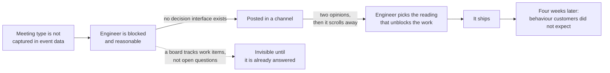
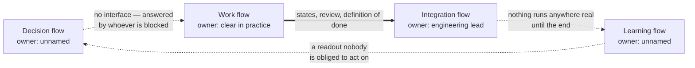

# DS-03 · Delivery system design

> A delivery system coordinates decisions, work, integration, and learning
> across explicit ownership and interfaces.

## Problem — the question answered by whoever was blocked

Mid-build, an engineer opens a ticket to write the summary pipeline and finds
that meeting type is not captured anywhere in the event data. The feature's
behaviour was supposed to differ by meeting type. Now it cannot, unless someone
decides something.

Watch what happens next. The engineer posts in a channel. Two people reply with
opinions. The PM is in a different thread. By the afternoon the conversation has
scrolled away, and the engineer — who is blocked and reasonable — picks the
interpretation that lets the work continue. It ships. Nobody lied and nobody was
careless. Four weeks later, the reason the feature does not behave as the
enterprise customers expected is a choice made in a channel by the only person
who was blocked by it.

The board never showed this, because a board tracks work items. An open decision
is not a work item. It has no column, no owner, and no date. It only becomes
visible when it has already been answered by default.

Follow the question rather than the ticket, and the mechanism is plain. Every
step is someone behaving well:

This failure is hard to see because every delivery metric looks healthy while it
happens. Cycle time is stable. Pull requests are reviewed. The team is
disciplined and fast. **A delivery system that is optimized for moving work will
move work, including work built on a silently answered question.** Noted's team
is exactly this kind of team: strong delivery discipline, thin evidence system.
Speed is not the problem. The absence of a channel for decisions and learning is.

Ask your team: *what open question is currently blocking someone, and who is
going to answer it, by when?* If the answer is a channel name, you have found
the gap.

## Concept — four flows, and the two left implicit

A delivery system carries four flows. Each needs an owner, an interface, and a
visible state. Most teams build two of them well and leave two implicit.

| Flow | What it carries | The owner question | Symptom when it is missing |
|---|---|---|---|
| **Decision flow** | Open questions that change what gets built | Who decides, by when, and against what evidence standard? | Assumptions get answered by whoever is blocked, and then shipped |
| **Work flow** | Tasks, states, capacity, order | Who is doing it, and what counts as done? | Work stalls invisibly, or two people build the same thing |
| **Integration flow** | Merging, environments, the release path, rollback | Who owns the health of the main line, and what gates it? | Everything meets in one large merge at the end |
| **Learning flow** | What the built thing taught you | Who reads the result, and what changes because of it? | Things ship and are never evaluated |

Teams almost always have a work flow and an integration flow, because those
break loudly. Decision flow and learning flow break quietly, so they are
frequently absent in teams that consider themselves high-performing.

Drawn as a loop, Noted's system shows its shape immediately. Solid edges are
the handoffs that have an owner and a contract; dotted edges are the ones that
run on goodwill:

Two of the four edges carry no contract, and both of those edges are where a
question turns into a silent commitment. This is not a slow team with a process
problem. It is a fast team with two flows and a loop that does not close.

### Interfaces, not ceremonies

The unit of delivery-system design is not a meeting. It is an **interface**: the
contract at a boundary between two owners. A usable interface states four
things.

| Element | The question it answers |
|---|---|
| **Input** | What the requester must provide for this to be actionable |
| **Output** | What comes back, in what form |
| **Latency** | How long a request waits before the requester can assume nothing is coming |
| **Failure behaviour** | What happens automatically when the latency is exceeded |

An interface without a latency is a queue with no bottom. An interface without a
failure behaviour is a promise that quietly converts into a blocked engineer
making a product decision.

Ceremonies are one way to implement an interface. They are not the interface. A
team that adds a weekly meeting has not created a decision flow; it has created
a place where decisions may or may not happen, with no latency guarantee and no
default.

### Where the flows connect

The four flows are not independent. The connections are where systems fail.

- The decision flow feeds the work flow. An open decision that reaches a
  developer before it is answered becomes a silent commitment.
- The integration flow feeds the learning flow. If nothing runs anywhere real
  until the end, there is nothing to learn from until the end.
- The learning flow feeds back into the decision flow, and then to DS-01. A
  learning flow that produces a readout nobody is obliged to act on is a report,
  not a flow.

### Boundary

This model has a size floor and a real cost.

A three-person team does not need four named flows with four named owners. The
flows still exist, but they collapse into one or two people, and formalizing
them adds coordination overhead that slows the loop the system was meant to
protect. The test is never how many roles or ceremonies you have. It is whether
an open decision has a named owner and a date. A three-person team can satisfy
that with one shared list.

The second limit is more important. **A delivery system cannot repair an unsound
commitment.** If DS-01 was wrong, an excellent delivery system builds the wrong
thing efficiently, learns about it faster, and produces a very clear account of
a wasted quarter. Do not use system design to answer a question that belongs to
the commitment.

The third limit: designing the learning flow does not create the evidence
capability it depends on. If nobody can define a measure, or the instrumentation
does not exist, a named learning owner will produce a meeting rather than an
answer. Name that as a capability gap, not as an ownership gap.

## Build — on Noted

Read `lessons/noted/case.md` if you have not already.

Take **Signal 2: the enterprise meeting-summaries work**, now committed in your
DS-01 brief and sequenced in DS-02.

The relevant facts about the team: the founder authored much of the research
layer. The engineering lead owns repository workflow and technical standards,
and some planning assumptions have not been checked against the code. The
support lead is closest to what customers actually said. The team collaboration
environment is in design, not live. Meeting type is not captured in event data.
Actor identity is missing for about 18% of events.

**Your task.** Map the delivery system for this build.

1. For each of the four flows, name the owner, the interface, and where its
   state is visible. If a flow has no owner, write that plainly rather than
   assigning yourself to all four.
2. Place the "meeting type is not captured" question into the decision flow.
   Give it an owner, a decision date, an evidence standard, and a default that
   fires if the date passes. Do not resolve it here; place it.
3. Write the interface between your build and the team collaboration environment
   that is still in design. Input, output, latency, failure behaviour. Decide
   whether it is a capability dependency you can stub, and record the contract.
4. Write the interface between engineering and the support lead. Support holds
   the closest record of what customers said, and that record is currently an
   input nobody has scheduled.
5. Design the learning flow, which currently does not exist. Name who reads what,
   on what date, and what specific thing could change because of it.
6. Name one capability gap that ownership alone will not fix, and say who could
   close it.

Step 2 is the whole lesson in one entry. Two ways of placing the same open
question into a decision flow:

**Weak** — "Open question: how should summaries handle meeting type? Owner: PM.
Status: to be discussed."

An owner and nothing else. There is no date, so it can never be late, and no
default, so when it is late the engineer answers it anyway. This entry will be
closed retroactively by a merged pull request.

**Strong** — "Meeting type is not captured in event data.
Decision: does stage-one behaviour differ by meeting type? Owner: you. Date:
before the first slice that touches summary generation. Evidence standard: what
the support lead recorded customers saying, not inference from event data.
Default if the date passes: one behaviour for all meetings, recorded as a known
limitation."

The default is what makes this a decision flow. It converts a silent answer
into a stated one.

Notice which column is longer. A decision-flow entry that fits on one line is
usually an owner with no interface behind them.

**Expect to be pushed on:** whether your decision flow has a date and a default
or only an owner; whether your learning flow names a person, a date, and a
consequence, or just says the team will review results; and whether you have
designed four ceremonies where a team of this size needs two interfaces.

### What a strong answer holds

- An owner, an interface, and a visible state for each of the four flows —
  with "no owner today" written where that is true, instead of your name in
  every row.
- The meeting-type question placed with an owner, a date, an evidence standard,
  and a default that fires if the date passes.
- An interface to the in-design collaboration environment with input, output,
  latency, and failure behaviour, and a decision on whether it can be stubbed.
- The support lead's record scheduled as a dated input to the build, not
  mentioned as a resource.
- One capability gap that ownership cannot close, and a refusal to claim the
  learning flow exists because a review meeting exists.
- The most common weak move is a decision-flow entry made of an owner and a
  status — "PM, to be discussed". It is weak because it can never be late, so
  the blocked engineer answers it and the entry is closed by a merged change.

## Use — on your product

Take your team's current delivery system as it actually operates, not as it is
documented.

1. Which of the four flows has no named owner today, and what has that cost in
   the last quarter?
2. Name one open decision currently sitting in a chat channel. Who is going to
   answer it, by when, and what happens if they do not?
3. Pick one interface between your team and another. What is its latency, and
   what happens automatically when the latency is exceeded?
4. When something your team shipped is evaluated, who is obliged to read the
   result, and what have they changed because of one?
5. Which of your gaps is an ownership gap and which is a capability gap? Say
   which is which, because the fix is different.

Write `<unknown>` where you do not know. In this lesson the unknowns are the
finding. A flow whose owner you cannot name is a flow that does not exist,
whatever the process document says.

## Ship — Delivery system map

Produce `artifacts/DS-03-delivery-system-map.md` using the template in
`artifact.md`.

Write it for someone joining the team in week three, and for the engineering
lead, who will notice immediately if you have described a system the code does
not support. It should let a new person find out who answers an open question
and by when, without asking anyone.

In your Product Decision Case, this artifact is where your decisions stop being
yours alone. DS-01 and DS-02 were positions you held. This one describes
obligations other people carry. DS-04 will test whether those obligations
survive review and disagreement.

## Carry forward

A map of four flows with owners, interfaces, latencies, and defaults, plus at
least one honestly named capability gap. DS-04 takes the decision flow you
designed and puts pressure on it: how review improves work without taking
ownership away, and how an escalation names the exact decision needed instead of
reporting a status.
