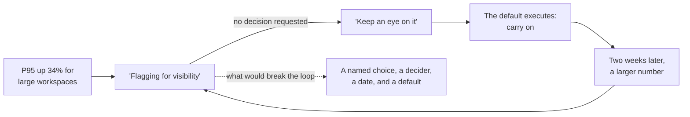
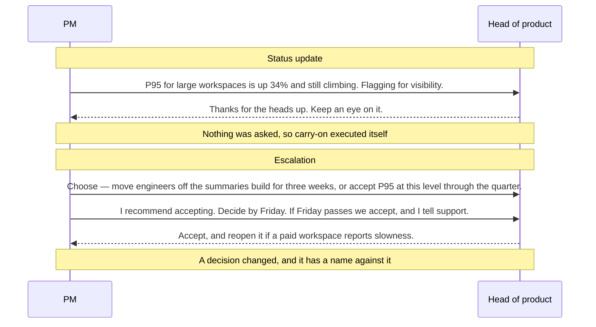

# DS-04 · Review, adaptation, and escalation

> Review should improve the work and expose risk while preserving ownership;
> escalation should name the exact decision needed.

## Problem — the escalation that asked for nothing

A PM writes to leadership: "P95 response time for large workspaces is up 34%,
and the trend is continuing. These workspaces hold a disproportionate share of
paid seats. Flagging for visibility."

The reply comes back within the hour: "Thanks for the heads up. Keep an eye on
it." Two weeks later the PM sends the same message with a larger number. The
same reply arrives.

Nothing moved, and nothing moved because **nothing was asked.** The PM believes
they escalated. Leadership believes they were informed. Both are behaving
reasonably. The message reported a status, and a status has no addressee who
must act, so the default — carry on — executed itself twice.

The loop is stable, which is why it can run for months without anyone noticing
that it is a loop:

There is a second failure that hides behind the first. A senior reviewer looks
at a plan, sees a weakness, and rewrites the plan. The plan improves. The owner
learns that plans get corrected above them, and brings the next one later and
thinner. The work got better once, and the system that produces work got worse.

Both failures are invisible from inside because both feel like diligence. Noted's
team makes this concrete in a specific way: it reviews code carefully and
reviews decisions not at all. Its review system is excellent at catching defects
and has no mechanism for catching assumptions.

Ask yourself about the last thing you escalated: *what decision changed, and who
made it?* If you cannot name both, you sent a status update.

## Concept — name the problem, not the fix

### Review has three jobs, and mixing them costs you

| Job | What it produces | Preserves ownership when |
|---|---|---|
| **Improve the work** | Named weaknesses and options | The reviewer names the problem; the owner chooses the fix |
| **Expose risk** | A risk that was invisible, with its trigger and consequence | The risk goes to the owner first, not around them |
| **Verify readiness** | A pass or fail against a stated gate | The gate criteria were written before the work started |

Run these as separate passes, or say which one you are doing. A review that
silently mixes "improve" and "verify" produces a reviewer's opinion presented as
a gate, and the owner cannot tell whether they are being advised or blocked.

The ownership rule is simple and hard: **a reviewer may name any problem and may
not choose the fix.** If the reviewer must choose the fix — because the
consequence is theirs, or the expertise is theirs — then they own that decision
and should say so out loud, rather than expressing it as feedback.

Both of these reviews of your Noted delivery sequence spot the same real
weakness. Only one of them leaves you owning your own plan:

**Weak** — "I've reordered your sequence so the large-workspace performance work
comes first, and moved the summaries slices behind it."

The plan is now better and is no longer yours. You learned that sequences get
corrected above you, so the next one arrives later and says less. The work
improved once; the system that produces work got worse.

**Strong** — "Your sequence assumes the summaries build can absorb a three-week
interruption. I cannot see what makes that true. That is the problem I am
naming. The fix is yours."

The same weakness, transferred without the decision attached. You may respond by
resequencing, by defending the assumption, or by escalating it — and whichever
you choose, you still own the outcome.

### Adaptation: what a review is allowed to change

Not every change discovered in review is the same size. Three tiers, and the
tier determines who decides.

| Tier | What changes | Who decides | What is recorded |
|---|---|---|---|
| **Inside the slice** | Implementation, approach, local scope | The owner, immediately | Nothing formal |
| **Inside the commitment** | Sequence, scope, dates within the committed outcome | The owner, and it is written down | An amendment to the DS-02 sequence |
| **The commitment itself** | The outcome, the population, the displacement | Escalate; the DS-01 brief is re-opened | A new or amended commitment brief |

Most delivery friction comes from tier confusion. A team that escalates tier-one
changes trains its leadership to micro-manage. A team that absorbs tier-three
changes quietly ends the quarter having delivered something nobody committed to.

### Escalation names the exact decision

An escalation is a request for a specific decision from a specific person. It
has five parts, and dropping any one of them converts it back into a status
update.

1. **The decision needed**, stated as a choice with its alternatives. Not "we
   have a performance problem" but "move two engineers off the summaries build
   for three weeks, or accept P95 at its current level through the quarter."
2. **Who must decide, and why it is above the owner.** There are only three
   honest reasons: the consequence lands outside the owner's scope, the decision
   is hard to reverse, or the required authority is specialist. If none of the
   three applies, you own it.
3. **The date, and the default that executes if the date passes.** An escalation
   with no date has no force. An escalation with no default is a request for
   permission to keep waiting.
4. **The evidence held, and what it cannot establish.** Including the absences.
   A missing signal is evidence about your listening channels before it is
   evidence about the world.
5. **What you recommend.** Escalating without a recommendation transfers the
   thinking as well as the decision, which is how a PM becomes a message router.

The difference between the two messages is visible in the exchange itself. Same
signal, same two people, same week — and only the second one has an addressee
who must act:

Read the second exchange again and find the four parts that the first one is
missing: the alternatives, the date, the default, and the recommendation.

### Boundary

Escalation is not always the right move, and treating it as a virtue damages the
system.

When the decision sits inside the owner's authority, escalating it transfers
accountability upward and teaches the team to stop deciding. A team that
escalates well and decides rarely has a fast path to leadership and no judgment
of its own. Before escalating, check the three reasons above honestly.

There is also a legitimate category that looks like escalation and is not:
**notification.** A known, accepted risk restated on a schedule needs visibility
without a decision. Label it as notification. If you route notifications through
the escalation path, real escalations lose their force, and the next one that
needs a decision reads as one more thing to be aware of. That is exactly how the
P95 message failed.

Finally, this model assumes there is someone with the authority to decide. When
the decision genuinely has no owner anywhere in the organization, an escalation
will not create one. That is an ownership gap from DS-03, and it needs a
different fix.

## Build — on Noted

Read `lessons/noted/case.md` if you have not already.

Take **Signal 3: P95 response time rose 34% for large workspaces.**

"Large" means more than 500 documents, about 4% of workspaces. Those workspaces
hold a disproportionate share of paid seats. No support tickets have mentioned
speed; the signal came from monitoring. The decision on the table is whether to
move engineering time this cycle away from planned features.

You are holding a commitment from DS-01 and a sequence from DS-02. This signal
arrived after both.

**Your task.** Run this through review, adaptation, and — only if it earns it —
escalation.

1. Run the three review jobs separately on your current plan against this signal.
   Say what each pass produces. Do not let "expose risk" turn into "verify
   readiness" because the risk makes you uncomfortable.
2. Decide the adaptation tier. Is this a change inside the slice, inside the
   commitment, or to the commitment itself? Justify the tier before you act on it.
3. Apply the three-reason test. Is this decision genuinely above you? If it is
   not, say so and decide it yourself, in writing.
4. If it is above you, write the escalation with all five parts. The decision
   must be stated as a choice with alternatives, and it must have a default that
   executes if the date passes.
5. Handle the absence of support tickets explicitly. State what that absence can
   and cannot establish, given what you know about the listening channels
   available to those workspaces.
6. Write one thing from this signal that is a notification, not an escalation,
   and route it differently.

**Expect to be pushed on:** whether "keep monitoring and act if tickets arrive"
is a default or an evasion; whether zero tickets is evidence of no user harm or
evidence of no listening channel; and whether you escalated a decision that the
three-reason test says you own.

### What a strong answer holds

- The three review jobs run as separate passes, each with a stated output, and
  no pass where a discovered risk quietly becomes a gate.
- An adaptation tier named and justified before any action is proposed.
- The three-reason test applied honestly. If none of the three applies, the
  answer decides in writing and does not escalate. The Concept section's
  example exchange is an illustration, not the answer.
- If it escalates, all five parts are present: a choice with alternatives, a
  named decider and the reason it is above you, a date with a default, evidence
  with its limits, and a recommendation.
- A statement of what zero tickets can and cannot establish, given what the
  case does and does not say about how those workspaces could complain. At
  least one item routed as a notification, with the reason.
- The most common weak move is "keep monitoring and act if tickets arrive" as
  the default. It is weak because it relies on a listening channel the case
  gives you no reason to believe exists.

## Use — on your product

Take the last escalation you sent, and one review you received.

1. What exact decision did your escalation ask for, with what alternatives? If
   none, rewrite it now.
2. Which of the three reasons made it above your authority — consequence,
   reversibility, or specialist expertise? If none applies, why did you escalate?
3. What was the default if nobody replied, and did anyone know it?
4. In the review you received, did the reviewer name a problem or choose a fix?
   What did that do to your ownership of the work?
5. Which of the things you currently route as escalations are actually
   notifications, and what is that costing your real escalations?

Write `<unknown>` where you do not know. In particular, if you do not know what
your last escalation's default was, write that down — a decision request with an
unknown default has already been decided by the default.

## Ship — Review and escalation protocol

Produce `artifacts/DS-04-review-and-escalation-protocol.md` using the template
in `artifact.md`.

Write it for two audiences at once: the people who will review your team's work,
so they know which job they are doing, and the person who receives your
escalations, so they know that anything arriving through this path requires a
decision from them by a date.

In your Product Decision Case, this artifact is what keeps DS-01 honest under
pressure. A commitment survives contact with reality only if there is a defined
path for the moment when the commitment turns out to be wrong.

## Carry forward

A protocol that separates the three review jobs, assigns adaptation to a tier,
and turns escalation into a dated decision request with a default. DS-05 puts
this to work at the highest-stakes moment: it takes the single event most teams
call "launch" and separates it into four decisions, each with its own control,
its own owner, and its own reversal condition.
