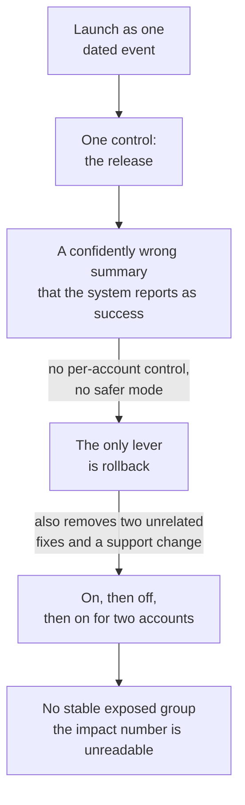
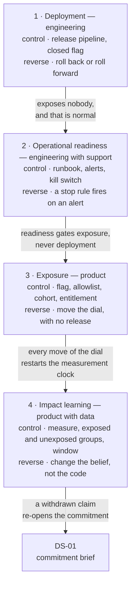

# DS-05 · Launch, exposure, and learning

> Deployment, user exposure, operational readiness, and impact learning are
> separate decisions with separate controls.

## Problem — launch treated as one dated event

Launch day for Noted's enterprise meeting summaries. The release goes out in the
morning. The feature is on for every enterprise workspace. An announcement email
is sent. The team starts watching a dashboard for impact.

At three in the afternoon, an account manager forwards a message. The summaries
are assigning action owners confidently and, for a subset of meetings, wrongly.
Not garbled — plausible, well-formatted, and wrong. Someone in one of the three
accounts has already acted on one.

Now watch what the team can actually do. Its only lever is to roll back the
release. That release also contains two unrelated fixes and a change the support
team depends on. Rolling back removes all of it. It cannot turn the feature off
for one account, because there is no per-account control. It cannot degrade the
feature to a safer mode, because there is only one mode. Nobody knows what the
alert threshold should have been, because the failure does not raise an error —
the system reports success.

Two weeks later, the impact number is unreadable. During the measurement window
the feature was on for everyone, then off, then on for two accounts. The
comparison has no stable exposed group and no unexposed group.

Nothing here was a delivery failure. The build was clean, the sequence held, the
review was thorough. The failure is upstream of all of it: **the team treated
launch as one dated event.** One event gives you one control, one owner, one
reversal path, and one measurement window — for four different failure modes
that arrive at different times and are answered by different people.

That word is the trap. "Launch" reads like a single act, and every calendar,
announcement plan, and status update in most companies reinforces it.

Trace what the single event costs. Each arrow is a consequence of the collapse
above it, not a mistake anyone made on the day:

Ask your team: *if this behaves badly for one customer at four o'clock on a
Friday, what exactly do you turn off — and what else goes off with it?*

## Concept — four decisions inside the word launch

There are four decisions inside the word "launch". They are separable, and each
has its own control, its own owner, and its own reversal condition.

| Decision | The question it answers | Control | Reversal | Typical owner | Failure it prevents |
|---|---|---|---|---|---|
| **Deployment** | Is this code running in production? | Release pipeline, dark deploy behind a closed flag | Roll back or roll forward the release | Engineering | Broken code reaching production |
| **Exposure** | Which users can see and use it? | Flag, allowlist, cohort, percentage, entitlement | Change the exposure setting, with no release | Product | Harm spreading faster than you can detect it |
| **Operational readiness** | Can we run it, support it, and stop it? | Runbook, alerts and thresholds, on-call, support scripts, capacity limits, kill switch | A stop rule fires on an alert, not in a meeting | Engineering with support | Being unable to respond to what you exposed |
| **Impact learning** | Did it produce the change you claimed? | Measure definition, exposed and unexposed groups, a stable window, a pre-set readout date | Change the belief and the commitment — not the code | Product with data | Concluding it worked because it shipped |

Separated, they form a chain in which each link holds a different kind of risk.
Read the nodes for what each decision controls and how it reverses, and read the
edges for the rule that connects one to the next:

Five rules follow directly from that chain, and each one is the answer to a real
failure.

**Deployment without exposure is normal.** Code can sit in production for weeks
with nobody able to reach it. Separating these two is what makes small,
frequent, boring releases compatible with careful product judgment. A team that
cannot deploy without exposing is forced to choose between shipping rarely and
exposing carelessly.

**Exposure is a dial, and the dial must move without an engineering release.**
If turning a feature off requires a deploy, a code review, and a pipeline run,
you do not have an exposure control — you have a deployment control that you
have decided to call an exposure control. The test is the Friday-afternoon test
above.

**Operational readiness gates exposure, not deployment.** You may deploy before
the runbook exists. You must not expose before it does. Readiness is the answer
to "what happens when this goes wrong", and that question becomes urgent the
moment a real user is behind it, not the moment the code is in production.

**Impact learning needs a stable exposure window.** Every move of the exposure
dial restarts the clock. This is the deepest reason "launch as one event"
destroys measurability: it puts exposure changes and impact measurement into the
same two weeks and then asks what the number means.

**Each of the four reverses differently, and the reversals are not equivalent.**
Rolling back a deploy does not un-send an announcement or undo a customer's
belief that the feature exists. Turning exposure off does not delete the data
the feature already wrote, or the decisions people made from its output.
Withdrawing a claim about impact does not withdraw the commitment made on the
basis of that claim — that requires re-opening DS-01.

### Exposure has four axes

"Exposed" is not one setting. Deciding a stage means setting all four.

| Axis | The question | Example difference |
|---|---|---|
| **Who** | Which population? | Three named accounts, or all enterprise workspaces |
| **How much** | What share of them? | 5% of eligible workspaces, or all of them |
| **What depth** | Which part of the capability? | Summary text only, or summary plus assigned action owners |
| **How visible** | Do they know it is new? | Silent availability, in-product notice, or an announcement email |

A silent exposure of summary text to 5% of workspaces and an announced exposure
of owner assignment to three named enterprise accounts are different decisions
with different reversal costs. The second is close to irreversible in the way
that matters: you cannot un-tell a customer that a capability exists.

### The AI evaluation boundary

Noted's summaries are AI output, which changes what readiness and exposure have
to cover. Carry the model from TJ-05 into this plan.

**Exposure to a new customer is exposure to a new input distribution.** The
evaluation you ran does not transfer automatically. A summary system that
performs well on the meetings you tested is making a claim about those meetings.
A new account brings different meeting shapes, vocabulary, and length. Each
exposure stage is therefore also an evaluation stage, and the evaluation must be
re-run on that stage's inputs before the next stage opens.

**An error rate is not a sufficient stop rule.** The failure in the opening
scenario produces no error. The system returns a well-formed summary and reports
success. Anything that watches for exceptions, timeouts, or failed requests will
show green throughout. A stop rule for probabilistic output needs a quality gate
that a human applies to a sample, at a sample rate that starts high and falls
only as evidence accumulates.

**Human authority over the output is part of the exposure decision.** Ask
whether the user can see that the owner assignment was generated, whether they
can correct it, and whether the correction persists. If they cannot, then
exposure carries more risk than the deployment risk suggests, because a wrong
output becomes a durable record rather than a suggestion.

**Falling back is not the same as rolling back.** An AI feature usually has a
lower-capability mode that is still useful: extract the text without assigning
owners, or produce a draft that is explicitly unassigned. Degrading to that mode
is a third option between "leave it running" and "take it away", and it is
available only if someone built it as a mode.

One honest limit from the case: meeting type is not captured in event data. So
you cannot segment output quality by meeting type. If the failure is specific to
one kind of meeting — and the opening scenario says it affects a subset — your
evaluation cannot see the pattern it most needs to see. Write that into the plan
as a known blindness, not as a task for later.

### Boundary

The four-way separation costs real machinery, and it is not free to keep.

Flags, entitlement checks, runbooks, sampling review, and a measurement plan all
have build cost and maintenance cost. Flags in particular do not stay harmless:
every long-lived flag is a permanent branch in the system, and accumulated flags
cause their own outages and their own untested code paths. Separating four
decisions for a small, reversible, low-consequence change to a personal
workspace is overhead that slows a team without reducing risk.

The separation earns its cost when at least one of these is true:

- Exposure is hard to reverse, because someone has already seen it or acted on it.
- The failure is silent, so you will not learn about it from an error.
- The consequence lands on someone who did not choose to take the risk.

Enterprise summaries meet all three. A change to the ordering of a personal
sidebar meets none.

The second limit is honesty about what cannot be staged. Some exposure is
genuinely all-or-nothing: a public pricing change, a legal notice, a published
API contract, a change to a shared document that other people can already see.
For those, the right move is to say so and put the effort into readiness and
reversal instead of designing a rollout ladder that does not exist. A fake
ladder is worse than an admitted single step, because people plan against it.

## Build — on Noted

Read `lessons/noted/case.md` if you have not already.

Take **Signal 2: automated meeting summaries for enterprise team leads** — the
commitment from DS-01, sequenced in DS-02, with the system mapped in DS-03 and
the escalation path from DS-04.

What the case gives you, and what constrains this plan: three enterprise accounts, roughly 20% of
revenue, all reached through one account manager. The team collaboration
environment is in design, not live. Meeting type is not captured in event data.
Actor identity is missing for about 18% of events. The support lead holds the
closest record of what customers actually said.

**Your task.** Produce a staged launch plan that treats launch as four decisions.

1. Write the four decisions separately. For each: the control, the owner, the
   reversal condition, and the exact person or alert that triggers the reversal.
   Do not let one owner hold all four.
2. Confirm your exposure control can move without an engineering release. If it
   cannot, say so plainly and record it as a gap, because everything else in
   this plan depends on it.
3. Build an exposure ladder with at least three stages. For each stage, set all
   four axes — who, how much, what depth, how visible — and write an entry gate
   and an exit gate. The exit gate must be an observation, not a duration.
4. Write the operational readiness checklist that must pass before stage one
   exposure. Include the kill switch, who may pull it, and what happens to
   in-flight work when it is pulled. Note which items are not required before
   deployment.
5. Apply the AI evaluation boundary. State what you evaluate before each stage,
   the human review sample rate and how it decreases, the human authority a user
   has over an assigned action owner, and the degraded fallback mode. Explain in
   one sentence why an error rate cannot detect the failure in the opening
   scenario.
6. Write the impact learning plan: the measure definition, the exposed and
   unexposed comparison, the stable window, and the readout date set in advance.
   State what this measurement cannot establish, given that meeting type is not
   captured and actor identity is missing for about 18% of events.
7. Name the one observation that would stop the ladder and re-open the DS-01
   commitment brief — and say who is allowed to make that call.

Two plans for the same feature, both written by someone who had done the build
work well. The first is the opening scenario before it happened:

**Weak** — "Release on launch day. Summaries on for every enterprise workspace,
with owner assignment. Announcement email the same morning. Watch the dashboard
for two weeks and report impact."

One date, one control, one owner, one window. Deployment and exposure are the
same act, so the only reversal is a rollback that takes unrelated work with it.
The announcement makes the exposure irreversible in the way that matters. And
the measurement window opens on the day the risk is highest, which is the day
the dial is most likely to move.

**Strong** — "Deploy on launch day behind a closed flag; nobody is exposed.
Readiness gate before any exposure — kill switch tested, the support lead knows
what they may stop and what happens to in-flight work. Stage one: one named
account, summary text only, no owner assignment, no announcement. Exit gate is a
sampled human review finding no wrongly assigned owner, not a number of days.
Measurement starts only after the dial stops moving."

Four decisions, four controls, four reversals. Depth is a dial too: withholding
owner assignment removes the exact failure mode the opening scenario produced,
without withholding the feature.

The difference is not caution. The weak plan may well go fine. The difference is
what each plan can do at three in the afternoon when it does not.

**Expect to be pushed on:** whether your exposure control genuinely moves
without a release; whether your stop rule can detect a confidently wrong summary
that the system reports as a success; and whether your measurement window
survives your own rollout schedule, or whether your stages move the dial inside
the window you plan to measure.

### What a strong answer holds

- Four decisions with four different controls, owners, and reversal triggers.
  No single person holds all four.
- A straight answer on whether exposure moves without a release — and if it
  does not, that gap is named as the first thing the plan depends on.
- A ladder where every stage sets all four axes, and every exit gate is an
  observation rather than a number of days.
- A stop rule that a human applies to a sample, because the failure this plan
  guards against reports success. An error rate alone is named as insufficient,
  with the reason.
- A measurement window inside which the dial does not move, plus a plain list
  of what uncaptured meeting type and missing actor identity on about 18% of
  events make unmeasurable.
- The most common weak move is an exit gate written as a duration — "two weeks
  at stage one." It is weak because time passing is not evidence that nothing
  went wrong; it is only evidence that nobody looked.

## Use — on your product

Take the next thing your team plans to launch.

1. Which of the four decisions currently share a control in your system, and
   what does that force you to give up when one of them goes wrong?
2. If it behaves badly for one customer on a Friday afternoon, what do you turn
   off, who can turn it off, and what else goes off with it?
3. What is your stop rule, and could it detect a failure that the system reports
   as a success?
4. Over what window will you measure impact, and how many times will exposure
   change inside that window?
5. Which single exposure step in your plan is genuinely irreversible, and what
   readiness does that step require that the earlier ones do not?

Write `<unknown>` where you do not know. The most common `<unknown>` here is the
stop-rule threshold. Leave it visible. A launch plan with a named missing
threshold is safer than one with a threshold invented on the day.

## Ship — Staged launch plan

Produce `artifacts/DS-05-staged-launch-plan.md` using the template in
`artifact.md`.

Write it for the person who will be on call during stage one and for the support
lead who will hear from the customer first. Both need to know, without asking
you, what they are allowed to stop and what happens when they stop it.

In your Product Decision Case, this is the artifact that converts a commitment
into contact with real users, under controls you chose in advance rather than
under pressure at three in the afternoon. It is also the artifact that produces
the only honest input to DS-06: a written expectation that reality can
contradict.

## Carry forward

Four separated decisions, an exposure ladder with gates, readiness that precedes
exposure, an evaluation boundary suited to probabilistic output, and a
measurement window that survives the rollout. DS-06 takes what this plan got
wrong and turns it into a change to an operating rule, an interface, a
threshold, or a capability — not into a list of feelings about the launch.
