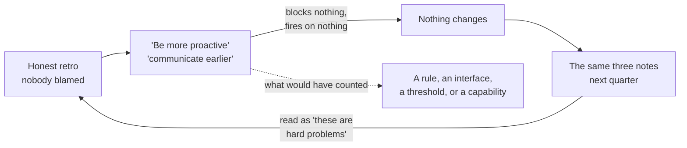
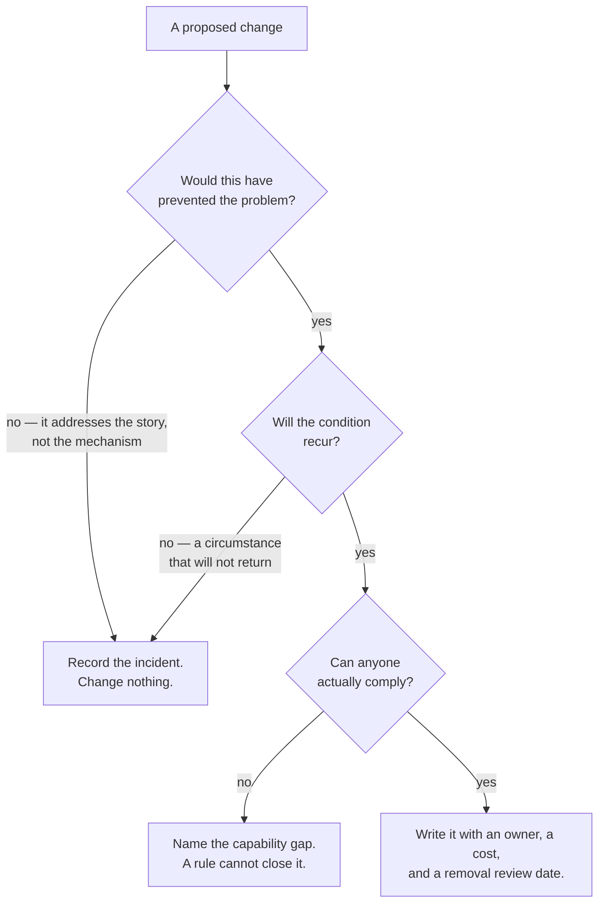

# DS-06 · System improvement

> Retrospectives matter when they change an operating rule, interface,
> threshold, or capability — not when they only record sentiment.

## Problem — the honest retrospective that changes nothing

The retrospective after the launch is a good one. People are honest. Nobody gets
blamed. The board fills with notes: "communication could have been better", "we
felt rushed at the end", "the flag work paid off", "the metric definition
confused everyone". The team leaves feeling closer and clearer.

The actions written down are: be more proactive about surfacing risk, improve
documentation, and communicate earlier with support.

Nothing happens. Not because anyone was insincere, but because none of those
sentences can block anything, fire on anything, or be checked by anyone. Next
quarter the same three notes appear, and the team reads that as evidence that
these are hard problems rather than evidence that nothing was changed.

The loop closes on itself, and each turn produces evidence for the wrong
conclusion:

The failure is hard to see because the retro was good by the standards most
teams use. It was honest, safe, and well attended. Honesty is being mistaken for
change. And there is a second, quieter substitution: the team fixed the
incident. The wrong action owners in three summaries were corrected. That is
repair. It is not improvement, because the system that produced them is
unchanged and will produce them again at the next exposure stage.

Ask yourself: *name one thing your team does differently today because of a
retrospective held in the last six months.* If you cannot name it, and point at
where it is written, your retrospectives are producing a feelings log.

## Concept — four forms a real system change takes

A retrospective produces exactly one class of output that counts: a **system
change**, in one of four forms. Everything else may be true, may be worth
saying, and is not the output.

| Form | What changes | Example shape | How you verify it happened |
|---|---|---|---|
| **Operating rule** | A constraint on how decisions or work proceed | "No exposure stage begins without a named stop-rule owner" | It blocks something within a stated period, or it is not a rule |
| **Interface** | A contract between two owners | "Support receives the exposure list before stage 2, not after" | The other side can describe the contract without being prompted |
| **Threshold** | A number that triggers an action | "P95 above X for two consecutive days opens a decision, not a watch" | It fires at least once, and the named action follows |
| **Capability** | Something the team can now do that it could not | "Exposure can be closed per account without a release — a flag, not a deploy" | Demonstrated, not planned |

The verification column is the part teams skip, and it is what separates a
change from an announcement. A rule that has never blocked anything is not
operating. A threshold that has never fired has not been tested against reality.
A capability that exists in a ticket does not exist.

### A system change is a commitment

It inherits everything from DS-01. It has an owner. It costs something. It
displaces something — usually speed, or someone's autonomy, or a step that used
to be optional. And it needs a **removal review date**.

This last part is missed almost universally. Rules accumulate. A team that adds
one rule per retrospective becomes, in two years, a team that cannot move, and
every individual rule in the pile was justified when it was written. A rule
adopted with no condition for its removal is process debt with no repayment
schedule. State when it will be reviewed, and what evidence would retire it.

### Repair and improvement are different work

| | Repair | Improvement |
|---|---|---|
| Object | The instance that failed | The system that produced it |
| Example | Correct the wrong owners in three summaries | Add a sampled quality review before each exposure stage |
| Success | The problem is gone | The next occurrence is prevented, caught earlier, or made cheaper |
| Risk if skipped | Users stay harmed | The same incident recurs with different details |

Both are necessary. Only the second changes the next launch. A retro that lists
repairs and calls them actions has produced a to-do list from an incident, which
the incident would have produced anyway.

### The honest input is a written expectation

The useful question in a retrospective is not "how did that feel". It is
**"which of our written expectations turned out to be wrong, and what did that
cost?"**

That question only works if expectations were written. This is what the rest of
the phase was for. The DS-01 brief holds a claim about value and a claim about
effort. The DS-02 sequence holds a claim about what each slice would teach you.
The DS-03 map holds a claim about who would decide what, by when. The DS-05 plan
holds a claim about what your stop rule could detect. Each of those is a
falsifiable statement, and a retrospective that reads them is doing different
work from one that reads the room.

### Boundary

Not every problem deserves a system change, and this is the limit that keeps the
model from becoming its own failure mode.

Apply two tests before writing anything down.

1. **Would this change have prevented the problem?** Many proposed rules would
   not have. They address the story the team told about the problem, not its
   mechanism.
2. **Will the condition recur?** A one-off caused by a circumstance that will not
   return produces a rule that costs forever and prevents nothing.

If either test fails, record the incident and change nothing. "We looked at this
and decided not to change the system" is a legitimate and underused outcome.

There is a second limit. Some failures are **capability failures that a rule
cannot fix.** Telling a team to be more careful with metric definitions, when
nobody on the team owns metric definitions and no one has the skill to write one,
is a rule standing in for a missing capability. The rule will be followed
sincerely and will not work, and the team will conclude it has a discipline
problem. Before writing a rule, ask whether anyone can actually comply with it.

Run every proposed change through both tests and the compliance question before
it is written down. Note that two of the four exits are not changes at all, and
both are correct answers:

The third gate is the one most often skipped, because a rule that nobody can
comply with still reads well in a retrospective document.

## Build — on Noted

Read `lessons/noted/case.md` if you have not already.

Take **Signal 1: activation fell 11% over six weeks** — but do not treat it as a
measurement question this time. Treat the state of that metric as an output of
the system you have been mapping.

What the case gives you: activation is defined as creating a document and returning within
seven days. Nobody on the team defends this definition; it is inherited. The
decline has not been segmented by cohort, channel, or platform. Two changes
shipped inside the window. This number reached a PM, and through the PM it is
now competing for the team's scarce attention against three other signals.

That is a system fact. An undefended metric with no owner is directing product
attention, and no segmentation happens before a signal reaches a decision.

**Your task.** Produce one system change.

1. State the system fact plainly, without proposing a fix. Separate it from the
   activation question itself.
2. Name which written expectation from an earlier artifact this contradicts. If
   none of your artifacts made a claim this could contradict, that absence is
   itself the finding — write it down.
3. Choose exactly one form — operating rule, interface, threshold, or capability
   — and say why the other three are the wrong instrument here. Be specific. If
   the real gap is that nobody can write a metric definition, a rule will not
   help.
4. Write the change with its owner, its cost, what it displaces, and how you
   will verify it happened. The verification must be observable by someone other
   than you.
5. Set a removal review date and the evidence that would retire the change.
6. Apply both boundary tests. Would this have prevented the problem, and will
   the condition recur? Answer honestly, including if the honest answer is that
   you should change nothing.
7. Name one thing from this situation that is true, worth saying, and is not a
   system change. Leave it out of the record deliberately, and say where it goes
   instead.

Step 3 and step 4 are where good intentions become either a change or a
sentence. Both of these were written about the same system fact:

**Weak** — "Action: agree on a better activation definition, and be more careful
about which metrics we act on."

Nothing here can block anything or fire on anything, so nothing can verify it.
It also fails the compliance question: if no one on the team owns metric
definitions, this asks for care where the gap is capability. Next quarter it
reappears as evidence that metrics are hard.

**Strong** — "Operating rule: a signal does not enter the team's attention list
until its metric has a named owner who will defend the definition in writing.
Owner: you. Cost: a signal can wait a week before it is actionable. Displaces:
raising a number in a meeting and having it acted on the same day. Verification:
it blocks at least one signal within one cycle, and the engineering lead can say
which one. Removal review: end of next quarter."

It has an owner, a cost, a displacement, an observable verification, and an end
date. Someone other than you can tell whether it is operating.

Apply the boundary tests to the strong version before you keep it. An inherited,
undefended activation definition is a condition that recurs — but ask honestly
whether this rule would have prevented an 11% decline reaching a PM unsegmented,
or only slowed down the conversation about it.

**Expect to be pushed on:** whether your rule is standing in for a missing
capability; whether you can name the first specific thing your change will block
or fire on, and roughly when; and whether your removal review date is a real
date with a real reviewer or a line written to satisfy this lesson.

### What a strong answer holds

- The system fact stated on its own, with no fix attached, and kept separate
  from the activation question itself.
- The earlier written expectation this contradicts, named — or a plain record
  that none of your artifacts made a claim it could contradict.
- Exactly one form chosen, with a sentence each on why the other three are the
  wrong instrument for this gap.
- An owner, a cost, a displacement, a verification someone other than you can
  observe, and a removal review date with a reviewer.
- Both boundary tests answered honestly, with "change nothing" accepted as a
  legitimate outcome, and a check that nobody is being asked to comply with a
  rule that needs a capability the team does not hold.
- The most common weak move is an action phrased as care — "be more careful
  about which metrics we act on." It is weak because it can block nothing and
  fire on nothing, so nobody can tell whether it is operating.

## Use — on your product

Take your team's last retrospective, and the notes it produced.

1. Which items were repairs of an instance, and which changed the system that
   produced it?
2. Pick one item that changed nothing. Which of the four forms would it have
   needed to take, and who would have owned it?
3. For the rules your team already operates: which one has never blocked
   anything, and should it be removed?
4. Which of your recurring problems is a capability gap being addressed with a
   rule, and what would closing the capability actually require?
5. What expectation did your team write down before the work that reality
   contradicted? If none exists, what will you write down before the next piece
   of work so that the next retrospective has something to test?

Write `<unknown>` where you do not know — especially for the cost and the
displacement of a proposed change. A rule whose cost is unknown is a rule you
have not finished designing.

## Ship — System change record

Produce `artifacts/DS-06-system-change-record.md` using the template in
`artifact.md`.

Write it for the person who will be told, three months from now, that they
cannot do something because of this change. They should be able to read it and
understand what it is protecting, what it costs, and when it will be reviewed
for removal.

This closes your Product Decision Case for the phase. The case now holds a
commitment, a sequence, a system map, a review protocol, a launch plan, and a
record of what the system learned. Read them in order once. The most useful
thing you will find is a place where a later artifact contradicts an earlier one,
because that is where one of your beliefs was load-bearing and wrong.

## Carry forward

One verified system change with an owner, a cost, a displacement, and a removal
review date — plus the habit of writing expectations that reality can contradict.
LD-01 takes this outside your own team. The system changes you can make yourself
run out at the edge of your authority, and beyond that edge you need direction
that other people can use to resolve a trade-off without asking you to decide
again.
