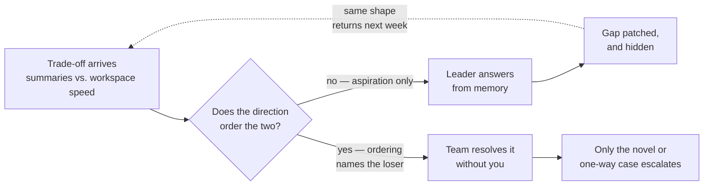
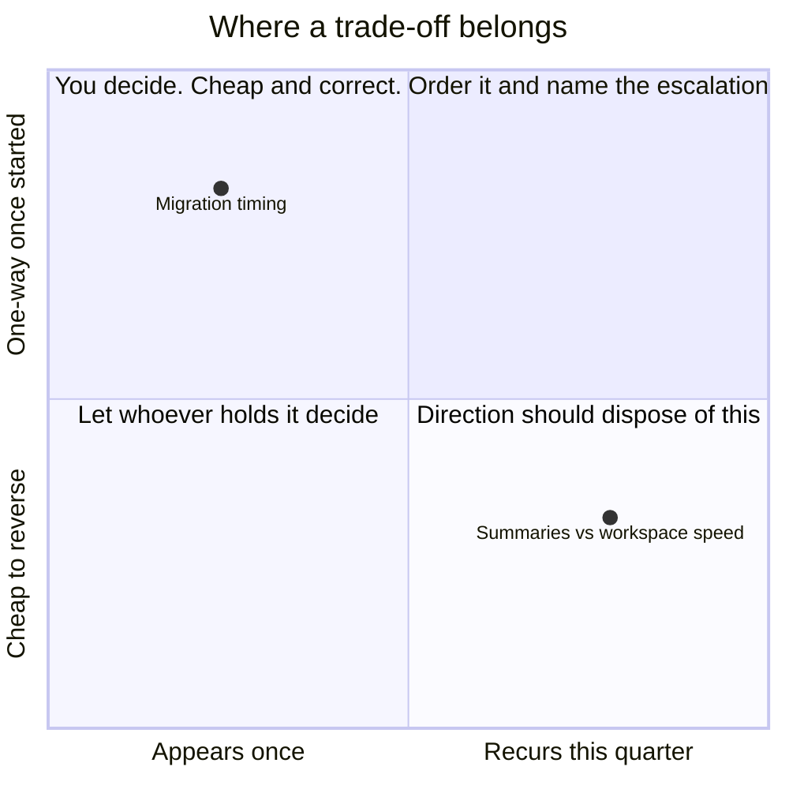

# LD-01 · Direction that enables decisions

> Direction succeeds when people can use it to resolve a real trade-off without
> asking the leader to decide again.

## Problem — the direction that resolves nothing without you

A PM writes a direction document. It says the product wins by making documents
worth returning to. It names the populations, the two-quarter horizon, and the
reason the team believes it. It is reviewed. Everyone agrees. It goes on the
wall.

Nine days later the engineering lead asks a question. Three enterprise customers
want automated meeting summaries. Large workspaces have slowed down. Both need
the same engineers this cycle. Which one? The PM looks at the direction
document, finds nothing that settles it, and answers from memory. The next week
there is another question, and the PM answers that one too.

Six weeks in, the direction has been read by everyone and used by nobody. Every
real trade-off still routes through one person. The PM feels busy and central,
which is easy to mistake for being effective.

The failure is hard to see from inside because the artifact looks correct and
the team agreed with it. Agreement is the wrong test. A direction that everyone
agrees with is usually one that has not yet asked anyone to give something up.
Nobody objects to "documents worth returning to." They object to "we will not
staff enterprise requests this quarter." The second sentence is direction. The
first is a description of a preference.

There is a second failure hiding under the first. Because the PM keeps
answering, the team never finds out that the direction is unusable. Each answer
patches the gap and hides it. The more responsive the leader, the longer the
document stays broken.

Both loops below start from the same trade-off. Only one of them ends anywhere
other than your desk:

The dotted edge is what makes this durable. The shape returns, you answer it
again, and answering feels like the work.

Ask yourself: *in the last month, name one trade-off someone else resolved by
pointing at the direction, and name one they resolved by asking me.* If the
second list is long and the first list is empty, you have published a preference
and called it direction.

## Concept — write the ordering, name what loses

Direction is not a description of where you are going. It is an instrument other
people use to dispose of cases without you.

Four parts. Most direction documents contain the first and stop.

| Part | Question it answers | Failure when it is missing |
|---|---|---|
| **Diagnosis** | What situation are we actually in | Direction becomes timeless and cannot expire |
| **Ordering** | Which value wins when two collide | Every conflict escalates to the leader |
| **Boundary** | What we will not do in this period | Displaced work quietly returns |
| **Revision trigger** | What evidence would change this | Direction hardens into a belief nobody may question |

Ordering is the part that does the work. It is also the part that is
uncomfortable to write, because writing it means naming the thing that loses.

### Three levels of direction

| Level | Example | What it can resolve |
|---|---|---|
| **Aspiration** | "Documents should be worth returning to" | Nothing. It excludes no option. |
| **Ordering** | "Retention of existing paid workspaces beats new-segment expansion this quarter" | A conflict between two funded options |
| **Constraint** | "We will not commit engineering capacity to any request from fewer than five customers until the underlying claim has been tested" | A whole class of incoming requests, in advance |

Aspiration is not useless. It is the reason the ordering is what it is. But an
aspiration alone hands every case back to the leader, because any option can be
argued to serve it.

Here is the same direction written both ways, against the live Noted collision
between the enterprise summaries request and large-workspace response time:

**Weak** — "We care about the health of our existing paid workspaces, and we
want to grow into enterprise."

Both signals serve it. Whoever argues more persuasively on Thursday wins, and
the trade-off comes back to you every time it recurs.

**Strong** — "When a request from a new revenue segment and a defect affecting
existing paid workspaces need the same engineers this cycle, existing paid
workspaces win. The enterprise summaries request waits until the underlying
claim has been tested."

The loser is named. Someone who was not in the room can apply this to a request
you have never seen.

The difference is not tone or length. The weak version excludes nothing, so it
cannot dispose of anything. The strong version gives something up, which is what
makes it usable by someone else.

### The trade-off test

There is one honest test of a direction, and it takes ten minutes.

Take two live requests that both have real support and cannot both be served
this cycle. Hand the direction to someone who was not in the room when it was
written. Ask them which request it resolves, and why.

Three possible results:

1. **They resolve it, and give your reasoning back to you.** The direction
   works.
2. **They resolve it, and give reasoning you disagree with.** The direction
   works, and you have just learned what it actually says. Fix the text, not the
   person.
3. **They say "it depends — what do you think?"** The direction is a values
   statement. Nothing about it will improve until you add ordering.

Result 3 is the common one. It is also the one leaders explain away, usually
with "they just need more context." More context delivered verbally is another
name for deciding it again yourself.

### Direction is written for the person furthest from you

The reader you are writing for is not the person in your weekly meeting. It is
the person who gets the question at 4pm on a Thursday, has thirty minutes, and
cannot reach you. If your direction only functions when accompanied by your
commentary, it is not portable, and it will not survive your absence, your
holiday, or your second and third PM.

### Boundary

Direction cannot resolve every trade-off, and one that tries becomes a rulebook
that is wrong within a month.

Some decisions should still come to you. A genuinely novel case, a one-way
consequence, or a conflict between two boundaries the direction itself set —
these are not failures of direction. They are the residue that direction is not
designed to absorb.

The boundary is this: **direction should resolve the recurring class, not the
singular case.** If a trade-off shape will appear four more times this quarter,
it belongs in the direction. If it will appear once, and reversing it would be
expensive, deciding it yourself is correct and cheap.

The failure at this boundary runs in both directions. Under-specified direction
sends everything to you. Over-specified direction resolves cases that should
have been escalated — for example, a rule that says "always prefer paid-seat
retention" will happily authorize skipping a security migration, which nobody
intended. When you write a constraint, write the class it does not cover in the
same breath.

Two properties place a trade-off, and they are not the same property: how often
its shape recurs, and what it costs to reverse.

The top-left quadrant is the one leaders write rules for and should not. The
bottom-right is the one they answer personally and should not.

## Build — on Noted

Read `lessons/noted/case.md` if you have not already.

**A standing condition for this phase.** The case gives you one dedicated PM —
you — plus a founder, an engineering lead, and a support lead. Phase 07 adds one
condition the case does not contain, and states it openly rather than smuggling
it in: Noted has funded two product hires. The first starts in about three
weeks. The second starts in about ten weeks. Their names, backgrounds, and
strengths are `<unknown>` and will stay unknown for most of this phase. That is
deliberate. Direction and decision rights that only work once you know the
person are not direction and decision rights.

Now take the live collision between **Signal 2 (three enterprise customers want
automated meeting summaries)** and **Signal 3 (P95 response time rose 34% for
large workspaces)**.

These two compete for the same engineering capacity this cycle. What the case
gives you: the three requests arrived through one account manager in one month
and represent roughly 20% of revenue; the underlying enterprise claim has never
been tested; large workspaces are about 4% of workspaces but hold a
disproportionate share of paid seats; no support ticket has mentioned speed.

**Your task.** Write direction that resolves this collision without you in the
room.

1. Write the **diagnosis** in three sentences. What situation is Noted actually
   in right now? Not the aspiration — the constraint or dynamic that makes this
   period different from the last one.
2. Write one **ordering** sentence: when the interests of existing paid
   workspaces collide with the interests of a new revenue segment, which wins
   this quarter, and why. Name the loser explicitly.
3. Write one **constraint** sentence: a class of incoming request you will not
   staff this period, stated so that someone can apply it to a request you have
   never seen.
4. Apply your own direction to the two signals. Write the answer it produces.
   If the answer surprises you, do not adjust the answer. Adjust the text.
5. Now apply it to **Signal 4 (the platform dependency loses support in ten
   weeks)**. Your direction was not written for this case. Say whether it
   resolves it, mis-resolves it, or correctly declines to resolve it. If it
   mis-resolves it, add the class exclusion.
6. Write the **revision trigger**: the observation and threshold that would make
   this ordering wrong.
7. Commit. State the one sentence of your direction that someone on the team
   will most want to argue with, and say why you are keeping it.

**Expect to be pushed on:** whether your ordering sentence actually excludes
anything or just restates a preference in stronger words; whether the constraint
in step 3 can be applied by a person who has never met the enterprise customers;
and whether step 5 shows your direction quietly authorizing a delay to a
security migration that nobody intended it to authorize.

### What a strong answer holds

- A diagnosis that describes the constraint or dynamic of this period — what
  makes it different from the last one — and not an aspiration.
- An ordering sentence that names the loser, and a constraint that a person who
  has never met the customers could apply to a request you have never seen.
- The direction applied to signals 2 and 3, with the answer it produces written
  down, and the text changed rather than the answer if the two disagree.
- The direction tested against Signal 4, with either a class exclusion added or
  a clear account of why it correctly declines to resolve that case.
- A revision trigger with an observation and a threshold. A refusal to write a
  rule for the singular, one-way case that should come to you.
- The most common weak move is an ordering that restates a preference more
  forcefully — "we prioritise existing paid workspaces." It is weak because both
  live signals can still be argued to serve it, so it disposes of nothing.

## Use — on your product

Take the direction that currently governs your own team. If nothing is written
down, write the sentence you have been saying out loud.

Answer five questions:

1. What is the last trade-off someone on your team resolved without asking you,
   and which sentence of your direction did they use?
2. Which option does your direction explicitly displace this period? Name it.
   If nothing is displaced, your direction has no ordering.
3. Hand your direction to one person who was not in the room when it was
   written, with two live competing requests. What did they conclude?
4. Which recurring trade-off arrives at your desk more than twice a month and is
   still not covered?
5. What observation would make your current ordering wrong, and who is watching
   for it?

Write `<unknown>` where you do not have the answer today. In particular, if you
cannot answer question 1 from memory, write `<unknown>` rather than
reconstructing an example. The absence is the finding.

## Ship — Decision-enabling direction

Produce `artifacts/LD-01-decision-enabling-direction.md` using the template in
`artifact.md`.

Write it for the person who joins your team in three weeks and gets a hard
question on their fourth day. That person has no history with you, no shared
shorthand, and no standing to interrupt you. If the document does not let them
resolve a real case alone, it has failed, no matter how accurate it is.

This extends your Product Decision Case upward. Every earlier artifact defended
one decision. This one defines the conditions under which a class of future
decisions can be made by someone else, which is what makes the rest of this
phase possible.

## Carry forward

An ordering sentence that names a loser, one constraint that applies to requests
you have not seen, and at least one trade-off class your direction correctly
refuses to resolve. LD-02 takes that residue — the cases direction cannot
absorb — and assigns them: who decides, on what evidence, with what escalation
boundary, and how that boundary moves as trust is earned.
