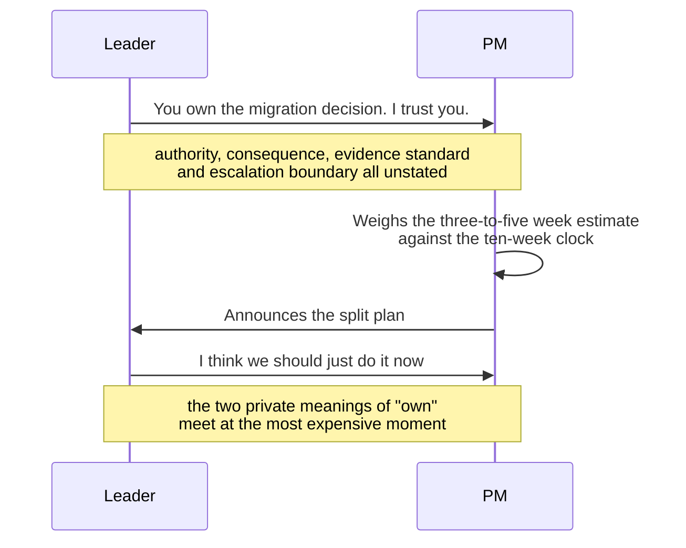
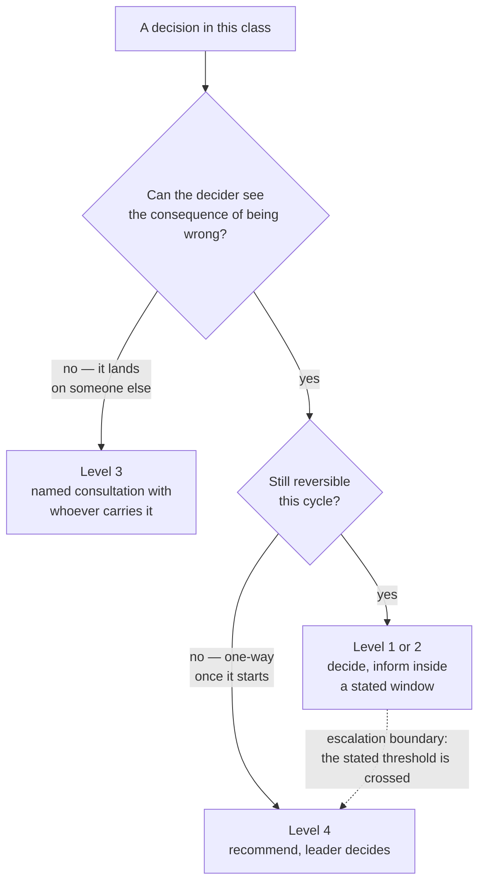

# LD-02 · Decision rights and progressive autonomy

> Autonomy grows when authority, consequence, evidence standards, and escalation
> boundaries are explicit.

## Problem — the decision that was loaned, not delegated

A leader tells a PM: "You own the migration decision. I trust you."

The PM spends a week with engineering, weighs a three-to-five week estimate
against a ten-week deadline, and decides to spread the work across the quarter.
They announce it. The leader hears about it in a standup, goes quiet, and then
says: "I think we should just do it now and get it behind us."

Both people leave that exchange with a different story. The PM believes the
ownership was fake. The leader believes the PM made a call above their weight
class. Neither is lying. The word "own" was never defined, so each person filled
it in with their own meaning, and the meanings only collided at the moment it
was most expensive.

What actually went wrong is not trust. It is that four separate things were
bundled into one word and none of them was written down. Who decides. Who
carries the consequence if it goes badly. What evidence would have made the
decision acceptable regardless of the answer. And what condition should have
brought it back before it was announced.

Trace the handoff and the collision has a location. It is not the announcement.
It is the first line:

Everything after the first message was going to end this way. The note in the
middle is the whole lesson: four things were bundled into one word, and neither
person could see the other's version until it cost something.

The failure is hard to see from inside because delegation feels generous in the
moment. "You own it" is a pleasant sentence to say. It costs the leader nothing
at the time and costs them nothing later either — they can always reclaim the
decision, because they never specified the conditions under which they would
not. Vague grants of autonomy are always revocable. That is what makes them
comfortable to give.

There is a quieter cost. Because the leader never wrote an evidence standard,
the PM had no way to know whether their reasoning was good enough before they
committed. They found out by being overruled. That teaches compliance, not
judgment.

Ask yourself: *the last time I gave someone a decision, could they have written
down, in advance, the condition under which I would have taken it back?* If not,
you did not delegate a decision. You loaned one.

## Concept — a decision right is four statements

A decision right is four statements, not one.

| Component | The question it answers | Failure when it is left implicit |
|---|---|---|
| **Authority** | Who makes the call, at what level | "Own it" collapses into "propose it" at the worst moment |
| **Consequence** | Who carries the cost if it is wrong | The decider optimizes for approval, not outcome |
| **Evidence standard** | What must be shown before deciding | Quality is judged after the fact, by taste |
| **Escalation boundary** | What condition sends it back up | The leader intervenes on mood, and it reads as arbitrary |

Write all four or you have written none.

### Levels of authority

"Autonomy" is not binary. Name the level explicitly.

| Level | What it means | Who announces the outcome |
|---|---|---|
| **1 · Decide alone** | You decide. No notification required before acting. | The decider |
| **2 · Decide and inform** | You decide, then tell named people within a stated window. | The decider |
| **3 · Decide after named consultation** | You must hear from specific people first. You are not required to agree with them. | The decider |
| **4 · Recommend, leader decides** | You do the work and take a position. The call is not yours. | The leader |
| **5 · Leader decides** | The decision is not delegated. | The leader |

Level 3 is the one that gets corrupted. Consultation is not consensus. If the
named people can block, you have written level 4 and called it level 3, and the
person will discover the difference in public.

The other common corruption is level 2 with a quiet veto: "decide and inform,
but check with me first." That is level 4. Say level 4. A person operating at
level 4 who knows it is level 4 will do better work than a person told they are
at level 2 and corrected each time.

Two questions place most decisions on that scale — whether the decider can see
the consequence, and whether the choice can still be undone this cycle:

The dotted edge is the escalation boundary, and it is the only line on this
diagram that has to be written down in advance. Undrawn, it still exists — it
just gets drawn after the fact, by the leader, on the day they dislike an
answer.

### Consequence is separate from authority

These come apart more often than people expect, and the split is legitimate.

A PM may hold authority over what gets built while the engineering lead carries
the consequence of a system that becomes unmaintainable. A support lead may hold
authority over what a customer is told while the PM carries the consequence of a
commitment that constrains the roadmap.

Name both. When authority and consequence sit with different people, the person
carrying the consequence needs a named channel — usually a documented objection,
not a veto. Unnamed, they will use the only channel available to them, which is
escalating to whoever will listen.

### Evidence standard: the part almost everyone omits

An evidence standard says what has to be true about the *reasoning* for the
decision to be acceptable, independent of which option is chosen.

Written on Noted's migration decision, the two versions look like this:

**Weak** — "Make a well-reasoned call on the migration."

The person cannot tell whether they have done enough until you react. You judge
the reasoning after seeing the answer, which means you are really judging the
answer.

**Strong** — "Before choosing, show me: the engineering estimate with its range
and its basis; the consequence of end-of-support stated separately from its
probability; one option you rejected and why; and the observation that would
make you reverse."

Migrating now and spreading the work across the quarter can both satisfy this.
That is the test of a standard: it constrains the reasoning, not the choice.

Note what this does. It lets the person know, before they commit, whether they
have done enough. It also means that if they meet the standard and you still
disagree with the answer, the disagreement is about judgment, not process — and
you must either let it stand or admit you are overruling. Both are honest. What
is not honest is deciding after the fact that the process was insufficient
because you disliked the outcome.

### Progressive autonomy

Autonomy is granted per decision class, not per person. The same PM can be at
level 1 on activation instrumentation and level 4 on anything that changes an
external customer commitment. That is not an insult. It is precision.

Movement should have a stated rule. The usable rule is calibration, not tenure
and not likeability:

> You move a level in this class when your last three decisions in it carried a
> written prediction made in advance, and the outcomes fell inside the
> confidence you stated.

This rewards the thing you want — stated uncertainty that turns out to be
honest — rather than the thing that is easy to see, which is confident delivery.
A person who is right 90% of the time and claims certainty every time is worse
calibrated than a person who is right 70% of the time and said so.

Autonomy can also move down. Say that in advance too, and say what would trigger
it, or the first reduction will land as a punishment.

### Boundary

Decision rights cannot be granted for a decision whose consequence the person
cannot see or carry.

If a PM cannot observe the cost of a maintenance burden they created, granting
them authority over it does not build judgment — it builds a habit that goes
uncorrected because the feedback lands on someone else. In that case the right
move is not to grant the decision. It is to change what they can see first, or
to place them at level 3 with the person who does carry it.

A second limit: a rights map is written against a situation, and situations
change. A decision class that was cheap to reverse can become one-way — the
moment a migration starts, the moment a commitment reaches a customer, the
moment a public announcement goes out. Rights maps that do not name their
expiry get applied after they stopped being true. Write the condition that
voids each row.

A third limit, and the one that catches product leaders: you cannot delegate
specialist authority you do not hold. You can decide who decides. You cannot
convert a PM into the person qualified to judge a technical risk, and writing
"PM decides" on that row does not make the risk go away — it just removes the
one person who could see it from the decision.

## Build — on Noted

Read `lessons/noted/case.md` if you have not already.

The standing condition from LD-01 still applies: two PM hires are funded, the
first starting in about three weeks, and their strengths are `<unknown>`.

Take **Signal 4: a core dependency loses support in ten weeks.**

What the case gives you: engineering estimates the migration at three to five
weeks with wide uncertainty; two engineers want to migrate now and two want to
spread the work across the quarter; after end-of-support, security patches stop
and nothing breaks immediately. The case does not tell you who has authority
today. It does tell you the engineering lead owns technical standards and
repository workflow, and that some planning assumptions have not been checked
against the code.

**Your task.** Write the decision rights for this decision, then write the
version that survives your absence.

1. Split the one question into at least three distinct decisions. "Migrate now
   or spread it" is one. There are others hiding inside it — for example, what
   evidence is required before committing to the estimate, and what happens if
   the migration overruns week four. Name them separately.
2. For each decision, assign the **authority level** from the table above. Use
   the numbers. If you write "shared" or "collaborative," you have not assigned
   it.
3. For each, name who carries the **consequence** if it goes wrong, and say
   whether that is the same person as the decider. Where it is not, name the
   channel the consequence-carrier uses to object.
4. Write the **evidence standard** for the main decision: what must be shown
   before anyone chooses, stated so that both possible answers could satisfy it.
   Then check your own standard for bias. If it can only be met by the option
   you prefer, it is not a standard.
5. Write the **escalation boundary**: the specific observation that sends this
   decision back up, with a threshold. "If it looks risky" is not one.
6. Write the **expiry condition** for the whole row set. What event makes this
   map wrong?
7. Now rewrite the map as it will read on the incoming PM's fourth day, when
   they have no history with the engineering lead and you are unreachable for
   two days. Change whatever stops working.
8. Commit: name the one decision here you are keeping at level 5, and state
   what would have to be true for you to move it to level 4.

**Expect to be pushed on:** whether any of your level 2 rows are level 4 wearing
a friendlier label; whether your evidence standard could be satisfied by the
answer you do not want; and whether you have quietly assigned a technical
judgment to someone who cannot see the consequence of getting it wrong.

### What a strong answer holds

- The one migration question split into at least three distinct decisions, each
  with a numbered authority level. No row says "shared" or "collaborative".
- A named consequence-carrier for each decision, and a written objection channel
  wherever the carrier is not the decider.
- An evidence standard that migrating now and spreading the work could both
  satisfy, with the bias check done in the open.
- An escalation boundary with an observable and a threshold, and an expiry
  condition for the whole map.
- A version that works on the incoming PM's fourth day with you unreachable —
  and a refusal to place a technical risk judgment with someone who cannot see
  the consequence of getting it wrong.
- The most common weak move is a level 2 with a quiet veto — "decide and
  inform, but run it past me first." It is weak because the person discovers it
  was level 4 in public, and what they learn is compliance.

## Use — on your product

Take one decision you have delegated in the last month.

Answer five questions:

1. Which authority level did the person actually have — 1 to 5? Which one did
   they think they had?
2. Who carries the consequence if that decision is wrong, and does that person
   have a named channel to object?
3. What evidence standard did you state in advance? If none, write `<unknown>`
   and note what you would have judged them against.
4. What observation should have sent the decision back to you, and did you say
   it out loud before they started?
5. What would have to happen, observably, for this person's level in this class
   to move up — and what would move it down?

Write `<unknown>` for anything you are reconstructing after the fact. Question 3
in particular tends to produce a standard invented in hindsight, which is the
exact failure this lesson is about.

## Ship — Decision-rights map

Produce `artifacts/LD-02-decision-rights-map.md` using the template in
`artifact.md`.

Write it for two readers at once: the person receiving the authority, who needs
to know exactly where their call stops, and the person carrying the consequence,
who needs to know how to object without escalating. If either reader has to ask
you what a row means, the row is not written yet.

This attaches to the direction from LD-01. Direction resolves the recurring
class. This map assigns everything direction deliberately left to a person, and
records the conditions under which that assignment changes.

## Carry forward

A map with named authority levels, separated consequence, an evidence standard
that both answers could satisfy, and a movement rule based on calibration rather
than tenure. LD-03 uses that evidence standard as the spine of coaching: it is
the thing you ask questions against when someone brings you reasoning that is
not good enough yet, and the thing that stops you from either handing them the
answer or waving it through.
