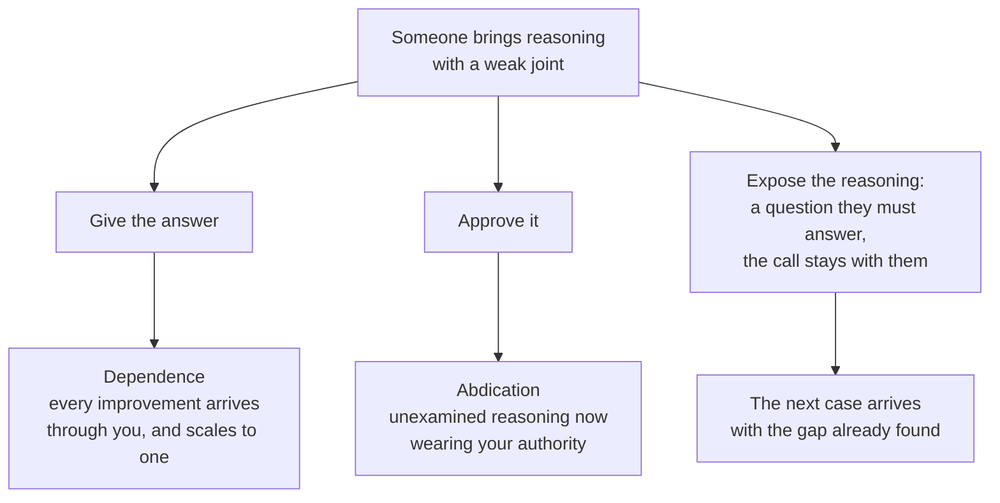
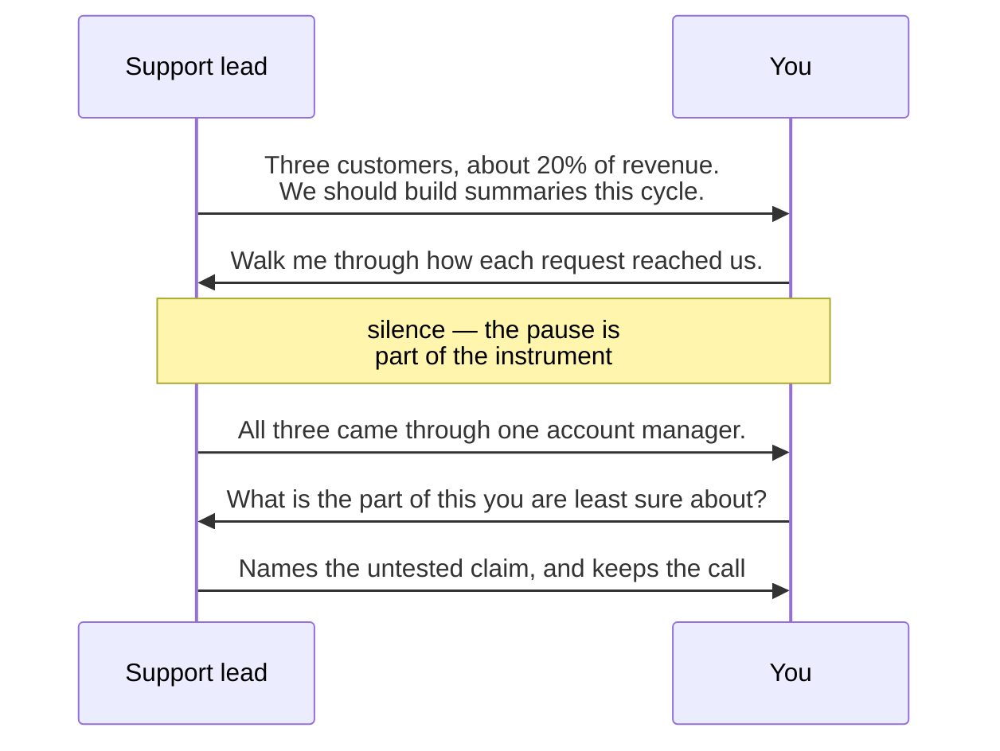

# LD-03 · Developing judgment in others

> Leaders develop judgment by exposing reasoning, asking calibrated questions,
> and reviewing decisions without taking them back.

## Problem — giving the answer, or waving it through

The support lead comes to you with a recommendation. "All three of my calls said
the same thing. Enterprise leads lose decisions after recurring meetings. Three
customers, about 20% of revenue. We should build summaries this cycle."

You can see the problem in four seconds. Three requests arrived through one
account manager inside one month. That is one channel, not a sample. Nobody has
tested whether the loss of decisions is real, or how often it happens, or
whether summaries would fix it. Meeting type is not even captured in the event
data.

So you say: "Three requests through one account manager is not prevalence. Go
and test whether the underlying problem is real before we spend a cycle on it."

That is correct advice. It is also the more expensive of the two ways to fail.

The support lead now does exactly what you said. They come back with a better
version of the same argument, and they wait for you to tell them whether it
passes. Next month they bring the next thing, unexamined, because checking it is
your job now. You have made yourself the quality function for reasoning you did
not do, and every improvement in their output arrives through you. That is
dependence, and it scales to exactly one person: you.

The other failure is quieter and more common. You are busy, the revenue number
is large, the support lead is credible, and you say: "That's a strong signal —
let's look at scoping it." Now the reasoning has gone unexamined and it is
wearing your authority. When it turns out that three requests were three
requests, nobody will be able to say which part of the argument was load-bearing,
because nobody inspected it. That is abdication.

Both failures feel good at the time. Giving the answer feels like mentorship.
Waving it through feels like trust. Neither one leaves the other person more
able to catch the same gap alone next month.

Three paths lead out of the same moment. Two of them are the trap:

Notice what the two trap paths have in common. In both, the weak joint is
handled by you. Only the third path leaves it handled by the person who will
meet it again next month.

Ask yourself: *when someone on my team brings me a recommendation, do they
arrive with the weak joint already named — or do they arrive expecting me to
find it?* Eight weeks of the second pattern is a diagnosis of your coaching, not
of their ability.

## Concept — ask the question whose answer they hold

Three moves are available when someone brings you reasoning that is not good
enough yet.

| Move | What you do | What the person learns | When it is the right move |
|---|---|---|---|
| **Give the answer** | Supply the conclusion and the reason | Your conclusion — not how to reach one | Decision is due today, or the consequence is one-way, or they cannot get the information in time |
| **Approve** | Accept without inspecting | That weak reasoning passes here | Only when the stated evidence standard is genuinely met |
| **Expose the reasoning** | Ask questions that make the gap visible to its author, then leave the decision with them | How to find the gap themselves | Default, when the class will recur |

The third move is the one this lesson is about, and it is harder than it looks,
because most attempts at it are the first move in disguise.

### The counterfeit: the answer in question form

"Do you really think three requests through one account manager is a pattern?"

That is not a question. It is a verdict with a question mark attached. The
person hears the verdict, agrees, and learns nothing except that you had already
decided. Rhetorical questions are the most common counterfeit of coaching,
because they let a leader feel patient while still supplying the answer.

The repair is not softer wording. It is a question whose answer the other person
holds and you do not:

**Weak** — "Do you really think three requests through one account manager is a
pattern?"

Your conclusion is already inside the sentence. They can agree or they can
defend themselves. Neither one teaches them to notice a single-channel sample
next month.

**Strong** — "Walk me through how each of these three requests reached us. What
was the path?"

They hold the raw calls; you do not. The one account manager appears in their
own answer, in their own words, and the recommendation is still theirs.

The difference is not politeness. The weak version transfers a verdict. The
strong version transfers the method for producing one.

Three counterfeits recur, and they fail in different directions:

| Counterfeit | What it sounds like | What the person learns |
|---|---|---|
| **The verdict in question form** | "Do you really think three requests is a pattern?" | That you had already decided, and the conversation is a formality |
| **The unanswerable question** | "What is the true prevalence of this problem?" | That this is a refusal wearing curiosity; it produces paralysis, not work |
| **The interrogation** | "What is the sample? The window? The channel? The population?" | To comply with a checklist. You get a better artifact and no better judgment |

### What makes a question calibrated

A calibrated question meets three conditions at once:

1. **They can answer it** from what they already hold, or can get within a day
   or two.
2. **They have not looked at it yet.** If they have, you are quizzing.
3. **They cannot answer it without touching the weak joint.** The gap becomes
   visible to them in the act of answering.

### A working bank of questions

Use the exposure that is weakest to pick the question. These are wordings you
can say as they are written.

**When the evidence boundary is weak**

- "Who did we not hear from, and how would we know if they disagreed?"
- "Walk me through how each of these three requests reached us. What was the
  path?"
- "If a fourth customer had said the opposite this month, where would that have
  shown up?"

**When the mechanism is weak**

- "Say we build it and it works perfectly. What is that person doing
  differently on a Tuesday?"
- "What has to be true about their meetings for this to help — and which of
  those things have we actually checked?"
- "If the real cause were something else entirely, what would it be?"

**When alternatives are missing**

- "What are we not doing if we do this?"
- "Give me the strongest version of the case for leaving the roadmap unchanged.
  I want it argued, not listed."

**When uncertainty is unstated**

- "How confident are you, as a number?"
- "What would move that number to ninety?"
- "What do you expect to see in six weeks if you are wrong?"

**When ownership or reversal is missing**

- "What would bring you back to reverse this?"
- "Who carries it if this is wrong, and have they heard the case?"

**When the person is defensive, or you have no read yet**

- "What is the part of this you are least sure about?"

That last one is the highest-yield question in the set. It invites the person to
volunteer the weak joint rather than defend the strong one, and it works even
when you have misjudged which exposure is missing.

### Silence is part of the instrument

After you ask, stop talking. The useful thinking happens in the pause, and the
pause will feel longer to you than to them. Leaders who cannot sit through it
fill it with a hint, and the hint is the answer.

Here is the whole move at the length it actually runs — two questions, one
silence, and a decision that never changes hands:

Read the last two messages together. You did not supply the weak joint; they
did. That is the only outcome that survives your absence next month.

### Reviewing without taking the decision back

Three rules make review safe to receive.

1. **Review the reasoning, not the conclusion.** Say which exposure is missing.
   Do not say which answer you would pick. The moment you name your preferred
   answer, the rest of the conversation is about pleasing you.
2. **Label your own view when you give it.** If they ask what you think — and
   they should be able to — answer, and mark it: "This is my read, not an
   instruction. The call is still yours." Withholding your view entirely is not
   coaching either. It is a puzzle.
3. **If you take the decision back, say so out loud.** "I am taking this one.
   Here is why, and here is the question I would have wanted you to answer."
   A takeback that is named teaches something. A takeback disguised as a
   suggestion teaches that ownership here is decorative.

### Exposing your own reasoning

Judgment transfers by watching reasoning happen, not by hearing conclusions
announced. Most leaders show their team only finished positions, which are the
least instructive part of their thinking.

The practical version is small: narrate one live decision a week, out loud,
before you have resolved it. Include the option you are tempted by and why you
distrust the temptation. Include a past call you got wrong, with what you knew
at the time — not the moral, the evidence. PJ-05 gave you the discipline of
judging a decision from what was knowable then; this is where you use it in
front of other people.

### The test

The measure of coaching is not whether the decision improved. It is whether the
next decision arrives with the gap already found.

Over eight weeks, watch for one thing: does this person bring you recommendations
with the weakest exposure already named and addressed? If yes, judgment is
transferring. If they bring you polished arguments and wait, you are still the
quality function.

### Boundary

Coaching is the wrong instrument in three situations, and using it anyway is its
own failure.

**When time has run out.** If the decision is due today and they cannot close
the gap by then, ask the question, give the answer, and label both: "I am
deciding this one. The question I would have asked you is X — hold onto it."
Coaching someone into a deadline they will miss is not development.

**When the gap is information you hold and they do not.** Questions asked across
an information gap are not calibrated; they are a guessing game with a power
difference. Give the information, then ask.

**When the problem is will, not capability.** Coaching develops judgment. It
does nothing about a person who is not doing the work, and running a fourth
coaching conversation with someone who has not acted on the first three is a way
of avoiding a harder conversation. That conversation is LD-06.

One more honest limit: this is slower per decision. A coached decision costs
more than a given one. The return comes only if the decision class recurs. If
this exact question will never come back, giving the answer is the correct use
of everyone's time, and dressing it up as development wastes it.

## Build — on Noted

Read `lessons/noted/case.md` if you have not already.

Take **Signal 2: three enterprise customers asked for automated meeting
summaries**, and the person bringing it is the **support lead** — who, the case
tells you, recorded several of those customer conversations and is closest to
what people actually said before it became a summary.

Their recommendation to you, in their words: *"All three of my calls said the
same thing. They lose decisions after recurring meetings. Three customers, about
20% of revenue. We should build summaries this cycle."*

What the case gives you and they may not have weighed: all three requests came
through the same account manager within one month; the underlying claim has
never been tested; meeting type is not captured in the product's event data.
What the case also gives you: this person holds something you do not — the raw
conversations, before summarization.

**Your task.** Build the coaching move, not the answer.

1. Name the single weakest exposure in their reasoning. Use one of the six —
   choice, evidence, uncertainty, alternatives, owner, revision trigger. Not
   "the whole thing is thin."
2. Write **three questions, verbatim**, in the order you would ask them. Each
   must be answerable by this person from what they hold or can get in two days.
   At least one must use the fact that they, not you, have the raw calls.
3. For each question, write what a good answer sounds like, what a defensive
   answer sounds like, and what you do next in each case. "Ask a follow-up" is
   not a next move; write the follow-up.
4. Write down the question you were tempted to ask that is actually your verdict
   in question form. Keep it in the artifact and mark it rejected. Naming your
   own counterfeit is the point of this step.
5. Decide the authority level you are operating at, using the LD-02 table, and
   say whether the call stays with the support lead after the questions. Then
   check: does anything in your plan quietly move it to you?
6. Write the exact sentence you would say if you do take the decision back.
   Plain words. If you cannot write it without softening it, you are planning a
   disguised takeback.
7. Write your own exposure move: one live decision of yours you will narrate to
   this person this week, including the part you are unsure about and one past
   call you got wrong with what you knew at the time.
8. Commit to the dependence test. Write what you expect to see in eight weeks
   that would tell you judgment transferred, and what you would see if it did
   not.

**Expect to be pushed on:** whether your three questions are genuinely open or
whether at least one is a verdict wearing a question mark; whether any question
is unanswerable given that meeting type is not captured, which would make it
paralysis rather than coaching; and whether step 5 survives inspection — most
first drafts return the decision to the leader through a phrase like "then bring
it back to me and we will decide together."

### What a strong answer holds

- One weak exposure named from the six, not "the whole thing is thin".
- Three verbatim questions, each answerable by the support lead from what they
  hold or can get in two days, and at least one built on the raw calls they have
  and you do not.
- For each question, what a good answer sounds like, what a defensive answer
  sounds like, and the actual next sentence you would say in each case.
- The rejected counterfeit present and labelled as yours.
- An authority level from the LD-02 table, the call left where you said it
  stays, a plain takeback sentence, and a dependence test with a date on it.
- The most common weak move is a verdict with a question mark — "do you really
  think three requests is a pattern?" It is weak because your conclusion is
  already in the sentence, so they learn what you decided and not how to
  notice it next month.

## Use — on your product

Take the most recent time someone brought you a recommendation you did not think
was good enough.

Answer five questions:

1. Which of the three moves did you use — give the answer, approve, or expose
   the reasoning? Be honest about which one it actually was.
2. Which exposure was weakest in their reasoning, and did you name it, or did
   you name your preferred conclusion instead?
3. Write one question you could have asked that they could have answered, had
   not yet looked at, and could not answer without touching the gap.
4. When they next bring you a decision in this same class, what will tell you
   the judgment moved — specifically, and observably?
5. What is one live decision of yours, right now, that you could narrate to them
   before it is resolved?

Write `<unknown>` where you cannot reconstruct what you actually said. Do not
improve the remembered version of your own question. Question 1 is the one
people most often answer generously about themselves.

## Ship — Judgment coaching plan

Produce `artifacts/LD-03-judgment-coaching-plan.md` using the template in
`artifact.md`.

Write it for yourself, to be used in a specific conversation this week. It is
not a development framework and it is not for a performance file. If it contains
no verbatim question wording, it will not survive contact with a real
conversation, because the moment of pressure is exactly the moment you will
revert to giving the answer.

This attaches to the decision-rights map from LD-02. The evidence standard you
wrote there is what these questions are asked against — it is what makes a
question a request for reasoning rather than an expression of your taste.

## Carry forward

A named weak exposure, three questions you can actually say out loud, a rejected
counterfeit question, and a dependence test with a date on it. LD-04 moves from
the single conversation to the system around it: the cadence, forums, artifacts,
and information flow that decide whether these conversations happen before a
commitment or after it.
