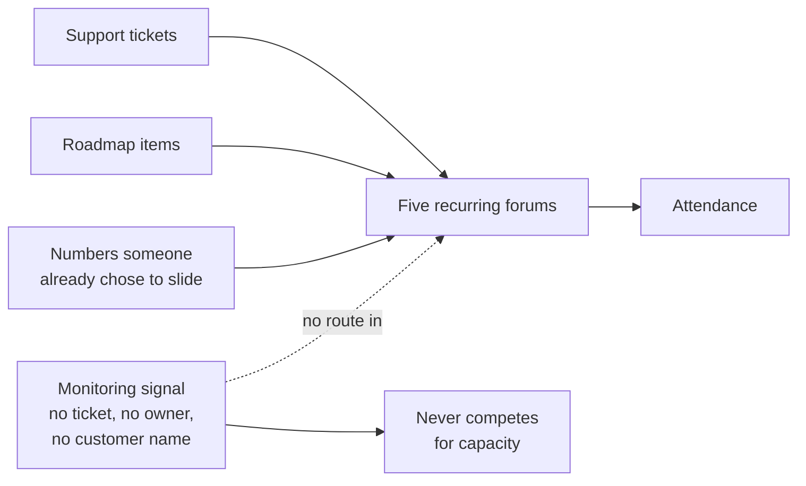
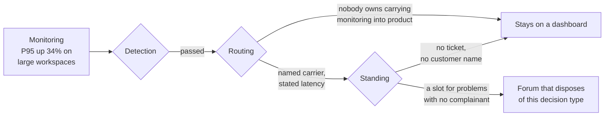

# LD-04 · Operating systems for good product work

> Cadence, artifacts, forums, and information flow should make the next
> important decision easier — not add ritual.

## Problem — process that produced attendance, not decisions

A team notices that decisions keep getting made badly, so it adds process.

A weekly product review, so nothing ships unseen. A monthly business review, so
the numbers get looked at. A roadmap document, updated every Friday. A
prioritization score, so requests can be ranked. A retro at the end of each
cycle. Each addition was a sensible response to a real failure.

Six months later, response time for large workspaces rises 34%. Monitoring
catches it on day two. It is visible on a dashboard the whole time. It reaches
no forum that can act on it for six weeks, because no support ticket mentions
speed, and every one of those five recurring meetings is fed by tickets,
roadmap items, or numbers that somebody already decided to put on a slide.

The team was not lazy. It attended everything. The operating system produced
attendance rather than decisions, and the one signal that most needed a decision
had no route into any room.

The failure is hard to see from inside for two reasons. First, each element was
individually justified — you can defend every meeting on this list, one at a
time, and nobody ever audits the set. Second, process feels like control. A
calendar full of review is emotionally indistinguishable from a system that
catches problems, right up until something arrives through a channel the system
does not have.

There is a third, quieter cost. Every hour of ritual is an hour not spent on the
decision itself, and the people most burdened by it are usually the ones closest
to the work.

Draw what feeds the forums and the gap stops being mysterious:

Every solid arrow into the forums is a channel someone built. The dotted one is
the channel nobody built, and the signal that most needed a decision arrived on
it.

Ask yourself, for each recurring meeting on your calendar: *what decision did
this dispose of in the last month?* Not "what did we discuss." What was decided,
by whom, that would otherwise still be open. Most teams cannot answer for more
than half their forums.

## Concept — name the decision each element disposes of

An operating system is four things. Each element must be justified by a decision
it makes easier, or it is ritual.

| Element | What it is | The test it must pass |
|---|---|---|
| **Cadence** | How often a loop runs | Matched to the rate at which the evidence changes, and to the clock on the consequence |
| **Forum** | Who is in a room, deciding what | It has a decision type it disposes of, and a stated authority level |
| **Artifact** | The durable thing that carries the reasoning | It is read before the forum, not presented inside it |
| **Information flow** | How a signal reaches someone who can act | A named path, with an owner and a latency |

One rule governs all four: **name the decision it makes easier, and name the
observation that would tell you it stopped.** An element with no decision
attached is a habit. That is allowed, but it should be labelled and it should
not be counted as decision infrastructure.

### Cadence is matched, not chosen

Cadence errors run in both directions, and the two failures look nothing alike.

| Error | What it produces | Example |
|---|---|---|
| **Faster than the evidence** | Thrash. The team reacts to variance and calls it learning. | Reviewing a metric weekly when it only moves meaningfully over a month |
| **Slower than the consequence** | Late decisions with no options left. | A quarterly planning review governing a dependency that loses support in ten weeks |

So a cadence has two constraints, not one: how fast the evidence refreshes, and
how fast the consequence closes. When those two disagree, the consequence wins,
and the loop needs a trigger rather than a calendar slot.

### Forums dispose of a decision type

A useful forum can complete this sentence: *this room exists to decide X, at
authority level N, and it is the only room where X is decided.*

If two forums can decide the same thing, the decision gets relitigated in
whichever one produces the answer someone wanted. If no forum can decide it, it
escalates to a person, which is the pattern LD-01 and LD-02 were trying to
reduce.

That sentence is the whole test. Written both ways for Noted's slowing large
workspaces:

**Weak** — "Weekly product review. We walk the roadmap, surface risks, and make
sure nothing ships unseen."

No decision type, no authority level, no exclusivity. Anything can be raised
here and anything can be raised elsewhere, so a contested call lands wherever it
gets the preferred answer.

**Strong** — "This room decides whether engineering capacity moves from planned
features to large-workspace response time, at level 4, and it is the only room
where that is decided."

One decision type, one stated authority level, one room. A monitoring signal
with no ticket behind it now has somewhere it can land.

The difference is exclusivity plus a named authority level. Without both, a
forum is a place where a decision is discussed and then made somewhere else.

The audit is short. List every recurring meeting. For each, write the decision
type it disposes of and one decision it actually disposed of last month. Merge
or remove the rows that come back empty. Expect to be uncomfortable: the meeting
with the best attendance is often the one with the emptiest row, because it is
pleasant and low-stakes.

### Artifacts are read, not presented

A forum where documents are presented spends its scarce, expensive resource —
several senior people in one place — on transmission. Transmission is the one
thing a document does perfectly on its own.

Pre-read plus silent reading time at the start converts the room's time into
disagreement, which is the only thing the room can do that the document cannot.
It also has a side effect worth as much: reasoning that must survive being read
alone cannot lean on the author's delivery.

The second function of artifacts is durability. A decision that exists only in a
meeting cannot be inspected in three months, cannot be carried by someone who
joins in three weeks, and cannot be revisited when its revision trigger fires,
because nobody wrote one down.

### Information flow has three failure points

A signal reaches a decision through three stages, and teams usually instrument
only the first.

| Stage | Question | How it fails |
|---|---|---|
| **Detection** | Did anything notice? | No instrumentation, no listening channel |
| **Routing** | Did it reach a room that can act? | Nobody owns carrying signals of that type across |
| **Standing** | Was it allowed to compete for capacity? | No advocate, no ticket, no customer name attached |

Standing is the one that catches product teams. A problem with no complainant
loses every prioritization contest, not because it is smaller, but because the
contest is fed by complaints. When you hear "no customers have raised it," treat
that as a fact about your channels before you treat it as a fact about the
world.

Run Noted's response-time signal through all three stages and the failure has a
precise address:

Both routes into the dead end look like the same outcome from outside — nothing
happened. They need different repairs. Routing is fixed by naming a person and a
latency; standing is fixed by changing what is allowed to compete.

### Boundary

An operating system cannot fix a direction problem or a decision-rights problem,
and adding process to either one makes things worse in a specific way: the
escalation becomes better attended.

If every trade-off routes to you, the answer is in LD-01 and LD-02. A new forum
will give that escalation a room, a slide, and six people's time.

There is also a floor and a ceiling. A four-person team does not need three
forums; imposing them borrows the coordination cost of a larger organization
without the coordination problem that justifies it. And elements decay upward
too: a single weekly conversation that worked at four people fails at twelve,
usually by becoming a status round where nothing is decided. Write the team size
each element was designed for, so the decay is visible when you cross it.

Finally, be honest that some ritual is legitimate without disposing of a
decision. A weekly team gathering that builds shared context has real value.
Keep it if you want it. Do not count it as decision infrastructure, and do not
let it absorb the hour that a decision forum needed.

## Build — on Noted

Read `lessons/noted/case.md` if you have not already.

The standing condition from LD-01 still holds: two PM hires are funded, the
first arriving in about three weeks.

Take **Signal 3: P95 response time rose 34% for large workspaces.**

What the case gives you: "large" means more than 500 documents, which is about
4% of workspaces; those workspaces hold a disproportionate share of paid seats;
no support ticket has mentioned speed; the signal came from monitoring. The case
also tells you the team has a disciplined delivery system and a much thinner
evidence system.

**Your task.** Design the operating system that would have turned this signal
into a decision, and pay for it by removing something.

1. Trace this signal through the three stages of information flow. State where
   it passed and where it failed. Be specific about which stage the missing
   support tickets belong to.
2. Name the forum that should dispose of a decision of this type. Complete the
   sentence: this room exists to decide X, at authority level N. If no such room
   exists today, say so plainly rather than assigning it to an existing meeting
   out of convenience.
3. Set the cadence for that forum using both constraints — how fast this
   evidence refreshes, and how fast the consequence closes. Then test the same
   cadence against **Signal 4's ten-week end-of-support clock**. If one cadence
   cannot serve both, say which one needs a trigger instead of a calendar slot,
   and write the trigger.
4. Specify the artifact that enters that forum: who writes it, who reads it
   before, and what it must contain for a decision to be possible in the room.
5. Assign the routing owner: the named person responsible for carrying a
   monitoring signal into a product decision. Give the latency you expect
   between detection and the room.
6. Give this problem **standing**. It has no complainant. Write the mechanism by
   which a signal with no customer attached can compete for capacity against one
   with three enterprise names on it.
7. Now pay for it. Name one existing ritual you will remove or merge, and state
   the decision type it was supposed to dispose of. If you cannot name one, your
   system grows every time you learn something.
8. Write the size band. State the team size this system is designed for, and the
   observation that would tell you it has been outgrown.

**Expect to be pushed on:** whether your new forum overlaps an existing one,
which means the decision will be relitigated in whichever room gives the
preferred answer; whether the cadence in step 3 quietly leaves the ten-week
clock to a meeting that happens after week ten; and whether your standing
mechanism in step 6 is a real route or a promise that you will remember to
advocate for it yourself.

### What a strong answer holds

- The P95 signal traced through detection, routing, and standing, with a
  verdict on each stage and a clear statement of which stage the missing tickets
  belong to.
- The forum sentence completed — this room decides X, at level N, and is the
  only room that does — or a plain admission that no such room exists today.
- A cadence justified against both the evidence rate and the consequence clock,
  and a written trigger for the ten-week clock if one cadence cannot serve both.
- A named routing owner with a latency, and a standing mechanism that works
  when you are not in the room to advocate.
- One ritual removed or merged, with the decision type it was supposed to
  dispose of, and a team-size band with the sign of outgrowing it.
- The most common weak move is placing the decision in an existing weekly
  review "for now." It is weak because that room has no exclusive decision
  type, so the call is relitigated wherever it gets the preferred answer.

## Use — on your product

Take your current calendar of recurring product meetings.

Answer five questions:

1. For each recurring forum, what decision type does it dispose of, and what did
   it actually decide last month?
2. Which decision type currently has no room that can decide it, and therefore
   arrives at a person?
3. Take one signal your team learned about late. Which of the three stages
   failed — detection, routing, or standing?
4. Which of your cadences is faster than its evidence, and which is slower than
   its consequence?
5. What will you remove to pay for anything you add?

Write `<unknown>` where you cannot say what a forum decided last month. That
blank is the finding, and filling it from memory with "we discussed the roadmap"
converts a finding into reassurance.

## Ship — Product operating system

Produce `artifacts/LD-04-product-operating-system.md` using the template in
`artifact.md`.

Write it for the person joining in three weeks, who needs to know where a
decision of each type gets made and what to bring. A new joiner reading it
should be able to route a signal correctly on their first week without asking
anyone which meeting to raise it in.

This sits underneath LD-01 and LD-02 in your Product Decision Case. Direction
resolves the recurring trade-off, rights assign the residue to people, and this
artifact is the machinery that gets the right evidence to those people before
the moment of commitment rather than after it.

## Carry forward

A forum inventory with empty rows removed, a cadence justified against both
evidence and consequence, a named routing owner, and a standing mechanism for
problems with no complainant. LD-05 asks the next question: the system you just
designed assumes certain capabilities exist on the team. Some of them do not.
That lesson maps which capabilities the work actually requires, and whether each
gap should be closed by development, hiring, or an interface to someone else.
