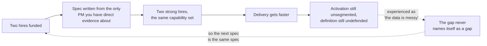
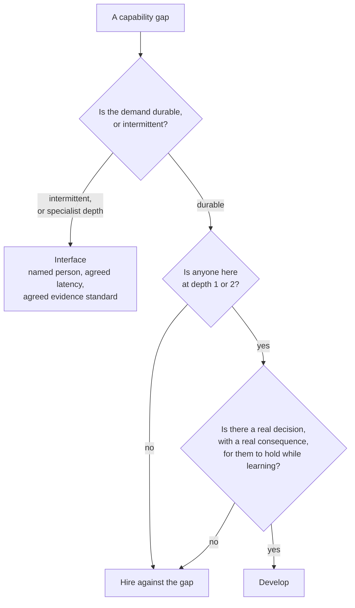

# LD-05 · Team capability architecture

> A team needs a portfolio of capabilities, not identical PMs; gaps should be
> addressed through development, hiring, or interfaces.

## Problem — hiring in your own image

A product leader gets budget for two hires. They write the job specification the
same afternoon.

It asks for someone who ships, who works well with engineers, who can hold a
roadmap, who is comfortable with ambiguity, and who has strong communication
skills. It is a good specification. It also describes the person writing it,
because that is the only model of a good PM they have direct evidence about.

Two hires later the team is faster and no better. Activation has fallen 11% over
six weeks and still nobody can segment it by cohort, channel, or platform.
Nobody can defend the activation definition, which is inherited and which no one
on the team wrote. Eighteen percent of events are missing actor identity, and
nobody has decided whether that invalidates the analysis. Three people can now
run a delivery cycle well. The decision underneath the cycle is still unexamined.

The failure is hard to see from inside because every individual hire was strong,
and because the team's visible output improved. More capacity applied to the
same capability set produces more of the same work, faster. If the missing
capability is the one that decides what to build, speed makes the error larger.

There is a second reason it stays invisible. Capability gaps do not announce
themselves as gaps. They announce themselves as questions that keep not getting
answered, and a team with no measurement capability does not experience this as
"we cannot measure." It experiences it as "the data is messy" — a condition,
not a missing skill.

The loop closes on itself, which is why it can run for a year:

Follow the dotted edges. Nothing in this loop tells anyone a capability is
missing, and the visible output improves at every pass.

Ask yourself: *which question does my team keep failing to answer, in a way that
we have started treating as a fact about the world rather than a fact about us?*

## Concept — derive capabilities from decisions, not traits

Capabilities belong to the team, not to each person in it. The unit of analysis
is coverage.

That reframing does real work. It stops you from grading individuals against a
complete model of a PM — a model nobody satisfies — and starts you asking a
better question: for the decisions this team actually faces, what must someone
here be able to do, and who is that?

### Derive capabilities from the work, not from a competency model

A generic competency list produces a generic team. Derive instead from two
things you already have: the decision classes in your LD-02 rights map, and the
loops in your LD-04 operating system. Each decision class implies a capability
someone must hold, or the class cannot be decided well.

State each capability as something observable in an artifact or a decision, not
as a trait.

| Not a capability | A capability |
|---|---|
| "Strong communicator" | "Can write a decision memo an executive acts on without a meeting" |
| "Data-driven" | "Can define a metric's population, event, window, and aggregation, and defend it against a challenge" |
| "Customer-obsessed" | "Can run an interview that separates what a customer said from what it means" |
| "Technical" | "Can read a change history and tell whether a planning assumption matches the code" |

The second column can be checked. The first column can only be felt, which is
how hiring in your own image survives review.

The same edit at specification scale, written against Noted's activation
decision:

**Weak** — "PM who ships, works well with engineers, can hold a roadmap, is
comfortable with ambiguity, and has strong communication skills."

Every line is a trait, and every trait describes the person writing it. Two
hires against this specification make the team faster at the work it already
does well.

**Strong** — "Can define activation's population, event, window and aggregation
and defend the definition against a challenge. Can segment a six-week decline by
cohort, channel and platform. Can state what missing actor identity on 18% of
events does and does not invalidate."

Each line is an output the activation decision actually requires, and each can
be checked in an interview against a real artifact.

The difference is where the list came from. The weak specification was derived
from a person. The strong one was derived from a decision the team cannot
currently make.

### Depth, not presence

A capability is not a checkbox. Use a stated scale so a map means the same thing
to two readers.

| Depth | Meaning |
|---|---|
| **0** | Absent. Nobody here can do this. |
| **1** | Can recognize when it is needed and when it has been done badly. |
| **2** | Can do it with support or review. |
| **3** | Can do it alone and be relied on for a consequential decision. |
| **4** | Can develop it in someone else. |

Level 1 is worth naming separately. A team where someone can *recognize* bad
measurement, even if they cannot do it, fails differently from a team where
nobody can — the first one can buy the capability safely, and the second one
cannot evaluate what it bought.

### Coverage and single points of failure

For each capability, ask what happens when the one person who holds it is on
leave for three weeks, or leaves permanently.

A capability held by exactly one person is acceptable when the decisions needing
it are infrequent and can wait. It is not acceptable on the critical path. Note
that this is a different question from depth: two people at depth 2 may be
safer than one person at depth 3, depending on whether the work can tolerate
review latency.

### Three ways to close a gap

| Instrument | What it costs | When it is right | How it fails |
|---|---|---|---|
| **Develop** | Months, and real decisions to practise on | The demand is durable and someone is at depth 1 or 2 | There is no real decision to practise on, so it becomes training with no consequence attached |
| **Hire** | Slowest; changes the team permanently | The demand is durable, deep, and nobody is close | You hire the person you can evaluate, which is the person most like you |
| **Interface** | Ongoing coordination, and queueing | The demand is real but intermittent, or the depth needed is specialist | The queue quietly lowers your evidence standard to whatever fits it |

Two questions choose between them, and the second one is the one people skip:

The bottom question is the one that fails silently. Without a real decision
attached, "develop" produces recognition and stalls there, and a year later the
gap is still open with a plan against it.

Interfaces are the most underused instrument. You do not need a data specialist
on the team if you have a named person elsewhere, an agreed latency, and an
agreed evidence standard. But an interface is only real when those three things
are written down. "We can ask the data team" is not an interface; it is a hope
with a name attached.

The interface failure mode deserves attention because it is silent. When the
queue is four weeks and the decision is due in two, nobody announces that the
standard has dropped. The team just decides on what it has, and records nothing
about the decision that the standard was not met.

### Complementary hiring has a cost you must pay

Hiring against the gap means hiring someone unlike the current team. That is the
correct move and it has a bill attached: a person whose strengths the team does
not share has no natural advocate, no shorthand, and no obvious way to
demonstrate value in the team's existing rituals.

If you do not build them a translation surface — a decision they own, a forum
where their work lands, an artifact the team already reads — they will be
isolated, then judged as a poor fit, then leave, and the team will conclude that
the gap was not real. Budget the interface, not just the offer.

### Boundary

A capability portfolio is relative to a strategy, and it expires with it.

The right portfolio for a team whose constraint is evidence quality is the wrong
portfolio for a team whose constraint is distribution. When strategy changes,
re-derive the list rather than re-scoring the old one. Re-scoring preserves
categories that stopped mattering.

Two further limits.

**You cannot develop a capability that has no decision to practise on.** LD-02
made this point about visibility of consequence, and it applies here too.
Development that consists of reading and shadowing produces recognition — depth
1 — and then stalls. If you cannot name the real decision the person will hold
while developing, choose interface or hire instead, and say so honestly.

**A capability map is a hypothesis about people, made on thin evidence, and it
hardens into a label fast.** Written down, "depth 1 on measurement" becomes a
fact about a person in the minds of everyone who reads it, including them. Date
every assessment, record what it was based on, and re-derive rather than
inherit. Where you have not seen someone do the thing, the honest entry is
`<unknown>`, not a guess in the middle of the scale.

## Build — on Noted

Read `lessons/noted/case.md` if you have not already.

The standing condition from LD-01 applies directly here: two PM hires are
funded, the first arriving in about three weeks, and their strengths are
`<unknown>`. This lesson is where that blank gets filled deliberately rather
than by whoever applies.

Take **Signal 1: activation fell 11% over six weeks.**

What the case gives you: activation is defined as creating a document and
returning within seven days; nobody on the team defends that definition, which
is inherited; the decline has not been segmented by cohort, channel, or
platform; two changes shipped inside the window; actor identity is missing for
about 18% of events. The case also tells you the team has a disciplined delivery
system and a much thinner evidence system, and it tells you what each of the
three existing people holds.

**Your task.** Build the portfolio the work requires, then decide how to close
each gap.

1. List the capabilities this one signal actually requires before a decision can
   be made. Derive them from the decision, not from a competency model. Expect
   four to seven. Each must be stated as something observable in an artifact or
   a decision.
2. Map current holders and depth, using the 0-4 scale, across yourself, the
   founder, the engineering lead, and the support lead. Where you have not seen
   someone do the thing, write `<unknown>`. Do not put a 2 where you mean "I
   assume so."
3. Mark every capability that is held by exactly one person, and say for each
   whether that is acceptable given how often this decision class recurs.
4. For each gap, choose develop, hire, or interface. For every "develop," name
   the real decision the person will hold while developing. If you cannot name
   one, change your choice.
5. Write the specification for the **first hire** against the gap. Then read it
   back and mark every line that describes you. Remove or justify each one.
6. Write what you are deliberately **not** hiring for, and which existing
   strength you are choosing not to duplicate.
7. Design the translation surface for that hire: which decision they will own on
   arrival, which forum their work lands in, and which artifact the team already
   reads that their work will enter. Use your LD-04 operating system, not a new
   ritual.
8. Commit: name the one capability you will not close this year, and state
   plainly what you accept as a consequence of leaving it open.

**Expect to be pushed on:** whether your list in step 1 is derived from the
activation decision or is a generic PM competency model with the serial numbers
filed off; whether any "develop" plan has a decision attached with a real
consequence, or is reading and shadowing; and whether the specification in step
5, after your edits, still describes a slightly better version of you.

### What a strong answer holds

- Four to seven capabilities derived from the activation decision, each stated
  as an output someone could check in an artifact.
- Depth scores across the four named people, with `<unknown>` wherever you have
  not seen the thing done, and a date on the assessment.
- Every capability held by one person marked, with a judgment on whether that
  is acceptable for how often this decision class recurs.
- Every "develop" tied to a real decision with a real consequence; where none
  exists, the instrument has been changed and the change explained.
- A first-hire specification with each line that describes you removed or
  justified, a named strength you are not duplicating, and a translation surface
  built from existing forums and artifacts.
- The most common weak move is a capability list that is a competency model in
  disguise — "data-driven", "technical". It is weak because none of it can be
  checked against an artifact, so hiring in your own image survives review.

## Use — on your product

Take your own team as it stands today.

Answer five questions:

1. Which question does your team keep failing to answer, in a way you have
   started treating as a condition of the world rather than a missing
   capability?
2. Which capabilities does your next quarter's decision set require, stated as
   observable outputs rather than traits?
3. Which capability is held by exactly one person, and what happens if they are
   away for three weeks at the wrong moment?
4. For each gap, is the honest instrument develop, hire, or interface — and what
   is the cost you are choosing to pay?
5. Which of your existing interfaces is really a hope with a name attached,
   because it has no named person, no latency, and no evidence standard?

Write `<unknown>` where you have not seen someone do the thing rather than
scoring them from impression. A capability map full of confident middle scores
is a map of your assumptions about people, and it will be read as a map of the
people.

## Ship — Capability portfolio

Produce `artifacts/LD-05-capability-portfolio.md` using the template in
`artifact.md`.

Write it for two audiences that must not be confused. The team-level view — what
the work requires and where coverage is thin — is for whoever funds and staffs
this team. Individual depth assessments are working notes for you, they are
dated, and they are hypotheses. Say which is which inside the document, because
a reader who mistakes the second for the first will treat a guess about a person
as a verdict.

This extends the Product Decision Case sideways. Every earlier artifact assumed
someone could do the work it implied. This one checks that assumption and prices
the shortfall.

## Carry forward

A work-derived capability list, honest depth scores with `<unknown>` where you
have not looked, one gap per instrument, and a hire specification that no longer
describes you. LD-06 takes the case where none of these instruments is the
answer — where someone holds a decision, has the capability, and the work is
still going wrong — and asks how a leader intervenes without converting a
temporary problem into a permanent loss of ownership.
