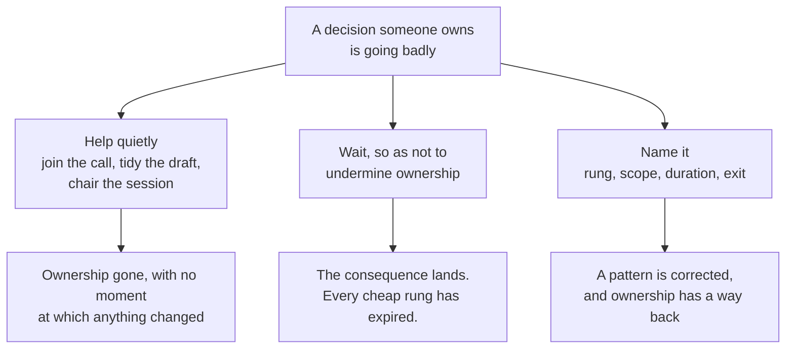
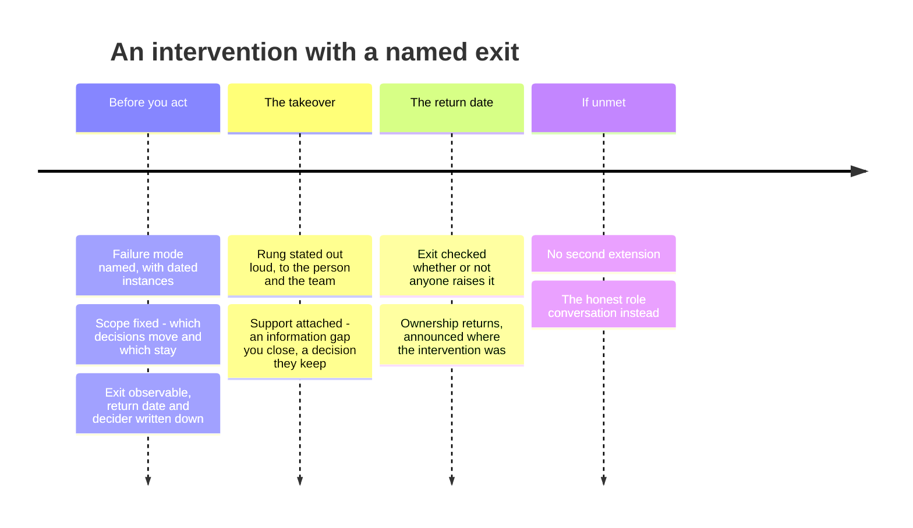

# LD-06 · Intervention and accountability

> Intervention should be proportionate, temporary, explicit about the failure
> mode, and designed to return ownership.

## Problem — the takeover nobody announced

A PM owns a decision and it is going badly. The leader can see it.

So the leader helps. They join the next customer call, "just to listen." They
take the draft and tidy the analysis section, because it was faster than
explaining. They chair the working session, because the last one drifted. Each
act is generous, each takes ten minutes, and none of them is announced.

Four weeks later the PM no longer holds the decision. Nobody told them. There
was no conversation, no failure named, no date, and no way back, because there
was never a moment at which something formally changed. The team saw all of it
and drew the obvious conclusion. The PM is now managing upward instead of
managing the problem, which makes their work worse, which confirms the leader's
read.

That is the first failure: the silent takeover. It feels like support and
functions as a demotion. The ambiguity is what makes it cruel — a person told
plainly "I am taking this decision for six weeks, here is why, here is how you
get it back" is in a far better position than a person quietly relieved of it
one helpful gesture at a time.

The second failure runs the other way. A leader who has learned not to undermine
ownership waits. They do not want to be the manager who takes things back. So
they say nothing while the pattern repeats, until the consequence lands. Then
the conversation is a post-mortem about a person rather than a correction of a
decision, and every cheap option — a question, a raised standard, one added
consultation — has expired.

Both failures come from the same missing thing. Intervention was never treated
as a decision with its own scope, duration, and exit. It was treated as a mood.

The two failures look like opposites and share a root:

Neither of the first two paths ever produces a conversation the other person can
answer. The third one is the only path with a return edge on it.

Ask yourself: *the last time I stepped into someone's work, could that person
have stated, on the day, exactly what had changed, how long it was for, and what
would return it?* If not, you did not intervene. You occupied.

## Concept — name the rung, write the exit

An intervention is a temporary, explicit change in decision rights. It has four
required parts, and it is not an intervention until all four exist.

| Part | What it must contain | What happens without it |
|---|---|---|
| **Named failure mode** | The specific pattern going wrong, stated as an observable, with instances | The person defends their character instead of fixing a pattern |
| **Proportionate scope** | Which decisions move, and which explicitly stay | A single-class failure becomes a whole-person demotion |
| **Duration and exit** | How long, the observable that returns ownership, and who decides | "Temporary" is a word; everyone reads it as permanent |
| **Support attached** | What you are adding — information, an interface, a decision to practise on | Intervention becomes surveillance |

An intervention with no exit is a demotion that has not been announced. If a
demotion is what you mean, say that instead. It is a legitimate decision and it
deserves its own honest conversation.

### The ladder

Intervention is not one thing. Pick the lowest rung that addresses the failure
mode you named, and say out loud which rung you are on.

| Rung | Action | Decision rights |
|---|---|---|
| **1** | Ask a calibrated question (LD-03) | Unchanged |
| **2** | Raise the evidence standard, or add a checkpoint before commitment | Unchanged; standard raised |
| **3** | Require a named consultation before the call | Narrowed to level 3 |
| **4** | Move this class to recommend-and-I-decide, temporarily | Level 4, for this class only |
| **5** | Take the decision, temporarily, with a stated return date | Level 5, for this class only |
| **6** | Change the role or the scope permanently | Not an intervention |

Two rules govern the ladder.

**Lowest sufficient rung.** If a raised evidence standard would address the
failure mode, rung 4 is an overreaction that costs you the person's ownership
for no additional safety.

**Early and low beats late and high.** Waiting until you are certain removes the
cheap rungs from the board. Rung 2 at week two is a smaller event than rung 5 at
week six, for you, for them, and for the work.

### Name the pattern, not the person and not the instance

A failure mode is an observable pattern with instances attached. "Is not
strategic enough" is a trait, and a trait cannot be corrected — it can only be
defended. "In the last four weeks, the problem statement has been rewritten
three times and no decision has been proposed" is a pattern, and it can be
addressed by Friday.

One bad call is data, not a pattern. Three of the same shape is a pattern. Say
which one you have, and if it is one instance, use rung 1 or 2 and watch.

### Accountability is not blame

Accountability means the person carries both the consequence and the correction.
Blame means they carry the story.

PJ-05 gave you the discipline of judging a decision from what was knowable at
the time. Apply it here before you intervene. A bad outcome from good reasoning
is not a failure mode, and intervening on outcome alone teaches the team a
precise and damaging lesson: avoid uncertainty rather than manage it. The people
who learn that lesson fastest are the ones who bring you the safest work.

So state which you are responding to — the reasoning or the outcome. If it is
the outcome, and the reasoning was sound, the honest intervention may be on the
system rather than the person.

### The exit is the contract

Write the return before you write the takeover. Four elements:

1. **The observable** that returns ownership. Not "when I have confidence
   again." Something the person can watch themselves.
2. **The date** it is checked, whether or not anyone raises it.
3. **Who decides** the return.
4. **Where it is announced** — to the same audience that saw the intervention. A
   public intervention with a private return is not a return. The team's model
   of who owns this decision does not update, and neither does the person's.

Laid out on a clock, an intervention has four moments, and three of them are
written before the first one happens:

The last column is the one that gets skipped, and skipping it is what converts
an intervention into a demotion nobody announced. An intervention with no
written return has already decided the role question; it just has not told
anyone.

If the exit condition is not met by the date, you have one honest choice and one
dishonest one. The honest one is to say that the class is not returning and to
have the role conversation. The dishonest one is a second extension. An
intervention that keeps getting extended is a decision you are avoiding, and
everyone involved can already tell.

All of that arrives through one opening sentence. Here it is written both ways,
for the PM holding Noted's large-workspace response-time decision:

**Weak** — "Let me just help with the workspace performance piece for a while.
I'll join the next session with engineering and take a pass at the analysis."

No rung, no failure mode, no scope, no date. The rights have moved and the
person cannot say what changed, so there is nothing they can do to get it back.

**Strong** — "The problem statement has been rewritten three times and no option
has gone to engineering. For the next three weeks I decide this one; you keep
the instrumentation call. It returns when one costed option reaches engineering,
and we check on the date either way."

Named pattern, named rung, named scope, named exit. The person can watch the
exit condition themselves, without asking how you feel about them.

The difference is not kindness. The second version is harder to say and easier
to receive, because it is the only one that can end.

### Boundary

Intervention is the wrong instrument whenever the cause is structural.

Run this test first: *would a capable person in this seat, with this direction,
these decision rights, this operating system, this evidence, and this interface,
have hit the same wall?* If the answer is yes, intervening on the person fixes
nothing, and it teaches the team that system failures are settled by finding
someone to correct.

The structural causes have addresses in this phase. No ordering to resolve the
trade-off is LD-01. Unclear authority or a missing evidence standard is LD-02. A
signal that never reached a room is LD-04. A capability nobody holds, or an
interface that was never real, is LD-05. Check those four before you write an
intervention contract, and be prepared to abandon the contract.

Two further limits.

**Emergencies are exempt from proportion, not from honesty.** A security,
legal, or customer-harm situation may require you to take the decision
immediately, at rung 5, with no ladder. Do it. Then separate the two things
afterwards: the emergency action, and any assessment of the person's judgment.
Folding the second into the first produces a verdict nobody can appeal, reached
under time pressure, on evidence collected during a fire.

**Some interventions are on you.** If you have intervened on three different
people in the same decision class, the pattern is in the class, not in the
people. That is a direction or rights problem wearing a personnel costume.

## Build — on Noted

Read `lessons/noted/case.md` if you have not already.

Assume the first of the two funded PM hires has now been in seat for six weeks.
Under your LD-02 rights map, they hold **Signal 3: P95 response time rose 34%
for large workspaces** at level 2 — decide and inform.

Here is what you have observed, and it is all you have observed. In six weeks
the problem statement has been rewritten three times. Each week produces a new
analysis and no proposed decision. Segmentation has not been done. No option has
been put to engineering. Meanwhile the end-of-support clock on Signal 4 has kept
running the whole time, and the paid seats concentrated in those 4% of
workspaces are still exposed.

You have not yet asked them why.

**Your task.** Decide whether to intervene, and if so, write the contract.

1. State the failure mode as an observable pattern, with its instances. Then
   check yourself: is this a pattern or a single instance repeated in your
   memory? Write the instances down with dates before you decide.
2. Run the structural test. Would a capable person in this seat have hit the
   same wall given your LD-01 direction, your LD-02 rights map, your LD-04
   operating system, and the capability picture from LD-05? Answer honestly and
   name which of the four is weakest. If the wall is structural, say so and stop
   — then write what you fix instead.
3. Separate reasoning from outcome. Say which one you are responding to. If the
   reasoning is sound and only the outcome is bad, say what that changes.
4. Choose the rung. Justify why the rung below it is insufficient for the
   failure mode you named. If you chose rung 5, say honestly whether you chose
   it for the failure mode or for the end-of-support clock — those are
   different reasons and only one of them is about this person.
5. Write the scope: which decisions move, and which explicitly stay with them.
   Name the ones that stay. Unstated scope expands.
6. Write the exit: the observable, the date, who decides, and where the return
   is announced.
7. Write the support you are attaching. Not encouragement — a specific
   information gap you will close, an interface you will open, or a decision
   they keep in order to practise.
8. Write the opening sentence, verbatim, that you will say to them. Then check
   it for the disguised version: any sentence that begins "let me just help
   with" and does not name a change in rights is a silent takeover.
9. Write what happens if the exit condition is not met by the date, including
   the sentence you would say if the honest answer is a role change.

**Expect to be pushed on:** whether your failure mode is a pattern with dated
instances or a trait in disguise; whether step 2 was run honestly or was a
formality on the way to the conclusion you had already reached; and whether your
exit observable in step 6 is something the PM can watch themselves, or is a
restatement of "when I trust them again."

### What a strong answer holds

- A failure mode written as a pattern with dated instances, not a trait, and an
  honest check on whether it is three instances or one remembered three times.
- The structural test run against LD-01, LD-02, LD-04, and LD-05, with the
  weakest of the four named — and a visible willingness to stop and fix the
  structure instead if that is where the test lands.
- A statement of whether you are responding to the reasoning or the outcome.
- The lowest sufficient rung, with the rung below shown to be insufficient. If
  rung 5, an honest line on whether the clock or the person drove it.
- Scope that names what stays with the PM; an exit with an observable they can
  watch, a date, a decider, and a place of announcement; an opening sentence
  that names a change in rights in plain words.
- The most common weak move is an exit written as your state of mind — "when
  I'm confident again." It is weak because the person cannot watch it, so it
  functions as no exit at all.

## Use — on your product

Take the last time you stepped into someone else's work.

Answer five questions:

1. What rung were you on, and did you say so out loud at the time?
2. What failure mode did you name, and was it a pattern with instances or a
   trait?
3. Could that person have stated, on the day, what had changed and what would
   return it?
4. Run the structural test in hindsight. Would a capable person in that seat,
   with the direction, rights, and interfaces you had provided, have hit the same
   wall?
5. If it is still running, what is the exit observable and the date — and if
   there is none, what does that make it?

Write `<unknown>` rather than reconstructing the intervention you meant to run.
Question 3 is the honest one: if you cannot say what they would have answered,
that itself is the finding.

## Ship — Intervention contract

Produce `artifacts/LD-06-intervention-contract.md` using the template in
`artifact.md`.

Write it to be shared with the person it concerns. That constraint does most of
the work. A contract you would not hand over is one whose failure mode is a
trait, whose scope is vague, or whose exit does not exist — and each of those is
easier to see when you imagine the other person reading it in front of you.

In the Product Decision Case, this is the counterpart to LD-02. That map granted
authority under stated conditions. This one records what happens when those
conditions are not met, on terms that were set before anyone was under pressure.

## Carry forward

A dated failure pattern, a structural test you were willing to lose, the lowest
sufficient rung, and an exit with an observable and a date. LD-07 turns outward.
The same discipline that makes an intervention legible to one person — named
position, honest uncertainty, visible dissent, an exact ask — is what makes a
recommendation usable by an executive who has ten minutes and no context.
