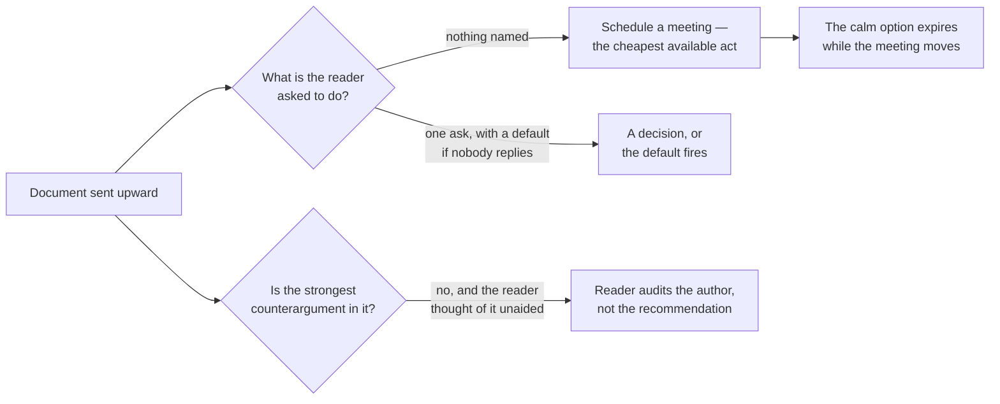
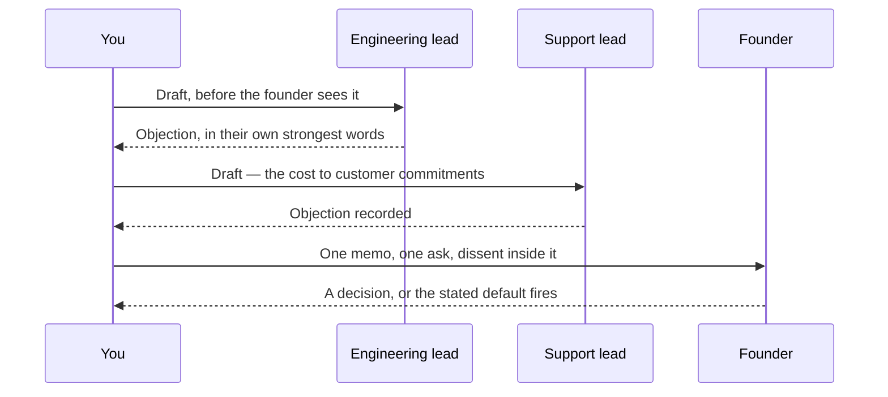

# LD-07 · Executive and cross-functional leadership

> Influence rises when context, recommendation, trade-offs, confidence, dissent,
> and the exact ask are clear.

## Problem — the document that contained no decision

A PM sends the founder a document titled "Platform migration — status and
options."

It is a good document. It explains that a core dependency loses support in ten
weeks. It gives the engineering estimate of three to five weeks. It lays out two
approaches, with pros and cons for each, evenly weighted. It closes with: "Happy
to discuss on Thursday."

The founder reads it, learns something, and replies: "Thanks — let's talk
Thursday." Thursday is moved. By the time the conversation happens, three of the
ten weeks are gone, and the option of doing the migration calmly has quietly
expired.

Nothing in the document was wrong. It simply contained no decision. It described
a situation to a person whose entire function is to resolve things, and asked
them to supply both the recommendation and the request. Faced with that, an
executive will do the cheapest thing available, which is to schedule a meeting.

The opposite failure is just as common and more damaging. A PM who has learned
to make a recommendation writes the case for their preferred option, weights the
alternative lightly, and omits that two engineers disagree. An experienced
reader detects this in about thirty seconds — usually because the counterargument
they can think of unaided is not addressed. From that point the reader is not
evaluating the recommendation. They are auditing the author, and every remaining
number in the memo is worth less than it was.

Both failures share a root. The author wrote from inside their own process. The
first wrote up what they had been doing. The second wrote up what they had
concluded. Neither wrote for a reader who has ten minutes, no context, and a
decision to make.

Two questions decide what happens to anything you send upward, and the document
answers them whether or not you meant it to:

Note that the two failure paths need opposite repairs. The first document needed
a position and an ask. The second needed the argument against it.

Ask yourself, about the last thing you sent upward: *what decision did it
request, from whom, by when — and what happened if nobody replied?* If the
answer is "it was for visibility," it may have been the right document. If you
needed something and it did not say so, it was not.

## Concept — lead with the position, name the ask

A usable executive memo carries six things. Missing any one of them produces a
specific, predictable failure.

| Element | The question it answers | Failure when it is missing |
|---|---|---|
| **Context** | Why is this in front of me now, and what closes | Reader cannot tell urgency from importance |
| **Recommendation** | What do you think we should do | Reader supplies their own, or schedules a meeting |
| **Trade-off** | What is given up, and who bears it | Approval is granted for a cost nobody saw |
| **Confidence** | How sure are you, and on what basis | Reader cannot calibrate how hard to push |
| **Dissent** | Who disagrees, and what is their best argument | Reader hears it later from someone else, and discounts you |
| **The ask** | What exactly do you need, from whom, by when | A meeting gets scheduled; the decision does not |

### Recommendation first

Put your position in the first three lines. Not the background, not the method,
not the journey.

A memo that builds to a conclusion is organized around the author's thinking.
The reader's need is the reverse: the position, then enough support to decide
whether to accept it, then the detail if they want it. Most executives read the
top and the ask and then decide how much of the middle they need. Structure for
that, rather than resenting it.

The same facts about Noted's platform dependency, written as a status update and
as a decision memo. Nothing was researched in between:

**Weak** — status update

"Platform migration — status and options. A core dependency loses support in ten
weeks. Engineering estimates three to five weeks. Two approaches, with pros and
cons for each. Happy to discuss on Thursday."

No position, no displaced work, no confidence, no dissent. The only thing the
reader is asked for is a calendar slot, so that is what they supply.

**Strong** — decision memo

"Recommendation: start the migration now, in one block. Displaced: the
enterprise summaries request waits this cycle. Confidence: moderate — the three
to five week range rests on planning assumptions that have not been checked
against the code. Dissent: two engineers argue for spreading the work;
`<unknown>` until I have their case in a form they would sign. Ask: approve or
reject by Tuesday. If I do not hear otherwise, we start on the block plan
Wednesday."

The strong version is not better researched. It is the same evidence carrying a
position, its cost, its uncertainty, its opposition, and a default that fires on
silence — which is what turns a document into a decision.

### Dissent raises influence

This is the element most often cut, and cutting it is the most expensive edit in
the document.

The reader's real question is rarely "is this correct." It is "how much of this
do I have to check myself." A memo that surfaces the strongest opposing
argument, in a form the opponent would sign, answers that question in your
favour. It says the search was real, so the reader can spend their scrutiny
elsewhere.

Four rules make dissent usable:

1. **Name the person and role.** "Some concerns were raised" is not dissent. It
   is a rumour with your fingerprints on it.
2. **State their argument at its strongest.** The test: would they sign this
   paragraph? A weakened version is worse than omission, because now the reader
   knows you had it and softened it.
3. **Say what would make them right.** The observation, not the sentiment.
4. **Say what you did about it.** Not "we discussed it." What changed, or why
   nothing did.

### The ask has four legitimate forms

Choose one. Mixing them produces a memo that gets read and not acted on.

| Form | Use when |
|---|---|
| **Approve X** | The decision is genuinely theirs to make |
| **Resolve a conflict** | Two owners disagree and neither can settle it |
| **Unblock a constraint** | You need a resource or permission you do not control |
| **Note only, no action** | You want them to have it before they hear it elsewhere |

The fourth form is real and honest. Say it explicitly — "no decision needed" —
and the reader will trust the memos where you do need something.

Then add the device that does more work than any other line in the memo: **what
happens if there is no answer by the date.**

> If I do not hear otherwise by Tuesday, we start the migration in one block on
> Wednesday.

This converts silence into a decision, makes the cost of delay visible, and
removes the most common failure mode of upward communication, which is not
rejection. It is nothing happening.

### Cross-functional readers are not the same audience

The memo has a second audience: the people who carry consequence but do not
decide — an engineering lead, a support lead, a finance partner.

Two failure shapes here. Writing only for the executive means peers learn of the
recommendation after it has been endorsed, and their objection then arrives at
the worst possible moment, aimed at you rather than at the argument. Writing for
everyone at once produces a document that offends nobody and asks for nothing.

The resolution is not a second memo. It is sequence. Circulate to the
consequence-carriers first, record their objection in the dissent section in
their own strongest terms, and then send one memo with one ask. This is the
objection channel from your LD-02 rights map being used the way it was designed:
their disagreement travels inside your document rather than around it.

One memo, one ask, and an order of arrival that decides where the objection
lands:

Reverse the first and last messages and every dashed reply becomes an objection
aimed at you in front of the person deciding. The content does not change. The
sequence does.

### Boundary

An executive memo is the wrong instrument in three situations.

**When the decision is yours.** Sending it up is a request for cover, and
experienced readers detect it quickly. The test is uncomfortable and reliable:
*would I have written this memo if I were confident?* If the honest answer is
no, what you want is not a decision. It is company. Decide, and inform.

**When trust is low or the topic is politically loaded.** A memo fixes positions
in writing, and written positions are harder to move than spoken ones. In that
situation the sequence inverts: have the conversation first, then write the memo
that records what was decided. A memo used to win an argument you have not yet
had usually hardens the argument.

**When decision rights are unclear.** If you do not know who decides, a memo
will be read by three people who each believe another one owns it, and the most
likely outcome is polite agreement followed by nothing. That is an LD-02
problem, and no amount of writing quality substitutes for fixing it.

One further limit: this format spends the reader's attention, and attention does
not refill. A memo every week trains the reader to skim, which means the one
that matters arrives at a reader who has learned not to read carefully. Use it
for decisions that deserve it.

## Build — on Noted

Read `lessons/noted/case.md` if you have not already.

Take **Signal 4: a core dependency loses support in ten weeks.**

What the case gives you: engineering estimates three to five weeks with wide
uncertainty; two engineers want to migrate now and two want to spread the work
across the quarter; after end-of-support, security patches stop and nothing
breaks immediately. It also tells you the engineering lead owns technical
standards and that some planning assumptions have not been checked against the
code, and that the founder made an earlier sequencing decision that may deserve
re-examination. Capacity is contested: Signal 2 carries roughly 20% of revenue
in requests, and Signal 3 concerns workspaces holding a disproportionate share
of paid seats.

**Your task.** Write the memo that produces a decision this week.

1. State the exact decision that genuinely requires the founder. Then apply the
   cover test: would you have written this memo if you were confident? If the
   answer is no, say so plainly, write down what you would decide, and note what
   you were actually seeking.
2. Write the recommendation as a single sentence that could open the memo. No
   preamble.
3. Write the trade-off: what is displaced if the recommendation is accepted, and
   who bears that cost. Name the displaced work specifically — it is one of the
   other three signals.
4. State your confidence and its basis. Handle the three-to-five week range
   honestly: say what the range rests on, and note that some planning
   assumptions have not been checked against the code. Do not convert a wide
   range into a single number to look decisive.
5. Write the dissent section. Give the strongest form of the case made by the
   two engineers who want to spread the work — strong enough that they would
   sign it — plus what would make them right and what you did about it. Where
   you do not know someone's actual argument, write `<unknown>` and record that
   you will ask before sending. Inventing their argument is the failure this
   section exists to prevent.
6. Write the exact ask. Name which of the four forms it is, who must answer, by
   when, and the default if there is no answer by that date.
7. Write the circulation order: who reads it before the founder, and how their
   objection gets into the dissent section rather than around it.
8. Cut it to one page. List what you removed, and confirm that nothing
   decision-bearing left with it.
9. Commit: name the one sentence in your memo that you most want to delete
   because it weakens your case. Keep it, and say why keeping it raises your
   influence rather than lowering it.

**Expect to be pushed on:** whether your ask is a decision or a meeting;
whether the dissent in step 5 is stated in a form the dissenting engineers would
actually sign, or is a version you built to be answerable; and whether this memo
is a genuine escalation or a request for cover on a decision that is already
yours under your own LD-02 rights map.

### What a strong answer holds

- The cover test answered out loud: whether this decision genuinely requires the
  founder, and if it does not, what you would decide and what you were actually
  seeking.
- A one-sentence recommendation that could open the memo with no preamble.
- A trade-off that names the displaced signal and who bears the cost, and a
  confidence statement that keeps the three-to-five-week range and says it rests
  on assumptions not yet checked against the code.
- Dissent that gives the two engineers' case in a form they would sign — or
  writes `<unknown>` with a plan to ask before sending. Their argument is not
  invented.
- An ask in one of the four forms, with a named decider, a date, and a default
  on silence; a circulation order that puts objections inside the memo rather
  than around it.
- The most common weak move is a balanced options document that ends "happy to
  discuss." It is weak because the only thing it asks for is a meeting, so a
  meeting is what it gets, and the calm option expires while it moves.

## Use — on your product

Take a decision you currently need from someone above you or beside you.

Answer five questions:

1. What is the exact decision you need, from which named person, by what date?
2. What happens if they do not reply — and is that default acceptable to you?
3. Who disagrees with your recommendation, and can you state their argument in a
   form they would sign?
4. Who carries the consequence but does not decide, and have they seen this
   before the decision-maker will?
5. Would you have written this if you were confident?

Write `<unknown>` where you have not actually asked someone for their position.
Question 3 is the one that generates invented dissent: if you have not heard
their argument, you do not have it, and a constructed version will be recognized
by the one person who holds the real one.

## Ship — Executive decision memo

Produce `artifacts/LD-07-executive-decision-memo.md` using the template in
`artifact.md`.

Write it for a reader with ten minutes, no context, and the authority to say yes
or no. That reader should be able to act from the first paragraph and the last,
and should find the middle only if they choose to look.

This is the outward-facing end of your Product Decision Case. Every earlier
artifact made your reasoning inspectable to yourself and your team. This one
makes a single decision available to someone who was never in any of those
conversations.

## Carry forward

This is the last lesson of the course, so what you carry forward is everything
you have built: a Product Decision Case that now runs from a first decision
brief through evidence, strategy, delivery, and the leadership structures around
them.

Do three things with it.

**Re-read it in order and find the contradiction.** Your LD-07 memo makes a claim
about capacity. Your LD-01 direction ordered two competing interests. Your PF-01
decision brief bounded a population. Somewhere in that sequence, an early belief
is no longer one you hold. Find it, and write one paragraph on what changed your
mind and when. That paragraph is the most valuable page in the case, because it
is the only evidence that your judgment moved rather than accumulated.

**Check the `<unknown>` entries.** Every artifact was allowed to carry named
gaps. Collect them into one list. Some have been closed by later work. Some have
been open the whole time, which tells you they were never load-bearing — or that
you have been avoiding them. Decide which, one by one.

**Put a revision trigger on the case itself.** Pick a date, three months out. On
that date, re-read the decision brief and the direction, and check the revision
triggers you wrote. Some will have fired without anyone noticing, which is the
normal fate of a trigger nobody owns. You now own them.

The case is not a portfolio. It is a record of how you reason under thin
evidence, kept honestly enough that you can be shown to have been wrong. Keep
adding to it against real decisions, and keep the entries where you changed your
mind.
