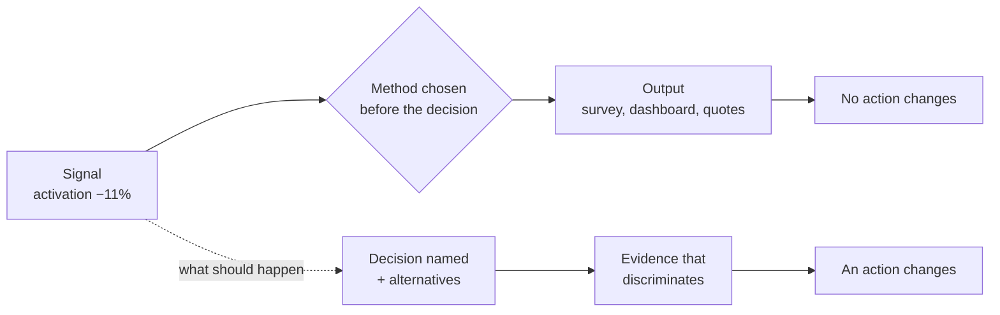

# Lesson authoring contract

Every lesson directory contains exactly three files:

```text
lessons/<phase-slug>/<lesson-slug>/
  lesson.md      # the teachable body
  checks.json    # 5 multiple-choice checks
  artifact.md    # the template for the artifact this lesson ships
```

The reference implementation is
[`lessons/01-problem-framing/pf-01-decision-before-method/`](01-problem-framing/pf-01-decision-before-method).
Read all three of its files before authoring a new lesson. Match their
structure exactly; the `learn` skill depends on it.

Regenerate the manifest after adding lessons:

```bash
npm run build:manifest
```

---

## lesson.md

YAML frontmatter with `id`, `title`, `phase`, `minutes`, `artifact`,
`prerequisites`, then a blockquote of the premise, then six sections in this
fixed order.

### `## Problem — <this lesson's angle>`

The heading carries a subtitle after an em dash, naming the specific failure
this lesson is about. The website renders it as the section heading, so a
generic one makes every lesson look identical. "the research nobody can act on",
not "why this judgment gets lost". Lower case, no trailing period.

Open with a **concrete failure**, never a definition. Show a PM or a team doing
something reasonable that produces a bad outcome, and name why the failure is
hard to see from inside. Two or three paragraphs.

End with a diagnostic question a reader can ask themselves or their team to
detect the failure.

### `## Concept — <the move in a phrase>`

Same rule: an em-dash subtitle naming the move, not the topic.

The durable model. Use a table where a table genuinely clarifies. Explain in
plain, direct language — no jargon that is not immediately unpacked.

Must include a `### Boundary` subsection stating **where this model stops being
true**. This is not a caveat paragraph; it is a real limit with a real example.
A lesson without an honest boundary teaches a rule the learner will misapply
under pressure.

### `## Build — on Noted`

Point at one specific signal from `lessons/noted/case.md`. Give the learner a
numbered task list that ends in a position they must commit to.

Include an **"Expect to be pushed on"** line naming the two or three weakest
points the tutor should attack. This is what makes the lesson interactive rather
than a reading.

End the section with a `### What a strong answer holds` subsection: four to six
bullets describing the **shape** of a strong answer — what it must name, what it
must refuse, the most common weak move and why it is weak. Not a model answer.
The website collapses it behind "check your answer" so a solo reader commits
first; the tutor withholds it until the learner has taken a position. Without
it, a reader with no tutor has no way to know whether they did the exercise well.

Do not reuse the same Noted signal as the lesson immediately before yours in the
phase unless the sequence genuinely requires it.

### `## Use — on your product`

Transfer the same move to the learner's live decision. Three to five questions.
Instruct them to write `<unknown>` for gaps rather than guessing.

### `## Ship — <artifact name>`

Name the output file as `artifacts/<LESSON-ID>-<artifact-slug>.md`, say who the
artifact is written for, and say how it connects to the cumulative Product
Decision Case.

### `## Carry forward`

One short paragraph: what the learner carries into the next lesson, and how the
next lesson uses it. Name the next lesson ID.

---

## Visuals

Every lesson carries **at least three visuals**, and they are not decoration.
Each one has to do work a paragraph cannot: show a mechanism, expose a
comparison, or make an abstract rule concrete.

Diagrams are **Mermaid**, in a fenced ` ```mermaid ` block. The website renders
them; the agent tutor reads the source and can walk a learner through it node by
node. Never use ASCII or Unicode box drawing.

### 1 · The mechanism diagram (required, in `## Problem` or `## Concept`)

Show how the failure actually happens, or how the model's parts connect. Keep it
under about eight nodes — a diagram nobody can hold in their head is a wall of
boxes.

````markdown

````

Use `flowchart` for mechanism and sequence, `quadrantChart` for two-axis
trade-offs, `timeline` for anything with a clock, and `sequenceDiagram` for
handoffs between people. Label every edge that carries meaning.

### 2 · The worked example (required, in `## Concept` or `## Build`)

Show the same thing done badly and done well, on the Noted case, with the
difference named. Use a two-column comparison:

```html
<div class="compare">
<div>

**Weak** — "Investigate why activation dropped."

Nothing here names a choice, so any finding is compatible with any action.

</div>
<div>

**Strong** — "Change the first-session experience, look outside the first
session, or make no change yet."

Three live options. A finding can now displace one.

</div>
</div>
```

Leave a blank line after `<div>` and before `</div>` so the markdown inside
still renders.

### 3 · The structural table (required, anywhere)

A table that lets a reader check their own work: the layers of a model, the four
boundaries of a method, the six exposures of an artifact. Enumerable facts
belong in tables — reasoning stays in prose.

### Optional, when the content earns it

- **A filled-in artifact fragment** in a fenced `markdown` block, so the learner
  sees the target before they write one.
- **A decision trace** — a numbered walk from signal to committed choice.
- **An annotated wrong answer**: a plausible artifact with the flaw marked and
  named.

### Rules

- Three visuals minimum, and no two of the same kind in one lesson.
- Every visual is referenced by the prose around it. A diagram nobody points at
  is decoration.
- A visual must be readable in one screen. Split it or cut it.
- Never put a number in a visual that the Noted case does not contain.

---

## checks.json

Five questions. Shape:

```json
{
  "id": "PF-01",
  "title": "Decision before method",
  "questions": [
    {
      "stage": "post",
      "question": "...",
      "options": ["...", "...", "...", "..."],
      "correct": 1,
      "explanation": "..."
    }
  ]
}
```

Rules:

- `correct` is a **zero-based index**. Vary it across the five questions — never
  put every answer at the same position.
- Test **reasoning, not recall**. A question answerable by matching a definition
  to its label is a failed question. Prefer short scenarios where the learner
  must apply the model.
- Every distractor must be **plausible and tempting**. At least one distractor
  per question should be the answer a competent PM would give if they had
  learned the vocabulary but not the judgment.
- The `explanation` says why the right answer is right **and** why the most
  tempting distractor fails. Name that distractor.
- No question may be answered correctly by reading the question stem alone.

---

## artifact.md

YAML frontmatter with `artifact`, `lesson`, `filename`. Then:

1. A short instruction to the tutor: fill this in with the learner's judgment,
   never invent evidence, use `<unknown>` for gaps.
2. The template itself in a fenced `markdown` block, with `<angle-bracket>`
   placeholders and inline guidance in parentheses.
3. A `## Quality bar` table checking the **six exposures** — choice, evidence,
   uncertainty, alternatives, owner, revision trigger — adapted to this specific
   artifact.
4. A closing line telling the learner they can stress-test it with
   `review-artifact`.

---

## House style

- Plain, direct English. Short sentences. One idea per sentence.
- Second person for the learner. Never "we" meaning the course.
- No idioms, no filler, no motivational language.
- Tables for enumerable facts. Prose for reasoning.
- Every fenced code block gets a language tag.
- Never cite external training programs or proprietary course material. This
  curriculum carries its own material and stands on its own reasoning.
- The one permitted outside pointer is the author's own book, *PM Is Now Another
  Member of Technical Staff*, and only as a **boundary marker** — the place where
  a lesson's judgment question turns into a technical skill this course
  deliberately does not teach. Rules: name it at most once per lesson, put it in
  the `### Boundary` subsection where boundaries already live, and never make it
  a dependency. Every lesson must stay completable by someone who has not read
  it. If the pointer reads as a recommendation rather than a limit, cut it.
- Never claim evidence the Noted case does not contain. If a lesson needs a
  detail that is not in `case.md`, either work without it or state plainly that
  it is unknown.
