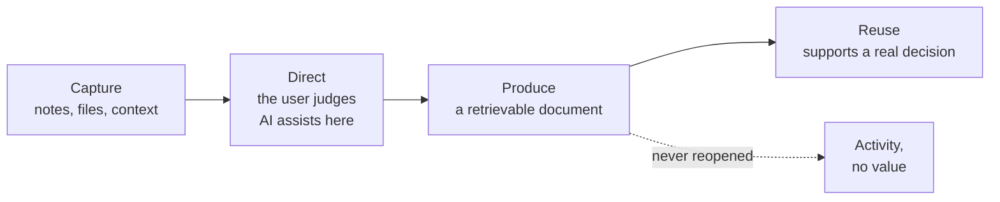
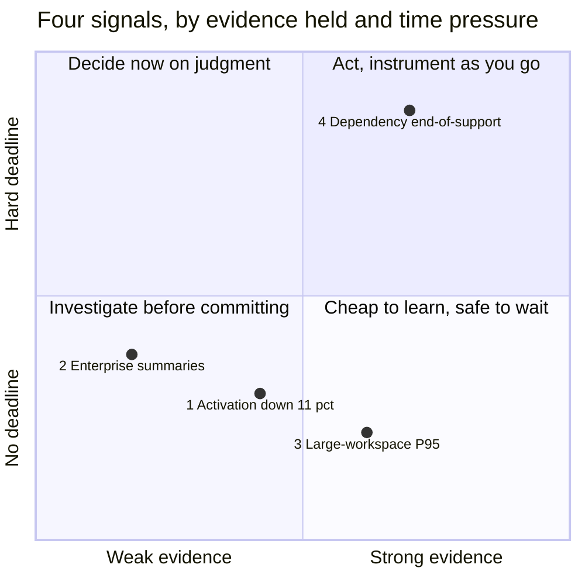

# The Noted case

The shared product case for CORE / PM. Every lesson practices its reasoning move
here first, then transfers it to the learner's own product.

Noted is stable enough that two learners can compare answers, and incomplete
enough that neither can look up the right one. That combination is the point.
If you find yourself certain, you have probably stopped noticing an assumption.

---

## The product

Noted is an AI-assisted document workspace. It helps people turn rough intent
into a useful document without leaving the place the work already lives.

It began from a familiar model — flexible pages, nested organization, files,
search, publishing. Its distinctive layer is AI embedded in the same surface as
the document itself.

The product sits across three jobs:

| Job | What it holds |
|---|---|
| **Capture** | Ideas, notes, files, prompts, meeting context, research, unfinished thinking |
| **Direct** | The user writes, judges, revises, and decides what becomes part of the document |
| **Produce** | A retrievable artifact that supports a decision, plan, handoff, or later return |

The document is the durable artifact. AI is a collaborator around it.

The job only completes at the far right of this chain, and every handoff can
leak:

**The trap this creates:** if the team optimizes AI usage while documents never
become useful — or never get opened again — the product has generated activity
without completing the job. Several signals below will tempt you into exactly
that mistake.

## What is actually live

Three capabilities are shipped. Three important extensions are not. A polished
design or a detailed spec does not mean a capability exists.

| Status | Capability |
|---|---|
| **Live** | Personal document workspace with AI assistance |
| **Live** | File storage and retrieval |
| **Live** | Public publishing path |
| **In design** | Team collaboration environment |
| **Planned** | Private draft-review workflow |
| **Planned** | AI-first onboarding |

Keep "live", "in design", and "planned" separate in your reasoning. Collapsing
them is one of the most common ways a product argument goes wrong.

## Who uses it

Three populations produce different signals. None of them should quietly stand
in for "the user."

- **Individual knowledge workers** — personal notes, drafts, and research. The
  largest population by count. Mostly free.
- **Small teams** — shared workspaces, light collaboration, growing file volume.
  Where most paid conversion happens today.
- **Enterprise team leads** — recurring meetings, decisions that need owners,
  context that has to survive handoffs. The smallest population, the loudest
  requests, the largest contracts.

These are constructed teaching populations, not validated market segments. They
exist to make population boundaries visible.

## Your role

You are Noted's first dedicated PM. The team has a disciplined delivery system
and a much thinner evidence system.

| Person | What they hold |
|---|---|
| **Founder** | Authored much of the research layer; made an earlier sequencing decision that may deserve re-examination |
| **Engineering lead** | Owns repository workflow and technical standards; some planning assumptions have not been checked against the code |
| **Support lead** | Recorded several customer conversations, and is closest to what people actually said before it became a summary |

You own the decision about what deserves attention and the evidence behind it.
You do not own every activity, and you do not own specialist judgment.

Delivery discipline makes a team efficient at building. It does nothing to
ensure the underlying decision deserved to be built.

---

## The four signals

Four signals compete for your attention at once. They are deliberately
incomplete. The first task is never to solve all four — it is to identify the
consequential decision behind each, and choose which one deserves scarce
judgment now.

They do not compete evenly. One has a clock, one has revenue attached, one has
the largest population, and one has nobody complaining:

The placement above is a reading of the case, not a fact in it. Disagreeing with
where a signal sits is a legitimate product argument — and making that argument
is most of the work in Phase 01.

### 1 · Activation is declining

Activation fell **11% over six weeks**.

- "Activation" is currently defined as creating a document and returning within
  seven days. Nobody on the team defends this definition; it is inherited.
- The decline is visible in aggregate. It has not been segmented by cohort,
  acquisition channel, or platform.
- Two changes shipped during the window: a revised signup flow and a new
  AI-suggestion prompt on the empty document state.

**The decision:** should Noted change the first-session experience, investigate
a cause outside the first session, or make no product change yet?

### 2 · Enterprise customers want automated summaries

**Three enterprise customers** asked for automated meeting summaries.

- All three requests came through the same account manager, within one month.
- Their combined contract value is roughly 20% of current revenue.
- The underlying claim — that enterprise team leads repeatedly lose decisions,
  action owners, or context after recurring meetings, causing rework or missed
  commitments — has never been tested.
- Meeting type is not captured in the product's event data.

**The decision:** should Noted spend design and engineering capacity to help
enterprise team leads record decisions, assign action owners, and share context
after recurring meetings — or keep the roadmap unchanged?

### 3 · Large workspaces are slowing down

**P95 response time rose 34%** for large workspaces.

- "Large" means more than 500 documents. That is about 4% of workspaces.
- Those workspaces contain a disproportionate share of paid seats.
- No support tickets have mentioned speed. The signal came from monitoring.

**The decision:** should Noted move engineering time this cycle from planned
features to large-workspace response times, or keep the current plan?

### 4 · A platform dependency is nearing end-of-support

A core dependency **loses support in 10 weeks**.

- Engineering estimates the migration at three to five weeks, with wide
  uncertainty.
- Two engineers want to migrate now. Two want to spread the work across the
  quarter.
- After end-of-support, security patches stop. Nothing breaks immediately.

**The decision:** should Noted complete the migration this cycle, or divide the
work across the remaining ten weeks?

---

## Evidence boundaries

Read this before using any number above in an argument.

In a live product, running behaviour, code, and change history can contradict a
narrative document, and those contradictions are evidence. That is a habit worth
carrying into your own work.

It is not something you can do here. **Everything in this case is constructed.**
No number below was measured, there is no running system behind it, and nothing
in the course asks you to go and inspect one. Realism is not validity.

- The four signals are real observations, not established causes.
- No signal above states its own mechanism. Any mechanism you use is yours, and
  you own defending it.
- Customer requests came through one channel. They are not an independent
  sample.
- Analytics has known gaps: actor identity is missing for about 18% of events,
  and meeting type is not captured at all.
- Nothing here establishes prevalence. Three requests are three requests.

When a lesson asks you to decide, you will not have enough evidence. That is not
a flaw in the case. It is the working condition of the job.
